# AWS S3 Mini Project

- During this project, I will explore Amazon S3 (Simple Storage Service), a vital component of Amazon Web Services (AWS) for storing and accessing data. I'll cover key concepts like Buckets, Objects, versioning, and permissions, along with practical demonstrations on effectively managing the S3 resources.

# Project Goals:

- The primary goal of this project is to familiarize participants with Amazon S3 (Simple Storage Service) and it's fundamental concepts. this project is all about how to create and manage S3 buckets, upload objects, enable versioning, set permissions for public access, and implement lifecycle policies.

# Learning Outcomes:

By the end of this project, the experience of executing the project wll make me gain practical explerience in working with Amazon S3 and will be able to:

- Create and configure S3 buckets using the AWS Management Console.

- Upload files and manage objects within S3 bucket

- Understand the importance of versioning and its implications for data management. 

- Confifure permissions to control access to S3 objects.

- Implement lifecycle policies to automate data management tasks and optimize storage costs.

# What is Amazon S3?

- Amazon S3, or Simple Storage Service, is like a big digital warehouse where anyone can store all kinds of data. It's part of Amazon Web Services (AWS), which is a collection of cloud computing services.

- Think of S3 as a giant virtual filing cabinet in the cloud. I can put files, documents, pictures, videos, or any other digital stuff I want to keep safe and accessible.

- What's cool about S3 is that it's super reliabe and secure. My data is stored across multiple servers in different locations, so even if something goes wrong with one server, the files are still safe.

- Plus, S3 is really flexible.I can easily access the files from anywhere in the world using the internet, and the control who gets to see or edit the stuff with different levels of permissions.

# S3 Benefits

Amazon S3 offers a range of benefits that make it a top choice for storing and managing data in the cloud.

- Firstly, S3 provides exceptional durability and reliability. My data is stored across multiple servers and data centers, ensuring that even if one servers fails, my files remains safe and accessible.

- Secondly, S3 offers scalability, meaning I can easily increase or decrease my storage capacity as needed. Whether I will be storing a few gigabites or petabytes of data, S3 can handle it without any hassle.

- Another key benefit of S3 is it's accessibilty. I can access my data from anywhere in the world using the internet, making it convenient for remote teams or distributed applications.

- Security is also a top prioritywith S3. I have full control over who can access my data and can encrypt my files to ensure they remain confidential and secure.

- Additional, S3 is cost-effective.I only pay for the storage I use, with no upfront fees or long-term contracts, making it a budget-friendly option for businesses of all sizes.

# S3 Use Cases

### Backup: 

Think of it as a safe place to keep copies of important files, like my computer's backup. If anything happens to the computer, I can get my files back from S3

### Website stuff:

S3 can also hold all the pieces of a website, like images and videos. So, when I visit a website, some of the stuff I saw might be stored in S3.

### Videos and Photos: 

All the videos and photos shared online, They're often stored in S3 because it's really good at keeping them safe and making sure they load fast.

### Apps and Games: 

S3 is also used by apps and games to store things like user profiles or game levels. It helps keep everything running smoothly and makes sure the progress is saved.

### Big Data:

Companies uses S3 to store huge amounts of data for things like analyzing customers behavior or trends. It's like having a big library where I can find all sorts of useful information.

### Emergency Backup:

Some companies use S3 to store copies of their data in case something bad happens, It's like having a backup to keep things going no matter what. Keeping old stuff: sometimes, companies have to keep old records for legal reasons. S3 has special storage options that are really cheap, so it's a good place to keep all that old stuff without spending too much money.

### Sending Stuff Fast:

S3 works with a service called CloudFront, which helps deliver stuff really quickly to people all over the world. So, if I am watching a video or downloading a file, S3 helps make sure it gets to me fast.

# s3 Core Concepts

### Buckets:

Think of buckets as folder where I can store my files.Each bucket has a unique name and can hold an unlimited number of objects (files).

### Objects:

Objects are the individual files I store in S3, like photos, videos, documents, or any other type of data. Each object has a unique key (file name) and can range in size from a few bytes to terabytes.

### Keys: 

Keys are unique identifiers for objects with a bucket. They're like the file names I use on my computer. I can organize objects with a bucket using folder-like structures in the their keys, called prefixes.

### Storage Classes: 

S3 offers different storage classes to suit various use cases and budget requirements. These include standard-IA(Infrequent Access), One zone-IA, Intelligent-Tiering, Glacier, and Glacier Deep Archive. Each class has different durability, availability, and cost characteristics.

### Access Control:

I can control who can access my objects in S3 using Access control Lists (ACLs) and Bucket Policies. I can also use Identity and Access Management (IAM) to mange access at a user or group level.

### Durability and Availability: 

S3 is designed for 99.999999999% (11 nines) durability, meaning my data is highly resistance to loss. It also offer high availability, ensuring that my objects are accessible whenever I need them.

### Data Transfer: 

S3 supports both inbound (upload) and outbound (download) data transfer. I can transfer data to and from S3 using various methods. including the AWS Management Console, CLI (Command Line Interface), SDKs (Software Development Kits), or third-party tools.

### Versioning:

S3 Versioning allows me to keep multiple versions of an object in the same bucket. This feature helps protect against accidental deletion or overwrite, as I can restore previous versions of an object if needed

**Note**

### Storage Class:

A storage class in Amazon S3 is like a category or type of storage option for the data. Each storage class has its own set of characteristics, such as cost, durability, and availability, that determine how my data is stored and managed in the cloud. I can choose the storage class that best fits my nees based of factors like how frequently I Access my data, how quickly I ned it, and how much I'M willing to pay for storage

### AWS Management Console:

It's a website where I can manage all the AWS services using a point-and-click iterface. I can do things like starting virtual servers, storing files, and setting up security rules, all without needing to write any code.

### CLI (Command Line Interface):

This is the tools that lets someone control AWS services using text commands typed into a terminal or command prompt.
It's handy for automating tasks and scripting repetitive actions.

### SDKs (Software Development Kits): 

SDKs are packages of tools and code that help developers build applications that use AWS services. They provide ready-made fuctions and examples to make it easier to integrate AWS into my software projects, whether I have coding in Java, Python, JavaScript, or another language.

# What is S3 Versioning?

Imagine I'm working on a big project and I accidentally delete an important file. But wait, with S3 Versioning, it's like having a magic undo button.

- Here's how it works: Normally, when a file is deleted in S3, it's gone for good But with versining turned on, s3 keeps a copy of every version of my file, even if I delete it or overwrite it. So if I make a mistake , I can easily go back to a previous version and restore it, just like rewinding time.

- This feature is super handy for protecting my data from accidents or malicious actions. It's like having a sefety net for my files, ensuring that even if something goes wrong, I have can always recover my precious data. 
Plus, it's easy to turn on and manage, giving me someone peace of mind knowing that the files are always safe and sound inAmazon S3.

- Firstly, I will create a new bucket in Amazon S3 to store my files. Following that, I will upload a file into this newly created bucket. Subsequently, I will enable versioning for the bucket, allowing us to retain multiple versions of my uploaded files for tracking changes over time. Next, I will configure the permission for the bucket to enable public access, ensuring that the files can be accessed by anyone with the appropriate link. Finally, I will implement lifecycle policies to automate the management of my files.

# Let's initiate the practical phase by setting up the creation of an Amazon S3 bucket,

1. First, navigate to the search bar on the AWS console.

a) Search for "S3"

2. After clicking on S3 in the search results, I'II be directed to the S3 page.

a) From there, locate and click on the "Create bucket" button.

3. Let's proceed with creating a new bucket. Please provide a unique name for the bucket,ensuring it's distinct from any existing bucket names

a) Select "ACL Disabled" for object ownership.

b) Ensure to check the "Block all public access" option.

c) Additionally, leave Bucket Versioning disabled.

d) Proceed with the default settings.

e) Once done, click on the "Create bucket" button to finalize the creation process.

**Note -** or Access Control List, is like a set of rules that decides who can access the stuff in Amazon s3. I can use ACL to grant access to the bucket and files for specific AWS accounts or predefined groups of users. It's a way to control who gets to see or mess with the data in the cloud.

 Note If anyone encounter this kind of error message below, then, consider changing the name and then proceed again.

 

For further details on naming conventions, Please refer to the documentation 

[bucket naming rules](https://docs.aws.amazon.com/AmazonS3/latest/userguide/bucketnamingrules.html )

My bucket has been successfully created, and currently, there are no objects stored within it.

 
## Now, Let's move on to the second part, where I'll upload an object into the bucket name: "my-first-s3-bucket-7742".

1. Let me create a file on my laptop with some data. I will write "welcome to AWS world" and save the file

2. Next, click on the "Upload" button.

3. Click on "Add file" and select the already created file.

a) Once selected click open.

 

4. Then, I will have to seeing the file being added.

a) Finally, click "Upload" to complete the process.

Congratulations! You have successfully uploaded your object (file) to the S3 bucket (folder).

### Let's move on to the next step, which involves enabling versioning.

1. In the bucket's Properties section on the right side, you will notice that bucket versioning is currently diabled.

So now, I will enable it.

2. Click on edit.

3. Select "Enabled"

a) Then click on "save changes" to enable versioning for the bucket.

4. Now, If I modify the content of the file and upload it again, I will create a new version of the file

 
 

a) By clicking on "Show versions" I will be able to see all the versions of the file I ve' uploaded.

 

b) Now, whenever I make changes to the file and upload it again to the same bucket, it will continue creating versions of that file for future reference.

**If I want to view the content of both versions, let's proceed to our steps, which involves setting permissions**

1. Now, in the permissions section of the bucket, I will notice that "Block all public access" is enabled.
 
a) Click on the "Edit" to make changes.

2. Now, uncheck the "Block all public access" option.

a) Then click on "save changes"

b) Now, Tpe "confirm" and click on "Confirm".

By taking this action, I will be allowing my file to be publicly accessible.
This confirmation step ensures that I will be aware of the implications of making my file public.

3. Now, I need to create a bucket policy to specify the actions I want the public to be able to perform on my file. Click on "Edit"

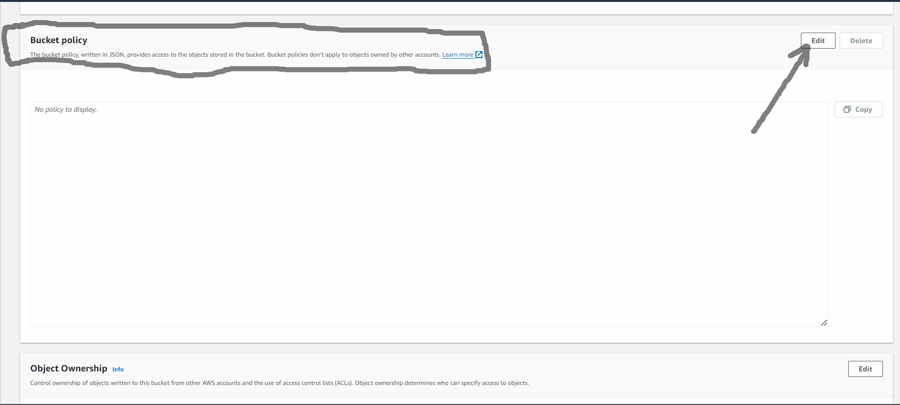

4. Now, click on the "Policy generator"

5. Now, select the "Type of policy" as "S3 Bucket Policy"

a) Set the "Effect" to "Allow"

b) Specify the "Principal" as "*" which means all users.

c) Choose the action "Get object" and "Get object version"

d) In the field of Amazon Resource Name (ARN), type the ARN of your bucket and add by "/*" after the ARN. Then,

e) Click on Add "statement".

**So Actual ARN is -**

arn:aws:s3:::my-first-s3-bucket-7742

**And we need to add**

arn:aws:s3:::my-first-s3-bucket-7742/*

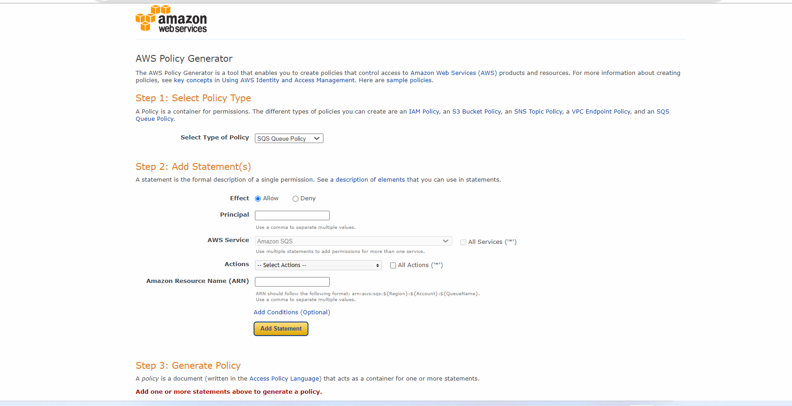

f) Copy the ARN from here.

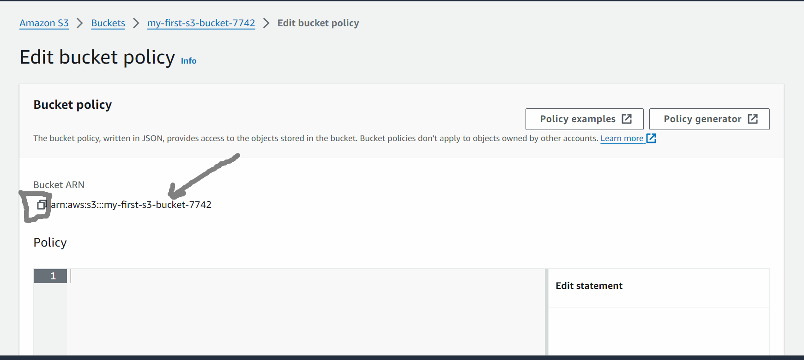

**Note -** ARN stands for Amazon Resources Name. It's like a unique address for every resource in AWS, such as bucket in S3. Just like your home address tells people where I live, an ARN tells AWS where a specific resource is located. It helps AWS know exactly which resource I would be referring to when I will be setting up permissions or policies.

6. Now click on "generate policy"

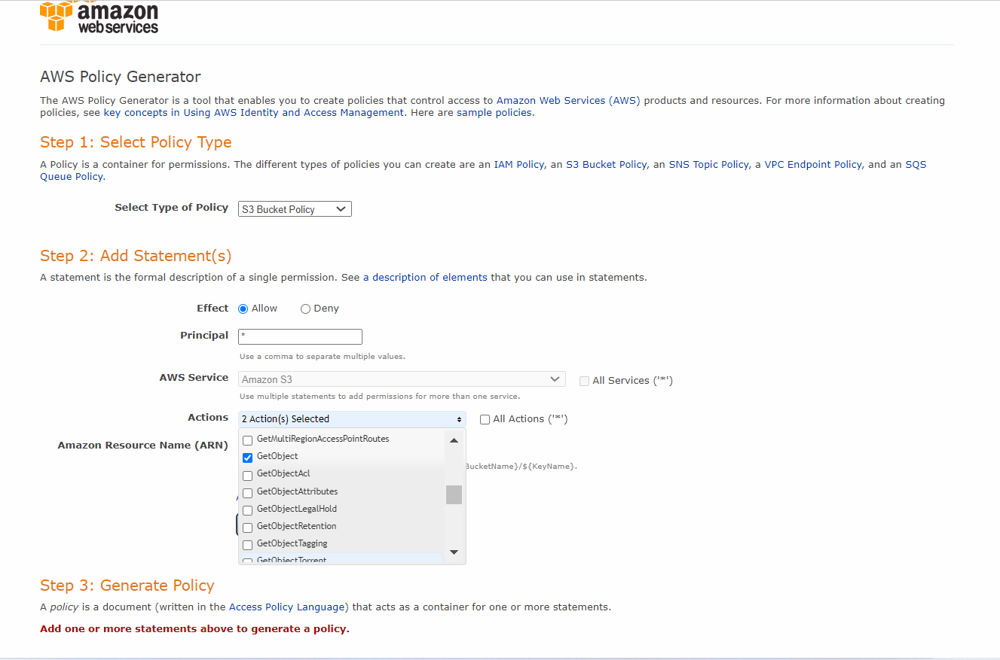

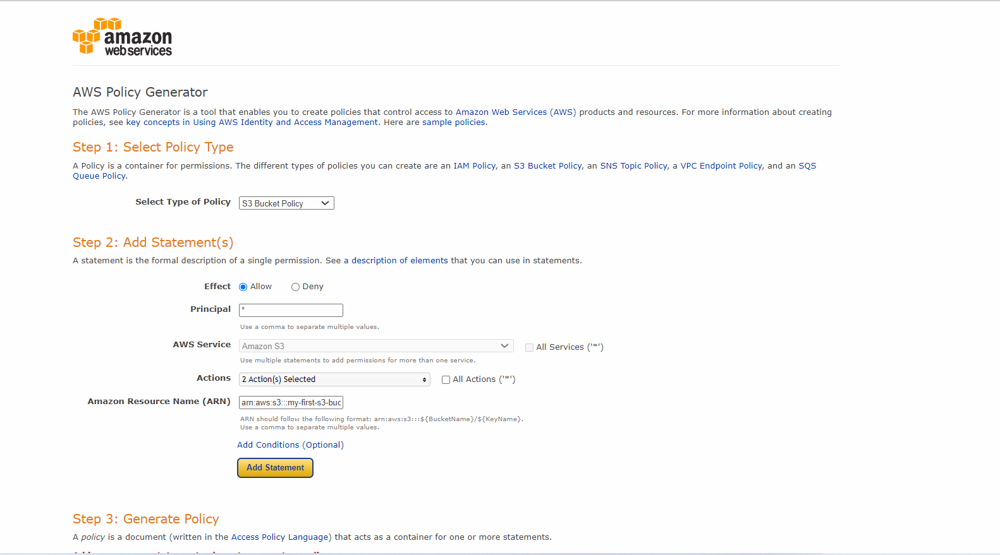

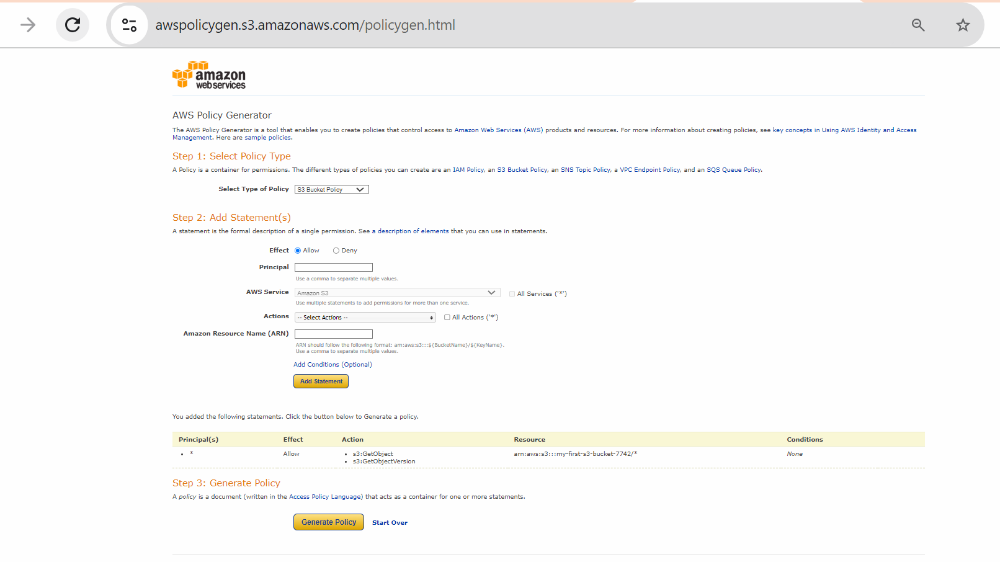

a) Now, copy this and click on "close"

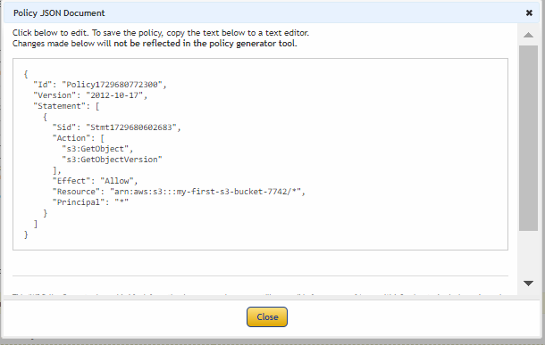

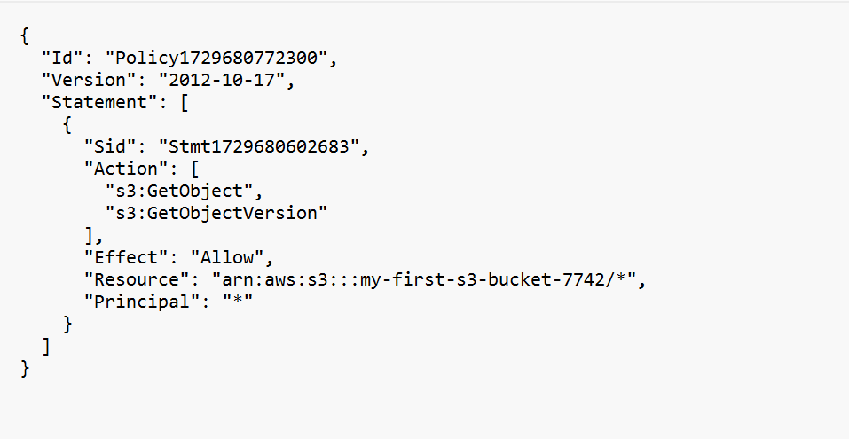

- "***Id:"Policy1729680772300"***: This line specifies the unique identifier for the policy. The ID is used for reference and be helpful for managing policies within AWS.

- "***Version":"2012-10-17":*** This line indicate the version of the policy language being used. In this case, It's using version "2012-10-17" of the policy language.

- ***"Statement":[...]:*** This line begins the definition of the policy's statements. Policies can have multiple statements, each defining a set of permissions.

 - ***"Sid":"Stmt1729680602683"***: This line assigns a unique identifier to the statement. Similar to the policy ID, the statement Id is used for reference and management purposes.

- ***"Action":["s3:GetObject","s3:GetObjectVersion"]***: This line specifies the actions allowed by this policy. In this case, it allows the s3:GetObject and s3:GetObjectVersion actions, which are used to retrieved objects and object versions from an S3 bucket.

***"Effect":"Allow"***: This lines specifies the effect of the statement, which can be either "Allow" or "Deny" Here, it indicates that the actions specified in the Action field are allowed.

***"Resource":"arn:aws:s3:::my-first-s3-bucket-7742/"***: This line specifies the AWS resources to which the policy applies. I n this case, it applies to all objects (/) within the S3 bucket named my-first-s3-bucket-7742. The ARN (Amazon Resources Name) uniquely identifies the resources.

***"Principal": "*":*** This line specifies the entity to which the policy applies. The * Wildcard means that the policy applies to all users and roles (i.e., any principal) in the AWS account.

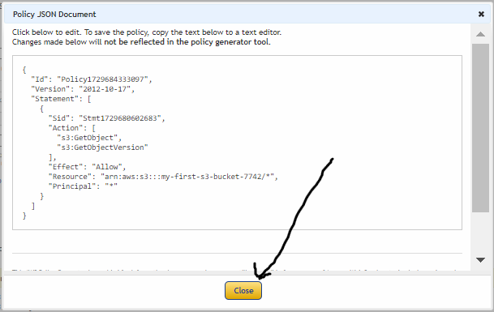

b) Navigate to the bucket policy tab.

c) Paste the policy I've created using the Policy Generator.

7. Click on "Save changes"

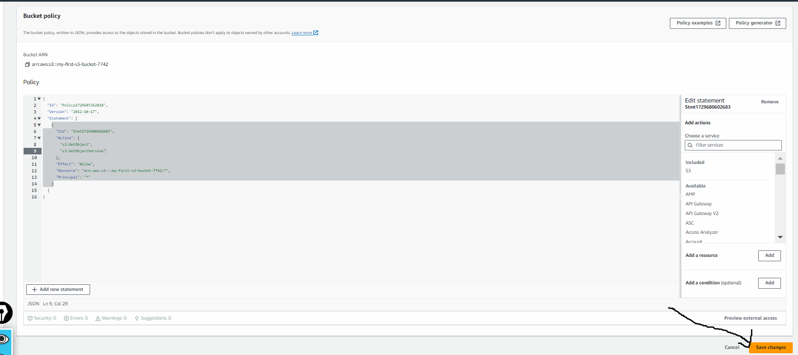

8. Now, click on this version of your file.

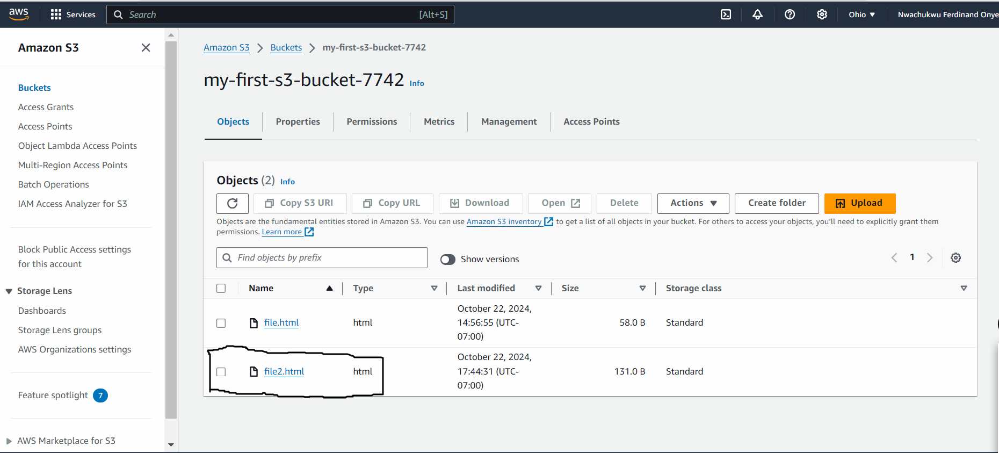

9. Click on the object URL

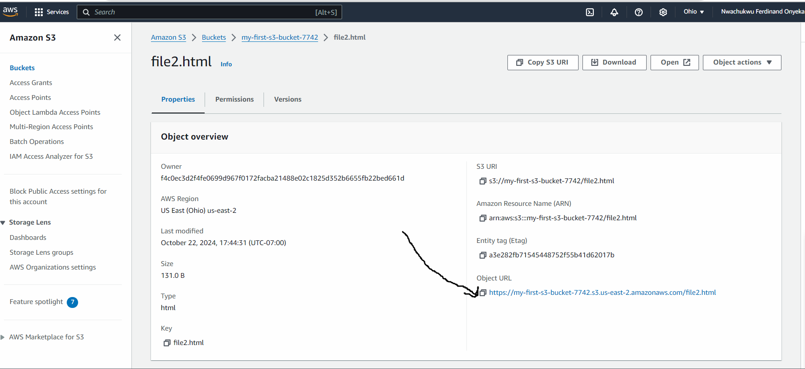

Here, You will see the previous data

If we click to the latest version

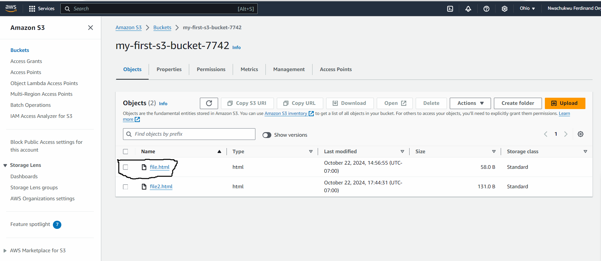

And click on the object URL

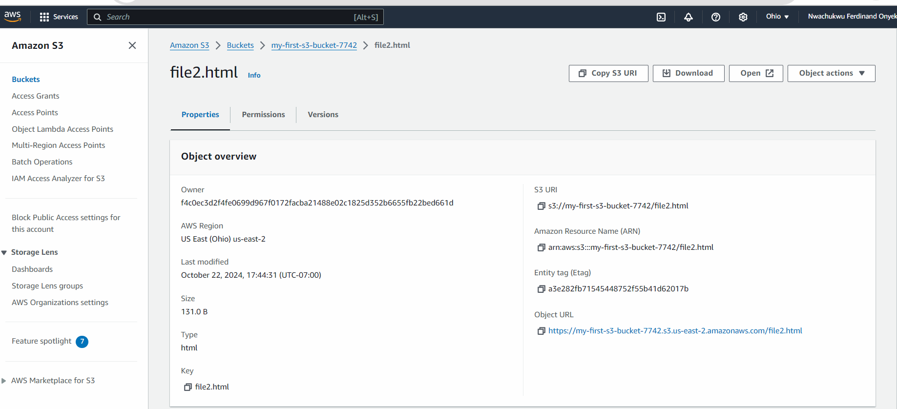

You will get the latest data.

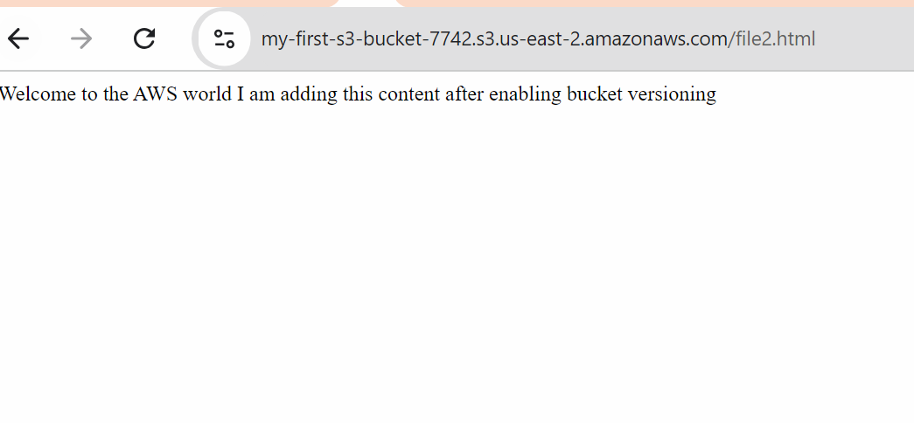

**Now, let's proceed to the next step, which involves creating lifecycle policies**.

1. For this, navigate to the management section of the bucket.

a) click on "Add lifecycle rule".

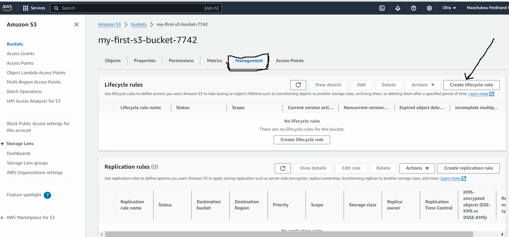

2. Give the specifications, and click to create rule.

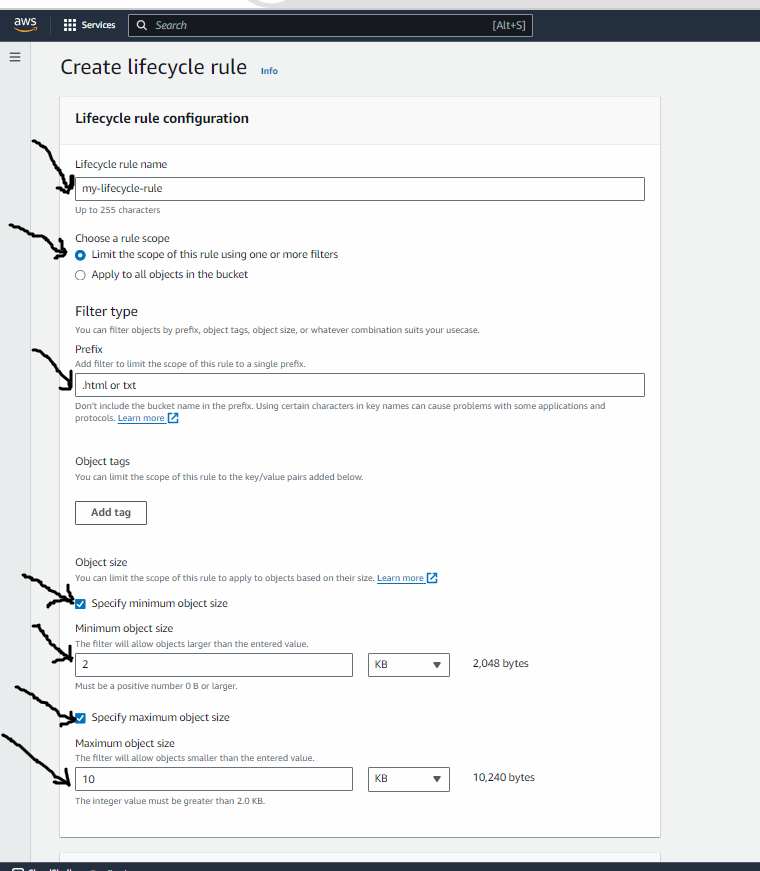

Now the lifecycle policy is being created succesfully.

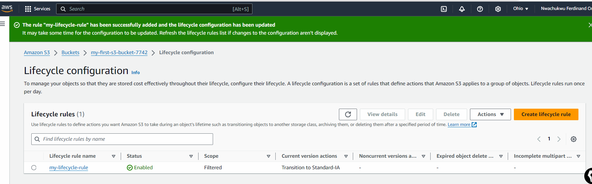

This rule is setup to automatically move file from one type of storage to another in my Amazon S3 bucket. Specifically, it moves files to a storage type called Standard-IA after they've been sitting in my bucket for 30 days. This helps me sve money because standard-IA storage is cheaper than the default storage option. So, if I have files that I don't access very often but still want to keep, This rule helps me save costs by storing them in a cheaper storage class after a certain period of time.

For more information about storage classes, I can go through Amazon S3 storage classes. And about storage lifecycle, I can go through Managing your storage lifecycle.

# Project Reflection:

- Participants have gained hands-on experience with Amazon S3, a core service of AWS.

- They have Managed S3buckets and objects, learning key concepts like versioning, permissions Management, and lifecycle policies.

- Through practical tasks, participants developed a solid understanding of S3 features.

- They learned to optimize storage costs and ensure data relaibility and accessibility using AWS features.

- I have learned to optimize storage costs and ensure data relaibility and accessibility using AWS features.

- This project equipped participants with valuable skills applicable to real-world scenarios.

