# Auomating Loadbalancer Configuration with Shell Scripting

This project is load balancer configuration with ease using scripting and simple *CI/CD* on jenkins. This project demonstrate how to automate the setup and maintenance of load balancer using a freestyle job, enhancing efficiency and reducing manual effort.

## Automate the Deployment of Webservers

In the Implementing load balancer with Nginx course, I deployed two backend servers, with a load balancer distributing traffic accross the webservers. I did that by typing commands right on the terminal.

In this course I will be automating the entire process. I will do that by writting a shell script that when ran, all that will did manually will be done automatically. As **DevOps Engineers** automation is at the heart of the work we do. Automation help us speed the deployment of services and reduce the chance of making errors in our day to day activity.

This course will give a great introduction to automation.

# Deploying and Configuring the Webservers

## Deploying and Configuring the Webservers.

- All the process I need to deploy the webservers has been **codified** in the shell script below:

`#!/bin/bash`

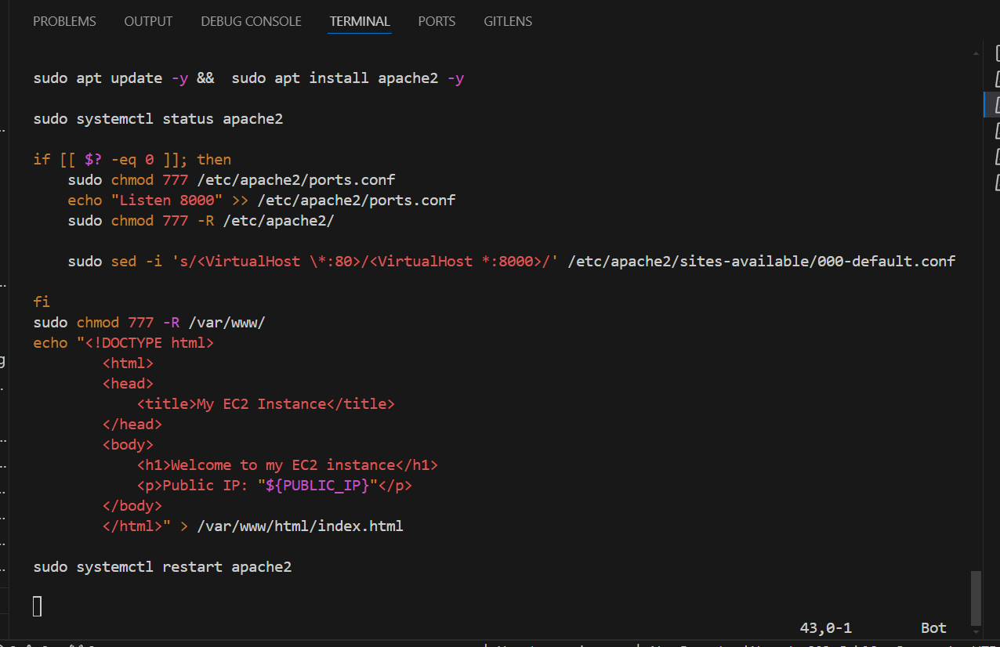

- Follow the steps below to run the script:

## Step 1: 
Provision an EC2 instance running ubuntu 20.04. 

## Step 2: 
Open port 8000 to allow traffic from anywhere using the security group.

## Step 3:
Connect to the webserver via the terminal using SSH client.

## Step 4: 
Open a file, paste the script above and close the file using the command below:

`sudo vi install.sh`

To close the file type the **esc** key then **Shift +:wqa!**

## Step 5:
Change the permissions on the file to make an executable using the command below:

`sudo chmod +x install.sh`

## Step 6: 
Run the shell script using the command below.

`./install.sh PUBLIC_IP`

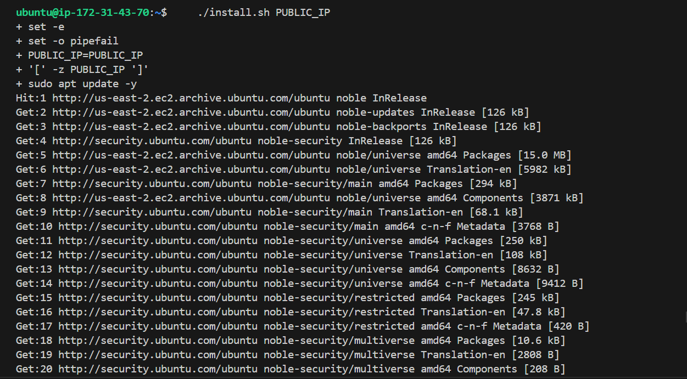

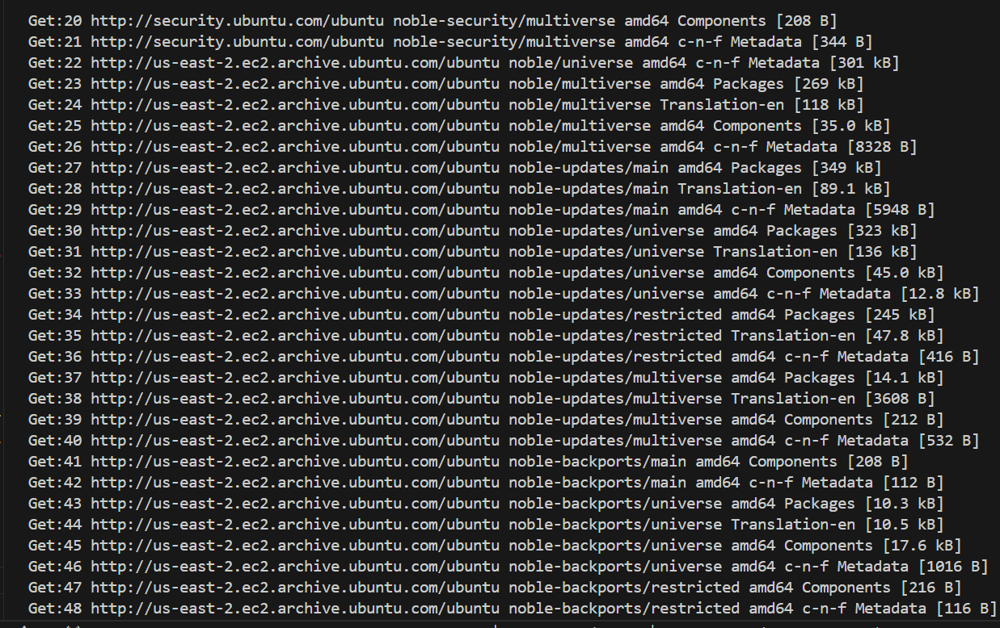

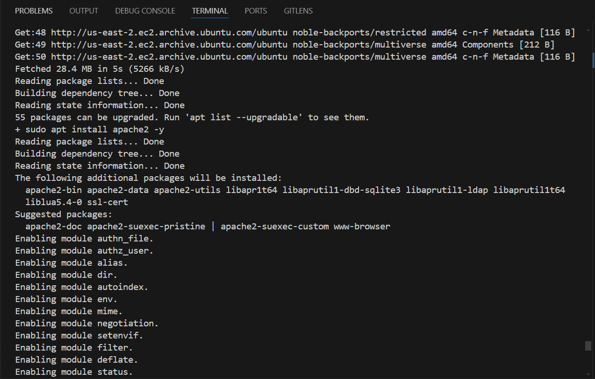

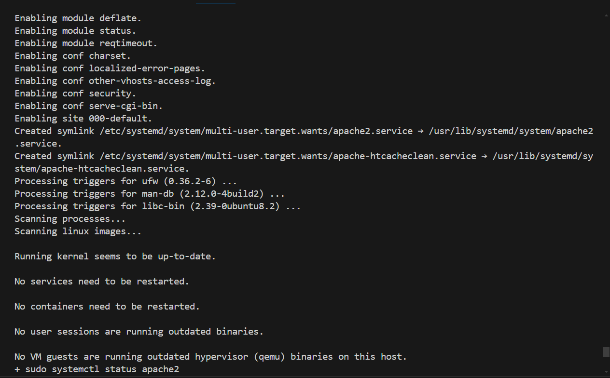

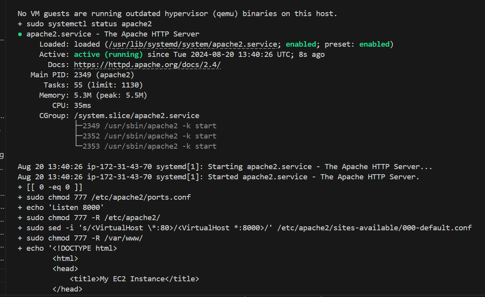

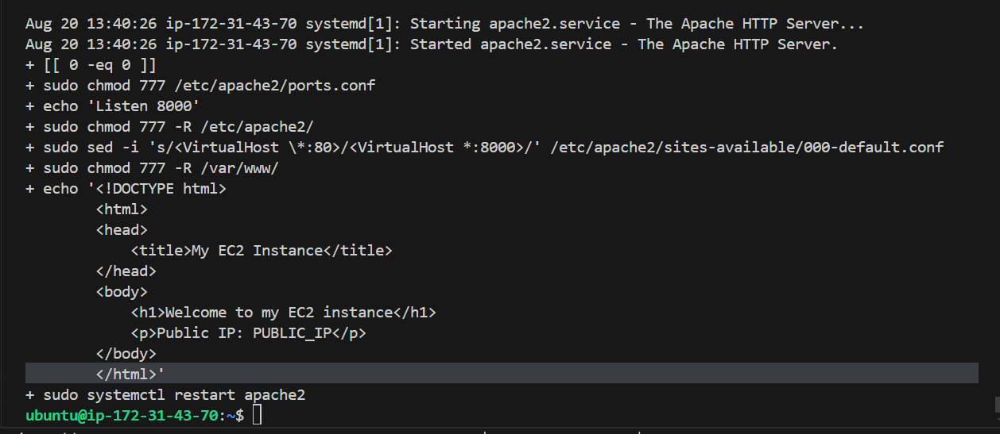

# The Second Webserver-2 Below.

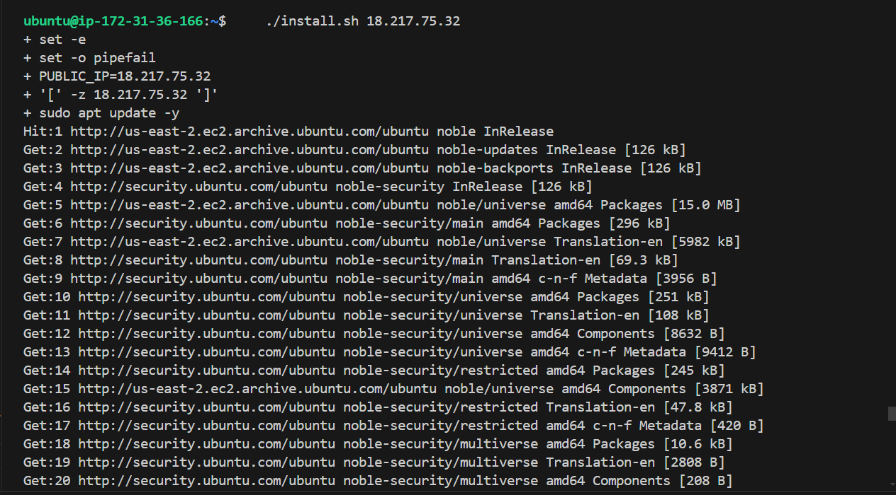

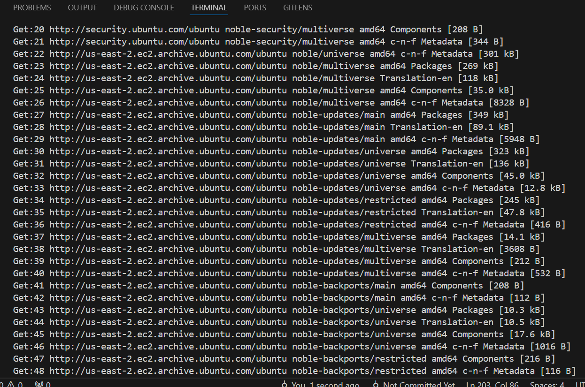

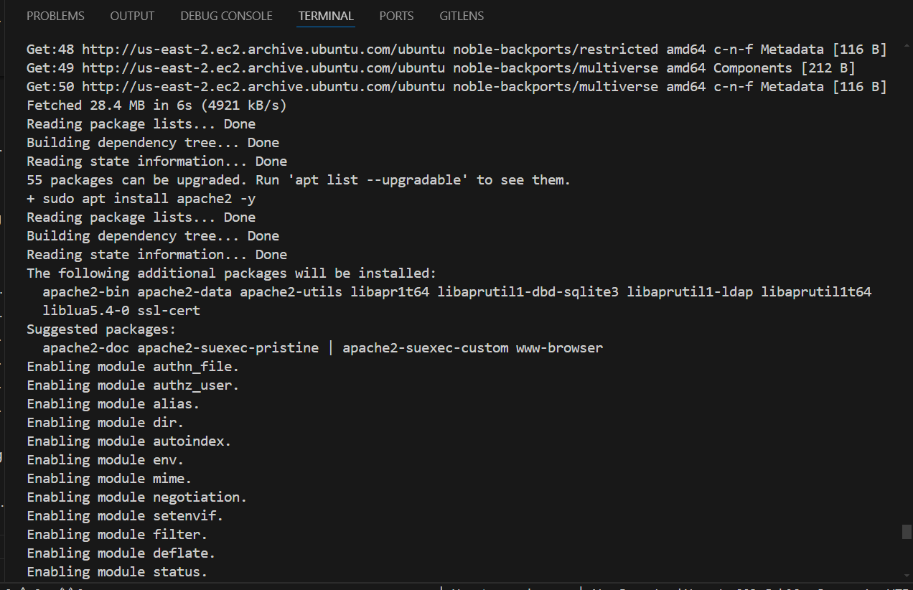

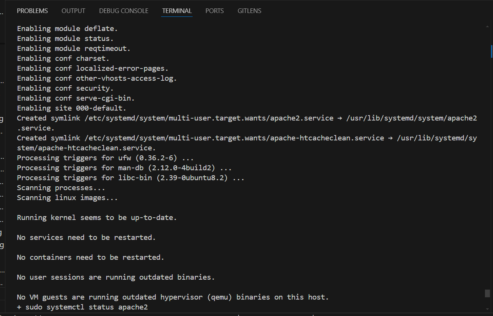

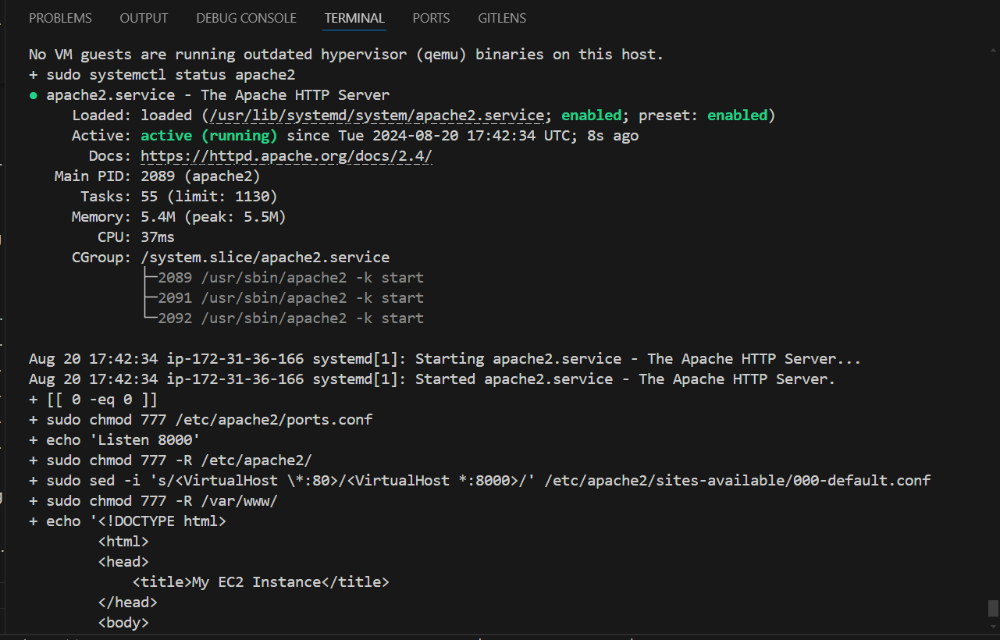

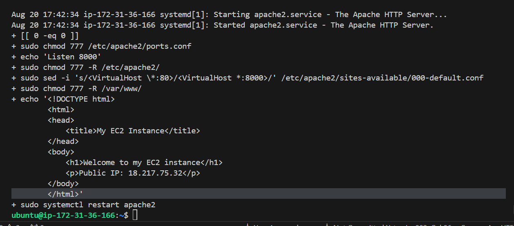

# Deployment of Nginx as a Load Balancer using Shell script

### Automate the Deployment of Nginx as a Load Balancer using Shell script.

