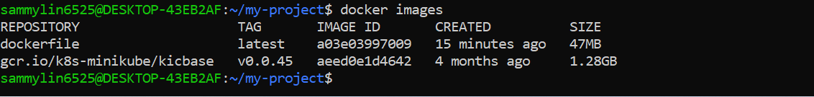

# Containerization and Container Orchestration

### Phase 1: Base Frontend Application with Docker and Kubernetes

1. Hypothetical Use Case

You are developing a simple static website (HTML and CSS) for a company's landing page.The goal is to containerize this application using Docker, deploy it to a Kubernetes cluster, and access it through Nginx.


2. Tasks

Task 1: Set up your project

- Create a new project directory.

- Inside the directory, create an HTML file (`index.html`) and a CSS file (`styles.css`).

## The Steps to follow

## 1. Create a new project directory:

```
mkdir my-project
```


2. I have to move into the directory:

```
cd my-project
```


## 2. Create the HTML File (index.html)

**Using a Code Editor (e.g., Vs Code, nano, vim etc).**

- Open the code editor

- In the "My-Project Directory" I have to create a new file named `index.html`.

- Add a basic HTML structure inside the file. Here's an example:

```
<!DOCTYPE html>
<html lang="en">
<head>
    <meta charset="UTF-8">
    <meta name="viewport" content="width=device-width, initial-scale=1.0">
    <title>My Project</title>
    <link rel="stylesheet" href="styles.css">
</head>
<body>
    <h1>Welcome to My Project</h1>
    <p>This is a simple HTML project.</p>
</body>
</html>
```


- Save the file.

## 3. Create the CSS File (styles.css)

 **Using a Code Editor:**

 1. In the `my-project` folder, I have to create a new file named `styles.css`.

 2. Add some basic CSS styles: 

```
body {
    font-family: Arial, sans-serif;
    background-color: #f4f4f9;
    margin: 0;
    padding: 0;
}

h1 {
    color: #333;
    text-align: center;
    margin-top: 50px;
}

p {
    text-align: center;
    color: #666;
}
```


# Task 2: Initialize Git

- Initialize a Git repository in my project directory.


# Task 3: Git Commit

- Add and commit my initial code to the Git repository.


# Task 4: Dockerize the application

- Create a `Dockerfile` specifying Nginx as the base image.

```
# Use Nginx as the base image
FROM nginx:alpine

# Copy your HTML and CSS files into the default Nginx HTML directory
COPY index.html /usr/share/nginx/html/
COPY styles.css /usr/share/nginx/html/

# Expose port 80 (default Nginx HTTP port)
EXPOSE 80

# Start the Nginx server
CMD ["nginx", "-g", "daemon off;"]
```


- Copy your HTML and CSS files into the Nginx HTML directory. (Use ChatGPT to generate a basic HTML and CSS code for a simple web application)


To build an image from this Dockerfile, navigate to the directory containing the file and run:

```
docker build -t dockerfile .
```


# Task 5: Push to Docker Hub

- Log in to Docker Hub.

To push my Docker image to "Docker Hub" follow these steps:

Step 1: Create a Docker Hub Account 

1. Go to [Docker Hub](https://hub.docker.com/)


- Push my Docker image to Docker Hub.



To run a container based on the custom NGINX image we created with a dockerfile, run the command.

```
docker run -p 8080:80 dockerfile
```


- Create a repository in a "Docker Hub"


- Tag Your Docker Image Before Pushing, ensure that my Docker image is appropriately tagged. I typically tag my Image with my Docker Hub username and the repository name.

```
docker tag <your-image-name> <your-dockerhub-username>/<your-repository-name>:<tag>
```


 

- Docker login


- Push my image to docker hub


```
docker push <your-dockerhub-username>/<your-repository-name>:<tag>
```


# Task 6: Set up a Kind Kubernetes Cluster

## step 1: Ensuring Prerequisites are Met.

1. Docker:
   
   - Install Docker on my system.
   - Verify Docker is installed and running:

   ```
   docker --version
   ```
   

2. Kubectl:

   - Install the Kunernetes CLI (`kubectl`):


- Install Kind (Kubernetes in Docker).
   
  - `Install kubectl instructions`.

- Verify installation:

  ```
  kubectl version --client
  ```


## Step 2: Install Kind (Kubernetes in Docker)

 1. Install Using curl (Linux and macOS)
  
   - Download kind:

   


   - Make it executable:

   ```
   chmod +x ./kind
   ```
   
   


- Move it to a directory in my system Path:


2. ## Install Using Package Manager


3. Verify Installation

- Run the following command to confirm installation:

```
kind version
```


- Create a Kind Cluster.

Step 3: Create a Kind Kubernetes Cluster

1. Create a Basic Cluster

To create a basic Kubernetes cluster, run:

```
kind create cluster --name my-kind-cluster
```


# Task 7: Deploy to Kubernetes

### Step 1: Prepare my Kubernetes Environment

1. Ensure Prerequisites are met:

  - Kubernetes cluster is up and running (e.g.,Mininkube AWS EKS,ETC.)

  - `Kubectl` CLI is installed and configured to connect to my cluster.

```
kubectl version --client
kubectl get nodes
```


- Create a Kubernetes Deployment YAML file specifying the image and desired replicas.

## Step 1: Create the Kubernetes Deployment YAML File

1. Open the text editor or IDE  and create a new file named `deployment.yaml`

2. Define the deployment configuration. Here's an example YAML file:

```
apiVersion: apps/v1
kind: Deployment
metadata:
  name: my-project
  labels:
    app: my-project
spec:
  replicas: 3  # Number of desired replicas
  selector:
    matchLabels:
      app: my-project
  template:
    metadata:
      labels:
        app: my-project
    spec:
      containers:
      - name: my-project
        image: sammylin6525/my-project:1.0 # Replace with your Docker image
        ports:
        - containerPort: 80
```


- Save the file as `deployment.yaml`


The provided YAML snippet defines a Kubernetes Deployment for deploying an instance of instance of the Nginx web server. Let's break down the key components:

- **apiVersion: apps/v1:** Specifies the Kubernetes API version for the object being created, in this case, a Deployment in the "apps" group.

- **Kind: Deployment:** Defines the type of Kubernetes resources being created, which is a Deployment. Deployments are used to manage the deployment and scaling of applications.

metadata: Contains metadata for the Deploment, including the name of the Deployment, which is set to "my-project"

- **Spec:** Describes the desired state of the Deployment.

- **replicas: 1:** Specifies that the desired number of replicas (instances) of the Pods controlled by this Deployment is 1.

- **Selector:** Defines how the Deployment selects which Pods to manage. In this case, it uses the label "app:my-project" to match pods.

- **Template:** Specifies the template for creating new Pods.

- **metadata:** Contains labels for the Pods, and in this case, the label is set to "app:my-project."

- **Spec:** Describes the Pod specification.

- **Containers:** Defines the containers within the Pod.

- **Name:** my-project: Sets the name of the container to "my-project."

- **image: sammylin6525/my-project:1.0:** Specifies the Docker image to be used to the my-project container. The image is "sammylin6525/my-project" with version "1.0."

**Note that the image can be replaced**

- **Ports:** Specifies the port mapping for the container, and in this case, it exposes port 80.


- Apply the deployment to my cluster.

# Step 2: Apply the Deployment YAML File

- Apply the file to the Kubernetes cluster using the following command:

```
kubectl apply -f deployment.yaml
```


- Verify that the deployment is created:

```
kubectl get deployments
```


- Check the pods created by the deployment:

```
kubectl get pods
```


# Task 8: Create a Service (ClusterIP)

### Step 1: Understand the Purpose of a ClusterIP Service.

A ClusterIP Service exposes the application to other resources **within the cluster.**This is a default service type and does not allow external access.It is used for internal communication between Pods or Deployments.


## Step 2: Create a ClusterIP Service YAML File

1. Open a text editor or IDE

2. Create a file named `service.yaml`.

3. Add the following configuration:

```
apiVersion: v1
kind: Service
metadata:
  name: my-project
  labels:
    app: my-project
spec:
  type: ClusterIP
  selector:
    app: my-project
  ports:
    - protocol: TCP
      port: 80        # The port for the service within the cluster
      targetPort: 80  # The port on the Pod where the application runs

```


The provided YAML snippet defines a Kubernetes Service for exposing "my-project" application to the external world. Let's break down the key components:

- **apiVersion:v1:** Specifies the Kubernetes API version for the object being created, in this case, a Service.

- **Kind: Service:** Defines the type of Kubernetes resources being created, which is a Service. Services provide a stable endpoint for accessing a set of Pods.

- **metadata:** Contains metadata for the Service, including the name of the Service, which is set to "my-project."

- **spec:** Describes the desired state of the Service.

- **Selector:** Specifies the labels used to select which Pods the Service will route traffic to. In this case, it selects Pods with the label "app:my-project."

- **Ports:** Specifies the ports configuration for the service.

- **Protocol: TCP:** Specifies the transport layer protocol, which is TCP in this case.


- **Port:80:** Defines the port on which the Service will be exposed.

- **TargetPort: 80:** Specifies the port on the Pods to which the traffic will be forwarded.


- **type: NodePort:** Sets the type of the Service to NodePort. This means that the service will be accessible externally on each Node's IP address at a static port, which will be automatically assigned unless specifies.


- Create a Kubernetes Service YAML file specifying the type as ClusterIP.

- Apply the service to my cluster.