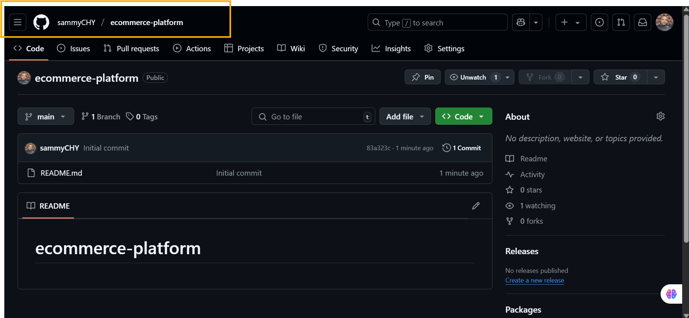
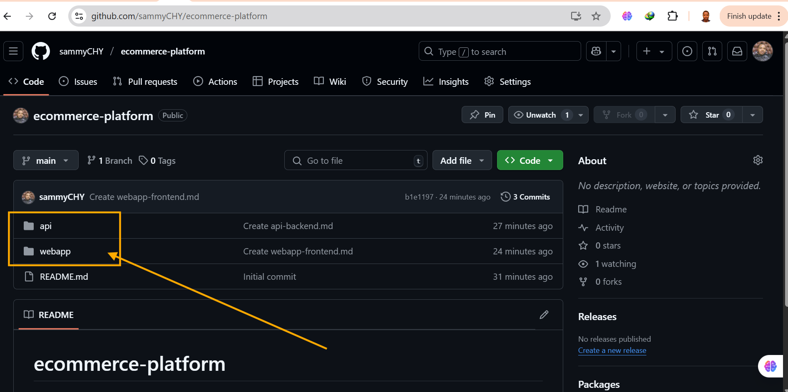

# E-Commerce with GitHub Actions

## Capstone Project: E-Commerce Application CI/CD Pipeline

### Project Overview: Automated Pipeline for an E-Commerce Platform

Hypothetical Use Case:

You are tasked with developing and maintaining an e-commerce platform. This platform has two primary components:

   - E- Commerce API: Backend service handling product listings, user accounts, and order processing.

   - E- **Commerce Frontend:** A web application for users to browse products, manage their accounts, and place orders.

The goal is to automate the integration and deployment process for both components using GitHub Actions, ensuring continuous delivery and integration.

**Project Tasks:**

**Task 1: Project Setup**

   - Create a new GitHub repository named `e-commerce-platform`. 

   - Inside the repository, create two directories: `api` for the backend and `webapp` for the frontend.

**Task 2: Initialize GitHub Actions**

   - Initialize a Git repository and add your initial project structure.

   - Create `.github/workflows` directory in your repository for GitHub Actions.

**Task 3: Backend API Setup:**

   - In the `api` directory, set up a simple Node.js/Express application that handles basic e-commerce operations.

   - Implement unit tests for your API.

**Task 4: Frontend Web Application Setup**

   - In the `webapp` directory, create a simple React application that interact with the backend API.

   - Ensure that frontend has basic features like product listing, user login, and order placement.

**Task 5: Continuous Integration Workflow**
  - Write a GitHub Actions workflow for the backend and frontend that:

   - Installs dependencies.

   - Runs tests.

   - Builds the application.

**Task 6: Docker Integration**

  - Create 'Dockerfile' for both the backend and frontend.

  - Modify your GitHub Actions workflows to build Docker images.

**Tasks 7: Deploy to Cloud:**

   - Choose a cloud platform for deployment (AWS, Azure, or GCP).

   - Configure GitHub Actions to deploy the Docker images to the chosen cloud platform.

   - Use Github Secret to securely store and access cloud credentials.

**Task 8: Continuous Deployment** 
   
   - Configure your workflows to deploy updates automatically to the cloud environment when changes are pushed to the main branch.

**Task 9: Performance and Security** 
   
   - Implement caching in your workflows to optimize build times.

   - Ensure all sensitive data, including API keys and database credentials, are secured using GitHub Secrets.

**Task 10: Project Documentation** 

   - Document your project setup, work details, and instructions for local development i a `README.md` file.

**Conclusion**

This capstone project aims to provide hands-on experience in automating CI/CD pipeline for a real-world e-commerce application, encompassing aspects like backend API management, frontend web development, Docker containerization, and cloud deployment.

Additional Resources:

   - [Node.js](https://nodejs.org/docs/latest/api/)

   - [React](https://react.dev/learn)

   - [Docker Documentation](https://docs.docker.com/get-started/)

   - [GitHub Actions Documentation](https://docs.github.com/en/actions)

   - Cloud Platforms Documentation:

       - [AWS](https://docs.aws.amazon.com/)

       - [Azure](https://learn.microsoft.com/en-us/azure/?product=popular)

       - [Google Cloud](https://cloud.google.com/docs)

This project will challenge your skills in developing a full-stack application and automating its deployment, offering a comprehensive understanding of CI/CD practices in a commercial setting.
