# E-Commerce with GitHub Actions

## Capstone Project: E-Commerce Application CI/CD Pipeline

### Project Overview: Automated Pipeline for an E-Commerce Platform

Hypothetical Use Case:

You are tasked with developing and maintaining an e-commerce platform. This platform has two primary components:

   - E- Commerce API: Backend service handling product listings, user accounts, and order processing.

   - E- **Commerce Frontend:** A web application for users to browse products, manage their accounts, and place orders.


The goal is to automate the integration and deployment process for both components using GitHub Actions, ensuring continuous delivery and integration.


**Project Tasks:**

**Task 1: Project Setup**

   - Create a new GitHub repository named `e-commerce-platform`. 


   - Inside the repository, create two directories: `api` for the backend and `webapp` for the frontend.


**Task 2: Initialize GitHub Actions**

   - Initialize a Git repository and add your initial project structure.

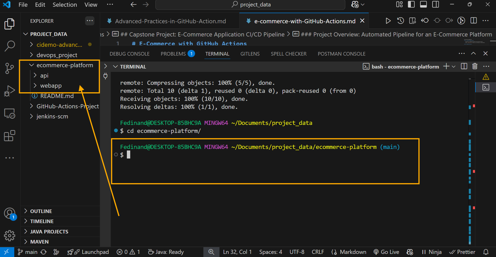

   - Create `.github/workflows` directory in your repository for GitHub Actions.

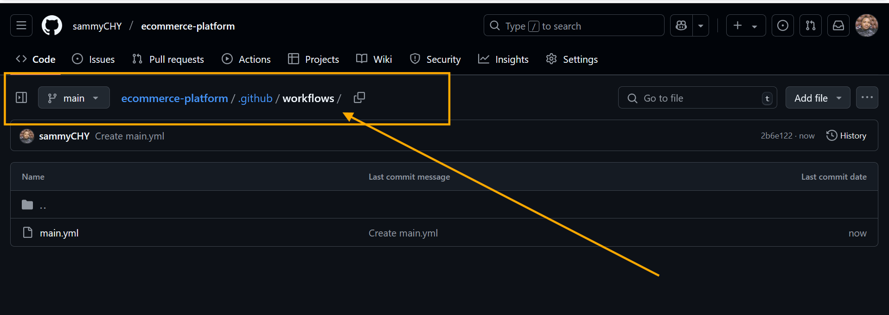

**Task 3: Backend API Setup:**

   - In the `api` directory, set up a simple Node.js/Express application that handles basic e-commerce operations.

1. (a) Install Node.js and NPM
Ensure the Node.js installed either in local computer or server. Check by running.

   
  `node -v`

  `npm -v`
   
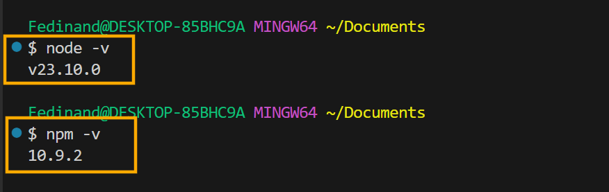

If Node.js is not installed, download it from [Node.js official website.](https://nodejs.org/en)

2. (b) Initialize a Node.js Project

Navigate to the `api` directory and initialize a new Node.js Project:


      ```
      mkdir api && cd api
      ```

npm init -y


This will creates a 'package.json' file.


   - Implement unit tests for your API.

Unit testing ensures that each part of my API works correctly. I will use **Jest** and **Supertest** to test a simple **Node.js.Express** API.

**Step 1: Install Testing Dependencies**

1. (a) Run the following command inside my API project directory:

```
npm install --save-dev jest supertest
```

- **Jest:** A popular JavaScript testing framework.

- **Supertest:** Helps test HTTP endpoints.


**Step 2: Configure Jest**

In your `package.json` modify the `"scripts"` section:

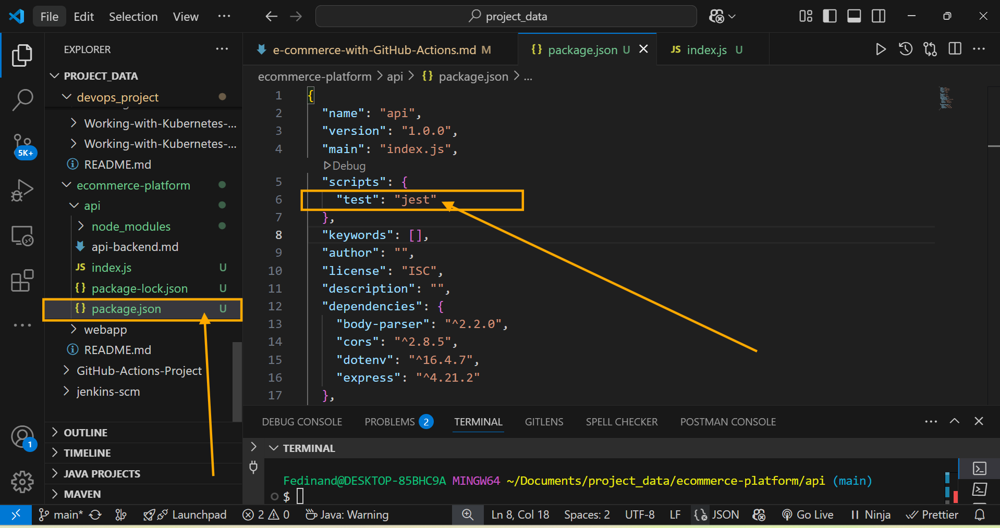

**Task 4: Frontend Web Application Setup**

   - In the `webapp` directory, create a simple React application that interact with the backend API.

To create a simple React application in the `webapp` directory that interacts with the backend API, follow these steps:

**Steps 1: Set Up the React Application**
Navigate to your project's root directory and create the React app inside the `webapp` folder.

Run the following command bellow:

```
npx create-react-app webapp
```


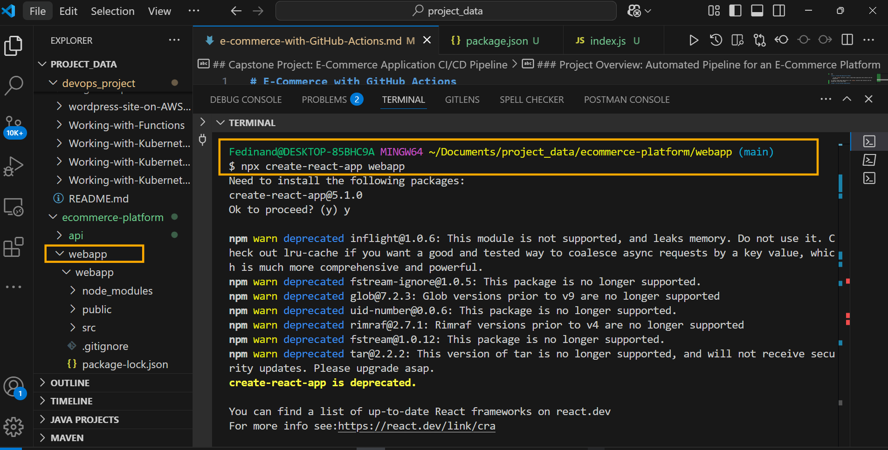


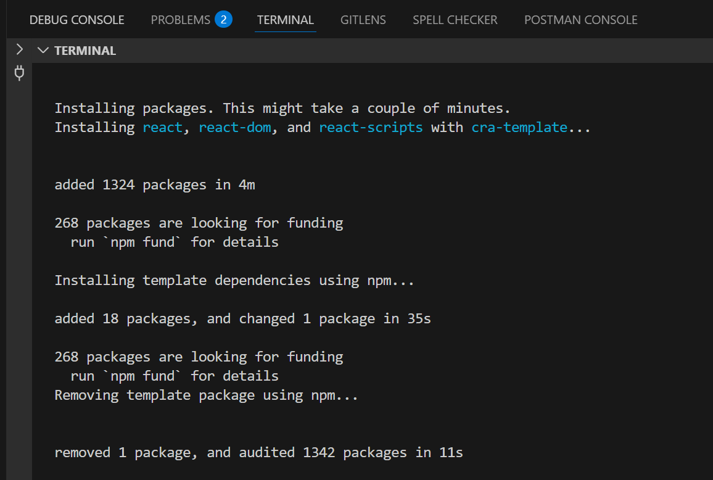


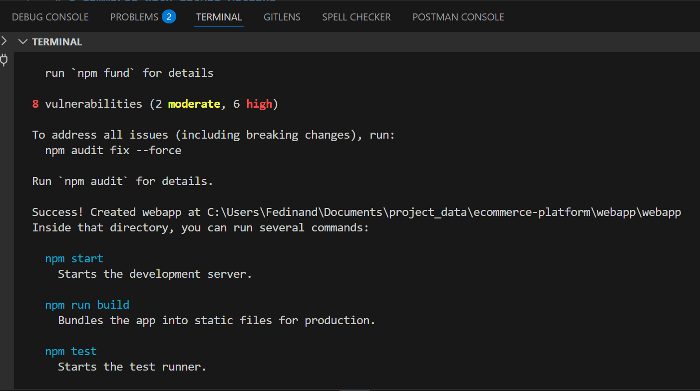


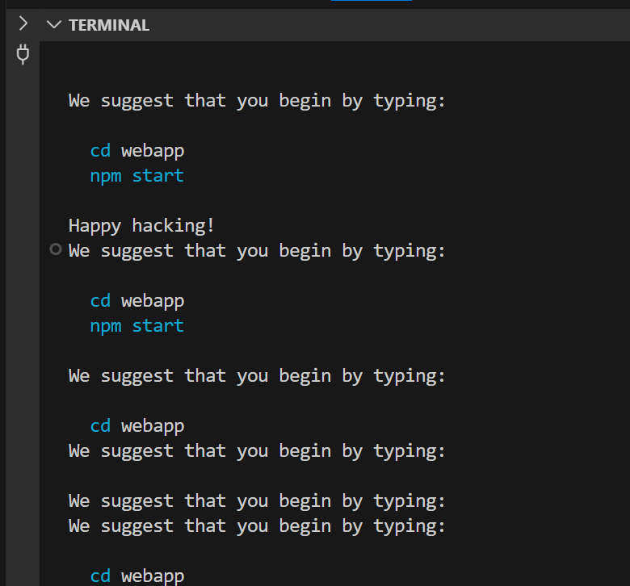


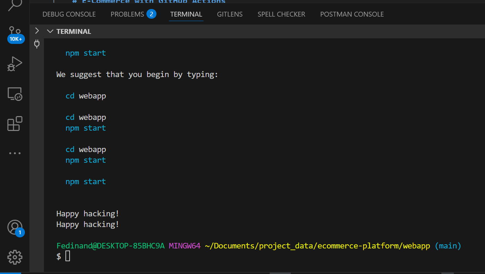


This will generate a new "React app" inside the `webapp` directory

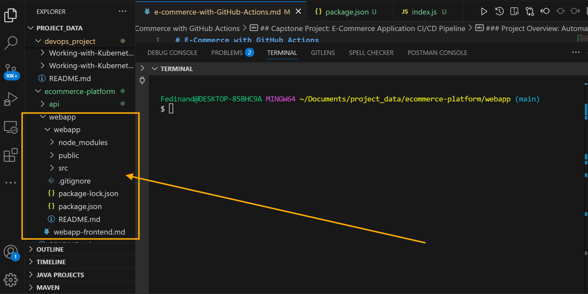

Once the installation is complete, navigate into the directory:

```
cd webapp
```

**Step 2: Install Required Dependencies**

To interact with the backend API, I will need `axios` for HTTP requests and `react-router-dom` for navigation.

```
npm install axios react-router-dom
```

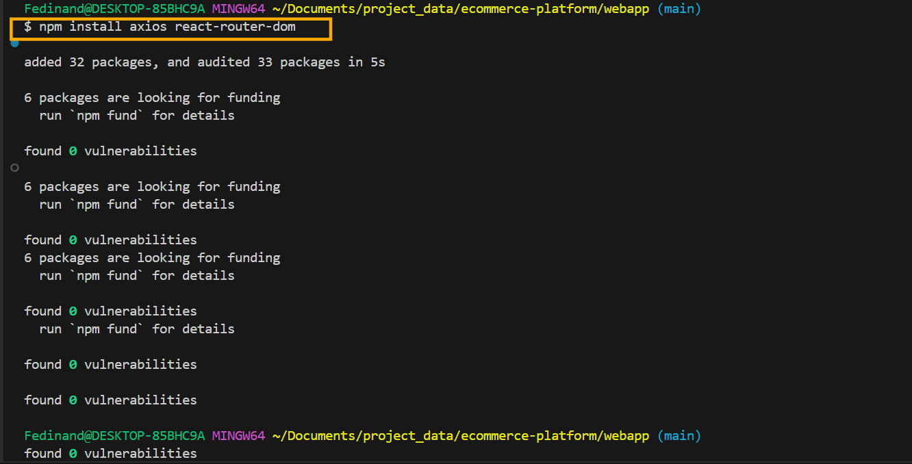


**Step 3: Set Up API Communication**

Modify the `src/App.js` file to fetch data from my backend.

EXAMPLE:

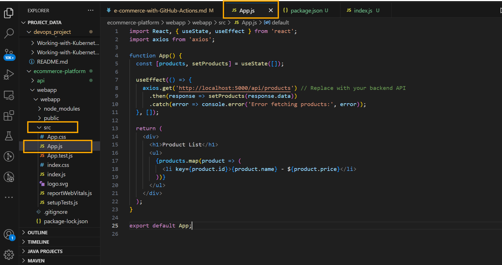


**Step 4: Start the React Application**

Run the development server:

```
npm start
```

- Ensure that frontend has basic features like product listing, user login, and order placement.


**Task 5: Continuous Integration Workflow**
  - Write a GitHub Actions workflow for the backend and frontend that:

   - Installs dependencies.

   - Runs tests.

   - Builds the application.


**Task 6: Docker Integration**

  - Create 'Dockerfile' for both the backend and frontend.

  - Modify your GitHub Actions workflows to build Docker images.


**Tasks 7: Deploy to Cloud:**

   - Choose a cloud platform for deployment (AWS, Azure, or GCP).

   - Configure GitHub Actions to deploy the Docker images to the chosen cloud platform.

   - Use Github Secret to securely store and access cloud credentials.

**Task 8: Continuous Deployment** 
   
   - Configure your workflows to deploy updates automatically to the cloud environment when changes are pushed to the main branch.


**Task 9: Performance and Security** 
   
   - Implement caching in your workflows to optimize build times.

   - Ensure all sensitive data, including API keys and database credentials, are secured using GitHub Secrets.


**Task 10: Project Documentation** 

   - Document your project setup, work details, and instructions for local development i a `README.md` file.


**Conclusion**

This capstone project aims to provide hands-on experience in automating CI/CD pipeline for a real-world e-commerce application, encompassing aspects like backend API management, frontend web development, Docker containerization, and cloud deployment.

### Additional Resources:

   - [Node.js](https://nodejs.org/docs/latest/api/)

   - [React](https://react.dev/learn)

   - [Docker Documentation](https://docs.docker.com/get-started/)

   - [GitHub Actions Documentation](https://docs.github.com/en/actions)

   ## Cloud Platforms Documentation:

   - [AWS](https://docs.aws.amazon.com/)

   - [Azure](https://learn.microsoft.com/en-us/azure/?product=popular)

   - [Google Cloud](https://cloud.google.com/docs)

This project will challenge your skills in developing a full-stack application and automating its deployment, offering a comprehensive understanding of CI/CD practices in a commercial setting.
