# Linux Administration and Shell Scripting

### Capstone Project: Shell Scrip for AWS IAM Management

**Project Scenario**

CloudOps Solutions is a growing company that recently adopted AWS to manage its cloud infrastructure. As the company scales, they have decided to automate the process of managing AWS Identity and Access Management (IAM) resources. This includes the creation of user groups, and the assignment of permissions for new hires, especially for their DevOps team.

## Purpose

In this capsone project, I will extend my shell scripting capabilities by creating more functions that extend the ***"aws_cloud_manager.sh"*** script.

**Objectives:**

1. **Script Enhancement:** refers to improving or extending an existing script to add new functionality, make it more efficient, or tailor it to meet additional requirements. In this context of my project, script enhancement involves modifying the provided script to include new capabilities for AWS Identity and Access Management (IAM) tasks.

# Components of Script Enhancement:

1. Adding New Features:
- Extending the script to include tasks that weren't originally present, such as creating users, managing groups, and assigning policies.

2. Improving Functionality:
- Making the script more robust by handling errors, optimizing logic, and automating additional processes.

3. Tailoring to New Requirements:

- Adapting the script to meet the objectives outlined in the project. For example:

- Defining IAM user names in an array.
- Creating IAM users and groups.
- Attaching policies and assigning users to groups.

4. Optimizing for Automation:
- Ensuring that the script minimizes manual work, uses loops and reusable functions, and executes tasks in an efficient sequence.

## In the context of This Project
The enhancement focuses on:
- **Transforming the script into an IAM management tool** that automates user, group, and policy creation in AWS.

- Adding logical steps (functions) for each objective, such as:

- Defining users in an array.
- Using AWS CLI commands to manage IAM resources.
- Adding error handling and logging.


### Extend the provided script to include IAM management.

To extend the provided script for IAM management, I'll provide a complete shell script that includes all the IAM management functionality based on the project requirements. 

### Full Script for IAM Management:

```
#!/bin/bash

# IAM Management Script for AWS

# Define IAM User Names Array
IAM_USERS=("user1" "user2" "user3" "user4" "user5")

# Function to Create IAM Users
create_iam_users() {
    echo "Creating IAM users..."
    for USER in "${IAM_USERS[@]}"
    do
        aws iam create-user --user-name "$USER" >/dev/null 2>&1
        if [ $? -eq 0 ]; then
            echo "Successfully created user: $USER"
        else
            echo "Failed to create user: $USER (might already exist)"
        fi
    done
    echo "IAM users creation completed."
}

# Function to Create IAM Group
create_iam_group() {
    GROUP_NAME="admin"
    echo "Creating IAM group: $GROUP_NAME..."
    aws iam create-group --group-name "$GROUP_NAME" >/dev/null 2>&1
    if [ $? -eq 0 ]; then
        echo "Successfully created group: $GROUP_NAME"
    else
        echo "Group $GROUP_NAME might already exist"
    fi
}

# Function to Attach Administrative Policy to Group
attach_policy_to_group() {
    GROUP_NAME="admin"
    POLICY_ARN="arn:aws:iam::aws:policy/AdministratorAccess"
    echo "Attaching AdministratorAccess policy to group: $GROUP_NAME..."
    aws iam attach-group-policy --group-name "$GROUP_NAME" --policy-arn "$POLICY_ARN" >/dev/null 2>&1
    if [ $? -eq 0 ]; then
        echo "Successfully attached policy to group: $GROUP_NAME"
    else
        echo "Failed to attach policy to group: $GROUP_NAME"
    fi
}

# Function to Assign Users to the Group
assign_users_to_group() {
    GROUP_NAME="admin"
    echo "Adding users to group: $GROUP_NAME..."
    for USER in "${IAM_USERS[@]}"
    do
        aws iam add-user-to-group --user-name "$USER" --group-name "$GROUP_NAME" >/dev/null 2>&1
        if [ $? -eq 0 ]; then
            echo "Successfully added user $USER to group: $GROUP_NAME"
        else
            echo "Failed to add user $USER to group: $GROUP_NAME"
        fi
    done
    echo "User assignment to group completed."
}

# Main Script Execution
echo "Starting AWS IAM Management Script..."
create_iam_users
create_iam_group
attach_policy_to_group
assign_users_to_group
echo "Script execution completed successfully."
```

### How It Works

1. IAM User Array:
- The script defines an array `IAM_USERS` to hold the list of usernames that need to be created.

2. Function for Each Task:
- `create_iam_users`: Iterates through the array and creates each user using the `aws iam create-user` CLI command.

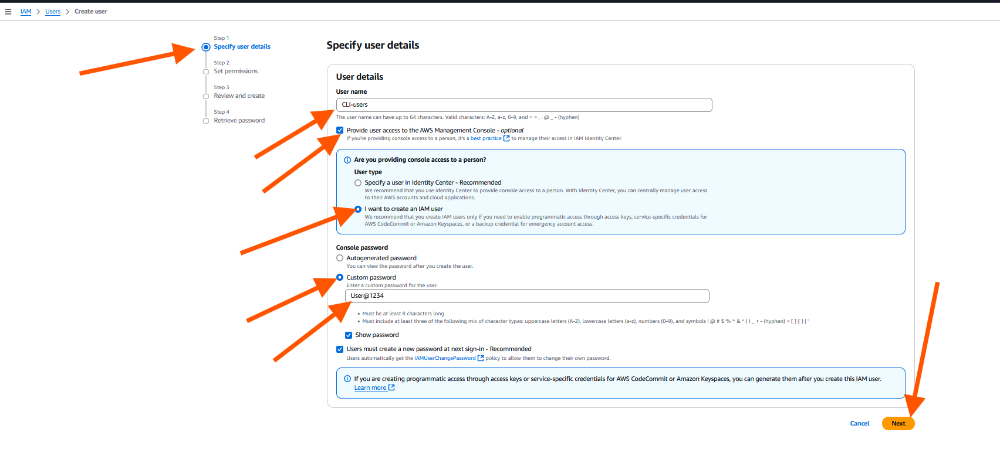

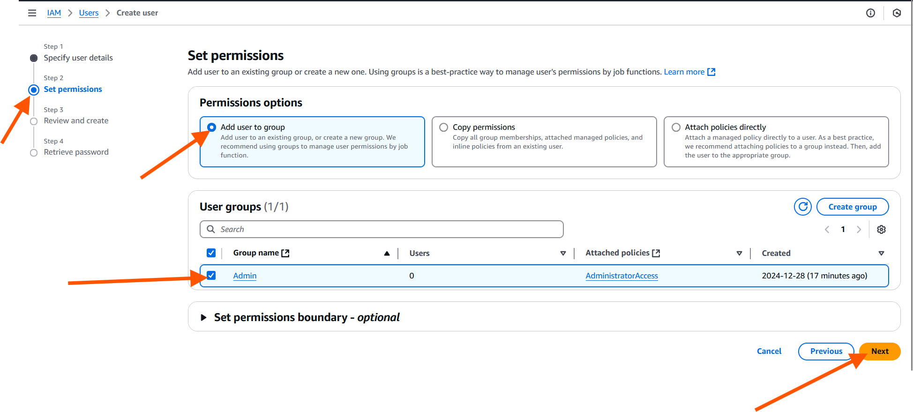


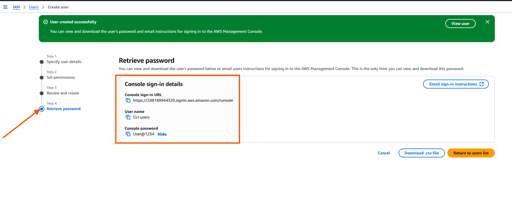


- `create_iam_group`: Creates an IAM group named `admin`.

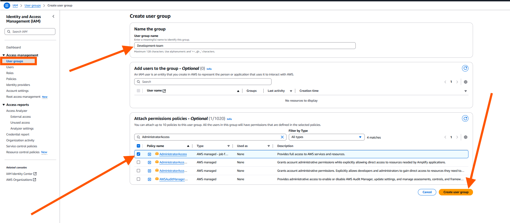

- `attach_policy_to_group`: Attaches the `AdministratorAccess` policy to the `admin`group.

- `assign_users_to_group`: Assigns each IAM user to the `admin` group.

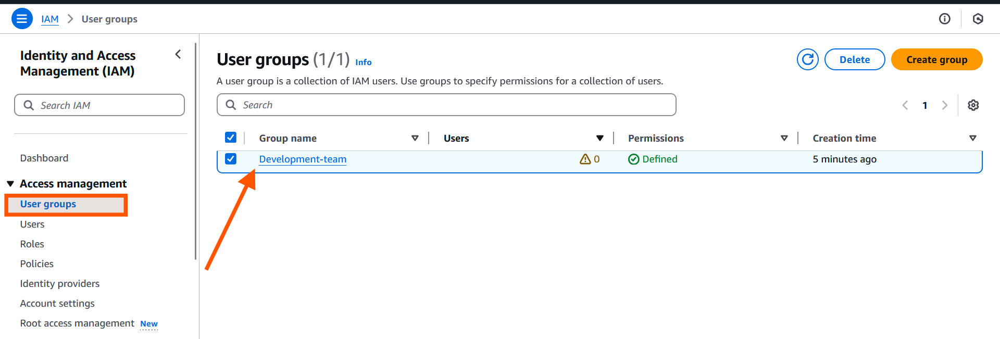

3. Main Execution Block:
- Each function is called in sequence to perform the tasks: creating users, creating a group, attaching a policy, and assigning users to the group.

### Steps to Run the Script

1. Install and Configure AWS CLI:
 
 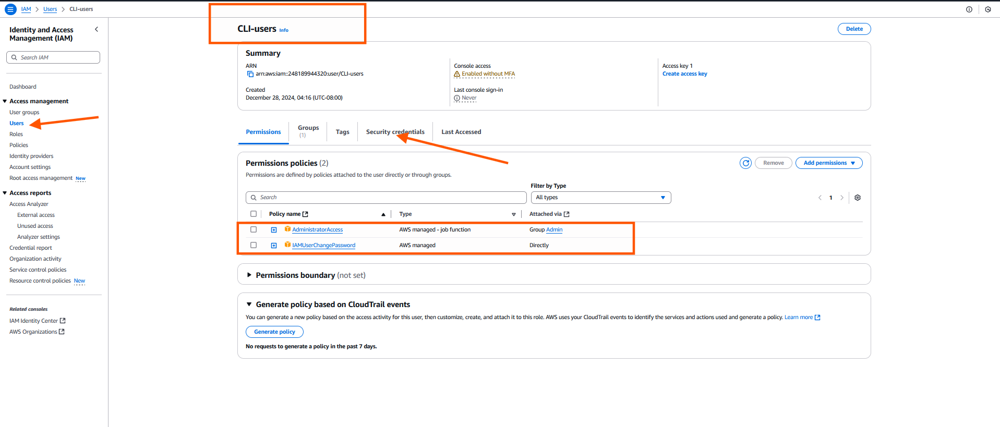


 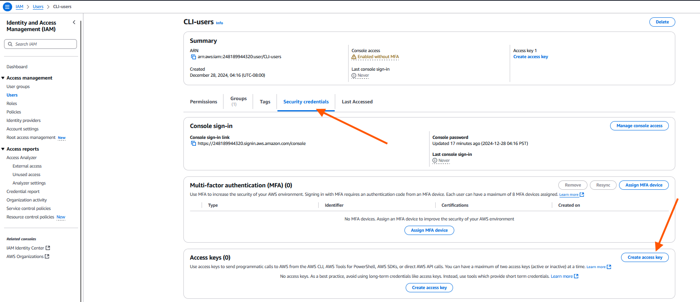

 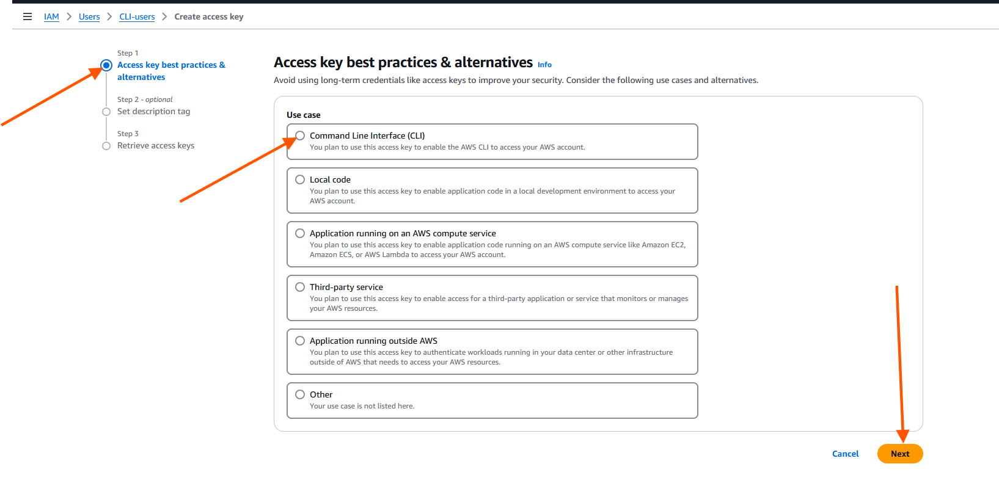

 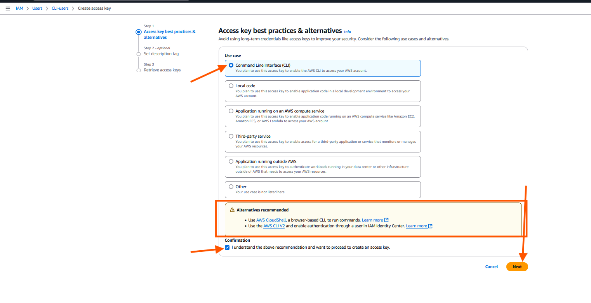

 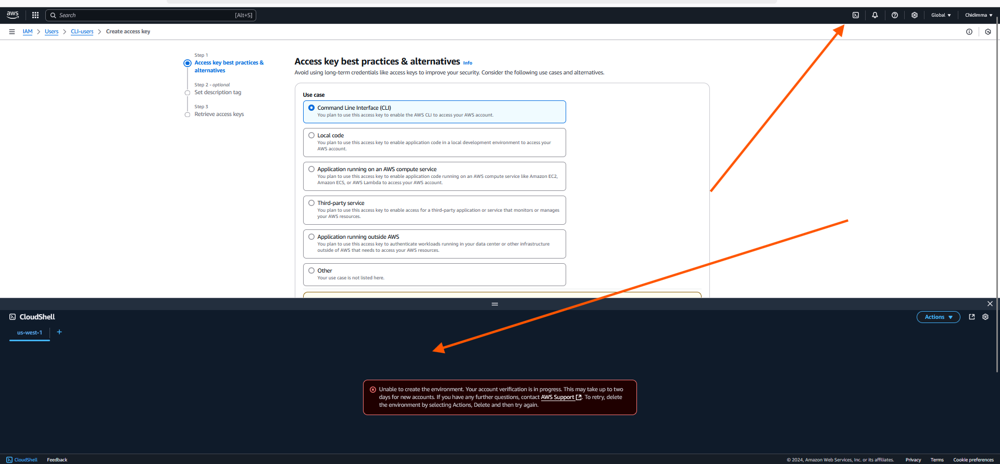

 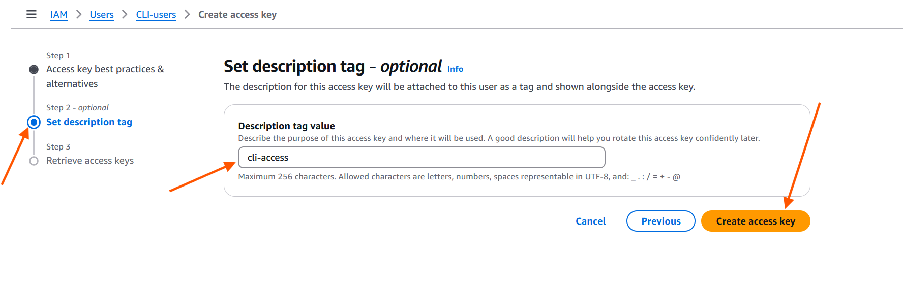

 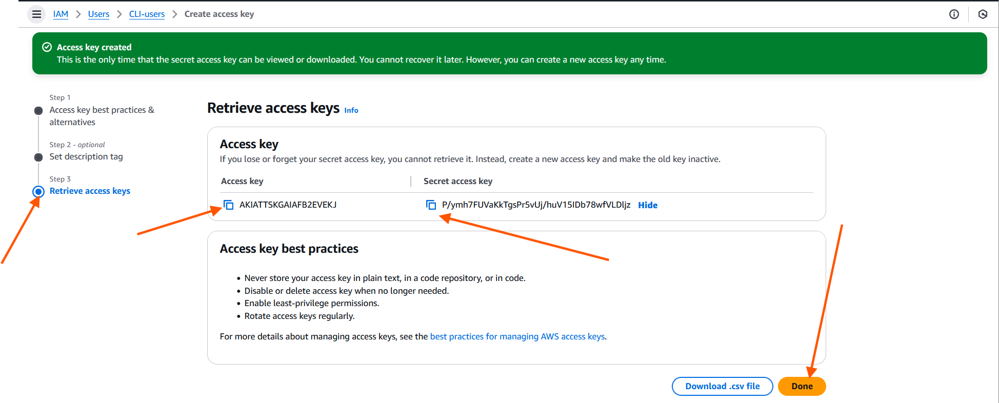

 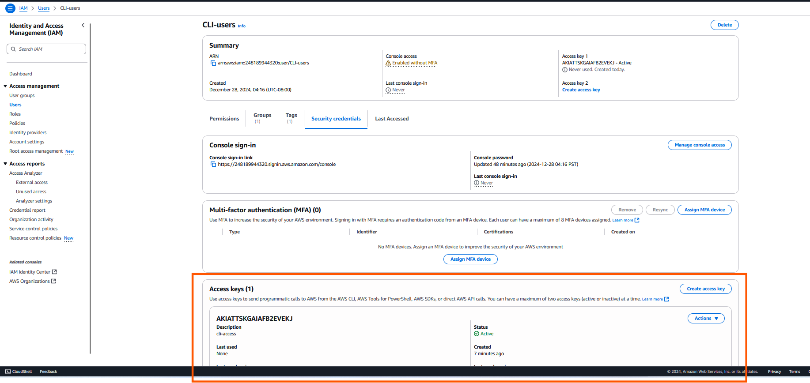

 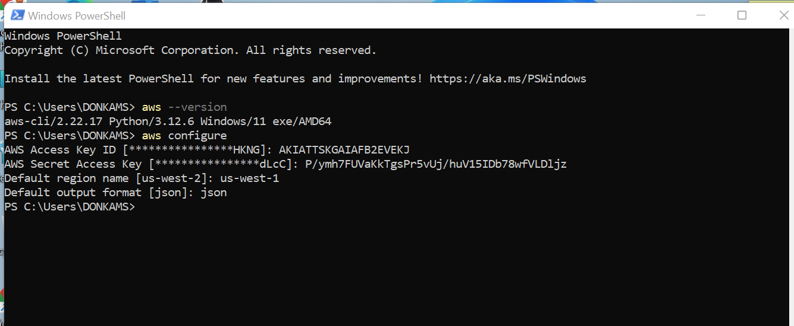