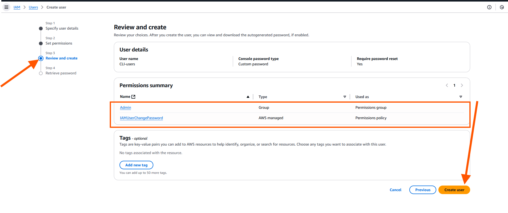

# Linux Administration and Shell Scripting

### Capstone Project: Shell Scrip for AWS IAM Management

**Project Scenario**

CloudOps Solutions is a growing company that recently adopted AWS to manage its cloud infrastructure. As the company scales, they have decided to automate the process of managing AWS Identity and Access Management (IAM) resources. This includes the creation of user groups, and the assignment of permissions for new hires, especially for their DevOps team.

## Purpose

In this capsone project, I will extend my shell scripting capabilities by creating more functions that extend the ***"aws_cloud_manager.sh"*** script.

**Objectives:**

# 1. **Script Enhancement:** refers to improving or extending an existing script to add new functionality, make it more efficient, or tailor it to meet additional requirements. In this context of my project, script enhancement involves modifying the provided script to include new capabilities for AWS Identity and Access Management (IAM) tasks.

# Components of Script Enhancement:

1. Adding New Features:
- Extending the script to include tasks that weren't originally present, such as creating users, managing groups, and assigning policies.

2. Improving Functionality:
- Making the script more robust by handling errors, optimizing logic, and automating additional processes.

3. Tailoring to New Requirements:

- Adapting the script to meet the objectives outlined in the project. For example:

- Defining IAM user names in an array.
- Creating IAM users and groups.
- Attaching policies and assigning users to groups.

4. Optimizing for Automation:
- Ensuring that the script minimizes manual work, uses loops and reusable functions, and executes tasks in an efficient sequence.

## In the context of This Project
The enhancement focuses on:
- **Transforming the script into an IAM management tool** that automates user, group, and policy creation in AWS.

- Adding logical steps (functions) for each objective, such as:

- Defining users in an array.
- Using AWS CLI commands to manage IAM resources.
- Adding error handling and logging.


### Extend the provided script to include IAM management.

To extend the provided script for IAM management, I'll provide a complete shell script that includes all the IAM management functionality based on the project requirements. 

### Full Script for IAM Management:

```
#!/bin/bash

# IAM Management Script for AWS

# Define IAM User Names Array
IAM_USERS=("user1" "user2" "user3" "user4" "user5")

# Function to Create IAM Users
create_iam_users() {
    echo "Creating IAM users..."
    for USER in "${IAM_USERS[@]}"
    do
        aws iam create-user --user-name "$USER" >/dev/null 2>&1
        if [ $? -eq 0 ]; then
            echo "Successfully created user: $USER"
        else
            echo "Failed to create user: $USER (might already exist)"
        fi
    done
    echo "IAM users creation completed."
}

# Function to Create IAM Group
create_iam_group() {
    GROUP_NAME="admin"
    echo "Creating IAM group: $GROUP_NAME..."
    aws iam create-group --group-name "$GROUP_NAME" >/dev/null 2>&1
    if [ $? -eq 0 ]; then
        echo "Successfully created group: $GROUP_NAME"
    else
        echo "Group $GROUP_NAME might already exist"
    fi
}

# Function to Attach Administrative Policy to Group
attach_policy_to_group() {
    GROUP_NAME="admin"
    POLICY_ARN="arn:aws:iam::aws:policy/AdministratorAccess"
    echo "Attaching AdministratorAccess policy to group: $GROUP_NAME..."
    aws iam attach-group-policy --group-name "$GROUP_NAME" --policy-arn "$POLICY_ARN" >/dev/null 2>&1
    if [ $? -eq 0 ]; then
        echo "Successfully attached policy to group: $GROUP_NAME"
    else
        echo "Failed to attach policy to group: $GROUP_NAME"
    fi
}

# Function to Assign Users to the Group
assign_users_to_group() {
    GROUP_NAME="admin"
    echo "Adding users to group: $GROUP_NAME..."
    for USER in "${IAM_USERS[@]}"
    do
        aws iam add-user-to-group --user-name "$USER" --group-name "$GROUP_NAME" >/dev/null 2>&1
        if [ $? -eq 0 ]; then
            echo "Successfully added user $USER to group: $GROUP_NAME"
        else
            echo "Failed to add user $USER to group: $GROUP_NAME"
        fi
    done
    echo "User assignment to group completed."
}

# Main Script Execution
echo "Starting AWS IAM Management Script..."
create_iam_users
create_iam_group
attach_policy_to_group
assign_users_to_group
echo "Script execution completed successfully."
```

### How It Works

1. IAM User Array:
- The script defines an array `IAM_USERS` to hold the list of usernames that need to be created.

2. Function for Each Task:
- `create_iam_users`: Iterates through the array and creates each user using the `aws iam create-user` CLI command.





- `create_iam_group`: Creates an IAM group named `admin`.


- `attach_policy_to_group`: Attaches the `AdministratorAccess` policy to the `admin`group.

- `assign_users_to_group`: Assigns each IAM user to the `admin` group.


3. Main Execution Block:
- Each function is called in sequence to perform the tasks: creating users, creating a group, attaching a policy, and assigning users to the group.

### Steps to Run the Script

1. Install and Configure AWS CLI:
 
 


 

 

 

 

 

 

 

 


 2. **Save the Script:**
 - Save the script to a file, e.g., `aws_cloud_managers.sh`.


 3. Make the Script Executable:

- Run the following command to make the script executable

`sudo chmod +x aws_cloud_managers.sh`

4. Run the Script:

- Execute the script:
`./aws_cloud_managers.sh`


# 2. Define IAM user Names Array:
To define an **IAM user names array** in a shell script, I can use a Bash array to store the names of the users. Below is the procedures:

Defining the IAM User Names Array.

```
IAM_USERS=("user1" "user2" "user3" "user4" "user5")
```
- Syntax Explanation:

- IAM_USERS: The name of the array variable.

- `=("user1" "user2" "user3" "user4" "user5")`: The array elements, which are the IAM user names.

### Accessing Array Elements

- Iterate Through the Array: To loop through the user names in the array:

```
for USER in "${IAM_USERS[@]}"
do
    echo "Creating IAM user: $USER"
done
```

- `${IAM_USERS[@]}` Expand to all elements of the array.
- `$USER`: Holds each element of the array during each iteration.

- **Access Individual Elements:** To access a specific element in the array (e.g.,the first user):

`echo "First user: ${IAM_USERS[0]}"`

### Full Example:

Here's an example script where the array is used to create IAM users:

```
 #!/bin/bash

# Define the IAM User Names Array
IAM_USERS=("user1" "user2" "user3" "user4" "user5")

# Loop Through the Array and Create IAM Users
for USER in "${IAM_USERS[@]}"
do
    echo "Creating IAM user: $USER"
    
    # AWS CLI command to create IAM user
    aws iam create-user --user-name "$USER"
    
    # Check if the user was created successfully
    if [ $? -eq 0 ]; then
        echo "Successfully created IAM user: $USER"
    else
        echo "Failed to create IAM user: $USER"
    fi
done

echo "IAM user creation process completed."

```


- Store the names of the five IAM users in an array for easy iteration during user creation.


# 3. Create IAM Users: 

- Iterate through the IAM user names array and create IAM users for each employee using AWS CLI commands.


# 4. Create IAM Group:

- Define a function to create an IAM 
group named "admin" using the AWS CLI.

```
Create IAM Group

  Write a function in the script to create the IAM group:

   create_group() { GROUP_NAME="admin"
   aws iam create-group --group-name
   "$GROUP_NAME"
   echo "Created group: $GROUP_NAME"
   }
   create_group.
   ```

  1. Overview of `create_group` Function

  The `create_group()` function:

- Defines a group name ( GROUP_NAME ).
- Uses the AWS CLI to create an IAM group.
- Provides feedback to the user if the group was created successfully or if there was an error.

2. Step-by-Step Implementation

Step1: Full Script Structure

Create a file called `manage_iam_group.sh`:

Bellow are the content to run the script:

```
#!/bin/bash

# Function to create an IAM group
create_group() {
    GROUP_NAME="admin"  # Set the group name

    echo "Attempting to create IAM group: $GROUP_NAME"

    # AWS CLI command to create the group
    aws iam create-group --group-name "$GROUP_NAME"

    # Check if the command was successful
    if [ $? -eq 0 ]; then
        echo "Successfully created IAM group: $GROUP_NAME"
    else
        echo "Failed to create IAM group: $GROUP_NAME"
    fi
}

# Main script execution
create_group  # Call the function to create the group
```

Step 2: Make the Script Executable.

`chmod +x manage_iam_group.sh`

Step 3: Execute the Script

Run the script:

`./manage_iam_group.sh`

The command bellow is to modify the script to check if the group already exists before attempting to create it. This way, you avoid errors and redundant group creation.

```
#!/bin/bash

# Function to create an IAM group
create_group() {
    GROUP_NAME="admin"  # Set the group name

    echo "Checking if group '$GROUP_NAME' already exists..."

    # Check if the group exists
    aws iam get-group --group-name "$GROUP_NAME" > /dev/null 2>&1
    if [ $? -eq 0 ]; then
        echo "Group '$GROUP_NAME' already exists. No action taken."
        return
    fi

    echo "Attempting to create IAM group: $GROUP_NAME"

    # AWS CLI command to create the group
    aws iam create-group --group-name "$GROUP_NAME"

    # Check if the command was successful
    if [ $? -eq 0 ]; then
        echo "Successfully created IAM group: $GROUP_NAME"
    else
        echo "Failed to create IAM group: $GROUP_NAME"
    fi
}

# Main script execution
create_group  # Call the function to create the group
```


# 5. Attach Administrative Policy to Group:

- Attach an AWS-managed administrative policy (e.g., "AdministratorAccess") to the "admin" group to grant administrative privileges.

```
 Attach Administrative Policy to the Group

    Attach the AdministratorAccess policy to the group:

attach_policy_to_group() {
    GROUP_NAME="admin"
    POLICY_ARN="arn:aws:iam::aws:policy/AdministratorAccess"
    aws iam attach-group-policy --group-name "$GROUP_NAME" --policy-arn "$POLICY_ARN"
    echo "Attached AdministratorAccess policy to group: $GROUP_NAME"
}
attach_policy_to_group. 
```

Attaching an administrative policy, such as `AdministratorAccess` to a group involves using the AWS CLI to bind the policy ARN to the group. Let's break down the process step-by-step with a script and its execution.

# Step 1. Save the Script

Open the shell editor (e.g., `nano, vi,vim`):

```
nano attach_policy.sh
```
2. Paste the script bellow into the file.

3. Save and exit the editor (e.g., Press `ctrl+0`, `Enter`, and `ctrl+x` in `nano`).


Here's the script to attach the `AdministratorAccess` policy to the `admin` `development-team`group:

```
#!/bin/bash

# Function to attach an administrative policy to a group
attach_policy_to_group() {
    GROUP_NAME="admin"  # Define the group name
    POLICY_ARN="arn:aws:iam::aws:policy/AdministratorAccess"  # ARN for AdministratorAccess policy

    echo "Attaching AdministratorAccess policy to group: $GROUP_NAME"

    # AWS CLI command to attach the policy to the group
    aws iam attach-group-policy --group-name "$GROUP_NAME" --policy-arn "$POLICY_ARN"

    # Check if the command was successful
    if [ $? -eq 0 ]; then
        echo "Successfully attached policy: $POLICY_ARN to group: $GROUP_NAME"
    else
        echo "Failed to attach policy to group: $GROUP_NAME"
    fi
}

# Main script execution
attach_policy_to_group  # Call the function
```

4. Run the script to attach the policy:

```
./attach_policy.sh
```


### Error Handling
If the script fails to attach the policy, ensure the following:

1. IAM Permissions: IAM user must have permission to attach policies to groups. The required permission is `iam:AttachGroupPolicy`.

2. Policy ARN Accuracy: Verify the policy ARN is correct:

```
aws iam list-policies --query 'Policies[?PolicyName==`AdministratorAccess`].Arn'
```

3. Group Existence: Ensure the group `admin`, `development-team` exists:

```
aws iam list-groups
```

The command to removing a policy.

If you need to detach the policy later, use the following command:

```
aws iam detach-group-policy --group-name admin --policy-arn arn:aws:iam::aws:policy/AdministratorAccess
```

6. Assign Users to Group:

- Iterate through the array of IAM user names and assign each user to the "admin" group using AWS CLI commands.


# Pre-requisite

- Completion of Linux foundations with shell Scripting mini projects.