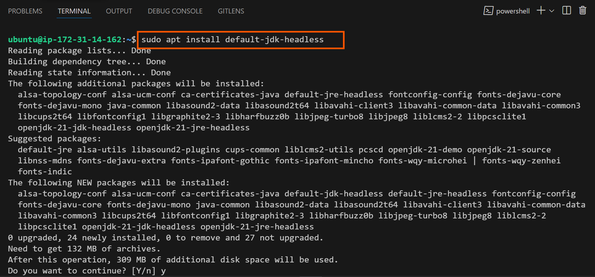

# Automating Deployment of an E-Commerce Website

## Capstone Project: CI/CD Mastery

**Project Scenario**

A technology consulting firm, is adopting a cloud architecture for it's software applications. As a DevOps Engineer,my task is to design and implement a robust CI/CD pipeline using Jenkins to automate the deployment of a web application. The goal is to achieve continous integration, continous deployment, and ensure the scalability and reliability of the applications.

### Pre-requisite

- Knowledge of Jenkins essentials.

- Completion of Introduction to Jenkins,Jenkins freestyle Project, and Jenkins Pipeline Job mini projects.

### Project Deliverables

### Documentation:

- Detailed documentation for each Jenkins component setup.

- Explanation of security measures implemented at each step.


### Demonstration:

- Detailed documentation for each Jenkins component setup.

- Explanation of security measures implemented at each step.

### Demonstration:

- Live demonstration of the CI/CD pipeline.

## Project Components

1. **Jenkins Server Setup**.

**Objective:** Configure Jenkins Server for CI/CD pipeline automation.


### Steps:

# Install Jenkins on a dedicated server.

Installation of Jenkins on a dedicated server is a straightforward process. Here's a step-by-step guild tailored for real-world deployment:

Step 1: Server Preparation

1. **Provision the Server:** Create a dedicated server ready with a supported operating system (Linux is Preferred, such as Ubuntu or CentOS).

2. **Update system Packages:**

   - For Ubuntu/Debian-based systems:

   ```
   sudo apt update && sudo apt upgrade -y
   ```


 
3. **Install Java:** Jenkins requires Java to run.
    - Install OpenJDK (Preferred):
      - For Ubuntu/Debian:
        
        ```
        sudo apt install openjdk-11-jdk -y
        ```
     



    **Step 2: Install Jenkins**

      On Ubuntu/Debian:

      1. Add Jenkins Repository: Get the Jenkins repo on the official site.
```
sudo wget -O /usr/share/keyrings/jenkins-keyring.asc \
https://pkg.jenkins.io/debian-stable/jenkins.io-2023.key
echo "deb [signed-by=/usr/share/keyrings/jenkins-keyring.asc]" \
https://pkg.jenkins.io/debian-stable binary/ | sudo tee \
/etc/apt/sources.list.d/jenkins.list > /dev/null
sudo apt-get update
sudo apt-get install jenkins
```
The command above installs Jenkins. It involves importing the Jenkins GPG key for package verification, adding the Jenkins repository to the system's sources, updating package lists, and finally, installing Jenkins through the package manager (apt-get).


**Check if Jenkins has been installed, and it is up and running**

```
sudo systemctl status jenkins
```


********************************************

# Set up necessary Plugins (Git, Docker, etc.).

- Configure Jenkins with required security measures.


### Instruction for Jenkins: