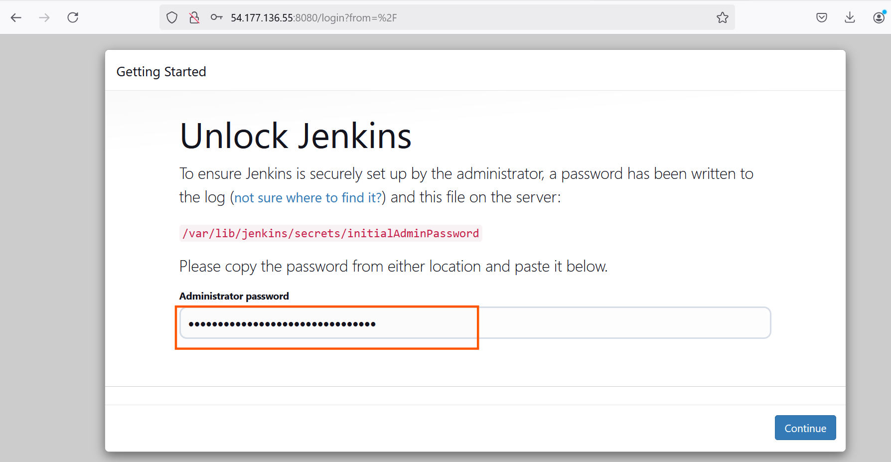
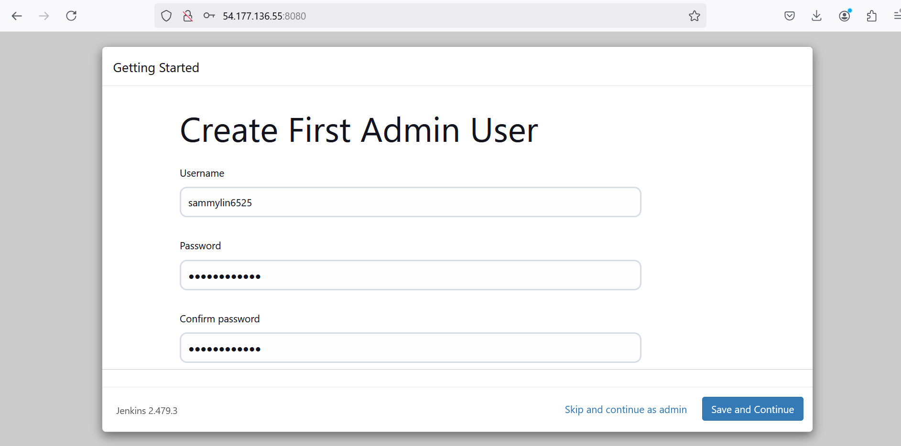
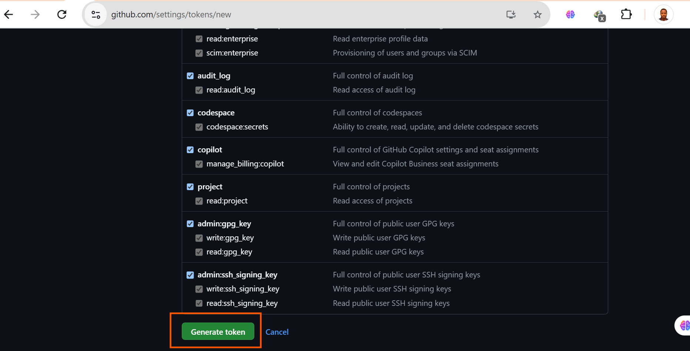

# Automating Deployment of an E-Commerce Website

## Capstone Project: CI/CD Mastery

**Project Scenario**

A technology consulting firm, is adopting a cloud architecture for it's software applications. As a DevOps Engineer,my task is to design and implement a robust CI/CD pipeline using Jenkins to automate the deployment of a web application. The goal is to achieve continous integration, continous deployment, and ensure the scalability and reliability of the applications.

### Pre-requisite

- Knowledge of Jenkins essentials.

- Completion of Introduction to Jenkins,Jenkins freestyle Project, and Jenkins Pipeline Job mini projects.

### Project Deliverables

### Documentation:

- Detailed documentation for each Jenkins component setup.

- Explanation of security measures implemented at each step.


### Demonstration:

- Detailed documentation for each Jenkins component setup.

- Explanation of security measures implemented at each step.

### Demonstration:

- Live demonstration of the CI/CD pipeline.

## Project Components

1. **Jenkins Server Setup**.

**Objective:** Configure Jenkins Server for CI/CD pipeline automation.


### Steps:

# Install Jenkins on a dedicated server.

Installation of Jenkins on a dedicated server is a straightforward process. Here's a step-by-step guild tailored for real-world deployment:

Step 1: Server Preparation

1. **Provision the Server:** Create a dedicated server ready with a supported operating system (Linux is Preferred, such as Ubuntu or CentOS).

2. **Update system Packages:**

   - For Ubuntu/Debian-based systems:

   ```
   sudo apt update && sudo apt upgrade -y
   ```


 
3. **Install Java:** Jenkins requires Java to run.
    - Install OpenJDK (Preferred):
      - For Ubuntu/Debian:
        
        ```
        sudo apt install openjdk-11-jdk -y
        ```
     


    **Step 2: Install Jenkins**

      On Ubuntu/Debian:

      1. Add Jenkins Repository: Get the Jenkins repo on the official site.
```
sudo wget -O /usr/share/keyrings/jenkins-keyring.asc \
https://pkg.jenkins.io/debian-stable/jenkins.io-2023.key
echo "deb [signed-by=/usr/share/keyrings/jenkins-keyring.asc]" \
https://pkg.jenkins.io/debian-stable binary/ | sudo tee \
/etc/apt/sources.list.d/jenkins.list > /dev/null
sudo apt-get update
sudo apt-get install jenkins
```
The command above installs Jenkins. It involves importing the Jenkins GPG key for package verification, adding the Jenkins repository to the system's sources, updating package lists, and finally, installing Jenkins through the package manager (apt-get).


**Check if Jenkins has been installed, and it is up and running**

```
sudo systemctl status jenkins
```


********************************************

# Set up necessary Plugins (Git, Docker, etc.).

Setting up necessary plugings like Git, Docker, and others in Jenkins is crucial for integrating version control, containerization, and other tolls into my CI/CD Pipelins. Here's a step-by-step guide to set up these plugins:

**step 1: Access Jenkins Plugin Manager**
  
1. Login in to the Jenkins server at      
`http://<my_server_ip>:8080`


- Run the command command below to generate adminpassword to access jenkins platform.

```
sudo cat /var/lib/jenkins/secrets/initialAdminPassword
```





After the Selection of the customized page to install all the plugins, then the next page is to configure the user name and password to access the Jenkins platform.




Next is access into the Jenkins Platform.


2. Navigate to the **Manage Jenkins -> Manage Plugins**. 


- Follow the Image description below to install all the recommended Jenkins Plugins (Git, Docker Pipeline.)


After, selecting the installation of Git plugins then, repeat thesame procedure to install "Docker-Pipeline".


# Configure Jenkins with required security measures.

On my Jenkins instance, I need to create a new rules for port 8080 in the security group

- By default, Jenkins listens on port 8080, I need to create an inbound rule for this in the security group of my Jenkins instance


  ### Instruction for Jenkins:

  - Document the steps for Jenkins installation.

  - Details the plugin installation and configuration.

  - Outline security measures applied to the Jenkins server.


  ***********************

2. # Source Code Management Repository Integration**

  **Objective:** Connect Jenkins to the version control system for source code management.

  **Steps:**

  ### Integrate Jenkins with the source code management repository (e,g., GitHub, Bitbucket).

    Integrating Jenkins with a source management (SCM) repository like GitHub or Bitbucket is essential for automating builds, tests, and deployments.

**Step 1: Install the Necessary Plugins**
    1. Navigate to Manage Jenkins -> Manage Plugins.

    2. Install the following plugins based on my SCM:

        - Git Plugin: For general Git repository integration

        - GitHub Integration Plugin: For GitHub-specific features (webhooks, build triggers, etc.).

**Step 2: Set Up Credentials**

  Jenkins requires credentials to connect to my repository.

  1. Generate Access Credentials:
  
      - GitHub:

        1. Go to your GitHub account settings -> **Developers Settings -> Personal Access Tokens**.

The procedure to carry out the settings above.


The token named and created after the step below.





2. **Add Credentials in Jenkins:**

    1. Navigate to **Manage Jenkins -> Manage Credentials**.


    2. Select the appropriate scope (Global or folder-specific).


    3. Add a new credential:

        - **Kind:** Choose either "Username with password" or "Secret Text" (use "Secret Text" for tokens).

        - ID: Enter a recognizable ID for later use.

        - Description: Provide details for easy identification.

     In the Jenkens platform, I have to create my first build job.

     From the dashboard menu on the left side, click on the new item

       

### Connecting Jenkins To Our Source Code Management

Now that I have created my first project on Jenkins , let me connect Jenkins with github.


Save the configuration and "build now" to connect jenkins to my repository.


 

### Configure webhooks for automatic triggering of Jenkins builds.

Webhooks allow Jenkins to automatically start a build whenever changes are pushed to a source code repository.

  1. Enable Webhook Triggering in Jenkins

  Before setting up webhooks, ensure Jenkins is configured to accept webhook requests.

### Configuring Build Trigger

As an angineer, I nee to be able to able to automate things and make our work easier in possible ways. I have connected `jenkins` to `jenkins-scm`, but I cannot run a new build with clicking on `Build Now`. To eliminate this, I need to configure a build trigger to `my jenkins first job`. with this, jenkins will run a new build anytime a change is made to my github repository.

Follow the instruction below to accomplish the task.

i. Click "Configure" my job and add this configurations

ii. Click on build trigger to configure triggering the job from GitHub webhook.


iii. Create a github webhook using jenkins ip address and port


**Instructions for Jenkins:**

  - Document the integration steps with the version control system.

  - Provide instructions for setting up webhooks. 

  ********************************************

  # 3. Jenkins Freestyle Jobs for Build and Unit Tests

  **Objective:** Create Jenkins Freestyle jobs for building a web application and running unit tests.

  **Steps:** 

  - Set up a Freestyle job for building the application.


### Creating a Freestyle Project

**Let's create my first build job**

i. From the dashboard menu on the left side, click on new item


ii. Create a freestyle project and name it "my-second-job"


 **Instructions for Jenkins:**

- Document the configuration of Freestyle jobs.

********************************************

# 4.Jenkins Pipeline for Web Application**

**Objective:** Develop a Jenkins Pipeline for running a web application.


**Steps:**

- Create a Jenkins Pipeline script to run a web application.

### Writing Jenkins Pipeline Script

A Jenkins pipeline script refers to a script that defines and orchestrates the steps and stages of a continuous integration and continuous delivery (CI/CD) Pipeline. Jenkins Pipelines can be defined using either declarative or scripted syntax. Declarative syntax is a more structured and concise way to define pipelines. It uses a domain-specific language to describe the pipeline stages, steps, and other configurations while scripted syntax provides more flexibility and is suitable for complex scripting requirements.

Below is my pipeline script.

```
pipeline {
    agent any

    stages {
        stage('Connect To Github') {
            steps {
                    checkout scmGit(branches: [[name: '*/main']], extensions: [], userRemoteConfigs: [[url: 'https://github.com/sammyCHY/jenkins-scm.git']])
            }
        }
        stage('Build Docker Image') {
            steps {
                script {
                    sh 'docker build -t dockerfile .'
                }
            }
        }
        stage('Run Docker Container') {
            steps {
                script {
                    sh 'docker run -itd --name nginx -p 8081:80 dockerfile'
                }
            }
        }
    }
}
```
**Explanation of the script above**

The provided Jenkins Pipeline script defines a series of tages for a continuous integration and continuous delivery (CI/CD) process. Let's break down each stage:

Agent configuration:

```
agent any
```
Specifies that the pipeline can run on any available agent (an agent can either be a jenkins master or node). This means the pipeline is not tied to a specific node type.


- Stages:

```
stages {
   // Stages go here
}
```
Defines the various stages of the pipeline, each representing a phase in the software delivery process.

- **Stage 1: Connect To Github:**

```
stage('Connect To Github') {
   steps {
      checkout scmGit(branches: [[name: '*/main']], extensions: [], userRemoteConfigs: [[url: 'https://github.com/RidwanAz/jenkins-scm.git']])
   }
}
```
- This stage checks out the source code from a GitHub repository (https://github.com/sammyCHY/jenkins-scm.git).

- It specifies that the pipeline should use the `main branch`

```
- Stage 2: Build Docker Image:

stage('Build Docker Image') {
   steps {
      script {
         sh 'docker build -t dockerfile .'
      }
   }
}
```

- This stage builds a Docker image named 'dockerfile' using the source code obtained from the GitHub repository.

- The `docker build` command is executed using the shell (`sh`).


- **Stage 3: Run Docker Container:**

```
stage('Run Docker Container') {
   steps {
      script {
         sh 'docker run -itd --name nginx -p 8081:80 dockerfile'
      }
   }
}
```
- This stage runs a Docker container named 'nginx' in detached mode (`-itd`).

- The container is mapped to port 8081 on the host machine (`-p 8081:80`).

- The Docker image used is the one build in the previous stage (`dockerfile`)

**Instructions for Jenkins:**

- Provide the Pipeline script to run a web application.


**********************

# 5. Docker Image Creation and Registry Push

**Objective:** Automate the creation of Docker images for web application and push them to a container registry such as docker hub.

Steps:

- Configure Jenkins to build Docker Images.


- Run a container using the built docker image

- Access the web application on my web browser

- Push Docker Images to a container registry.


# Instruction for Jenkins:

- Document Docker image creation within Jenkins.

- Explain the process for running a container

- Explain the setup for pushing images to a registry.