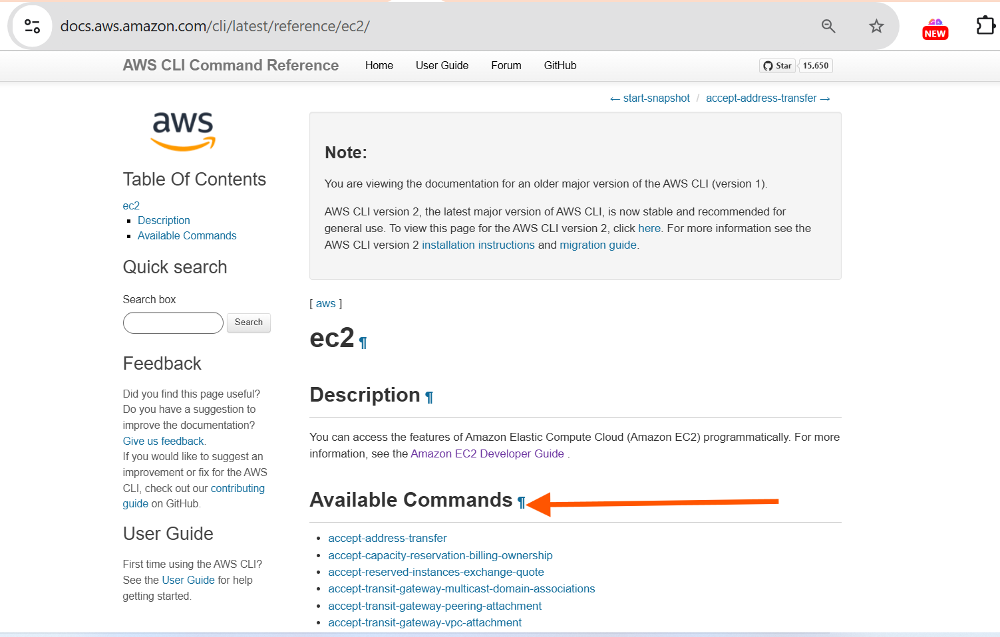
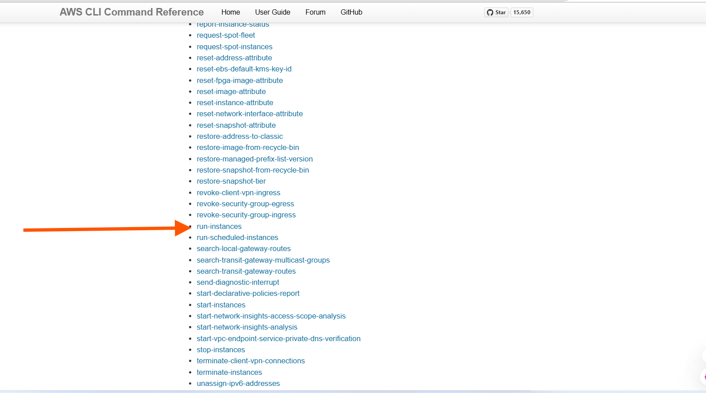
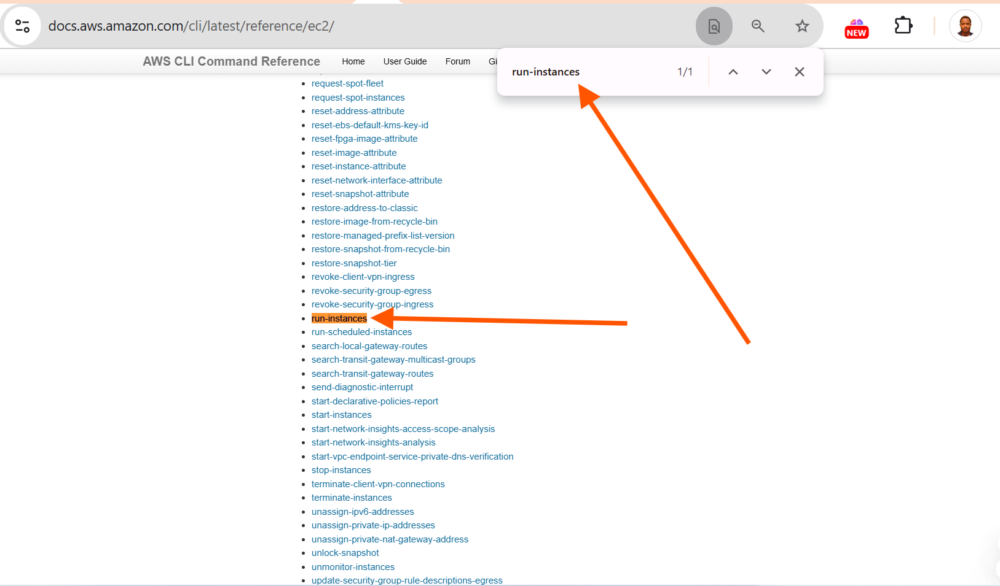
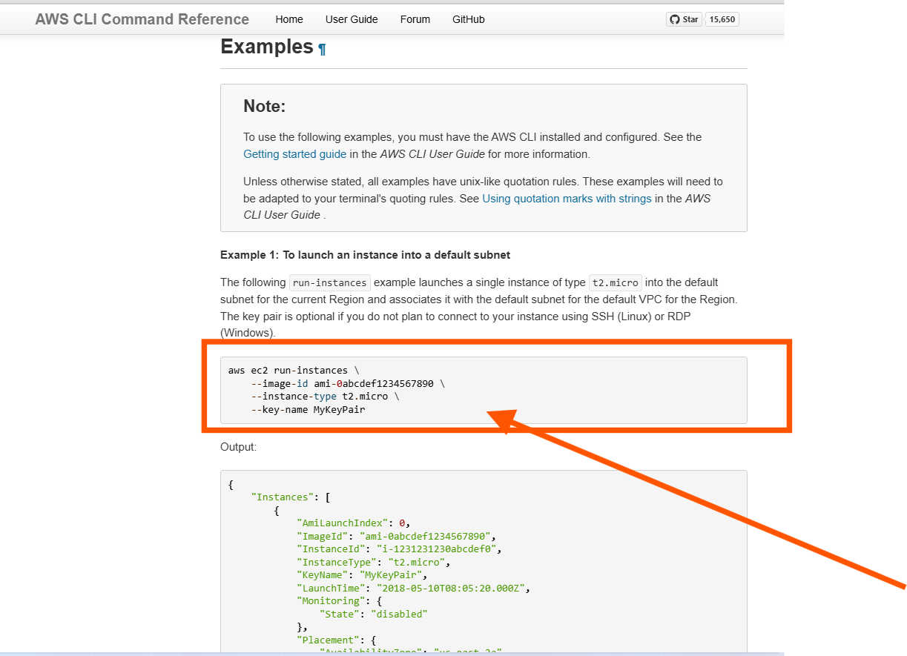

# Creating AWS Resources With Functions & Indroducing Arrays

I will begin this project by creating two functions:

1. One for provisioning EC2 instances and

2. Another for setting up S3 buckets.

These functions will streamline the process of resources creation and enable us to automate tasks effectively.

### Function to Provision EC2 instances

To programmatically create EC2 instances, you must use the [official documentation](https://docs.aws.amazon.com/cli/latest/reference/ec2/) to understand how to use the [`aws cli` to create instances](https://docs.aws.amazon.com/cli/latest/reference/ec2/)

From the Available Commands, you will be able to interact with AWS Programmatically.




If you search for **run-instances** on the page with **Control F** on the key board, click on it and it will take you to the datailed documentation on the sub-command to create EC2 instances.






Here is an ecample of how you would create EC2 instances using the command line.

```
    aws ec2 run-instances \
        --image-id "ami-0cd59ecaf368e5ccf" \
        --instance-type "t2.micro" \
        --count 5 \
        --key-name MyKeyPair \
        --region eu-west-2
```

Note: Make sure you have a key pair created in my aws console. The you can replace the `mykeypair` with my key pair name.

On the same page, if you search for one of the arguments, you will be able to read more about how to pass different arguments to the cli.



For the command to work: A keypair must already exist. You must create a keypair from the console. To create a new key pair.

1. Navigate to the AWS EC2 console

2. Follow the image below to create a key pair


Now, lets update the shell script and create a function that will be responsible for creating EC2 instances.

```
#!/bin/bash

# Function to create EC2 instances

create_ec2_instances() \{

    # Specify the parameters for the EC2 instances
    instance_type="t2.micro"
    ami_id="ami-0cd59ecaf368e5ccf"  
    count=2  # Number of instances to create
    region="eu-west-2" # Region to create cloud resources
    
    # Create the EC2 instances
    aws ec2 run-instances \
        --image-id "$ami_id" \
        --instance-type "$instance_type" \
        --count $count
        --key-name MyKeyPair
        
    # Check if the EC2 instances were created successfully
    if [ $? -eq 0 ]; then
        echo "EC2 instances created successfully."
    else
        echo "Failed to create EC2 instances."
    fi
\}

# Call the function to create EC2 instances
create_ec2_instances
```
### Lets highlight some new areas

- $?: This is a special variable that holds the exit status of the last executed command. In this case, it checks if the aws ec2 run-instances command was successful. Therefore if exit code is "0" is interpreted as successful. Therefore if exit code is "0" then echo the message to confirm that the previous command was successful.


- We have once again used environment variables to hold the value of **ami_id, count and region** and replace with their respective values with **$ami_id, $count and $region**

**Define function to create S3 buckets & learn about Arrays**

Before dividing into creating S3 buckets, It's beneficial to brush up on AWS S3 bucket concepts. If you need a quick refresher, [consider watching this informative video](https://www.youtube.com/watch?v=e6w9LwZJFIA&pp=ygURd2hhdCBpcyBzMyBidWNrZXQ%3D)

The [AWS CLI reference for S3 can be found here.](https://docs.aws.amazon.com/cli/latest/reference/s3api/) We will be using it in the script.

In this section, our objective is to create five distict S3 buckets, each designated for storing data related to Marketing, Sales, HR, Operations, and Media.

To achieve this, I will utilze a fundamental data structure in shell scripting known as an "array". this is because, we need one single variable holding all the data, and then have the capability to loop through them.

**Arrays in Shell Scripting**

An array is a versatile data structure that allows you to store multiple values under a single variable name. Particularly in shell scripting, arrays offer an efficient means of managing collections of related data, making them invaluable for our task ahead.

Below is what the function would look like.

```
# Function to create S3 buckets for different departments
create_s3_buckets() \{
    # Define a company name as prefix
    company="datawise"
    # Array of department names
    departments=("Marketing" "Sales" "HR" "Operations" "Media")
    
    # Loop through the array and create S3 buckets for each department
    for department in "$\{departments[@]\}"; do
        bucket_name="$\{company\}-$\{department\}-Data-Bucket"
        # Create S3 bucket using AWS CLI
        aws s3api create-bucket --bucket "$bucket_name" --region your-region
        if [ $? -eq 0 ]; then
            echo "S3 bucket '$bucket_name' created successfully."
        else
            echo "Failed to create S3 bucket '$bucket_name'."
        fi
    done
\}

# Call the function to create S3 buckets for different departments
create_s3_buckets
```

Lets break down each part of the code.

- This lines begins the definition of a shell function named **create_s3_buckets.**

```
# Function to create S3 buckets for different departments
create_s3_buckets() \{
```

- Here, I define a variable named company and assign it the value "datawise". This varaible will serve as the prefix for all S3 bucket names, ensuring their uniqueness. You should replace ***datawise*** with any other company name of my choice or any other unique identifier. This is because S3 buckets **Must** be unique globally.

```
# Define a company name as prefix
company="datawise"
```
- This is where we define a variable that is an array. An array named **departments** is declared, containing the names of differents. Each department name will be used to construct the name of an S3 bucket.

```
  # Array of department names
  departments=("Marketing" "Sales" "HR" "Operations" "Media")
```
- This line initiates a loop that iterates over each element in the departments array. For each iteration, the value of the current departments name is stored in the variable
**department**

```
for department in "$\{departments[@]\}"; do
```

```
    The syntax $\{departments[@]\} in Bash refers to all elements in the array departments.

    [@]: This is an index or slice syntax specific to arrays in Bash. It signifies that we want to access all elements of the array.

    If you were interested in accessing a single element from the array, you would still use the syntax $departments[index]\}, where index is the position of the element you want to access. Remember that array indexing in Bash starts from 0.
    ```
    An example is;

 ```
 departments=("Marketing" "Sales" "HR" "Operations" "Media")

# Accessing the fourth element (Operations) from the array
echo "$\{departments[3]\}"
```
Output:

```
Operations
```
- Within the loop, we construct the name of the S3 bucket using the company prefix, the current **department** name, and the sufix ***"-Data-Bucket".***


