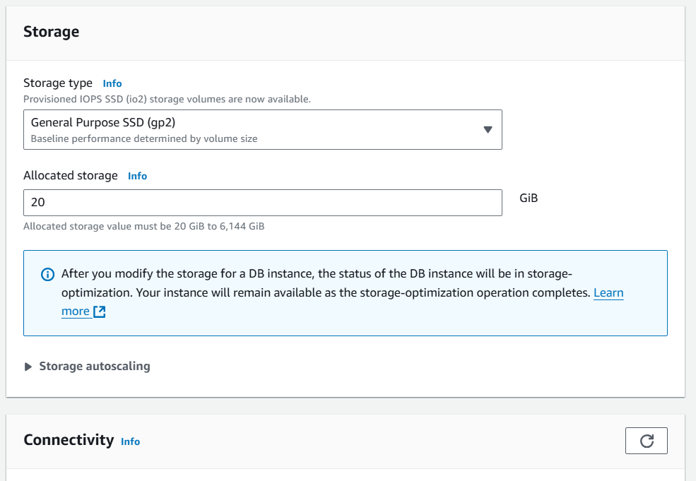
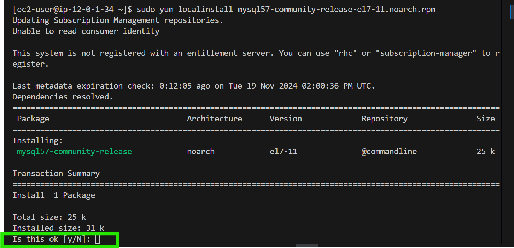

# Database Management with Amazon RDS

During the seesion, attendees will learn about Amazon RDS (Relational Database Service), a key part of Amazon Web Services (AWS) designed for managing relational databases in the cloud. The session will focus on essential tasks such as creating an AWS RDS database, connecting it to an EC2 instance, and accessing the contents of the database and its tables. The practical demonstrations will show how to efficiently set up and maintain databases using Amazon RDS.

Before Immersing into the specifics of Amazon RDS, it's essential to ensure that participants have a basic understanding of cloud computing concepts. If terms like "RDS" or "relational databases" are unfamiliar, participants may find it helpful to review introductory materials to become acquainted with cloud computing fundamentals.

# Project Goals:

- Help GatoGrowFast manage its expanding data needs with a reliable database solution.

- Teach participants how to set up and manage databases using Amazon RDS.

- Enable users to handle client data and project information effectively.

# Learning Outcomes:

- Learn to create and set up databases using Amazon RDS.

- Understand the importance of managing client data and project details.

-Gain practical skills in using the AWS Management Console for database setup.

- Learn about database security and user access control.

- Practice troubleshooting and optimizing database performance.

GatoGrowFast is a fast-growing IT services company the provides software development, cloud solutions, and cybersecurity services to businesses. With an increasing number of clients and projects, the company needs a strong and relaible databases to handle all its data. This includes keeping track of client details, managing project information, and processing services orders. As the business keeps expanding, the amount of data is getting bigger and more complex, so they need a database system that can keep up.

# Requirements:

Client Data Management:

- Store detailed information about clients, such as their names, contact info, and service history.

- Make sure this data is easy to access for client support, marketing and sales analysis.

# Project Catalog:

- Maintain a comprehensive list of projects with descriptions,

- Ensure that project information can be easily updated and managed to keep tha catalog accurate and up-to-date.

**What is a database?**

You can think of a database as a big digital filing cabinet where I acan store all kinds of information. Instead of paper files, though, it's all stored on a computer. So, If I have a list of my favorite songs, or a record of all the books in a library, I can keep them organized in a database. It's like having a super organized digital notebook where I can easily find and manage my information.

**What is database management?**

Database management is like being the boss of that digital filling cabinet we talked about earlier. It's all about making sure the information in the database is well-organised, secure, and easy to access. So, just like a manager at a company, you're responsible for things like creating and updating records, setting up rules for who can access what, and making sure everything runs smoothly. Think of it as keeping the digital filing cabinet in tip-top shape so that everyone can find what they need without any issues.

Think of a database as a digital storage space where I keep all my important stuff, like lists of names, numbers, or even pictures. Now, imagine I have a special friend, let's call them a Database Mnager, who helps me to keep everything tidy and organized in that storage space.

So, Database Management is like having that friend tidy up my digital space, making sure everything is easy to find and use. They organize my stuff neatly, help my add new things, and make sure nothing gets lost or messed up.

Now, think of a Database Management System (DBMS) as the toolbox my friend uses to do all this. It's like a set of special tools and tricks that make organizing and managing my digital stuff super easy. with the DBMS, my friend can quickly search for things, sort them out neatly, and even protect my data from getting messed up or lost. It's like having a magical helper to keep my digital life in order.

Imagine my organizing a big treasure hunt with lots of clues hidden everywhere. Each clue is like a piece of information in my database. Now, to manage all these clues effectively, I need a system that keeps everything organized, helps me find the right clues quickly, and ensures that only the right people can access them. That's exactly what a Relational Database Management System (RDBMS) does!

Picture RDBMS as my trust  treasure map maker. It takes all the clues (data) I have and puts them into neat categories, like different types of treasure. Then, it connects these categories together, just like drawing lines on my treasuer map to show where each clue leads.

Now, when I need to find a specific clue, RDBMS swoops in like a superhero, quickly locating if for me. And just like a good guard dog, it keeps my treasure safe from any unwanted visitors by controlling who can access it.

**Difference between a Database management system (DBMS) and Database Management System (RDBMS)?**

Imagine If I'm planning a treasure hunt with lots of clues hidden around my backyard. Now, If I're just using my regular old memory to remember where each clue is, that's like using a Database Management System (DBMS). I're doing all the work myself, trying to a Relational Database Management System (RDBMS), It's like having a super-powered assistant to help me out. This assistant not only remembers where each clue is but also organizes them neatly into categories and draws connections between them. So, when I need to find a specific clue, my assistant can quickly point me in the right direction.

In simple terms, DBMS is like doing the trasure hunt all by myself, while RDBMS is like having a helpful assistant to make everything easier and more organized.

Let's come to the practical part,

1. Navigate to the search bar on the AWS console.

a) Input "RDS" to locate the RDS service. Once found, click on the RDS option to proceed.

2. Navigate to the left sidebar and select the "Databases" section.

a) Click on "Create Database" to proceed.

3. Select "Standard create" as the database creation method.

a) Choose the MYSQL engine.

**Note-** MySQ, PostgreSQL, Amazon Aurora etc. are like digital assistants for organizing my data. They help me store and manage information in a organized way, kind of like keeping my files neat and tidy in a virtual filing cabinet. You can create different categories for my data, like lists of names or numbers, and easily find what I need when I need it.

These tools are called relational database management systems (RDBMS). They're like special software that makes it easy to work with structured data, meaning data that's organized into tables with rows and columns. With RDBMS, I can create databases, defines how my data should look, search for specific information, and make sure everything stays organized and secure. It's like having a super-powered organizer for my digital information.

b) Select the latest engine version or any preferred version.

c) Choose a free tier template.

d) Then, specify the DB instance name.

Settings

e) Select a master username for my database.

f) Choose "Credentials management" as "Self-managed."

g) Enter the master password for the database and confirm it by re-entering it in the "Confirm master password" field.

**Note-** Ensure to record the username and password I entered somewhere safe, like a text editor such as Notepad. Forgetting these credentials could result in being unable to access the database I've created.

h) Choose DB instance class as db.t3.micro.

i) Please maintain the default settings for the other configurations.

j) Choose the VPC I have created in the [Previous project](./AWS VPC mini project.md)

k) Select "Public access" as "yes"

**Note -** While it's generally not recommended to keep my database public, for the purpose of this practical exercise, I will be configuring it as public.

i) Select the option "VPC security group (firewall)" as "Choose existing".

m) Then, I have to choose pre-created security group in the "Existing VPC security groups" section.

**Note-** Ensure that my security group attached to database permits inbound traffic on port 3306.

If the security group is not configured, set it up by selecting the attached security group and add an inbound rule for MySQL/Aurora on port 3306, allowing traffic from the 0.0.0.0/0 CIDR range.

n) I can choose any of the availability zones. Here, I have selected "us-east-2a"

I can leave the other settings as default.

o) Proceed by selecting the optional labeled "Create database" to initiate the creation process.

Typically,creating a database takes some time. To monitor the progress, I can refresh the page periodically by clicking on the refresh button in the designated section as indicated in the image below.

Now, I can observe that the database is available for use, when creating the db, it will first show creating then click refresh sign after some few minutes of creation then, you will "Available"

**Please note:** If I encounter an error of this nature, attempt to change the password and then proceed with the next steps.

when creating the rds db and password error is encountered then try to change the password and proceed.

For more clarity about Naming constraints I can go through the Naming constraints in Amazon RDS

[Naming constraints in Amazon RDS](https://docs.aws.amazon.com/AmazonRDS/latest/UserGuide/CHAP_Limits.html)

4. Proceed by clicking on my database, labeled "my-rds-database."

5. Now scroll down and on the right side, I will find an endpoint. Copy this endpoint.

Keep this endpoint along with the username and password in a safe place for future reference.

I have already created an EC2 instance with an Amazon Linux.

After connecting to the instance, execute the following commands: 

`sudo yum update -y`

`sudo yum install wget -y`

`wget --version`

`sudo wget https://dev.mysql.com/get/mysql57-community-release-el7-11.noarch.rpm`

`sudo yum localinstall mysql57-community-release-el7-11.noarch.rpm`

**Note-**Whenever prompted, please input "yes" or "no," and type "y" for "yes."

`rpm --import https://repo.mysql.com/RPM-GPG-KEY-mysql-2022`

`sudo rpm --import https://repo.mysql.com/RPM-GPG-KEY-mysql-2022`

systemctl start mysqld.service systemctl enable mysql.service

systemctl status mysqld.service

`sudo yum install mysql`
 

**Please note** that you can press "q" to quit here after running the status command.

Now, for connecting my RDS to ec2 instance,

**mysql -h [Endpoint] -p [Port] -u [Username] -p[Password]**

In this process, I'm executing commands tailored to our specific database configuration. I have to ensure that I adjust the values to align with my database setup.

` mysql -h myrdsdatabase-1.c1ow86siau2t.us-east-2.rds.amazonaws.com -P 3306 -u admin -p`

**Note:** Ensure that you follow the write up above to get to the database of the rds

If you want to review all databases, run:

`show databases;`

`use mysql;`

`show tables;`

I have successfully set up my database and connected it to my EC2 instances. Plus, I ve effortlessly accessed and explored the database tables. Great job on reaching this important milestone!

**Summary:** By using Amazon RDS with MYSQL, sammychy can handle its growing data needs efficiently. This solution provides the scalability, security and reliability required to support the company's expansion, allowing sammychy to focus on delivering excellent IT services to its clients.

**Project Reflection:**

This project highlighted the importance of a reliable database system for companies like sammychy as they expand. participants got practical experience setting up databases using Amazon RDS. They understood how crucial it is to handle client data and projects well. Overall, it was a valuable learning experience, giving participants essential skills in managing databases effectively.