# Deployment Pipelines and Cloud Platforms

## GitHub Actions and CI/CD Course: Deployment Pipelines and Cloud Platforms.

### Introduction to GitHub Actions Course: Deployment and Cloud Integration.


Welcome to our comprehensive course on GitHub Actions, focusing on deployment pipelines and cloud platform integration. In this course, we're going to explore how you can leverage GitHub Actions to automate your deployment processes, effectively pushing your applications to various cloud environments. Whether you're a budding developer, a seasoned engineer, or anyone interested in the world of DevOps, this course is tailored to provide you with practical skills, and insight into the world of continuous integration, continuous deployment, and cloud services.


# The Relevance of This Course for Learners


Imagine you're a pilot of a modern airliner - a complex machine with numerous systems and components that need to work in perfectly harmony. In this analogy, your codebase is the airliner, while GitHub Actions represents the sophisticated control systems that manage the aircraft's operations. Each commit, merge, or push you make is akin to adjusting the flight controls, ensuring that the aircraft navigates smoothly and efficiently to its destination - which,in our case, is the successful deployment of your application.


Deploying applications to the cloud without automation is like flying a plane manually without any advanced navigation systems - It's possible, but prone to errors, inefficiencies, and immense stress. GitHub Actions provides the automation - the autopilot, if you will - ensuring that your deployment processes are as smooth, error-free, and efficient as possible. Through this course, you will learn not just to 'fly the plane', but to engage and trust your autopilot, enabling you to manage your applications' journey from development to production with confidence and precision. 


## Pre - requisites

1. **GitHub Account:**

    - Necessary for managing repositories and setting up GitHub Actions

    - Sign up at [GitHub](https://github.com/)


2. **Basic Knowledge of Git:** 

    - Understanding of Git for version control.

    - Installation guide: [Git Installation.](https://git-scm.com/book/en/v2/Getting-Started-Installing-Git)

    - Basic tutorial: [Git Basics.](https://git-scm.com/docs/gittutorial)


3. Familiarity with YAML.

    - Understanding YAML syntax for writing GitHub Actions workflows.

    - Quick guide: [Learn YAML in Y Minutes.](https://learnxinyminutes.com/yaml/)


4. Experience with Cloud Platforms (AWS, Azure, or GCP:)


    - Basic knowledge of the chosen cloud platform for deployment.

    - AWS: [AWS Getting Started.](https://aws.amazon.com/getting-started/)

    - Azure: [Azure Documentation](https://learn.microsoft.com/en-us/azure/?product=popular)

    - Google Cloud: [Google Cloud Documentation.](https://cloud.google.com/docs)


5. **Understanding of CI/CD Concepts:**

    - Familiarity with Continuous Integration and Continuous Deployment Processes.

    - Resources: [CI/CD Introduction](https://www.redhat.com/en/topics/devops/what-is-ci-cd)


6. **Node.js and npm Installed** (for Node.js based projects):

    - Knowledge of Node.js for running JavaScript server-side.

    - Node.js. [Download and Installation](https://nodejs.org/en/download/)

    - Verify installation: Run `node -v` and `npm -v` in the terminal.


7. **Access to a Code Editor or IDE:**

    - A text editor or Integrated Development Environment (IDE) like Visual Studio Code, Atom, or Sublime Text.

    - Visual Studio Code: [Download VS Code](https://code.visualstudio.com/Download)


8. Basic Knowledge of Software Deployment:

    - Understanding the basics of deploying applications, especially in a cloud environment.

    - Resource: [Introduction to Software Deployment](https://www.ibm.com/topics)


9. Internet Connection:

    - Required for accessing GitHub, Cloud platforms, and online resources.


10. Willingness to Experiment and Learn:

    - Openness to exploring new tools and troubleshooting potential issues. 


**Lesson 1: Introduction to Deployment Pipelines**

**Objectives:**

   - Define and understanding the stages of a deployment pipeline.

   - Learn about different deployment strategies.


Lesson Details:

1. Defining Deployment Stages:

    - **Development:** Writing and testing code in a local environment.

    - **Integration:** Merging code changes to a shared branch.

    - **Testing:** Running automated tests to ensure code quality.

    - **Staging:** Deploying code to a production-like environment for final testing.

    - **Production:** Releasing the final version of your code to the end-users.

**Understanding Deployment Strategies:**

  - **Blue-Green Deployment:** Running two production environments, only one of which servers end-users at any time.

  - **Canary Releases:** Rolling out changes to a small subset of users before full deployment.

  - **Rolling Deployment:** Gradually replacing instances of the previous version of an application with the new version.


**Lesson 2: Automated Release and Versioning**

**Objectives:**

   - Automate Versioning in the CI/CD process.

   - Create and manage software releases.

Automating Versioning in CI/CD:

1. **Semantic Versioning:**

    - Use semantic versioning (SemVer) for your software. It uses a three-part version number, for example, `MAJOR.MINOR.PATCH`.

    - Resources: [Semantic Versioning](https://semver.org/)


2. **Automated Versioning with GitHub Actions:**

    - Implement automated versioning using GitHub Actions to increment version numbers automatically based on code changes.


### Example Snippet for a Versioning Script in GitHub Actions:


```
name: Bump version and tag
on:
  push:
    branches:
      - main

jobs:
  build:
    name: Create Tag
    runs-on: ubuntu-latest
    steps:
      - name: Checkout code
        uses: actions/checkout@v2
        # The checkout action checks out your repository under $GITHUB_WORKSPACE, so your workflow can access it.

      - name: Bump version and push tag
        uses: anothrNick/github-tag-action@1.26.0
        env:
          GITHUB_TOKEN: ${{" secrets.GITHUB_TOKEN "}}
          DEFAULT_BUMP: patch
        # This action automatically increments the patch version and tags the commit.
        # 'DEFAULT_BUMP' specifies the type of version bump (major, minor, patch).
```

- This action will automatically increment the patch version and create a new tag each time changes are pushed to the main branch.


### Creating and Managing Releases:

1. **Automating Releases with GitHub Actions:**

    - Set up GitHub Actions to create a new release whenever a new tag is pushed to the repository.

    **Example snippet to create a release:**

```
    on:
  push:
    tags:
      - '*'

jobs:
  build:
    name: Create Release
    runs-on: ubuntu-latest
    steps:
      - name: Checkout code
        uses: actions/checkout@v2
        # Checks out the code in the tag that triggered the workflow.

      - name: Create Release
        id: create_release
        uses: actions/create-release@v1
        env:
          GITHUB_TOKEN: ${{" secrets.GITHUB_TOKEN "}}
        with:
          tag_name: ${{" github.ref "}}
          release_name: Release ${{" github.ref "}}
          # This step creates a new release in GitHub using the tag name.
```


- The `actions/create-release@v1` action is used to create a release on GitHub. It uses the tag that triggered the workflow to name and label the release.


**Troubleshooting and Additional Resources:**

  - For troubleshooting GitHub Actions, the [GitHub Actions Documentation](https://docs.github.com/en/actions) is an invaluable resources.

  - To resolve issues related to specific actions used in your workflow, refer to their respective repositories on GitHub or their documentation.

  - For general questions and community support, the [GitHub Community Forum](https://github.com/orgs/community/discussions/) can be a great place to seek help.


  - Remember, reading through the logs generated by GitHub Actions can provide insights into what might be going wrong with your workflows.


**Lesson 3: Deploying to Cloud Platforms**

**Objectives:**

   - Deploy applications to popular cloud platforms using GitHub Actions

   - Configure deployment environments.

**Lesson Details:**
**Detailed Guide: Deploying Applications to Cloud Platforms with GitHub ACtions**

For beginners completely new to GitHub Actions and cloud deployment, it's essential to understand the process step-by-step. Here's a detailed breakdown of deploying applications to cloud platforms like AWS, Azure, or Google Cloud Platform using GitHub Actions:


Step 1: Choose a Cloud Platform

   - Decide on a cloud platform based on your project requirements. Each platform (AWS, Azure, Google Cloud) has its own set of services and pricing models.

   - AWS: [Amazon Web Services](https://aws.amazon.com/)

   - Azure: [Microsoft Azure](https://azure.microsoft.com/en-us/)

   - Google Cloud Platform: [GCP](https://cloud.google.com/?hl=en)


**Step 2: Set Up GitHub Actions for Deployment**

1. Creating the Workflow File:

    - Workflow file are YAML file stored in your repository's `.github/workflows` directory.

    - Start by creating a file, e.g., `deploy-to-aws.yml` in this directory.

2. Defining the Workflow:

    - A workflow is defined with a series of steps that run on specified events.

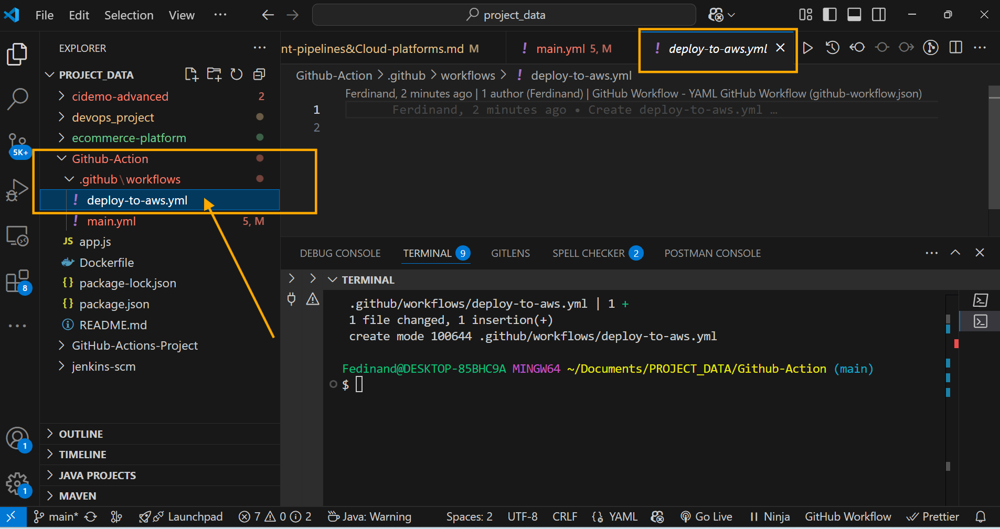


The AWS IAM creation and secret key generation for pipeline procedure.

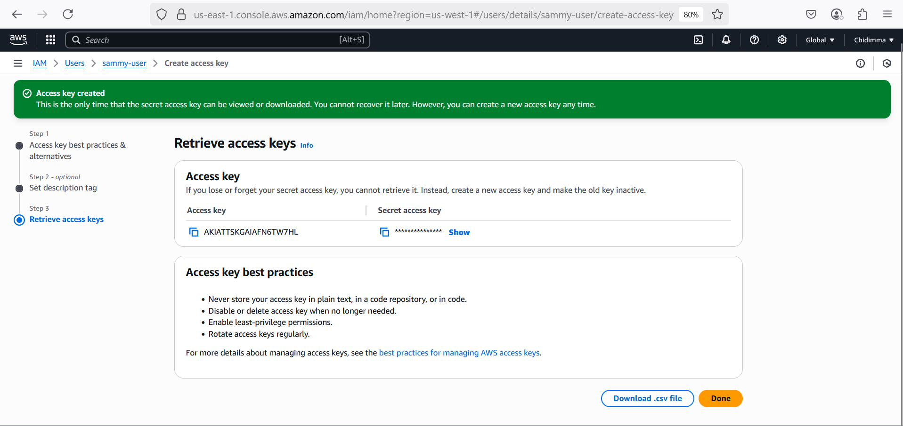


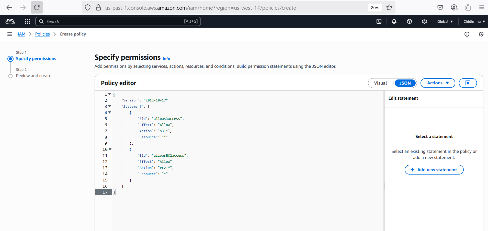


**Example for AWS Deployment:**

```
name: Deploy to AWS
on:
  push:
    branches:
      - main
  # This workflow triggers on a push to the 'main' branch.

jobs:
  deploy:
    runs-on: ubuntu-latest
    # Specifies the runner environment.

    steps:
    - name: Checkout code
      uses: actions/checkout@v2
      # Checks out your repository under $GITHUB_WORKSPACE.

    - name: Set up AWS credentials
      uses: aws-actions/configure-aws-credentials@v1
      with:
        aws-access-key-id: ${{" secrets.AWS_ACCESS_KEY_ID "}}
        aws-secret-access-key: ${{" secrets.AWS_SECRET_ACCESS_KEY "}}
        aws-region: us-west-2
      # Configures AWS credentials from GitHub secrets.

    - name: Deploy to AWS
      run: |
        # Add your deployment script here.
        # For example, using AWS CLI commands to deploy.
```

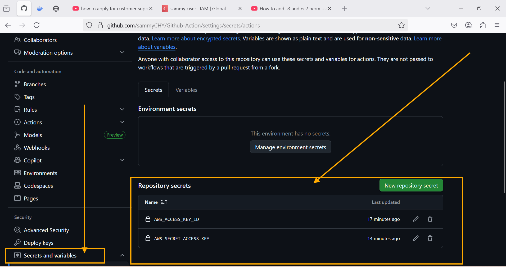


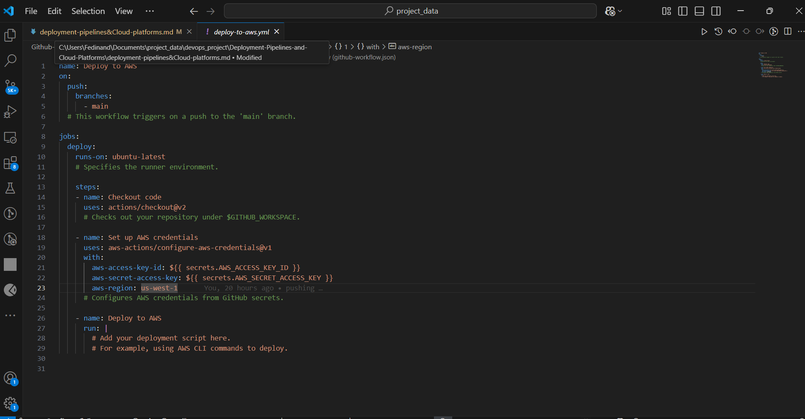

- This workflow deploys your application to AWS when changes are pushed to the main branch. 

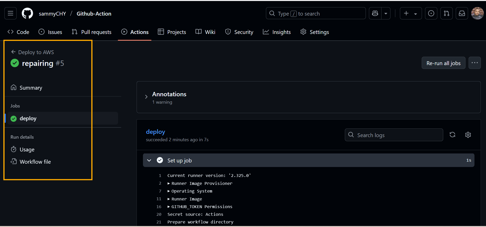

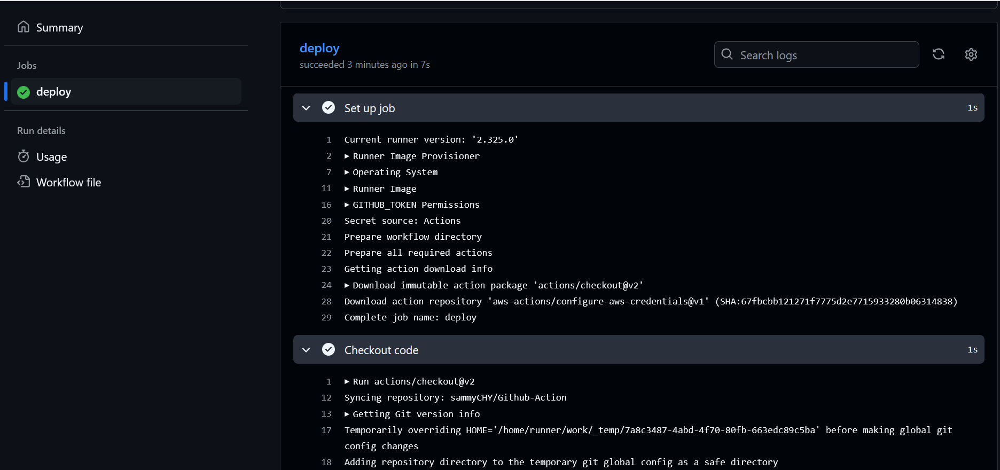

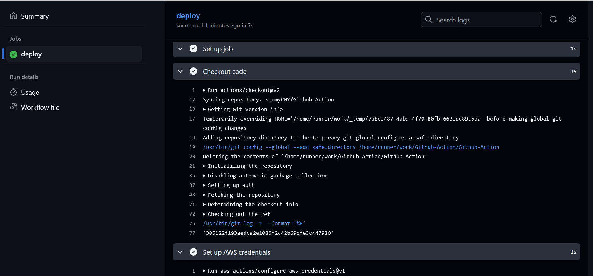

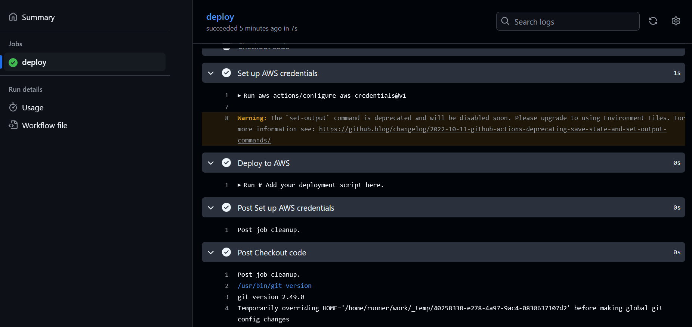

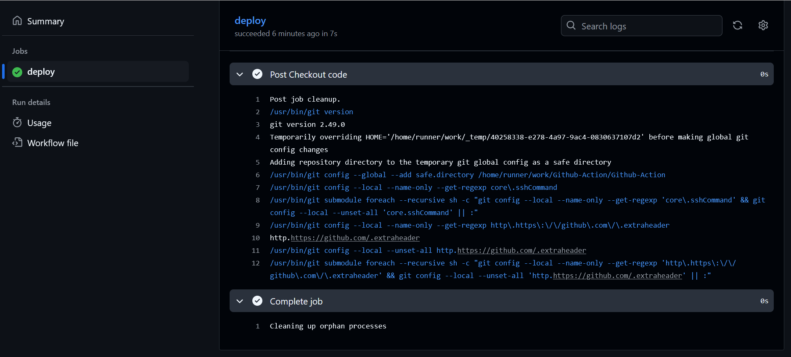

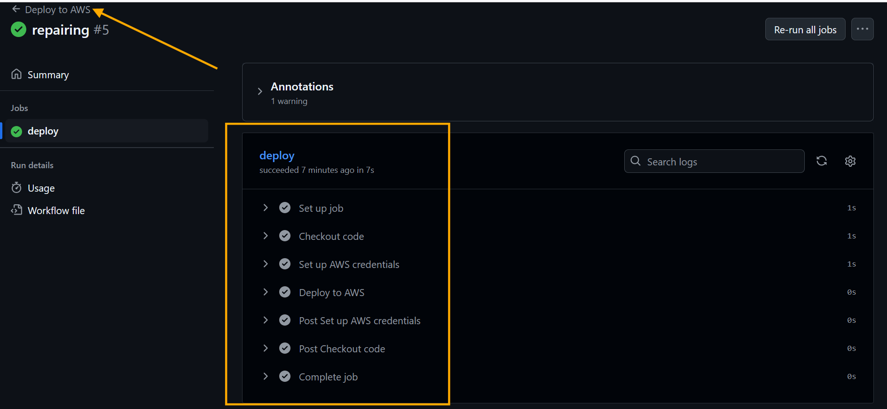


**Step 3: Configuring Deployment Environments:**

1. Setting Up Environment Variables and Secrets:

    - Store sensitive information like API keys and access tokens as [GitHub Secrets](https://docs.github.com/en/actions/security-for-github-actions/security-guides/using-secrets-in-github-actions) 

    - Use environment variables for non-sensitive configuration.


2. Environment-Specific Workflow:

    - Tailor your workflow for different environments (development, staging, production) by using conditions or different workflow files.


Additional Resources:

   - GitHub Actions Documentation: For a comprehensive understanding, refers to the [official documentation](https://docs.github.com/en/actions) 

   - AWS GitHub Actions: Learn more about the [AWS actions available on GitHub](https://github.com/aws-actions)  

   - Azure GitHub Actions: Check out [Azure actions](https://github.com/Azure/actions)

   - Google Cloud GitHub Actions: Explore [Google Cloud actions](https://github.com/google-github-actions)


Troubleshooting:

   - Review action logs in GitHub for errors during execution.

   - Ensure that your cloud platform credentials are correctly set up in GitHub Secrets.

   -  Validate your YAML file for syntax errors using online validators like [YAML Lint](https://www.yamllint.com/) 


