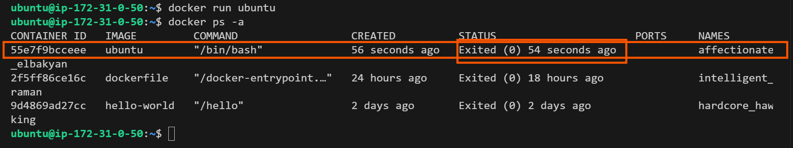

# Docker Containers
### Docker Containers for Beginners
### Introduction to Docker Containers

Docker containers are lightweight, portable, and excutable units that encapsulate an application and its dependencies. In the previous step, I worked a little with docker container. I would dive deep into the basics of working with Docker containers, from launching a running containers to managing their lifecycle.

### Running Containers.

To run a container, I have to use the `docker run` command followed by the name of the image I want to use.

Reacall that I pulled an ubuntu image from the official ubuntu repository on docker hub. Let's create a container from the ubuntu image. This command launches a container based on the Ubuntu image.

```
docker run ubuntu
```


The image above shows that the container is created but not running. I can start the conatiner by running.

```
docker start CONTAINER_ID
```


### Launching Containers with Different Options

Docker provides various option to customize the behavior of containers. For example, I can specify environment variables, map ports, and mount volumes. Here's an example of running a container with a specific environment variable:

```
docker run -e "MY_VARIABLE=my-value" ubuntu
```

Running Containers in the Background

By default, containers run in the foreground, and the terminal is attached to the container's standard input/output. To run a container in the background, use the `-d` option:
 
 ```
 docker run -d ubuntu
```
This command starts a container in te background, allowing me to continue using the terminal.

# Starting, Stopping, and Restarting Containers

- To start a stopped container:

```
docker start container_name
```
- To stop a running container:

```
docker stop container_name
```

- To restart a container:

```
docker restart container_name
```

### Removing Containers

- To remove a container, I use the `docker rm` command followed by the container's ID or name:

```
docker rm container_name
```

