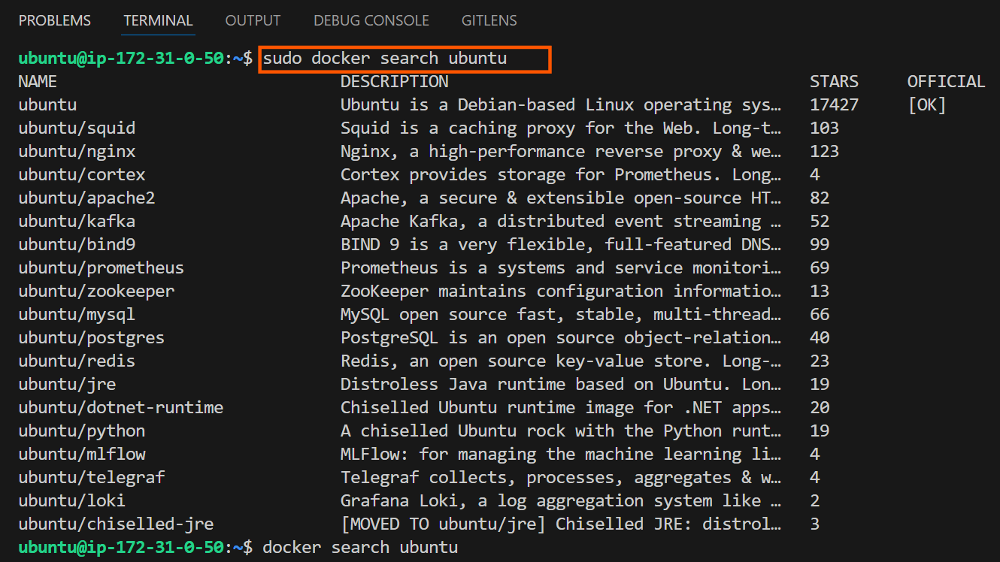
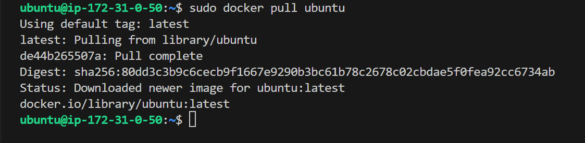
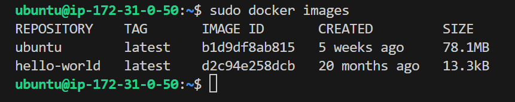

# Docker Images

### Working with Docker Images

### Introduction to Docker Images

Docker images are the building blocks of containers. They are lightweight, portable, and self-sufficient packages that contain everything neede to run a software application, including the code, runtime, libraries, and system tools. Images are created from a set of instructions known as a Dockerfile, which specifies the environment and configuration for the application.

### Pulling Images for Docker Hub

[Docker Hub](https://hub.docker.com/) is a cloud-based registry that hosts a vast collection of Docker images. I can pull images from Docker Hub to my local machine using the `docker pull` command.

To explore available images on Docker Hub, the docker command provides a search subcommand. For instance, to find the Ubuntu image, you can execute:

```
docker search ubuntu
```

This command allows me to discover and explore various images hosted on Docker Hub by providing relevant search results. In this case, the output will be similar to this:



In the "OFFICIAL" column, the "OK" designation signifies that an image has been constructed and is officially supported by the organization responsible for the project. Once you have Identified the desired image, you can retrieve it to your local machine using the "pull" subcommand.

To download the official Ubuntu image to my computer, I have to use the following command:

```
docker pull ubuntu
```
Executing this command will fetch the official Ubuntu image from Docker Hub and store it locally on my machine, making it ready for use in creating containers.



Once an image has been successfully downloaded, you can proceed to run a container using that downloaded image by employing the "run" subcommand. Similar to the hello-world example, if an image is not present locally when the `docker run` subcommand is invoked, Docker will automatically download the required image before initiating the container.

To view the list of images that have been downloaded and are available on your local machine, enter the following command:

```
docker images
```
Executing this command provides a comprehensive list of all the images stored locally, allowing you to verify the presence of the downloaded image and gather information about its size, version, and other relevant details.



As we move in this course, I will get to know the images to work with containers.

### Dockerfile

A Dockerfile is a paintext configuration file that contains a set of instructions for building a Docker image. It serves as a blueprint for creating a reproducible and consistent environment for my application. Dockerfiles are fundamental to the containerization process, allowing me to define the steps to assembe an image that encapsulates my application and its dependencies.

### Creating a Dockerfile.

In this dockerfile file, we will be using an nginx image. `Nginx` is an open source software for web serving, reverse proxying, caching, load balancing media streaming, and more. It started out as a web server designed for maximum performance and stability. It is recommended to study more on [Nginx here](https://www.f5.com/glossary).

To create a Dockerfile, use a text editor of your choice, such as vim or nano. Start by specifying a base image, defining the working directory, copying files, installing dependencies, and configuring the runtime environment.

Here's a simple example of a Dockerfile for a html file: Let's create an image with using a dockerfile. Paste the code snippet below in a file named `dockerfile` This example assumes you have a basic HTML file named `index.html` in the same directory as my Dockerfile.

```
# Use the official NGINX base image
FROM nginx:latest

# Set the working directory in the container
WORKDIR  /usr/share/nginx/html/

# Copy the local HTML file to the NGINX default public directory
COPY index.html /usr/share/nginx/html/

# Expose port 80 to allow external access
EXPOSE 80

# No need for CMD as NGINX image comes with a default CMD to start the server
```
