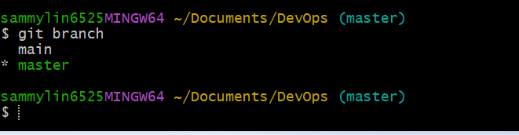

# 1. GIT PROJECT

## What is Git:
Git is a distributed version control system (DVCS) that is widely used for tracking changes in source code during software development. It allows multiple developers to collaborate on a project, keep track of changes made to the codebase, and revert to previous versions if necessary. Git is designed to be fast, efficient, and flexible, making it suitable for projects of all sizes, from small personal projects to large-scale enterprise applications.

### Key features of Git include:
- Distributed Development: Git allows each developer to have a local copy of the entire project repository, including its 
  complete history.This enables developers to work offline and independently, making it easier to collaborate and share 
  changes with others.

- Branching and Merging: Git provides powerful branching and merging capabilities, allowing developers to create separate 
  branches to work on new features or bug fixes without affecting the main codebase. Branches can be merged back into the 
  main branch (typically master or main) once changes are complete.

- History and Tracking: Git tracks changes to files over time, providing a detailed history of who made each change, when it 
  was made, and what was changed. This makes it easy to trace the evolution of the codebase and identify the cause of bugs 
  or issues.

- Collaboration: Git enables seamless collaboration among developers by providing mechanisms for sharing changes, resolving 
  conflicts, and reviewing code. Developers can push their changes to a shared repository and pull changes from others, 
  facilitating teamwork and code review processes.

- Staging Area: Git introduces a staging area (also known as the index) where changes can be selectively added before 
  committing them to the repository. This allows developers to review and fine-tune their changes before making them 
  permanent.

- Speed and Efficiency: Git is designed to be fast and efficient, with most operations performed locally without the need 
  for a network connection. This makes Git suitable for projects of all sizes, from small personal projects to large-scale 
  enterprise applications.

### Overall, **Git** is a powerful and widely adopted version control system that revolutionized the way software is developed, allowing teams to collaborate more effectively and manage code changes with confidence. It has become an essential tool in modern software development workflows and is supported by a vibrant ecosystem of tools, services, and communities.

## To create a new Git project, you would typically follow these steps:
### Create a New Directory: 
- Navigate to the directory where you want to create your project, or create a new directory for your project.
- bash
- Copy code
- mkdir my_project

### Initialize Git Repository: 
- Navigate into the directory you've created and initialize a new Git repository using the git init command.
- bash
- Copy code
- cd my_project
- git init

### Add Your Files: Add your project files to the directory. You can create new files or copy existing files into the directory.
- bash
- Copy code
- Create a new file
- touch README.md
- Add some content to the file
- echo "My Git Project" > README.md

### Stage and Commit Your Changes: Use the git add command to stage your files and the git commit command to commit them to the repository.
- bash
- Copy code
- git add .
- git commit -m "Initial commit"
Replace "Initial commit" with a descriptive message for your initial commit.

### Connect to Remote Repository (Optional): If you want to push your project to a remote repository (e.g., GitHub, GitLab, Bitbucket), you need to add a remote repository URL.
- bash
- Copy code
- git remote add origin <remote_repository_url>
- Replace <remote_repository_url> with the URL of your remote repository.

### Push Your Changes (Optional): If you've connected your local repository to a remote repository, you can push your changes using the git push command.
- bash
- Copy code
- git push -u origin master
This command pushes your changes to the master branch of the remote repository. If you're using a different branch, replace master with the name of your branch.

## With these steps, you've created a new Git project, initialized a Git repository, added your project files, committed your changes, and optionally connected to a remote repository and pushed your changes. You can continue working on your project and use Git commands to manage its version control.

# 2. Initializing a Git Repository:
Follow these process to open initialize git repo:
- Open a git bash on your local computer.
- On the working git bash terminal create a folder or directory eg any folder using this command  >mkdir to foldername<
- move into your working directory or folder by using this command  >cd to foldername<
- while you are inside the folder run **git init** command

# 3. Git Commit:
The **git commit command** is used to record changes to the repository. It creates a snapshot of the changes staged in the index (staging area) and commits them to the Git repository's history. 
It is more or less like saving the changes made on the files. Changes can be adding, modifying, deleting files or text.

### Follow this steps to make our first **git commit**

- In your working directory create a file using the command touch git.txt.
- Write a sentence inside the file and save changes.
- Add the changes to git stagging area using this command **git add**
- To commit the changes to your git run this command **git commit -m "initial commit"**

# 4. WORKING WITH BRANCHES:
**Git branches** are independent lines of development that allow you to work on different features, fixes, or experiments in isolation from each other. They enable you to develop new features, fix bugs, or make changes to your project without affecting the main codebase until the changes are ready to be merged.

### Follow the process for create a first git branch
To create a new branch run this command **git checkout -b**
The -b flag helps to create and change into a new branch
make a new branch by running this command **git checkout -b my-new-branch**

# 5. LISTING GIT BRANCHES:
Use this command below to list the branches on the local git repository
**git branch**

# 6. CHANGE INTO AN OLD BRANCH:
Run this command below
git checkout >branch_name<

# 7. GIT MERGING:
**Git merging** is the process of integrating changes from one branch into another. It combines the changes made in a source branch with the changes made in a target branch, creating a new commit that incorporates both sets of changes.
eg if we want to add the content of branch B into A.
first we change into branch A and run the git command below:
**git merge B**

# 8. DELETING A GIT BRANCH:
you can carryout the task by using this command below:
git branch -d >branch_name<

To learn more on git branches, use the command below.
**git branch --help**

  
