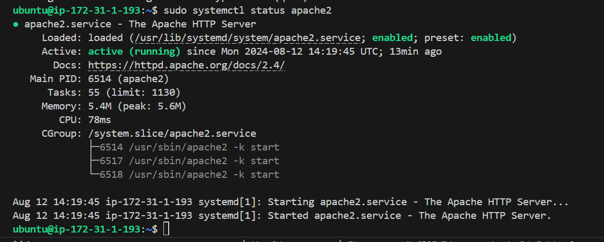

# Implementing Loadbalancer with Nginx.

- This project entails the discovering the art of *load balancing with Nginx* in this project. Learn how to distribute traffic efficiently across multiple servers, optimize performance, and ensure high availability for your web applications.

# Setting up a Basic Load Balancer:

- In this project, I am going to be provisioning two **EC2** instances running *Ubuntu 22.04* and install apache webserver in them. We will open port 8000 to allow traffic from anywhere, and finally update the default page of the webservers to display their public IP address.

- Next provision another EC2 instance running **Ubuntu 22.04**, this time, I will install *Nginx* and configure it to act as a load balancer distributing traffic across the webservers.

### Step 1: Provisioning EC2 instance.

- Open AWS Management Console, click on EC2. Scroll down the page and click on Launch instance:

Console

- Under Name, provide a unique name for each webservers:

- Under key pair. click on create a new key pair, although, I already have a key pair which I will use for all the instances created for this lesson:

### Step 2 Open Port 8000:
I will be running my webserver on port 8000 while the load balancers runs on port 80. I will need to open port 8000 to allow traffic from anywhere. To do this we need to add a rule to the security group of each of the webservers created.
The prompt below is steps to attain the result.

- Click on the instance ID to get the details of the EC2 instance.

- On the same page, scroll down and click on security:

- Click on security group:

- On the top of the page clickon Action and select Edit inbound rules:

- Add the rules:

- Click on save rules:

### Step 3: Install Apache Webserver:

After provisioning both of our servers and have opened the necessary ports, Its time to install apache software on both server. To do so I have to first connect to each of the server via ssh. Then I can now run commands on the terminal of my webservers.

- Connecting to the webserver: T o connect to the webserver,click on the instance Id, at the top of the page click on connect.

- Next copy the ssh command below:

**copy-ssh-command**

- Open a terminal in the local machine, cd into the Downloads folder. Paste the copied ssh command in the previous step.

- Click on enter and type yes when prompt display. After that, I have to be connected to a terminal on my instance.

- Next install apache with the command below:

`sudo apt update -y && sudo apt install apache2 -y`

- Verify That the apache is running using the command below:

`sudo systemctl status apache2`

### Step 4: Configure Apache to server a page showing its public IP:

However, I have to start by configuring **Apache** webserver to serve content on port 8000 instead of its default which is port 80. Then I will create a new index.html file. The file will contain code to display the public IP of the **EC2** instance. I will then override apache webserver's default html file with my new file.

- Configuring Apache to Serve content on port 8000:

 - 1. Using text editor (eg vi, nano) open the file /etc/apache2/ports.confi

 **Copy Below Code**

 `sudo vi /etc/apache2/ports.conf`

 - 2. Add a new Listen directive for port 8000: First type **i** to switch the editor to insert mode. Then add the listen directive. Then save the file.

  

 - 3. Next open the file /etc/apache2/sites-available/000-default.confi and change port 80 on the virtualhost to 8000 like the screenshot below:

 `sudo vi /etc/apache2/sites-available/000-default.conf`

 

- 4. Close the file by first pressing the **esc** key on the keyboard then the command below:

`:wqa!`

- 5. Restart apache to load the configuration using the command below:

`sudo systemctl restart apache2`

- Creating a new html file:

- 1. Open a new **index.html** file with the command below:

`sudo vi index.html`

- 2. Switch vi editor to insert mode and paste the html file below. Before pasting the html file, get the public IP of the EC2 instance  from AWS Management Console and replace the placeholder text for IP address in the html file. 

- 3. Change file ownership of the index.html file with the command below:

`sudo chown www-data ./index.html`

- Overriding the Default html file of Apache Webserver:

- 1. Replace the dafault html file with the new created html file using the command below:

`sudo cp -f ./index.html /var/www/html/index.html`

- 2. Restart the webserver to load the new configuraion using the command below :

`sudo systemctl restart apache2`

- 3. Exactly the page below suppose to display on the browser.

## Step 5:  Configuring Nginx
 
 - Provisioning a new EC2 instance running ubuntu 22.04. Make sure port 80 is opened to accept traffic from anywhere. 

 - Next ssh into the instance. Again refer to the previous steps to accomplish this project.

 - Install Nginx into the instance using the command below:

 `sudo apt update -y && sudo apt install nginx -y` 

 - Verify that the Nginx is installed with the command below:

 

 

 To verify that Nginx is installed with the command below:

 `sudo systemctl status nginx` 

 

 - Open Nginx configuration file with the command below:

 `sudo vi /etc/nginx/conf.d/loadbalancer.conf`

- Paste the configuration file below to configure nginx to act like a load balancer. A screenshot of an example config file is shown below: I have to edit the file and provide necessary information like the server IP address etc.

**Upstream backend_servers** defines a group of backend servers. The **server** lines inside the upstream block list the addresses and ports of the backend servers. **Proxy_pass** inside the **location** block sets up the load balancing, passing the requests to the backend servers. The **proxy_set_header** lines pass necessary headers to the backend servers to correctly handle the requests.

- Testing the configuration with the command below:

`sudo nginx -t`

