# Implementing Wordpress Website with LVM Storage Management.
This projact has to do with Implementing wordpress website with LVM storage Management on AWS EC2 Ubuntu.

- The course provides a step-by-step introduction to implementing wordpress on AWS EC2 Ubuntu as the operating system.

- The project will also teach how to leverage the power of AWS cloud infrastructure to build scalable and reliable WordPress sites. 

### Understanding 3 Tier Architecture 

**Web solution with Wordpress**

In this project I'm tasked to prepare storage infrastructure on two Linux servers and Implement a basic web solution using **WordPress**.

### Project 6 consist of two parts:

- Configure storage subsystem for web and Database servers based on Linux OS. The focus of this parts is to display a practical experience of working with disks, partitions and volumes in Linux.

- Install Wordpress and connect it to a remote MySQL database server. This part of the project will solidify the learning of deploying Web and DB tiers of Web solution.

### Three-tier Architecture.

- The **Three-tier Architecture** is a client-server software architecture pattern that comprise of 3 separate layers.

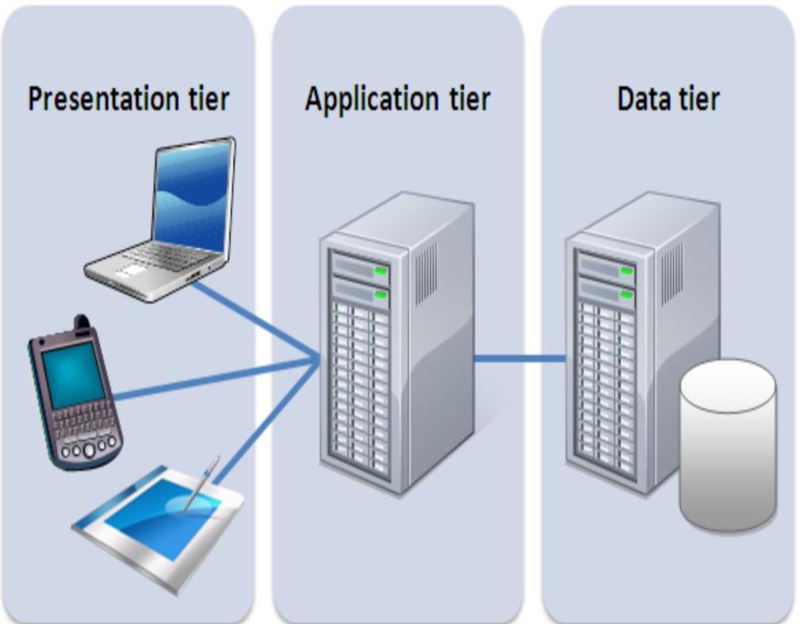

1. **Presentation Layer** (PL): This is the user interface such as the client server or browser on a laptop.

2. **Business Layer** (BL): This is the backend program that implements business logic. Application or Webserver.

3. **Data Access or Management Layer** (DAL): This is the layer for computer data storage and data access. **Database Server** or File System Server such as ***FTP Server*** or ***NFS Server*** 

### The 3-Tier Setup.

1. A Laptop or PC to serve as a client.

2. An EC2 Linux Server as a web server (This is where I will install WordPress)

3. An EC2 Linux Server as a database (DB) server.

The project will be carried out using *`RedHat`* **OS for this project**

# Implementing LVM on Linux Servers (Web and Database Servers)

Step 1. - Prepare a Web Server.

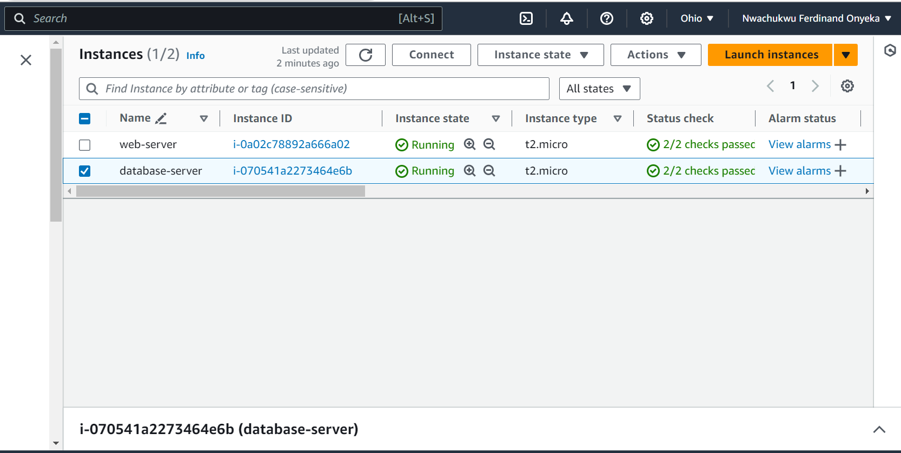

1. Launch an EC2 instance that will serve as "Web Server". Create 3 volume in the same AZ as a web server EC2, each of 10 GiB.
The video on this link show how to Add EBS Volume to an EC2 Instance [click here to watch the video](https://www.youtube.com/watch?v=HPXnXkBzIHw)

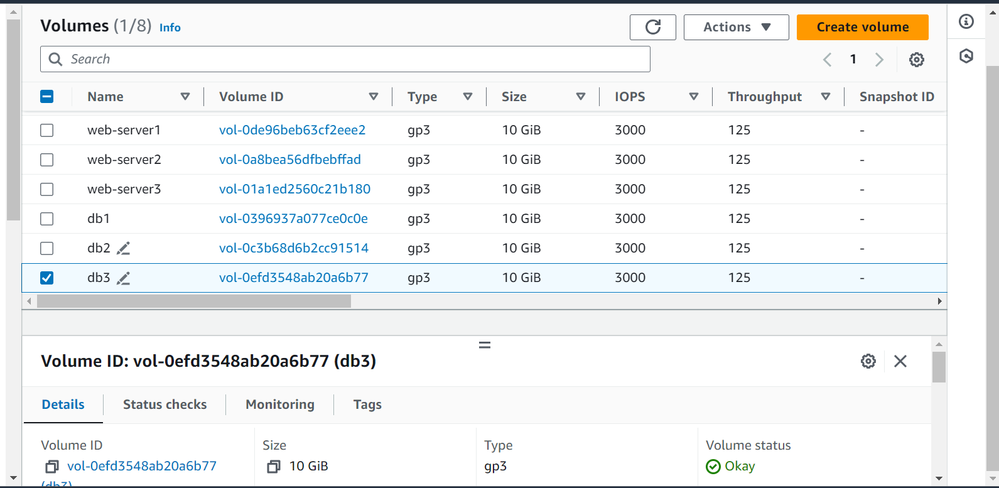

2. Attach all three volumes one by one to the Web Server EC2 Instance.

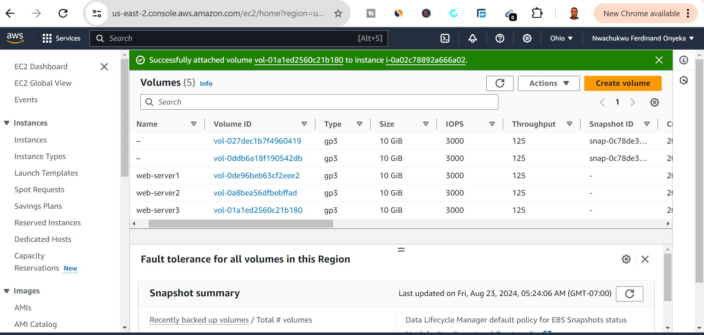

3. Open up the Linux terminal to begin configuration.

4. I will have to use `lsblk` command to inspect what block devices are attached to the server. Notice names of the newly created devices. All devices in the Linux in /dev/ directory. Inspect it with `ls/dev/` and I have to make sure all 3 newly created block devices there- their names will likely be `xvdf`, `xvdg`, `xvdh`.

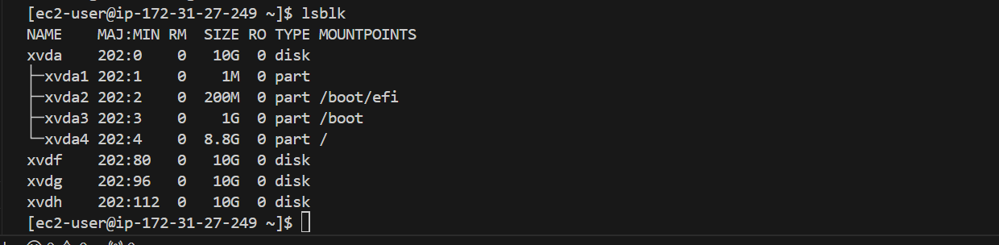

4. Use `df -h` command to see all mounts and free space on your server

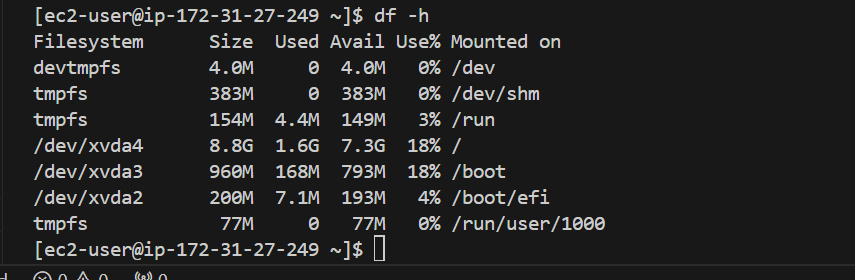

5. Use `gdisk` utility to create a single partition on each of the 3 disks

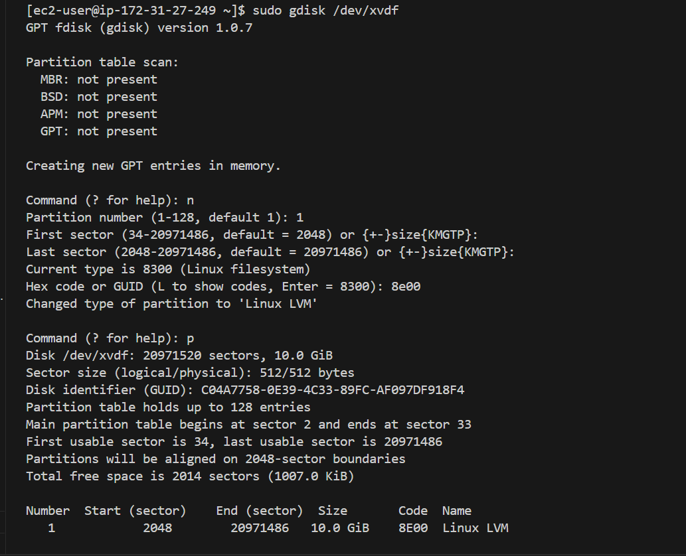

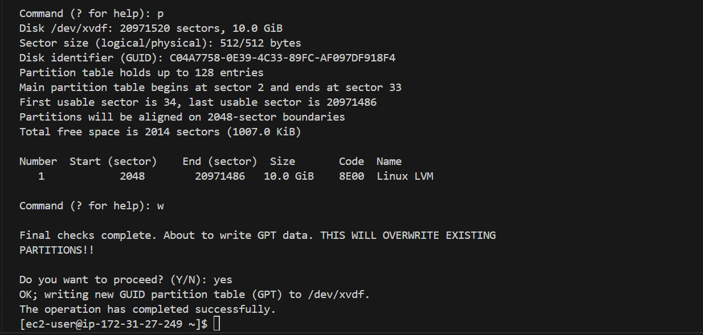

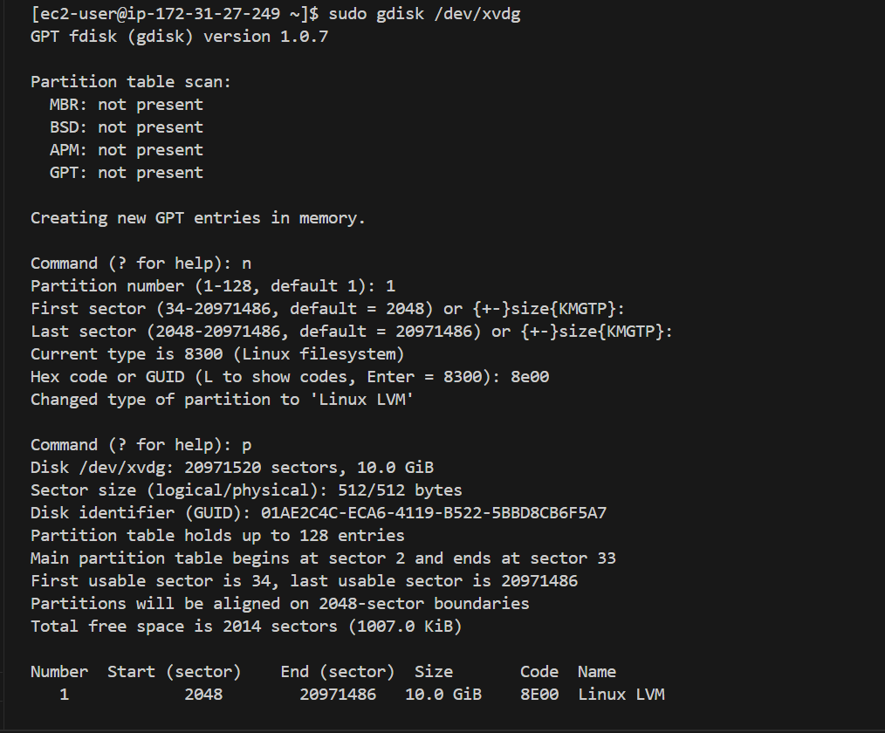

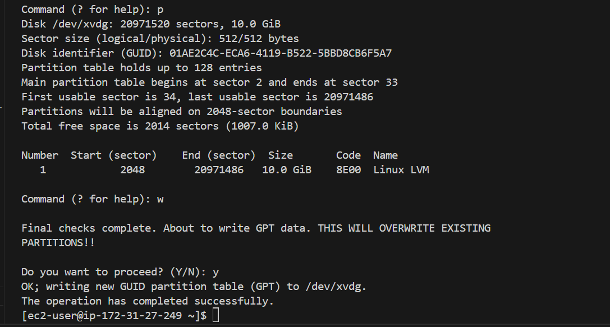

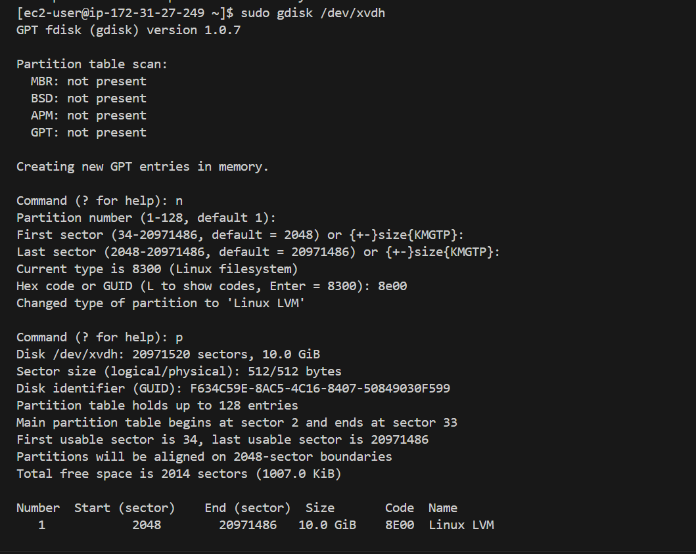

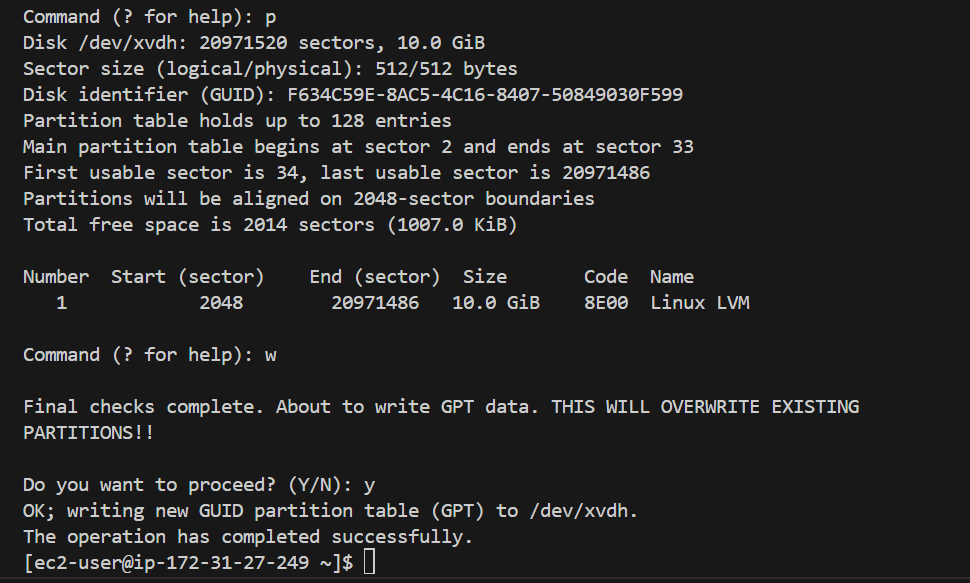

After the partition.

5. Use `lsblk` utility to view the newly configured partition on each of the 3 disks.

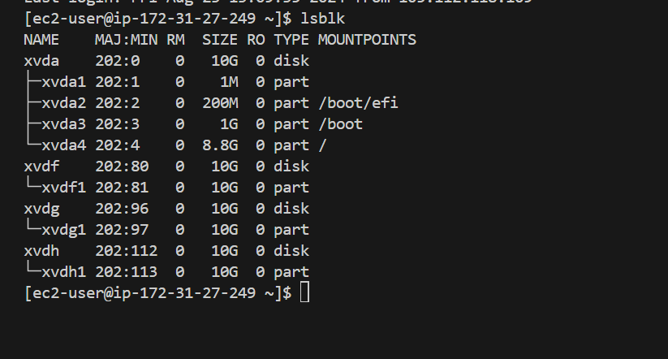

6. Install  `lvm2` packaging using `sudo yum install lvm2`. Run `sudo lvmdiskscan` command to check for available partitions.

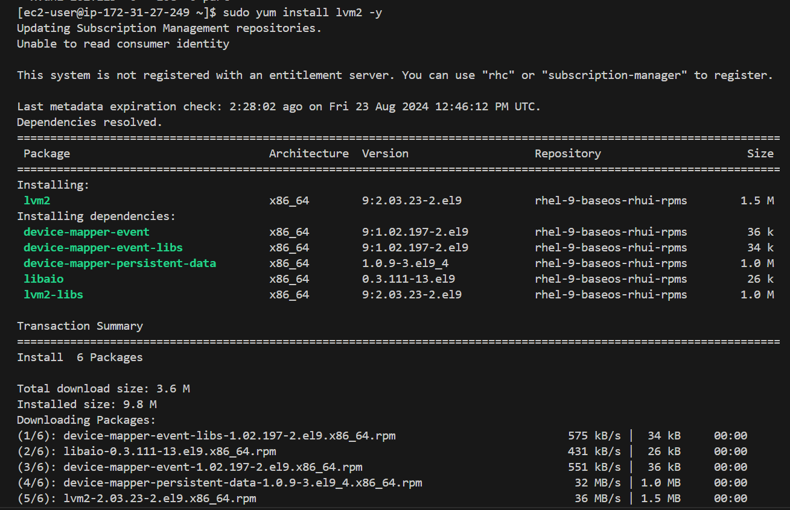

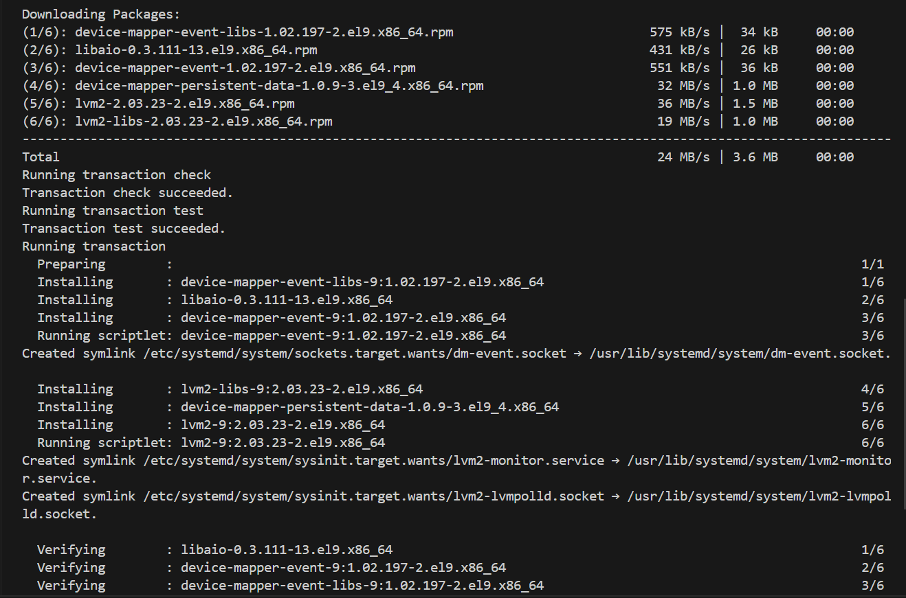

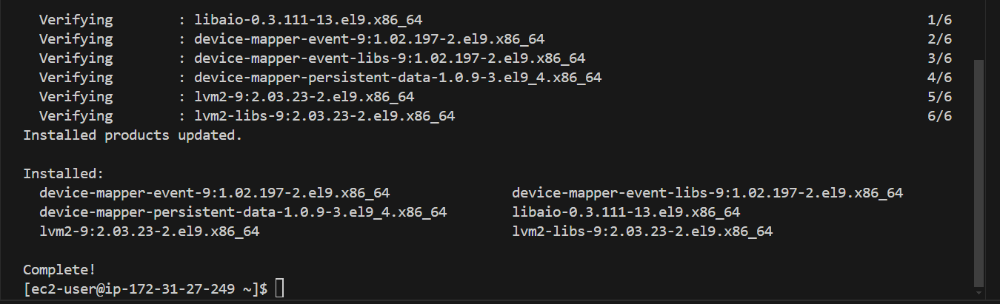

7. Use  `pvcreate` utility to mark each each of 3 disks as physical volumes (PVs) to be used by LVM

`sudo pvcreate /dev/xvdf1`
`sudo pvcreate /dev/xvdg1`
`sudo pvcreate /dev/xvdh1`

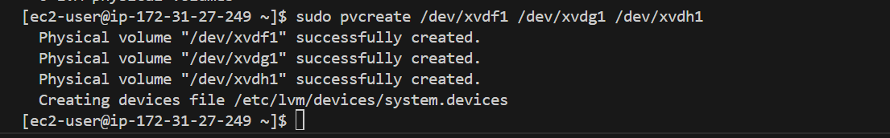

8. Verify that the physical volume has been created successfully by running `sudo pvs`

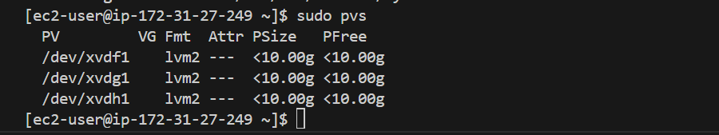

9. Use `vgcreate` utility to add all 3 PVs to a volume group (VG). Name the VG **webdata-vg** 

`sudo vgcreate webdata-vg /dev/xvdf1 /dev/xvdg1 /dev/xvdh1`

10. Verify that the VG has been created successfully by running `sudo vgs`

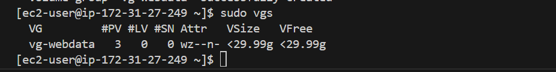

11. Use `lvcreate` utility to create 2 logical volumes. apps-lv (**Use half of the PV size**), and **logs-lv Use the remaining space of the PV size**. **NOTE**: *apps-lv* will be used to store data for the Website while, *logs-lv* will be used to store data for *logs*.

`sudo lvcreate -n apps-lv -L 14g webdata-vg`

`sudo lvcreate -n logs-lv -L 14g webdata-vg`

12. Verify that the Logical volume has been created successfully by running `sudo lvs`

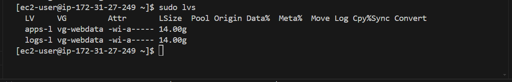

13. Verify the entire setup.

`sudo vgdisplay -v #view complete setup - VG, pv, and LV`

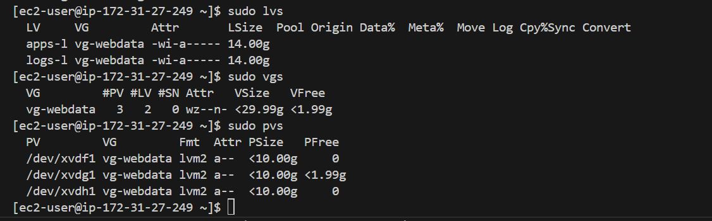

14. Use `mkfs.ext4` to format the logical volumes with `ext4` filesystem

`sudo mkfs -t ext4 /dev/webdata-vg/apps-lv`

`sudo mkfs -t ext4 /dev/webdata-vg/logs-lv`

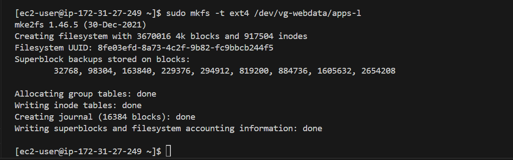

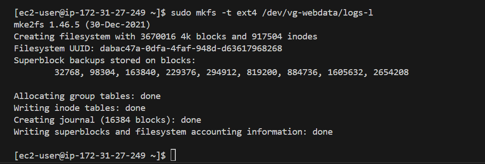

15. Create **/var/www/html** directory to store website files

