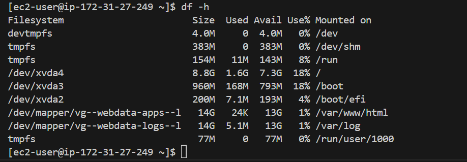
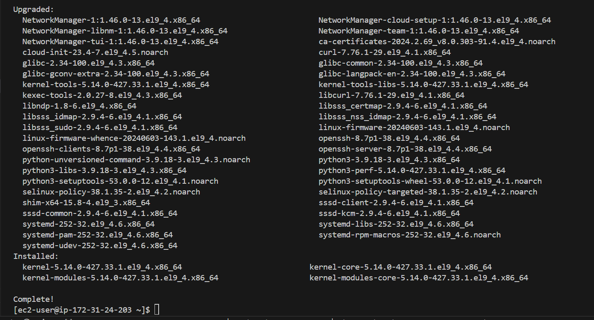

# Implementing Wordpress Website with LVM Storage Management.
This projact has to do with Implementing wordpress website with LVM storage Management on AWS EC2 Ubuntu.

- The course provides a step-by-step introduction to implementing wordpress on AWS EC2 Ubuntu as the operating system.

- The project will also teach how to leverage the power of AWS cloud infrastructure to build scalable and reliable WordPress sites. 

### Understanding 3 Tier Architecture 

**Web solution with Wordpress**

In this project I'm tasked to prepare storage infrastructure on two Linux servers and Implement a basic web solution using **WordPress**.

### Project 6 consist of two parts:

- Configure storage subsystem for web and Database servers based on Linux OS. The focus of this parts is to display a practical experience of working with disks, partitions and volumes in Linux.

- Install Wordpress and connect it to a remote MySQL database server. This part of the project will solidify the learning of deploying Web and DB tiers of Web solution.

### Three-tier Architecture.

- The **Three-tier Architecture** is a client-server software architecture pattern that comprise of 3 separate layers.

1. **Presentation Layer** (PL): This is the user interface such as the client server or browser on a laptop.

2. **Business Layer** (BL): This is the backend program that implements business logic. Application or Webserver.

3. **Data Access or Management Layer** (DAL): This is the layer for computer data storage and data access. **Database Server** or File System Server such as ***FTP Server*** or ***NFS Server*** 

### The 3-Tier Setup.

1. A Laptop or PC to serve as a client.

2. An EC2 Linux Server as a web server (This is where I will install WordPress)

3. An EC2 Linux Server as a database (DB) server.

The project will be carried out using *`RedHat`* **OS for this project**

# Implementing LVM on Linux Servers (Web and Database Servers)

Step 1. - Prepare a Web Server.

1. Launch an EC2 instance that will serve as "Web Server". Create 3 volume in the same AZ as a web server EC2, each of 10 GiB.
The video on this link show how to Add EBS Volume to an EC2 Instance [click here to watch the video](https://www.youtube.com/watch?v=HPXnXkBzIHw)

2. Attach all three volumes one by one to the Web Server EC2 Instance.

3. Open up the Linux terminal to begin configuration.

4. I will have to use `lsblk` command to inspect what block devices are attached to the server. Notice names of the newly created devices. All devices in the Linux in /dev/ directory. Inspect it with `ls/dev/` and I have to make sure all 3 newly created block devices there- their names will likely be `xvdf`, `xvdg`, `xvdh`.

4. Use `df -h` command to see all mounts and free space on your server

5. Use `gdisk` utility to create a single partition on each of the 3 disks

After the partition.

5. Use `lsblk` utility to view the newly configured partition on each of the 3 disks.

6. Install  `lvm2` packaging using `sudo yum install lvm2`. Run `sudo lvmdiskscan` command to check for available partitions.

Run `sudo lvmdiskscan` command to check for available.

7. Use  `pvcreate` utility to mark each each of 3 disks as physical volumes (PVs) to be used by LVM

`sudo pvcreate /dev/xvdf1`
`sudo pvcreate /dev/xvdg1`
`sudo pvcreate /dev/xvdh1`

8. Verify that the physical volume has been created successfully by running `sudo pvs`

9. Use `vgcreate` utility to add all 3 PVs to a volume group (VG). Name the VG **webdata-vg** 

`sudo vgcreate webdata-vg /dev/xvdf1 /dev/xvdg1 /dev/xvdh1`

10. Verify that the VG has been created successfully by running `sudo vgs`

11. Use `lvcreate` utility to create 2 logical volumes. apps-lv (**Use half of the PV size**), and **logs-lv Use the remaining space of the PV size**. **NOTE**: *apps-lv* will be used to store data for the Website while, *logs-lv* will be used to store data for *logs*.

`sudo lvcreate -n apps-lv -L 14g webdata-vg`

`sudo lvcreate -n logs-lv -L 14g webdata-vg`

12. Verify that the Logical volume has been created successfully by running `sudo lvs`

13. Verify the entire setup.

`sudo vgdisplay -v #view complete setup - VG, pv, and LV`

14. Use `mkfs.ext4` to format the logical volumes with `ext4` filesystem

`sudo mkfs -t ext4 /dev/webdata-vg/apps-lv`

`sudo mkfs -t ext4 /dev/webdata-vg/logs-lv`

15. Create **/var/www/html** directory to store website files

`sudo mkdir -p /var/www/html`

16. Create **/home/recovery/logs** to store backup of log data.

`sudo mkdir -p /home/recovery/logs`

17. Mount **/var/www/html** on **apps-lv** volume

`sudo mount /dev/webdata-vg/apps-lv /var/www/html/`

18. Use **rsync** utility to backup all the files in the log directory **/var/log** into **/home/recovery/logs** (This is required before mounting the file system).

`sudo rsync -av /var/log/. /home/recovery/logs/`

19. Mount **/var/log** on **logs-lv** logical volume. (Note that all the existing data on /var/log will be deleted. That is why 15 above is very important).

`sudo mount /dev/webdata-vg/logs-lv /var/log`

20. Restore log files back into **/var/log** directory.

`sudo rsync -av /home/recovery/logs/log/. /var/log`

21. Update `/etc/fstab` file so that the mount configuration will persist after restart of the server.

The UUID of the device will be used to update the `/etc/fstab` file;

`sudo blkid`

sudo vi `/etc/fstab`

Update `/etc/fstab` in this format using UUID and leading and ending quotes should be removed.

22. Test the configuration and reload the daemon.

`sudo mount -a`
`sudo systemctldaemon-reload`

23. Verify the setup by running `df -h`, output must look like this:

# Installing WordPress and Configuring to use MySQL Database

# Step 2 - Prepare the Database Server.

Launch a second RedHat EC2 instance that will have a role - 'DB Server' Repeat the same steps as for the Web Server, but instead of `apps-lv` create `db-lv` and mount it to `/db` directory instead of `/var/www/html/`

### Step3 - Install WordPress on  the Web Server EC2

1. Update the repository.
  
  `sudo yum -y update`

2. Install wget, Apache and it's dependencies.

`sudo yum -y install wget httpd php php-mysqlnd php-fpm php-json`

3. Start Apache.

`sudo systemctl enable httpd`
`sudo systemctl start httpd`

[The image shows the sudo systemctl enable, start and status of httpd](image/images/sudo-systemctl-start&status-httpd.png)

4. To install PHP and it's dependencies.

`sudo yum install https://dl.fedoraproject.org/pub/epel/epel-release-latest-8.noarch.rpm`
`sudo yum install yum-utils http://rpms.remirepo.net/enterprise/remi-release-8.rpm`
`sudo yum module list php`
`sudo yum module reset php`
`sudo yum module enable php:remi-7.4`
`sudo yum install php php-opcache php-gd php-curl php-mysqlnd`
`sudo systemctl start php-fpm`
`sudo systemctl enable php-fpm`
`setsebool -P httpd_execmem 1`

5. Restart Apache.

`sudo systemctl restart httpd`

6. Download Wordpress and copy wordpress to `var/www/html`

`mkdir wordpress`
`cd   wordpress`
`sudo wget http://wordpress.org/latest.tar.gz`
`sudo tar xzvf latest.tar.gz`
`sudo rm -rf latest.tar.gz`
`cp wordpress/wp-config-sample.php wordpress/wp-config.php`
`cp -R wordpress /var/www/html/`

