# Introduction to Continuous Integration and Continuous Deployment.

The Project will involve setting up a simple web application (e.g., a Node.js application) and applying CI/CD practices using GitHub Actions. This application will have basic functionality, such as serving a static web page.


# Introduction to GitHub Actions and CI/CD Course Project

Introduction course on GitHub Actions and Continous Integration/Continuous Deployment (CI/CD). This course is designed to provide and hands-on-learning experience, guiding me through the essentials of automating software development processes using GitHub Actions. Whether a developer, a student, or someone curious about CI/CD practices, this course will equip you with the practical skills and knowledge you need to implement these powerful automation techniques in your projects.

# Why is This Relevant for Learners?


For an example, Imagine you're a chef in a busy restaurant. Every dish you prepare is like a piece of software code. Without a systematic approach, you might end up with orders being mixed up, dishes taking too long to prepare, or worse, the quality of the food being inconsistent. This is where a well-organized kitchen, with clear processes and automation (like having appliances that precisely time and cook parts of the dishes), comes into play. In software development, CI/CD is akin to this efficient kitchen. It ensures that your 'dishes'(software builds) are consistently 'cooked'(built, tested, and deployed) with precision and efficiency. By learning GitHub Actions and CI/CD, you're essentially learning how to set up and manage your high-tech kitchen in the software world, allowing you to serve 'dishes' faster, with higher quality, and with fewer 'kitchen mishaps' (bugs and deployment issues).


This course will help me understand and implement these practices, making my software development process more efficient and error-free, much like a well-orchestrated kitchen. Whether you're working on personal projects, contributing to open source, or building enterprise-level applications, mastering CI/CD with GitHub Actions will be an invaluable skill in my development toolkit.


### Pre-requistes

1. Basic knowledge of Git and GitHub:

    - Understanding of version control concepts.
    - Familiarity with basic Git operations like clone, commit, push, and pull.
    - A GitHub account and knowledge of repository management on GitHub.

2. Understanding of Basic Programming Concepts:

    - Fundamental programming knowledge, preferably in JavaScript, as the example project uses Node.js.

    - Basic understanding of how web applications work.

3. Familiarity with Node.js and npm:

    - Basic knowledge of Node.js and npm (Node package manager).

    - Ability to set up a simple Node.js project and install dependencies using npm.

4. Text Editor or IDE:

    - A text editor or Integrated Development Environment (IDE) like visual studio Code, Atom, Sublime Text or any preferred editor for writing and editing code.


5. Local Development Environment:

    - Node.js and npm installed on the local machine.

    - Access to the command line or terminal.


6. Internet Connection:

    - Stable Internet connection to access GitHub and potentially other online resources or documentation.

7. Basic Understanding of CI/CD Concepts (Optional but Helpful):

    - General awareness of Continuous Integration and Continuous Deployment concepts.

    - This can be part of the learning in the course, but prior knowledge is beneficial.


### Lesson 1: Understanding Continuous Integration and Continuous Deployment

## Objectives:

1. Define CI/CD and understand its benefits.

2. Get familiar with the CI/CD Pipeline.


## Lesson Details:

1. Definition and Benefits of CI/CD:

    - Continuous Integration (CI) is the practice of merging all developers working copies to a shared mainline several times a day.

    - Continuous Deployment (CD) is the process of releasing software changes to production automatically and reliably.

    - **Benefits:** Faster release rate, improved developer productivity, better code quality, and enhanced customer satisfaction.


2. Overview of the CI/CD Pipeline:
    

    - **CI Pipeline** typically includes steps like version control, code integration, automated testing, and building the application.

    - **CD Pipeline** involves steps like deploying the application to a staging or production environment, and post-deployment monitoring.

    - **Tools:** Version control systems (e.g., Git), CI/CD platforms (e.g., GitHub Actions), testing frameworks, and deployment tools.

## Lesson Details:

- **GitHub Actions:** A CI/CD Platform integrated into GitHub, automating the build, test, and deployment pipelines of your software directly within my GitHub repository.

- **Documentation Reference:** Explore the [GitHub Actions Documentation](https://docs.github.com/en/actions) for in-depth understanding.

### Key Concepts and Terminology:

### 1. Workflow:

-   **Definition:** A configurable automated process made up of one or more jobs. Workflows are defined by a YAML file in your repository.

- **Example:** A workflow to test and deploy a Node.js application upon a Git Push.

- **Documentation:** Learn more about workflows in the [GitHub Docs on Workflows](https://docs.github.com/en/actions/writing-workflows)


### 2. Event:

-   **Definition:** A specific activity that triggers a workflow. Events include activities like push, pull request, issue creation, or even a scheduled time.

-   **Example:** A `Push` event triggers a workflow that runs tests every time code is pushed to any branch in a repository.

-   **Documentation:** Review different types of events in the [Events that trigger workflows section](https://docs.github.com/en/actions/writing-workflows/choosing-when-your-workflow-runs/events-that-trigger-workflows)


### 3. Job:

-   Definition: A set of steps in a workflow that are executed on the same runner. Jobs can run sequentially or in parallel.

- **Example:** A job that  runs on your application.

- Documentation: Understand jobs in detail in the [GitHub Docs on Jobs](https://docs.github.com/en/actions/writing-workflows/choosing-what-your-workflow-does)


### 4. Step:

-   **Definition:** An individual task that can run commands within a job. Steps can run scripts or actions.

-   **Example:** A step in a job to install dependencies (`npm install`).

-   **Documentation:** Learn about steps in the [Steps section of GitHub Docs](https://docs.github.com/en/actions/writing-workflows/workflow-syntax-for-github-actions#jobsjob_idsteps)


5. Action:

-   **Definition:** Standalone commands combined into steps to create a job. Actions can be written by you or provided by the GitHub community.

-   **Example:** Using `actions/checkout` to check out your repository code.


-   Documentation: Explore GitHub Actions in the [Marketplace](https://github.com/marketplace?type=actions) and learn how to create your own in the [Creating actions guide](https://docs.github.com/en/actions/sharing-automations)  


### 6. Runner:

-   **Definition:** A server that runs your workflows when they're triggered. Runners can be hosted by GitHub or self-hosted.

-   Example: A GitHub-hosted runner that uses Ubuntu.

-   **Documentation:** Delve into runners in the [GitHub Docs on](https://docs.github.com/en/actions/using-github-hosted-runners)


## Additional Resources:

-   **GitHub Learning Lab:** Interactive courses to learn GitHub Actions. visit [GitHub Learning Lab](https://lab.github.com/courses)

-   **GitHub Actions Quickstart:** For a hands-on introduction, check out the [Quickstart for GitHub Actions](https://docs.github.com/en/actions/writing-workflows/quickstart)


-   **Community Forums:** Engage with the GitHub community for questions and discussions at [GitHub Community Forums.](https://github.com/orgs/community/discussions/)


# Practical Implementation

### Setting Up the Project:

1. Initialize a GitHub Repository:

    - Create a new repository on GitHub.

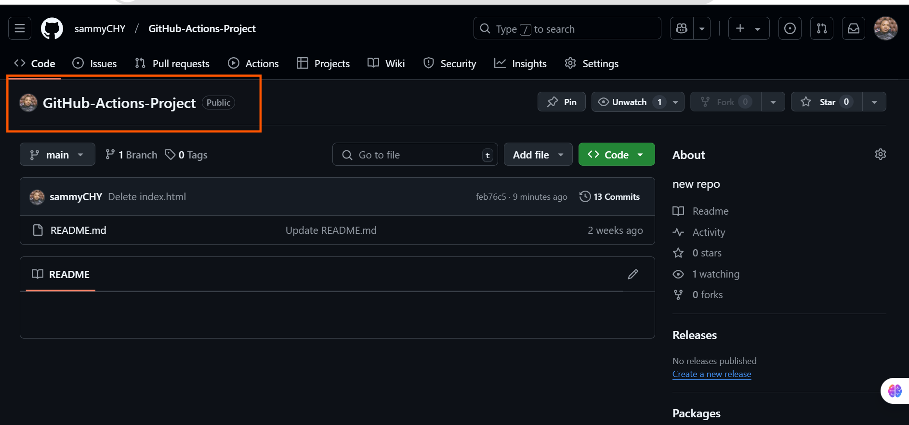


    - Clone it to your local machine.

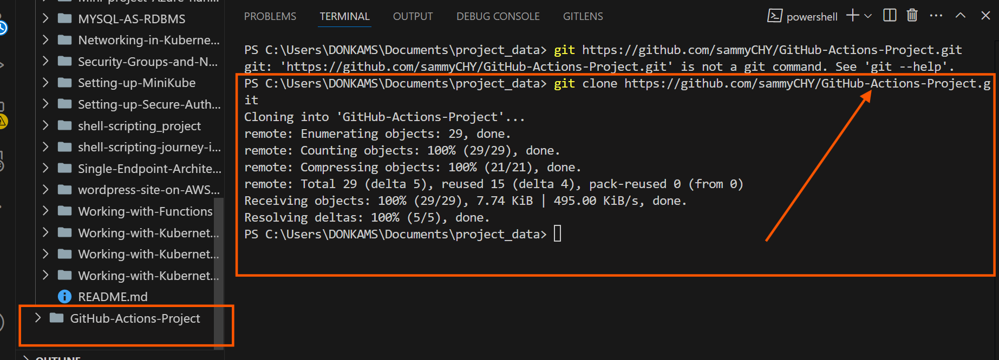

# 2. Create a Simple Node.js Application:

    - Initialize a Node.js Project (`npm init`).

**Install Node.js and npm**

Before starting, I have to ensure that **Node.js** and **Npm**[node package manager] are installed in my server or my local computer before proceeding with other installation but before then, use the command below to check the status of the `node.js and npm` in the local computer of the server.

`node -v`
`npm -v`

If they are not installed, I have to download and install Node.js from [Node.js Official Website](https://nodejs.org/en) or using another alternative site that has [Snap package Node.js](https://snapcraft.io/node)

For Windows you use this site [node.js window installation](https://nodejs.org/en/download/)

[Download]("C:\Users\DONKAMS\Downloads\node-v22.14.0-x64.msi")

[Steps to install npm and node.js in the window](https://phoenixnap.com/kb/install-node-js-npm-on-windows)


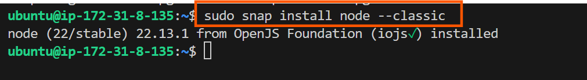
    
After the window installation of `npm` then restart the terminal or the system and then initialize `npm` by running `npm init`in the terminal, immidiately you run the command `package.json` will be installed automatically.

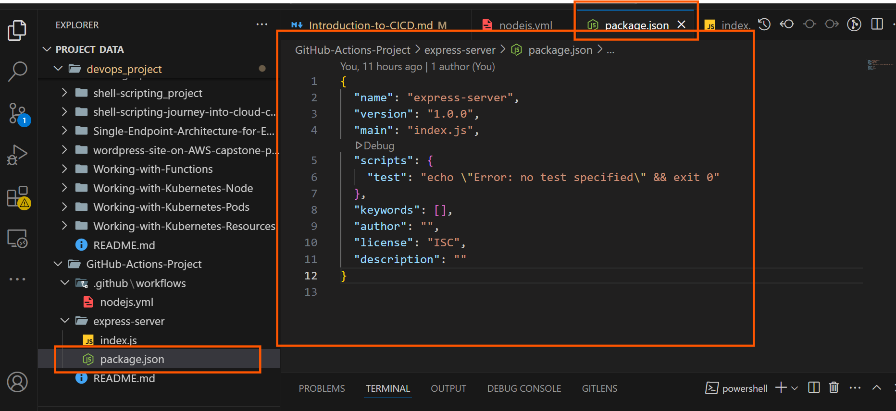


 ### Bellow is the practice to install `npm` and `node.js` in the server

`nvm` stands for **Node Version Manager**. It is a tool that allows to easily manage and switch between between multiple versions of Node.js on my machine. This is particularly useful when working on different projects that require different versions of Node.js.   

Key Features of `nvm`

1. **Install Multiple Node.js Versions:**

    - You can install multiple versions of Node.js and switch between them as needed.

2. **Switch Between Node.js Versions:**

    - Easily switch between installed versions of Node.js for different projects.

3. **Set a Default Node.js Version:**

    - Set default version of Node.js to use globally.

4. **Uninstall Node.js Versions:**

    - Remove versions of Node.js that you no longer need.

[the Image shows the `nvm` link for installation](https://github.com/nvm-sh/nvm?tab=readme-ov-file#installing-and-updating)

Once you have access to the site the scroll down to `Installing and Updating` and copy either of the two command below and run it on the terminal linked to your Linux Ubuntu.


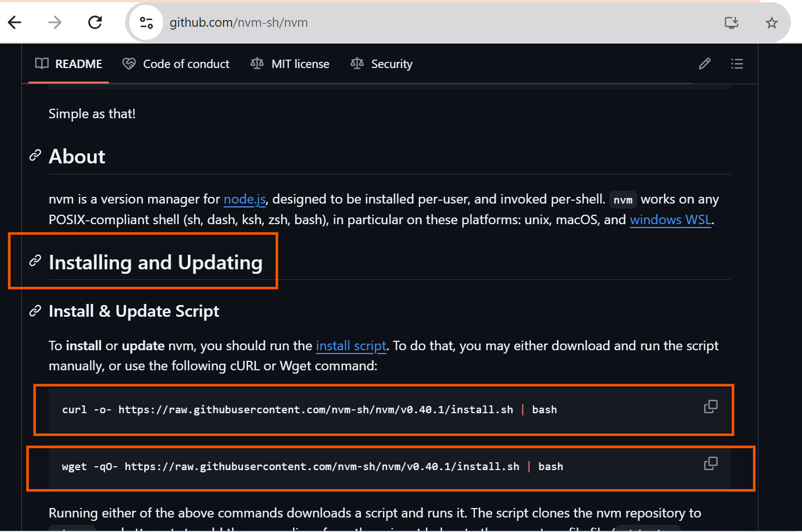


`curl -o- https://raw.githubusercontent.com/nvm-sh/nvm/v0.40.1/install.sh | bash`


`wget -qO- https://raw.githubusercontent.com/nvm-sh/nvm/v0.40.1/install.sh | bash`

Below are the installation of the `nvm` on the terminal.

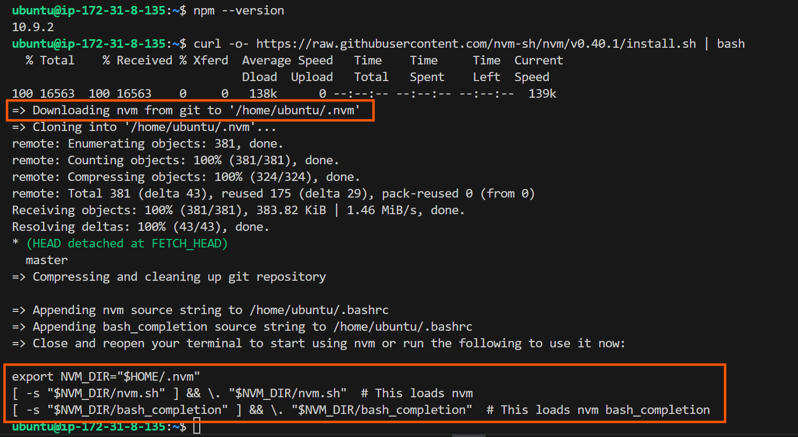

After the Installation you have to restart the terminal or exit and reload.
If you want to re-open a new terminal you can use a shortcut keys command like:

`ctrl+sht+t`

After re-opening of the new terminal then, re-enter the `nvm` on the terminal.

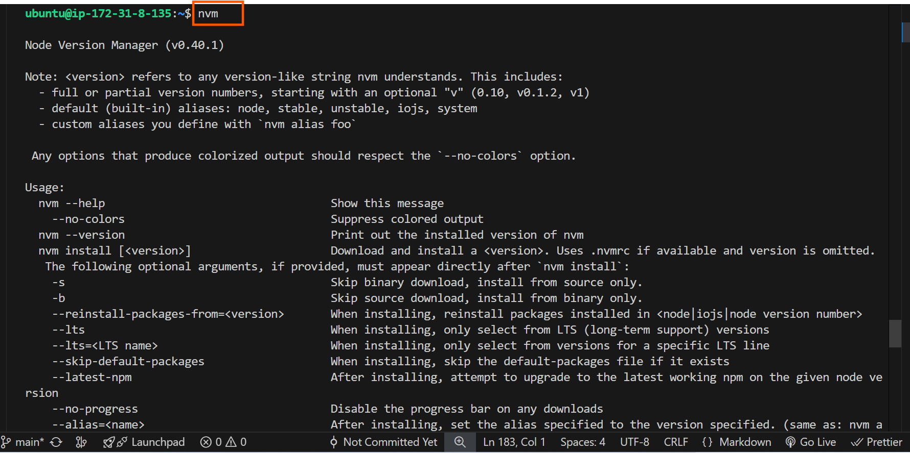

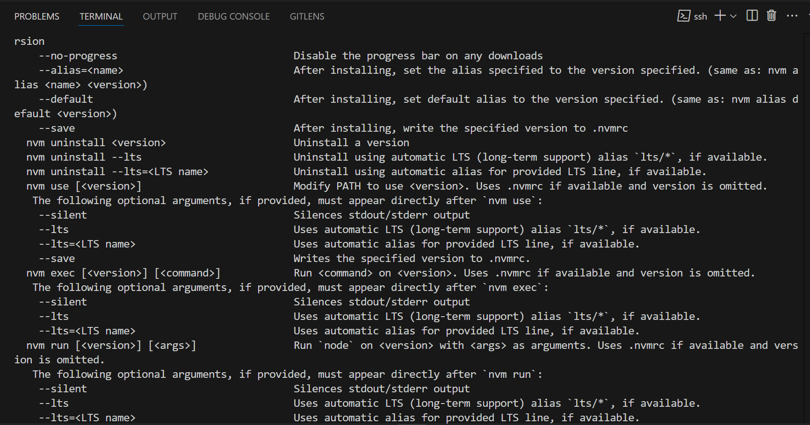

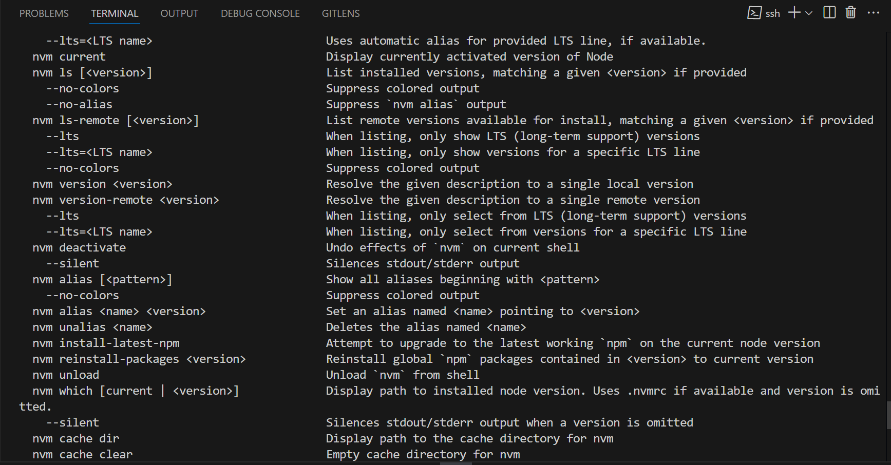

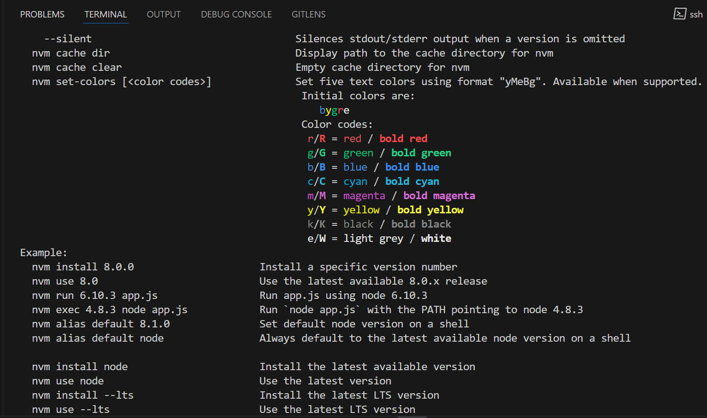

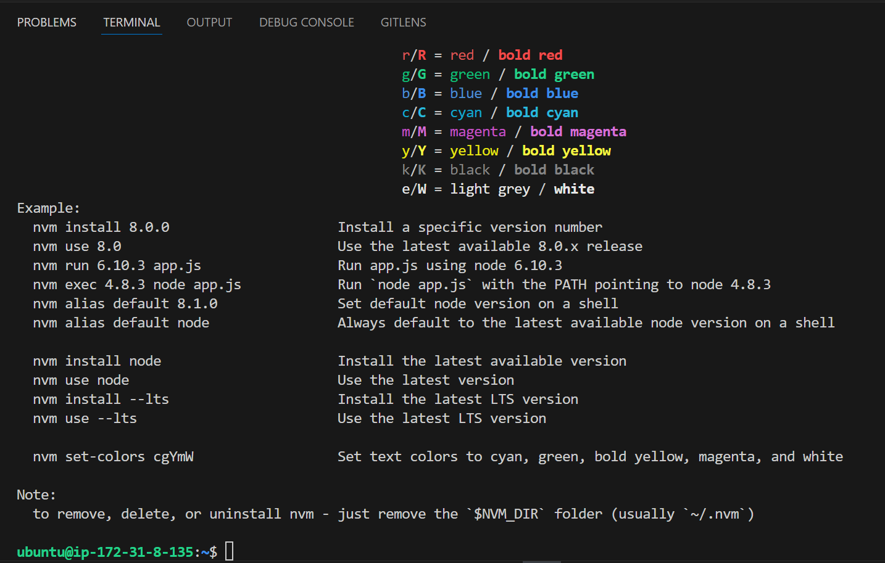

 
- Create a simple server using Express.js to serve a static web page.

Below are the steps to create a simple server using "Express.js"

**Step1: Set Up a Project:**

-   Create a new directory for your project:

```
mkdir express-server
cd express-server
```

- Add your code to the repository and push it to GitHub.

The code below is the snippet to be added and push to the Github.

```
// Example: index.js
const express = require('express');
const app = express();
const port = process.env.PORT || 3000;

app.get('/', (req, res) => {
  res.send('Hello World!');
});

app.listen(port, () => {
  console.log(`App listening at http://localhost:${port}`);
});
```
 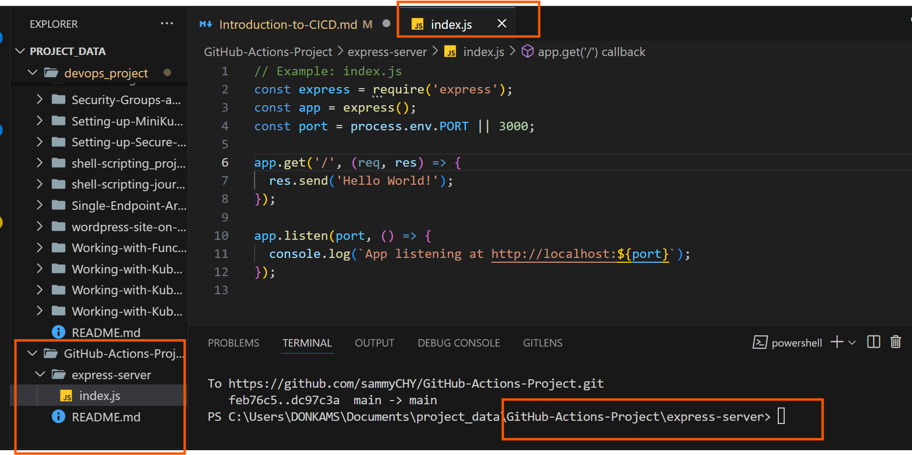


# 3. Writing Your First GitHub Action Workflow:

### Create a `.github/workflows` directory in your repository.

Below are the steps to follow:

1. Navigate to your Repository.

    - Go to your repository on GitHub or open it in your local development environment.

    - Click on the action in the upper interface.

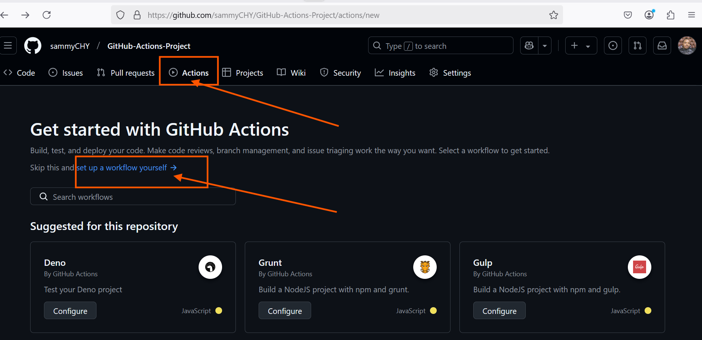

2. Create the `.github`Directory.

    - Click on the "set up a workflow yourself"

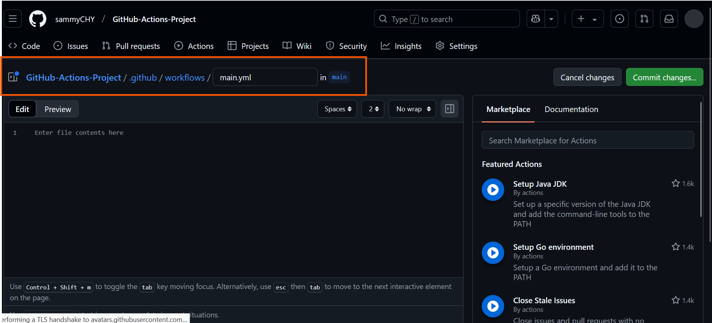


### Add a workflow file (e.g., `nodejs.yml`).

```
name: Node.js CI
 
on:
  push:
    branches: [main]
  pull_request:
    branches: [main]
 
jobs:
  build:
    runs-on: ubuntu-latest
    defaults:
      run:
        working-directory: express-server

    strategy:
      matrix:
        node-version: [18.x, 20.x] # Updated Node.js versions
 
    steps:
      - name: Checkout repository
        uses: actions/checkout@v4 # Updated to v4
 
      - name: Use Node.js ${{ matrix.node-version }}
        uses: actions/setup-node@v4 # Updated to v4
        with:
          node-version: ${{ matrix.node-version }}
 
      - name: Initialize package.json
        run: npm init -y
 
      - name: Install dependencies
        run: npm install
 
      - name: Build project (if applicable)
        run: npm run build --if-present
 
      - name: Run tests
        run: npm test

```

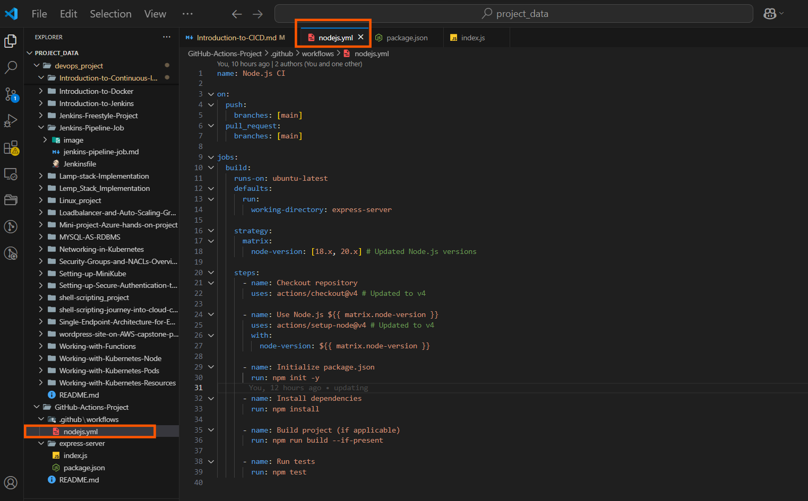


### Explanation:

1. `name`: This simply names your workflow. It's what appears on GitHub when the workflow is running.

2. `on`: This section defines when the workflow is triggered. Here, it's set to activate on push and pull request events to the main branch.

3. `jobs` Jobs are a set of steps that execute on the same runner. In this example, there's one job named `build`

4. `runs-on` Defines the type of machine to run the job on. Here, it's using the latest Ubuntu virtual machine.

5. `Strategy.matrix`: This allows you to run the job on multiple versions of Node.js, ensuring compatibility.

6. `Steps`: A sequence of tasks executed as part of the job.

    - `actions/checkout@v2`: Checks out your repository under `$GITHUB_WORKSPACE`.

    - `actions/setup-node@v1`: Sets up the Node.js environment.

    - `npm ci`: Installs dependencies defined in `package-lock.json`.

    - `npm run build --if-present`: Runs the build script from `package.json` if it's present.

    - `npm test`: Runs tests specified in `package.json`.


This workflow is a basic example for a Node.js project, demonstrating how to automate testing across different Node.js versions and ensuring that your code integrates and works as expected in a clean environment.

4. Testing and Deployment:

    - Add automated tests for your application.

    - Create a workflow for deployment (e.g., to a cloud service like Heroku or AWS).


5. Experiment and Learn:


    - Modify workflows to see how changes affect the CI/CD process. 

    - Try adding different types of tests (unit tests, integration tests).


 

