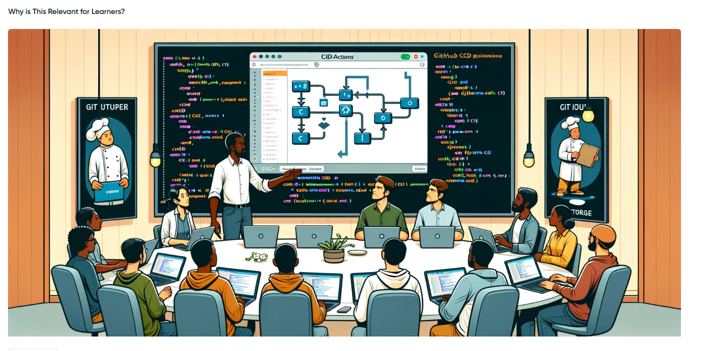

# Introduction to Continuous Integration and Continuous Deployment.

The Project will involve setting up a simple web application (e.g., a Node.js application) and applying CI/CD practices using GitHub Actions. This application will have basic functionality, such as serving a static web page.

# Introduction to GitHub Actions and CI/CD Course Project

Introduction course on GitHub Actions and Continous Integration/Continuous Deployment (CI/CD). This course is designed to provide and hands-on-learning experience, guiding me through the essentials of automating software development processes using GitHub Actions. Whether a developer, a student, or someone curious about CI/CD practices, this course will equip you with the practical skills and knowledge you need to implement these powerful automation techniques in your projects.

# Why is This Relevant for Learners?

For an example, Imagine you're a chef in a busy restaurant. Every dish you prepare is like a piece of software code. Without a systematic approach, you might end up with orders being mixed up, dishes taking too long to prepare, or worse, the quality of the food being inconsistent. This is where a well-organized kitchen, with clear processes and automation (like having appliances that precisely time and cook parts of the dishes), comes into play. In software development, CI/CD is akin to this efficient kitchen. It ensures that your 'dishes'(software builds) are consistently 'cooked'(built, tested, and deployed) with precision and efficiency. By learning GitHub Actions and CI/CD, you're essentially learning how to set up and manage your high-tech kitchen in the software world, allowing you to serve 'dishes' faster, with higher quality, and with fewer 'kitchen mishaps' (bugs and deployment issues).

This course will help me understand and implement these practices, making my software development process more efficient and error-free, much like a well-orchestrated kitchen. Whether you're working on personal projects, contributing to open source, or building enterprise-level applications, mastering CI/CD with GitHub Actions will be an invaluable skill in my development toolkit.

### Pre-requistes

1. Basic knowledge of Git and GitHub:

    - Understanding of version control concepts.
    - Familiarity with basic Git operations like clone, commit, push, and pull.
    - A GitHub account and knowledge of repository management on GitHub.