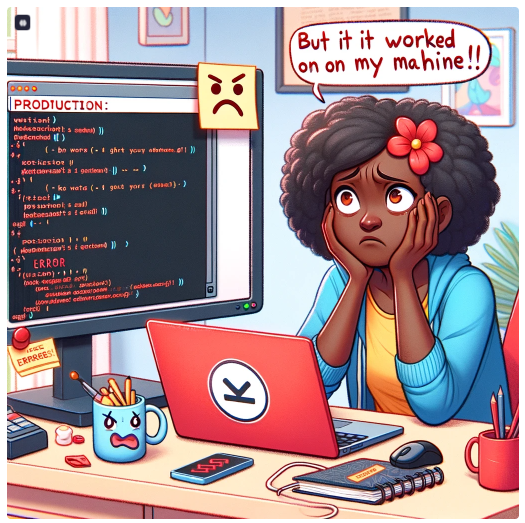

# Introduction to Docker

### Introduction to Docker and Containers

### what are Containers?

In realm of software development and deployment, professionals used to face a dilemma. They crafted brilliant code on their local machines, only to find that when deployed to other environments, it sometimes does not work. The culprit? The notorious "it works on my machine" phenomenon.



Get started with Docker, a tool that emerged to a major problem IT industry. A man named Solomon Hykes, who, in 2013, unvailed Docker, a containerisation platform that promised to revolutionize the way IT professionals built, shipped, and ran applications.

Imagine containers as magical vessels that encapsulates everything an application needs to run smoothly - its code, libraries, dependencies, and even a dash of configuration magic. These containers ensure that an application remains consistent and behaves the same, whether it's running on a developer's laptop, a testing server, or a live production environment. Docker had bestowed upon IT professionals the power to say goodbye to the days of "it works on my machine."


As a learner, I have to find myself at the crossroads of this digital fairytale. why, you may wonder, should you embark on this journey into the world of Docker? Fear not, for the answer lies in the immense benefits that Docker bestows upon its disciples. Moreover, Docker simplifies the deployment process, making it as easy as waving a wand. Gone are the days of wrestling with complex installation procedures and compatibility issues. Docker containers provide a standardized, portable environment, ensuring that my applications run seamlessly across various platforms.

So, as you embark on this adventure into Docker, envision yourself as a modern-day sorcerer, wielding the power to conjure applications that dance gracefully from development to deployment.

Advantages of Conatiners

- ***Portability Across Different Environments:***In the past, deploying applications was akin to navigating a treacherous maze, with compatibility issues lurking at every turn. Docker's containers, however, encapsulate the entire application along with its dependencies and configurations. This magical package ensures that my creation dances gracefully across different platforms, sparing you from the woes of the "it works on my machine" curse. With Docker, bid farewell to the headaches of environment mismatches and embrace a world where your application reigns supreme, irrespective of its hosting kingdom.

- Resources Efficiency Compared to Virtual Machines: Docker containers share the underlying host's operating system kernel, making them lightweight and nimble. This efficiency allows me to run multiple containers on a single host without the extravagant resource demands of traditional virtual machines. Picture Docker containers as magical carriages, swiftly transporting my applications without burdening the kingdom with unnecessary excess. With Docker, revel in the harmony of resource optimization and application efficiency.

- **Rapid Application Deployment and Scaling:** Docker containers can be effortlessly spun up or torn down, facilitating the swift deploment of applications. Whether you're facing a sudden surge in demand or orchestrating a grand-scale production, Docker allows you to scale my applications seamlessly. Imagine commanding an army of containers to conquer the peaks of user demand, only to gracefully retreat when the storm has passed. With Docker, the ability to scale becomes a wand in my hand, transforming the challenges of deployment into a choreographed ballet of efficiency.

Comparison of Docker Container with Virtual Machines

Docker and Virtual machines (VMs) are both technologies used for application deployment, but they differ in their approach to virtualization. Virtual machines emulate entire operating systems, resulting in higher resource overhead and slower performance. In contrast, Docker utilizes containerization, encapsulating applications and their dependencies while sharing the host OS's kernel. This lightweight approach reduces resource consumption, provides faster startup times, and ensures portability across different environments. Docker's emphasis on microservices and standardized packaging fosters scalability and efficiency, making it a preferred choice for modern, agile application development, whereas virtual machines excel in scenarios requiring stronger isolation but at the cost of increase resource usage. The choice between Docker and VMs depends on specific use cases and the desired balance between performance and isolation.

## Importance of Docker

- **Technology and Industry Impact:** The significance of Docker in the technology landscape cannot be overstated. Docker and containerization have revolutionized software development, deployment, and management. The ability to package applicationd and their dependencies into lightweight, portable conatainers addresses key challenges in software development, such as consistency across different environments and efficient resource utilization.

- **Real-World Impact:** Implementing Docker brings tangible benefits to organizations. It streamlines the development process, promotes collaboration between development and operations teams, and accelerates the delivery of applications Docker's containerization technology enhances scalability, facilitates rapid deployment, and ensures the consistency of applications across diverse environments. This not only saves time and resources but also contributes to a more resilient and agile software development lifecycle.

- Target Audience
This course on Docker is designed for a diverse audience, including:

DevOps Professionals: Interested in container orchestration, seeking effient ways to manage and deploy appliactions, improve resouce utilization, and ensure system stability.

- Developers: Who wants to streamline their application development, enhance collaboration, and ensure consistency across different stages of the development lifecycle.

It caters to cloud engineers, QA engineers, and other tech enthusiast who are eager to enhance their technical skills and establish a strong foundation in docker and containersation. Professionals seeking to expand their skill set or students preparing for roles in technology related fields will find this project beneficial.

## Prerequisites

Before diving into this Docker course, learners

- Should have successfully completed our TechOps Career Essentials and Advanced TechOps course.

- Should be comfortable navigating linux and executing its commands.

- Should have basic cloud computing knowledge.

- Understanding of virtual machines and their role in software deployment.

# Project Goals

By the end of this course, learners should aim to achieve the following:

1. Grasp the concept of containers, their isolation, and their role in packaging applications.

2. Familiarize themselves with key Docker features, commands, and best practices.

3. Comprehend how Docker containers contribute to resource efficiency compared to traditional virtual machines.

4. Learn how Docker ensures consistent application behavior across different development, testing, and production environments.


5. Master the techniques for quickly deploying and scaling applications using Docker.

# Getting Started With Docker

### Installing Docker.
We need to launch an ubuntu 20.04LTS instance and connect to it, then follow the steps below.


Before installing Docker Engine for the first time on a new host machine, it is necessary to configure the Docker repository. Following this setup, we can proceed to install and update Docker directly from the repository.

Now let's first add docker's official GPC key

learn more about [GPG KEYS](https://help.ubuntu.com/community/GnuPrivacyGuardHowto)

```
sudo apt-get update
```


This a Linux command that refreshes the package list on a Debain-based system, ensuring the latest software information is available for installation.

```ll/ubuntu/
sudo apt-get install ca-certificates curl gnupg
```


This a Linux command that installs essential packages including certificate authorities, a data tranfer tool (curl), and the GNU privacy Guard for secure communication and package verfication.

```
sudo install -m 0755 -d /etc/apt/keyrings
```


The command above creates a directory (/etc/apt/keyrings) with specific permissions (0755) for storing keyring files, which are used for docker's authentication.

```
curl -fsSL https://download.docker.com/linux/ubuntu/gpg | sudo gpg --dearmor -o /etc/apt/keyrings/docker.gpg
```
This downloads the Docker GPG key using `curl`


```
-----BEGIN PGP PUBLIC KEY BLOCK-----

mQINBFit2ioBEADhWpZ8/wvZ6hUTiXOwQHXMAlaFHcPH9hAtr4F1y2+OYdbtMuth
lqqwp028AqyY+PRfVMtSYMbjuQuu5byyKR01BbqYhuS3jtqQmljZ/bJvXqnmiVXh
38UuLa+z077PxyxQhu5BbqntTPQMfiyqEiU+BKbq2WmANUKQf+1AmZY/IruOXbnq
L4C1+gJ8vfmXQt99npCaxEjaNRVYfOS8QcixNzHUYnb6emjlANyEVlZzeqo7XKl7
UrwV5inawTSzWNvtjEjj4nJL8NsLwscpLPQUhTQ+7BbQXAwAmeHCUTQIvvWXqw0N
cmhh4HgeQscQHYgOJjjDVfoY5MucvglbIgCqfzAHW9jxmRL4qbMZj+b1XoePEtht
ku4bIQN1X5P07fNWzlgaRL5Z4POXDDZTlIQ/El58j9kp4bnWRCJW0lya+f8ocodo
vZZ+Doi+fy4D5ZGrL4XEcIQP/Lv5uFyf+kQtl/94VFYVJOleAv8W92KdgDkhTcTD
G7c0tIkVEKNUq48b3aQ64NOZQW7fVjfoKwEZdOqPE72Pa45jrZzvUFxSpdiNk2tZ
XYukHjlxxEgBdC/J3cMMNRE1F4NCA3ApfV1Y7/hTeOnmDuDYwr9/obA8t016Yljj
q5rdkywPf4JF8mXUW5eCN1vAFHxeg9ZWemhBtQmGxXnw9M+z6hWwc6ahmwARAQAB
tCtEb2NrZXIgUmVsZWFzZSAoQ0UgZGViKSA8ZG9ja2VyQGRvY2tlci5jb20+iQI3
BBMBCgAhBQJYrefAAhsvBQsJCAcDBRUKCQgLBRYCAwEAAh4BAheAAAoJEI2BgDwO
v82IsskP/iQZo68flDQmNvn8X5XTd6RRaUH33kXYXquT6NkHJciS7E2gTJmqvMqd
tI4mNYHCSEYxI5qrcYV5YqX9P6+Ko+vozo4nseUQLPH/ATQ4qL0Zok+1jkag3Lgk
jonyUf9bwtWxFp05HC3GMHPhhcUSexCxQLQvnFWXD2sWLKivHp2fT8QbRGeZ+d3m
6fqcd5Fu7pxsqm0EUDK5NL+nPIgYhN+auTrhgzhK1CShfGccM/wfRlei9Utz6p9P
XRKIlWnXtT4qNGZNTN0tR+NLG/6Bqd8OYBaFAUcue/w1VW6JQ2VGYZHnZu9S8LMc
FYBa5Ig9PxwGQOgq6RDKDbV+PqTQT5EFMeR1mrjckk4DQJjbxeMZbiNMG5kGECA8
g383P3elhn03WGbEEa4MNc3Z4+7c236QI3xWJfNPdUbXRaAwhy/6rTSFbzwKB0Jm
ebwzQfwjQY6f55MiI/RqDCyuPj3r3jyVRkK86pQKBAJwFHyqj9KaKXMZjfVnowLh
9svIGfNbGHpucATqREvUHuQbNnqkCx8VVhtYkhDb9fEP2xBu5VvHbR+3nfVhMut5
G34Ct5RS7Jt6LIfFdtcn8CaSas/l1HbiGeRgc70X/9aYx/V/CEJv0lIe8gP6uDoW
FPIZ7d6vH+Vro6xuWEGiuMaiznap2KhZmpkgfupyFmplh0s6knymuQINBFit2ioB
EADneL9S9m4vhU3blaRjVUUyJ7b/qTjcSylvCH5XUE6R2k+ckEZjfAMZPLpO+/tF
M2JIJMD4SifKuS3xck9KtZGCufGmcwiLQRzeHF7vJUKrLD5RTkNi23ydvWZgPjtx
Q+DTT1Zcn7BrQFY6FgnRoUVIxwtdw1bMY/89rsFgS5wwuMESd3Q2RYgb7EOFOpnu
w6da7WakWf4IhnF5nsNYGDVaIHzpiqCl+uTbf1epCjrOlIzkZ3Z3Yk5CM/TiFzPk
z2lLz89cpD8U+NtCsfagWWfjd2U3jDapgH+7nQnCEWpROtzaKHG6lA3pXdix5zG8
eRc6/0IbUSWvfjKxLLPfNeCS2pCL3IeEI5nothEEYdQH6szpLog79xB9dVnJyKJb
VfxXnseoYqVrRz2VVbUI5Blwm6B40E3eGVfUQWiux54DspyVMMk41Mx7QJ3iynIa
1N4ZAqVMAEruyXTRTxc9XW0tYhDMA/1GYvz0EmFpm8LzTHA6sFVtPm/ZlNCX6P1X
zJwrv7DSQKD6GGlBQUX+OeEJ8tTkkf8QTJSPUdh8P8YxDFS5EOGAvhhpMBYD42kQ
pqXjEC+XcycTvGI7impgv9PDY1RCC1zkBjKPa120rNhv/hkVk/YhuGoajoHyy4h7
ZQopdcMtpN2dgmhEegny9JCSwxfQmQ0zK0g7m6SHiKMwjwARAQABiQQ+BBgBCAAJ
BQJYrdoqAhsCAikJEI2BgDwOv82IwV0gBBkBCAAGBQJYrdoqAAoJEH6gqcPyc/zY
1WAP/2wJ+R0gE6qsce3rjaIz58PJmc8goKrir5hnElWhPgbq7cYIsW5qiFyLhkdp
YcMmhD9mRiPpQn6Ya2w3e3B8zfIVKipbMBnke/ytZ9M7qHmDCcjoiSmwEXN3wKYI
mD9VHONsl/CG1rU9Isw1jtB5g1YxuBA7M/m36XN6x2u+NtNMDB9P56yc4gfsZVES
KA9v+yY2/l45L8d/WUkUi0YXomn6hyBGI7JrBLq0CX37GEYP6O9rrKipfz73XfO7
JIGzOKZlljb/D9RX/g7nRbCn+3EtH7xnk+TK/50euEKw8SMUg147sJTcpQmv6UzZ
cM4JgL0HbHVCojV4C/plELwMddALOFeYQzTif6sMRPf+3DSj8frbInjChC3yOLy0
6br92KFom17EIj2CAcoeq7UPhi2oouYBwPxh5ytdehJkoo+sN7RIWua6P2WSmon5
U888cSylXC0+ADFdgLX9K2zrDVYUG1vo8CX0vzxFBaHwN6Px26fhIT1/hYUHQR1z
VfNDcyQmXqkOnZvvoMfz/Q0s9BhFJ/zU6AgQbIZE/hm1spsfgvtsD1frZfygXJ9f
irP+MSAI80xHSf91qSRZOj4Pl3ZJNbq4yYxv0b1pkMqeGdjdCYhLU+LZ4wbQmpCk
SVe2prlLureigXtmZfkqevRz7FrIZiu9ky8wnCAPwC7/zmS18rgP/17bOtL4/iIz
QhxAAoAMWVrGyJivSkjhSGx1uCojsWfsTAm11P7jsruIL61ZzMUVE2aM3Pmj5G+W
9AcZ58Em+1WsVnAXdUR//bMmhyr8wL/G1YO1V3JEJTRdxsSxdYa4deGBBY/Adpsw
24jxhOJR+lsJpqIUeb999+R8euDhRHG9eFO7DRu6weatUJ6suupoDTRWtr/4yGqe
QhxAAoAMWVrGyJivSkjhSGx1uCojsWfsTAm11P7jsruIL61ZzMUVE2aM3Pmj5G+W
9AcZ58Em+1WsVnAXdUR//bMmhyr8wL/G1YO1V3JEJTRdxsSxdYa4deGBBY/Adpsw
24jxhOJR+lsJpqIUeb999+R8euDhRHG9eFO7DRu6weatUJ6suupoDTRWtr/4yGqe
QhxAAoAMWVrGyJivSkjhSGx1uCojsWfsTAm11P7jsruIL61ZzMUVE2aM3Pmj5G+W
9AcZ58Em+1WsVnAXdUR//bMmhyr8wL/G1YO1V3JEJTRdxsSxdYa4deGBBY/Adpsw
24jxhOJR+lsJpqIUeb999+R8euDhRHG9eFO7DRu6weatUJ6suupoDTRWtr/4yGqe
dKxV3qQhNLSnaAzqW/1nA3iUB4k7kCaKZxhdhDbClf9P37qaRW467BLCVO/coL3y
QhxAAoAMWVrGyJivSkjhSGx1uCojsWfsTAm11P7jsruIL61ZzMUVE2aM3Pmj5G+W
9AcZ58Em+1WsVnAXdUR//bMmhyr8wL/G1YO1V3JEJTRdxsSxdYa4deGBBY/Adpsw
24jxhOJR+lsJpqIUeb999+R8euDhRHG9eFO7DRu6weatUJ6suupoDTRWtr/4yGqe
dKxV3qQhNLSnaAzqW/1nA3iUB4k7kCaKZxhdhDbClf9P37qaRW467BLCVO/coL3y
9AcZ58Em+1WsVnAXdUR//bMmhyr8wL/G1YO1V3JEJTRdxsSxdYa4deGBBY/Adpsw
24jxhOJR+lsJpqIUeb999+R8euDhRHG9eFO7DRu6weatUJ6suupoDTRWtr/4yGqe
dKxV3qQhNLSnaAzqW/1nA3iUB4k7kCaKZxhdhDbClf9P37qaRW467BLCVO/coL3y
dKxV3qQhNLSnaAzqW/1nA3iUB4k7kCaKZxhdhDbClf9P37qaRW467BLCVO/coL3y
Vm50dwdrNtKpMBh3ZpbB1uJvgi9mXtyBOMJ3v8RZeDzFiG8HdCtg9RvIt/AIFoHR
H3S+U79NT6i0KPzLImDfs8T7RlpyuMc4Ufs8ggyg9v3Ae6cN3eQyxcK3w0cbBwsh
Vm50dwdrNtKpMBh3ZpbB1uJvgi9mXtyBOMJ3v8RZeDzFiG8HdCtg9RvIt/AIFoHR
H3S+U79NT6i0KPzLImDfs8T7RlpyuMc4Ufs8ggyg9v3Ae6cN3eQyxcK3w0cbBwsh
/nQNfsA6uu+9H7NhbehBMhYnpNZyrHzCmzyXkauwRAqoCbGCNykTRwsur9gS41TQ
H3S+U79NT6i0KPzLImDfs8T7RlpyuMc4Ufs8ggyg9v3Ae6cN3eQyxcK3w0cbBwsh
/nQNfsA6uu+9H7NhbehBMhYnpNZyrHzCmzyXkauwRAqoCbGCNykTRwsur9gS41TQ
/nQNfsA6uu+9H7NhbehBMhYnpNZyrHzCmzyXkauwRAqoCbGCNykTRwsur9gS41TQ
M8ssD1jFheOJf3hODnkKU+HKjvMROl1DK7zdmLdNzA1cvtZH/nCC9KPj1z8QC47S
M8ssD1jFheOJf3hODnkKU+HKjvMROl1DK7zdmLdNzA1cvtZH/nCC9KPj1z8QC47S
xx+dTZSx4ONAhwbS/LN3PoKtn8LPjY9NP9uDWI+TWYquS2U+KHDrBDlsgozDbs/O
xx+dTZSx4ONAhwbS/LN3PoKtn8LPjY9NP9uDWI+TWYquS2U+KHDrBDlsgozDbs/O
jCxcpDzNmXpWQHEtHU7649OXHP7UeNST1mCUCH5qdank0V1iejF6/CfTFU4MfcrG
jCxcpDzNmXpWQHEtHU7649OXHP7UeNST1mCUCH5qdank0V1iejF6/CfTFU4MfcrG
YT90qFF93M3v01BbxP+EIY2/9tiIPbrd
YT90qFF93M3v01BbxP+EIY2/9tiIPbrd
=0YYh
=0YYh
-----END PGP PUBLIC KEY BLOCK-----
```

```
sudo chmod a+r /etc/apt/keyrings/docker.gpg
```
Sets read permissions for all users on the Docker GPG key file within the APT keyring directory.


**Let's add the repository to Apt sources**

```
echo \
  "deb [arch=$(dpkg --print-architecture) signed-by=/etc/apt/keyrings/docker.gpg] https://download.docker.com/linux/ubuntu \
  $(. /etc/os-release && echo "$VERSION_CODENAME") stable" | \
  sudo tee /etc/apt/sources.list.d/docker.list > /dev/null
```


The "echo" command creates a Docker APT repository configuration entry for the Ubuntu system, incorporating the system architecture and Docker GPG key, and then "sudo tee /etc/apt/source.list.d/docker.list> /dev/null" writes this configuration to the "/etc/apt/sources.list.d/docker.list" file.

```
sudo apt-get update
```


