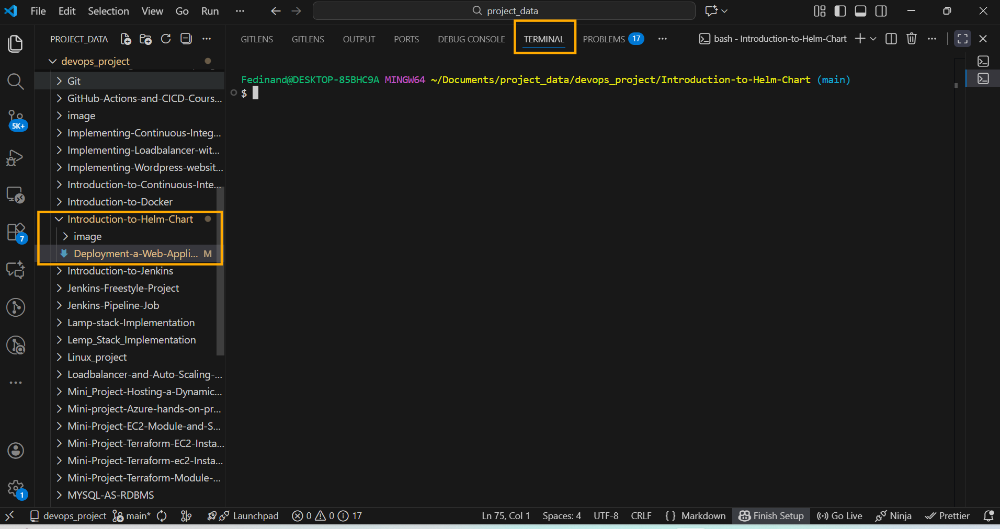
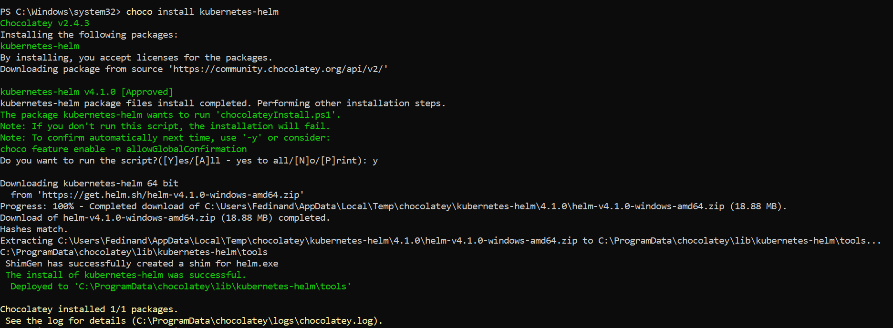
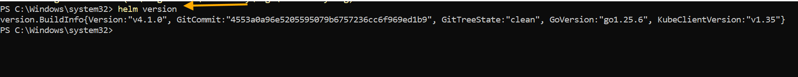
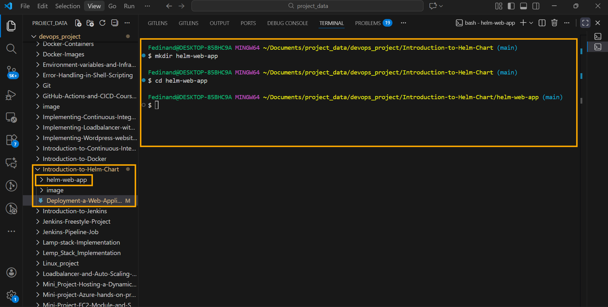

# Deployment a web Application Using Helm in Kubernetes

## Table of Contents


1. Deploying a Web Application Using Helm in Kubernetes

    - Introduction

    - Overview

    - Prerequisites

2. Step 1: Install Helm

    - For Linux and macOS Users

    - For Windows Users

3. Step 2: Create a New Helm Chart.

4. Step 3: Customize your Helm Chart

    - Understanding Helm Charts, Values, and Templates

5. Step 4: Deploying Your Application

6. Step 5: Integrating Helm with CI/CD (Jenkins)

7. Step 6: Update Helm Chart and Trigger Jenkins Pipeline


# Introduction To Helm


Helm is a Package manage for Kubernetes applications. It simplifies the deployment and management of applications on Kubernetes by providing a way to define, install, and upgrade even the most complex Kubernetes applications applications. This practical exercise is designed for learners who are eager to dive into the world of Kubernetes, offering a hands- on experience with Helm, a key tool in modern cloud-native technology stacks. Throughout this project, you will learn how to utilize Helm to streamline the deployment and management of applications in a Kubernetes environment. By creating, configuring, and deploying a simple web application, you'll gain valuable insights into the efficiencies Helm brings to Kubernetes application management.


Imagine you're a chef in a large, busy kitchen. In this scenario, Kubernetes is the kitchen itself, equipped with all the necessary tools and stations, while the individual dishes you need to prepare are the applications. Now, Helm acts like a recipe book that not only contains recipes but also automates the preparation process. Each Helm chart is a recipe, specifying ingredients (containers, services, etc.) and the steps needed to create the dish (application). By using Helm, you're not just cooking one dish ata a time; you're efficiently managing multiple dishes, ensuring each is prepared consistently and to the highest standard , no matter how busy the kitchen gets. This project will help you learn to be that efficient chef  in the Kubernetes kitchen, making the process of deploying and managing applications as seamless as preparing a well-structured meal.


# Overview

In this project, you'll deploy a simple web application in a Kubernetes cluster using Helm. This project covers using Helm charts, customizing deployments with templates and values, installing and running Helm, and integrating Helm into a basic CI/CD pipeline.


# Prerequisites

- Completion of core programs 1 - 4

- Kubernetes setup (Minikube, Kind, or a cloud service like GKE, EKS, AKS).

- Git repository

- Basic Kubernetes understanding (Pods, Deployments, Services).

- Jenkins server

- Basic command-line skills.

- Docker installed (for building container images).


Step 1: Install Helm

Let's get our hand on installing helm on different environment for different operating system (OS). But first we need to install [vscode](https://code.visualstudio.com/download) for OS, this will give us ease to work with our helm files. Follow the [link to download vscode](https://code.visualstudio.com/download) if not installed.


For Linux and macOS Users

1. Open Your vscode:

    - Run you vscode as an administrator
    - Access your CLI by opening the Terminal.




2. Download Helm:

    - For Linux, use `curl` to download Helm:

    ```
    curl -L https://get.helm.sh/helm-v3.5.0-linux-amd64.tar.gz -o helm.tar.gz
    ```

    - For macOS, use `curl` to download Helm:

    ```
    curl -L https://get.helm.sh/helm-v3.5.0-darwin-amd64.tar.gz -o helm.tar.gz
    ```

3. Extract the Downloaded File:

    ```
    tar -zxvf helm.tar.gz
    ```

4. Move the Helm Binary:

    For Linux:

    ```
    mv linux-amd64/helm /usr/local/bin/helm
    ```

    - For macOS:
    
    ```
    mv darwin-amd64/helm /usr/local/bin/helm
    ```

    - Use `sudo` if necessary.

5. Verify Installation:

    ```
    helm version
    ```

6. Clean Up:

    ```
    rm helm.tar.gz && rm -r *-amd64
    ```

For Windows Users

1. Open Your vscode:

    - Run you vscode as an administrator
    - Access your CLI by opening the Terminal.


2. Install Helm:

    - Install Helm using the [chocolatey](https://chocolatey.org/). chocolately, just like linux `apt` and `yum`, is a windows package manager for installing, updating and removing software packages on windows.

    ```
    choco install kubernetes-helm
    ```



Note: If you don't have [chocolatey](https://chocolatey.org/). installed, follow the  [official documentation](https://chocolatey.org/) to install it.


3. Verify Installation:


    - In PowerShell or Command Prompt, run:

    ```
    helm version
    ```



# Step 2: Create a New Helm Chart

Now that we have helm installed on our environment, let's create a helm chart.


1. Create Project Directory:

     ```
     mkdir helm-web-app

     cd helm-web-app
     ```

2. Create a New Chart:

    ```
    helm create webapp
    ```



3. Initialize a Git Repository

    ```
    git init
    git add .
    git commit -m "Initial Helm webapp chart"
    ```

4. Push to Remote Repository:

    - Create a new repository on GitHub, GitLab, or your preferred Git hosting service.

    - Follow the instructions provided by your Git service to Push your local repository to the remote. For example:

    ```
    git remote add origin <REMOTE_REPOSITORY_URL>
    git push -u origin master
    ```


