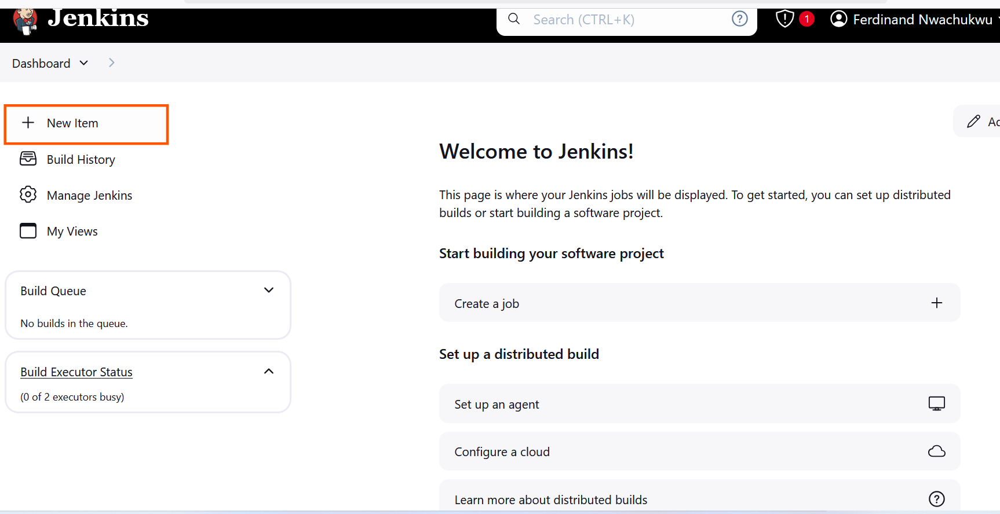
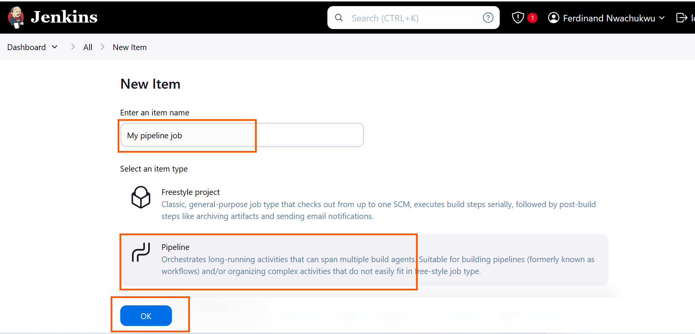

## What is a Jenkins Pipeline Job

A Jenkins pipeline job is a way to define and automate a series of steps in the software delivery process. It allows you to script and organize your entire build, test, and deployment. Jenkins pipelines enable organizations to define, visualize, and execute intricate build, test, and deployment processes as code. This facilitates the seamless integration of continuous integration and continuous delivery (CI/CD) practices into software development.

Let's recall our docker foundations project when we created a dockerfile and made a docker image and container with it. Now let's automate the same process with jenkins pipeline code.

# Creating a Pipeline Job

Let's create our first pipeline job

i. From the dashboard menu on the left side, click on new item.

ii. Create a pipeline job and name it "My pipeline job"

# Configuring Build Trigger

Like we did previously in the earlier project, create a build trigger for jenkins to trigger new build

i. Click "Configure" your job and add this configurations

ii. Click on build trigger to configure triggering the job from Github webhook
 

