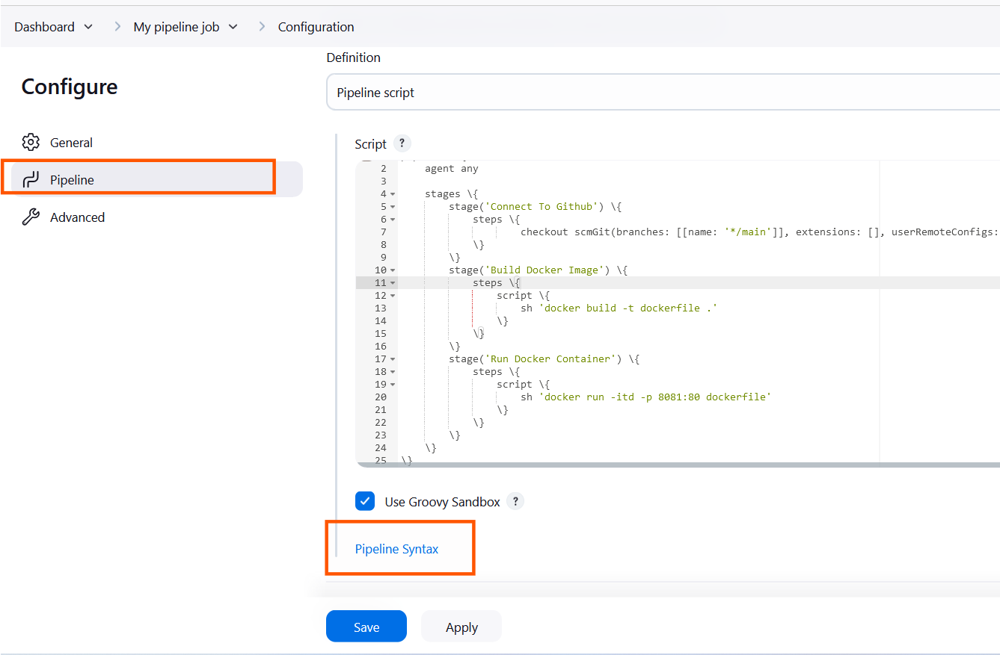

## What is a Jenkins Pipeline Job

A Jenkins pipeline job is a way to define and automate a series of steps in the software delivery process. It allows you to script and organize your entire build, test, and deployment. Jenkins pipelines enable organizations to define, visualize, and execute intricate build, test, and deployment processes as code. This facilitates the seamless integration of continuous integration and continuous delivery (CI/CD) practices into software development.

Let's recall our docker foundations project when we created a dockerfile and made a docker image and container with it. Now let's automate the same process with jenkins pipeline code.


# Creating a Pipeline Job

Let's create our first pipeline job

i. From the dashboard menu on the left side, click on new item.


ii. Create a pipeline job and name it "My pipeline job"


# Configuring Build Trigger

Like we did previously in the earlier project, create a build trigger for jenkins to trigger new build

i. Click "Configure" your job and add this configurations

ii. Click on build trigger to configure triggering the job from Github webhook
 


iii. Since we have created a github webhook previously, I do not need to create another one again.

Now let's work on our pipeline script

## Writing Jenkins Pipeline Script

A jenkins pipeline script refers to a script that defines and orchestrate the steps and stages of a continuous integration and continuous delivery (CI/CD) pipeline. Jenkins pipelines can be defined using either declarative or scripted syntax. Declarative syntax is a more structured and concise way to define pipelines.It uses a domain-specific language to describe the pipeline stages, steps, and other configurations while scripted syntax provides more flexibility and is suitable for complex scripting requirements.

Let's write our pipeline script

```
pipeline \{
    agent any

    stages \{
        stage('Connect To Github') \{
            steps \{
                    checkout scmGit(branches: [[name: '*/main']], extensions: [], userRemoteConfigs: [[url: 'https://github.com/sammyCHY/jenkins-scm.git']])
            \}
        \}
        stage('Build Docker Image') \{
            steps \{
                script \{
                    sh 'docker build -t dockerfile .'
                \}
            \}
        \}
        stage('Run Docker Container') \{
            steps \{
                script \{
                    sh 'docker run -itd -p 8081:80 dockerfile'
                \}
            \}
        \}
    \}
\}
```

**Explanation of the script above**


The provided Jenkins pipeline script defines a series of stages for a continuous integration and continuous delivery (CI/CD) process. Let's break down each stage:

- **Agent Configuration:**

```
agent any
```

Specifies that the pipeline can run on any available agent (an agent can either be a jenkins master or node). This means the pipeline is not tied to a specific node type.

- **Stages:**

```
stages \{
   // Stages go here
\}
```

Defines the various stages of the pipeline, each representing a phase in the software delivery process.

- **Stage 1: Connect To Github:**

```
stage('Connect To Github') \{
   steps \{
      checkout scmGit(branches: [[name: '*/main']], extensions: [], userRemoteConfigs: [[url: 'https://github.com/sammyCHY/jenkins-scm.git']])
   \}
\}
```

- This stage checks out the source code from a GitHub repository (`https://github.com/sammyCHY/jenkins-scm.git).

- It specifies that the pipeline should use the `main` branch.

- Stage 2: Build Docker Image:

```
stage('Build Docker Image') \{
   steps \{
      script \{
         sh 'docker build -t dockerfile .'
      \}
   \}
\}
```

- This stage builds a Docker image named 'dockerfile' using the source code obtained from the GitHub repository.

- The `docker build` command is executed using the shell (`sh`).

- Stage 3: Run Docker Container:

```
stage('Run Docker Container') \{
   steps \{
      script \{
         sh 'docker run -itd --name nginx -p 8081:80 dockerfile'
      \}
   \}
\}
```

- This stage runs a Docker container named 'nginx' in detached mode (`-itd`).

- The container is mapped to port 8081 on the host machine (`-p 8081:80`).

- The Docker image used is the one built in the previous stage ('dockerfile').


***Copy the Pipeline script and paste it in the section below***

Pipeline

Definition

Pipeline script


The stage 1 of the script connects jenkins to github repository. To generate syntax for my github repository, follow the steps below.


i. Click on the pipeline syntax




ii. Select the drop down to search for **`checkout: Check out from version control`**


### Overview

This **Snippet Generator**will help you learn the pipeline script code which can be used to define various steps. Pick a step you are interested in from the list, configure it, click **Generate Pipeline Script** and you will see a pipeline script statement that would call the step with that configuration. You may copy and paste the whole statement that would call the step with that configuration. You may copy and paste the whole statement into my script, or pick up just the options you care about. (Most parameters are optional and can be omitted in your script, leaving them at default values.)


Steps

Sample Step

