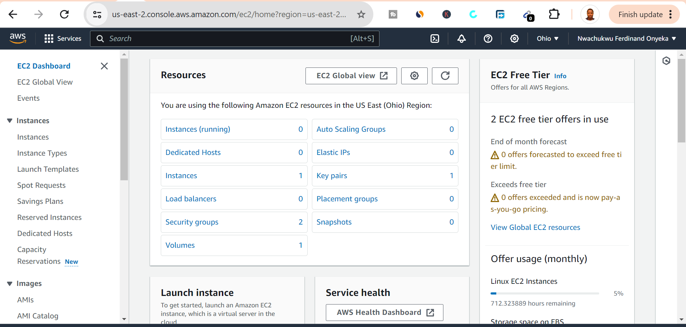
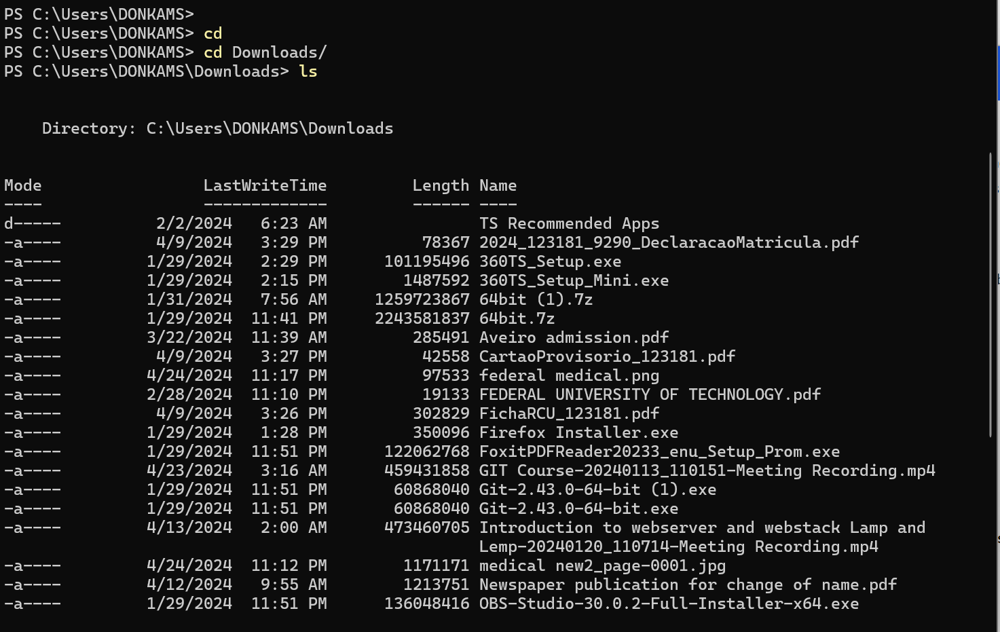
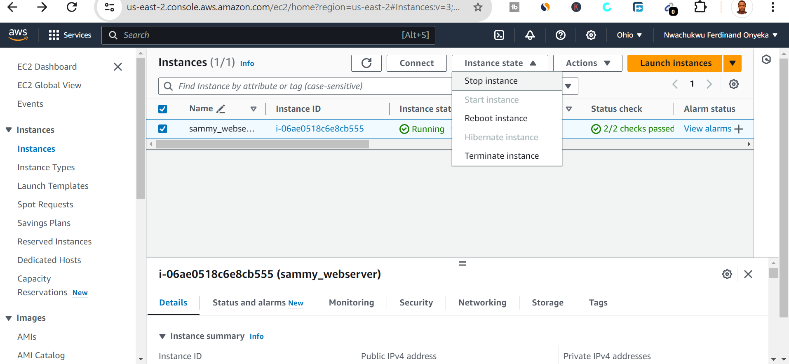

# Lamp Stack Implementation

The **LAMP stack** is a popular open-source software stack used for web development. 
LAMP stands for Linux, Apache, MySQL, and PHP, which are the key components of the stack. 
Here's a brief description of each component and how they work together in a LAMP stack implementation:

- Linux: Linux is the operating system that forms the foundation of the LAMP stack. It provides the underlying infrastructure and resources for hosting web applications. Linux is chosen for its stability, security, and open-source nature. Various distributions of Linux, such as Redhat, Ubuntu, CentOS, and Debian, are commonly used in LAMP stack implementations.
  
- Apache: Apache is a widely-used open-source web server software that serves as the HTTP server in the LAMP stack. Apache receives HTTP requests from clients (such as web browsers) and serves static and dynamic web content in response. It supports various features such as virtual hosting, SSL/TLS encryption, URL rewriting, and authentication.
  
- MySQL: MySQL is an open-source relational database management system (RDBMS) that serves as the database component of the LAMP stack. It provides a robust, scalable, and high-performance platform for storing and managing structured data. MySQL is commonly used for web applications that require data storage, retrieval, and manipulation, such as content management systems (CMS), e-commerce platforms, and web applications.

- PHP: PHP is a server-side scripting language that is used for developing dynamic web applications and generating dynamic web content. PHP scripts are executed on the server by the Apache web server, generating HTML output that is sent to the client's web browser. PHP integrates seamlessly with Apache and MySQL, allowing developers to build powerful and interactive web applications.
In a LAMP stack implementation, Linux provides the operating system environment, Apache serves as the web server, MySQL handles database operations, and PHP processes dynamic content. Together, these components form a powerful and versatile platform for developing and hosting a wide range of web applications, from simple websites to complex web-based systems.

## Preparing Prerequisites

### 1. AWS:
AWS, short for Amazon Web Services, is a comprehensive and widely-used cloud computing platform provided by Amazon. It offers a broad set of cloud services, including computing power, storage solutions, networking capabilities, databases, machine learning, artificial intelligence, analytics, developer tools, security features, and more.

Here are some key aspects and features of AWS:

- Compute Services: AWS provides various compute services, including Amazon Elastic Compute Cloud (EC2) for scalable virtual servers, AWS Lambda for serverless computing, Amazon Elastic Container Service (ECS) for container management, and more.

- Storage Solutions: AWS offers a range of storage options, such as Amazon Simple Storage Service (S3) for scalable object storage, Amazon Elastic Block Store (EBS) for block storage volumes, Amazon Glacier for long-term archival storage, and Amazon Elastic File System (EFS) for scalable file storage.

- Networking: AWS provides networking services, including Amazon Virtual Private Cloud (VPC) for creating isolated virtual networks, Amazon Route 53 for domain name system (DNS) management, Elastic Load Balancing for distributing incoming traffic, and more.

- Databases: AWS offers managed database services like Amazon Relational Database Service (RDS) for relational databases (MySQL, PostgreSQL, Oracle, SQL Server, etc.), Amazon DynamoDB for NoSQL databases, Amazon Redshift for data warehousing, and more.

- Developer Tools: AWS offers developer tools like AWS CodeCommit for version control, AWS CodeBuild for continuous integration, AWS CodeDeploy for automated deployments, AWS CodePipeline for continuous delivery, and more.
Security and Identity: AWS provides security services and features, including AWS Identity and Access Management (IAM) for managing user access and permissions, AWS Key Management Service (KMS) for encryption key management, AWS Certificate Manager for SSL/TLS certificates, and more.

- Analytics and Big Data: AWS offers analytics and big data services, such as Amazon EMR for big data processing, Amazon Athena for interactive query analysis, Amazon Kinesis for real-time data streaming, AWS Glue for data integration, and more.
AWS is known for its scalability, reliability, flexibility, and pay-as-you-go pricing model, making it a popular choice for businesses of all sizes, from startups to large enterprises, to build and deploy their applications and services in the cloud.

 

 The image above is the interface of the **aws** platform, after creating an instance, a private key was downloaded on a local host from **AWS** while setting up the server, It is a PEM file format. However, the PEM will be used to connect to our EC2 instance via **ssh.** 
 Thereafter, remenber to run the command below to have access to the downloaded private key, then connect ssh key from the instance server.

  

  ### 2. Connect to the Instance: you can connect to the server by running the command below.

  `ssh -i "sammy-ec2.pem" ubuntu@ec2-18-219-135-230.us-east-2.compute.amazonaws.com`

- It is adviseable to read the information about AWS `free tier limits` and make sure that the **EC2** instance stopped when it's not in use.
Below is the location to stop the intance.

  
