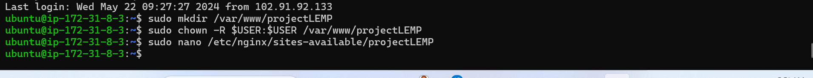
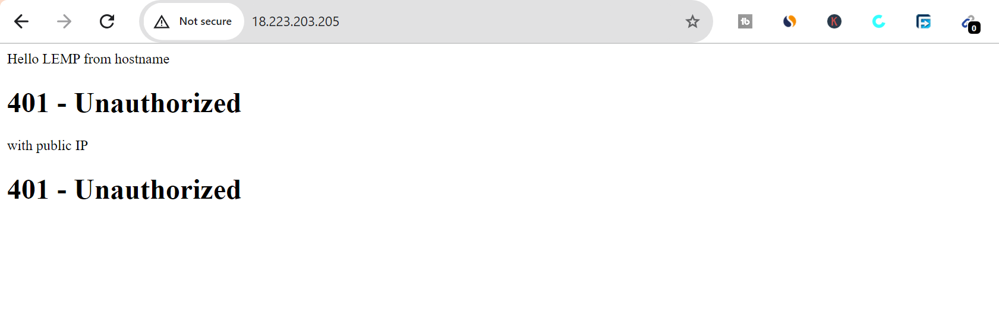
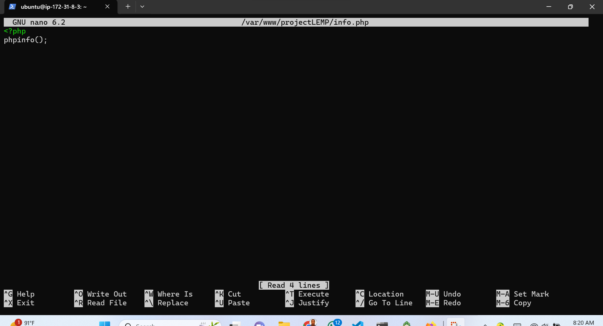
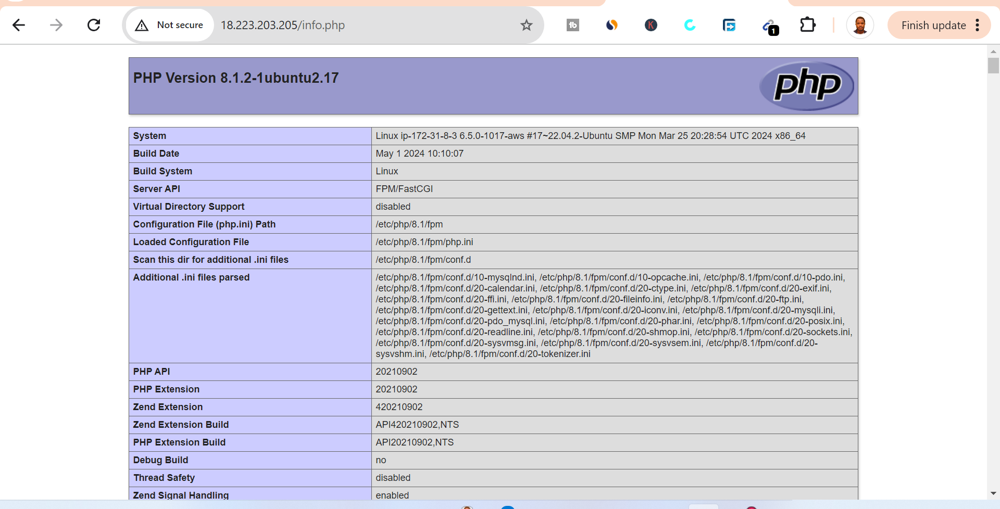
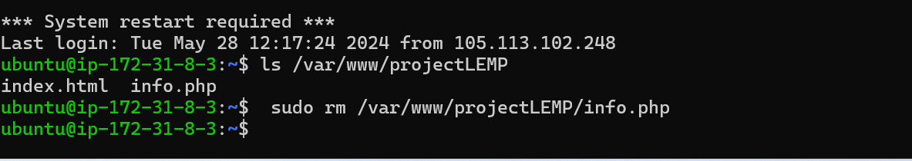
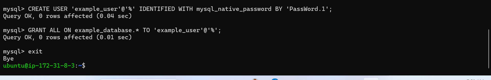
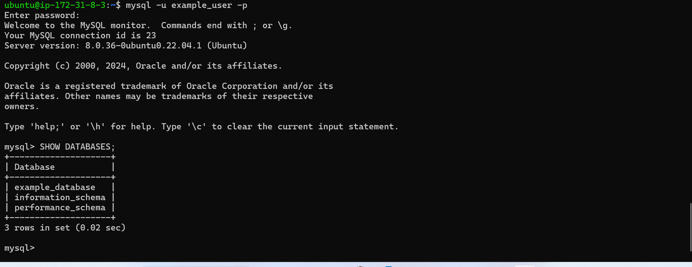
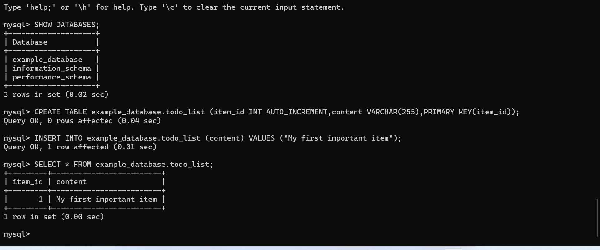
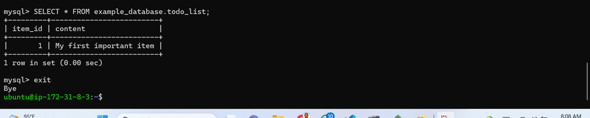

#  Web Stack Implementation (LEMP Stack)
Implementing a web stack involves setting up the necessary components for a web application to function. A typical web stack consists of four main components: the operating system, the web server, the database, and the programming language. One popular web stack is the LEMP stack, which includes Linux, Nginx, MySQL, and PHP. Here's a step-by-step guide to implementing a LAMP stack on an Ubuntu server:
First of all, I will run this command bellow on my Git Bash

`ssh -i "sammy-ec2.pem" ubuntu@ec2-3-138-120-20.us-east-2.compute.amazonaws.com`

 

## Installing the Nginx Web Server

### Step 1 - Installing the Nginx Web Server:

Nginx is for displaying of web pages to our visitors, therefore, we are going to employ high performance web server. I am going to use `apt` package manager to install this package.

- First of all, am going to start start updating my server package index by running the command below; `$ sudo apt update` and `sudo apt install nginx`

 

  
 

After the installation, then observe if it is green and running, which means the installation is correct and successfull.

- The command below is to show the installation status.
- `$ sudo systemctl status nginx`

 

Before we can receive any traffic by our Web Server, we need to open `TCP PORT 80` which is default port that web brouser use to access web pages in the internet. However, we all know, we have TCP port22 open by default on our EC2 machine to accces it via SSH, so we need to add a rule to EC2 configuration to open inbound connection through port 80:

 

After confirming the success running of our server,firstly, I will check how to access it locally in the Ubuntu shell by running the command bellow.

`$ curl http://localhost:80`
or 
`$ curl http://127.0.0.1:80`

 

 

Now, it's time to test how our Nginx server can respond to requests from the internet by Opening a web browser and try to access the following url.

`http://<public-IP-Address>:80`

 

## Installing MYSQL

### Step 2- Installing MYSQL

Now that I have my server up and running, I need to install a Database Management System (DBMS) to be able to manage data my site in a rational database.

However, I will use `apt` to acquire and install the software:

Bellow is the command to achieve that.

`$ sudo apt install mysql-server`

 

After the installation, log into the MYSQL console by typing the command bellow.

`$ sudo mysql`

 

To exit MYSQL shell with: run the command.
`mysql> exit`

Start the interactive script by running:

`$ sudo mysql_secure_installation`

 

 

 

 

After I have finished the installation, I have to test if I will be able to login to my MYSQL console by typing the command bellow:

`$ sudo mysql -p`

 

MYSQL Server is now installed and secured. Next. I will install PHP, the final component in the LEMP Stack Project.

#  Installing PHP

## Step 3 - Installing PHP

I have Nginx installed to serve my content and MYSQL installed to install and manage my data. Now am proceeding to install PHP to process code and generate dynamic content for the web server.

Nginx requires an external program to handle PHP processing and act as a bridge between the PHP interpreter itself and the web server. This allows for a better overall performance in most PHP-based websites, but it requires additional configuration. I will need to install `php-fpm`, which stands for PHP fast CGI process manager"  and tell Nginx to pass PHP requests to this software for processing. Additionally, you will need `php-mysql`, a PHP module that allows PHP to communicate with Mysql-based database. Core PHP packages will automatically bi installed as dependencies.

To install these 2 packages at once, I need to run the command bellow.

`$ sudo apt install php-fpm php-mysql`

 

#  Configuring Nginx to Use PHP Processor

### Step 4 - Configuring Nginx to Use PHP Processor

In this guide, I will use **ProjectLEMP** as an example domain name.
On Ubuntu 20.04, Nginx has one server block enabled by default and is configured to serve documents out of a directory at `/var/www/html`. for the your_domain website, leaving `/var/www/html` in place as the default directory to be served if a client request does not match any other sites.

Am creating the root web directory for `Your_domain` as follows:

`$ sudo mkdir /var/www/projectLEMP`

Next is to assign ownership of the directory with the $USER environment variable, which will refernce my current system user:

`$ sudo chown -R $USER:$USER /var/www/projectLEMP`

Thereafter, I have to open new configuration file in Nginx's `sites-availabel` directory using preferred command-line editor. Here, I will use `nano` :

`$ sudo nano /etc/nginx/sites-available/projectLemp`

I have to activate configuration by linking to the config file from Nginx's `sites-enabled` directory:

`$ sudo ln -s /etc/nginx/sites-available/projectLEMP /etc/nginx/sites-enabled/`

However, this will tell Nginx to use the configuration next time it is reloaded. I have to test my configuration for syntax errors by typing:

`$ sudo nginx -t`

 

Notice, If I want to disable default Nginx host that is currently configured to listen on port 80, then, I have to run this command bellow.

`sudo unlink /etc/nginx/sites-enabled/default`

If I have to reload Nginx, then I have to run this command:

`$ sudo systemctl reload nginx`

My new website is now active, but the web root/var/www/projectLEMP is still empty. I create an index.html file in this location so that I can test my new server block works as expected:

 

#  Testing PHP with Nginx

Step 5 - Testing PHP with Nginx
At this point LEMP stack is now completely installed and fully operational.
I have to create a test PHP file in my document root. I will open a new file called `info.php` within my document root in my text editor: run the command bellow.

`$ nano /var/www/projectLEMP/info.php`

 

Bellow is the assessment of web browser by visiting the domain name or the public IP address to view the set up in the Nginx configuration file.

If I have to remove the PHP environment and the Ubuntu server. Then, I can use `rm` to remove the file:

`$ sudo rm /var/www/domain/info.php`

#  Retrieving data from MYSQL database with PHP

### Step 6 - Retrieving data from MYSQL database with PHP.

In this phase I create a test database (DB) with simple "To do list" and configure access to it, so that the Nginx website would be able to query data from the **DB** and display it.

I will create a database named **example_database** and a user named **example_user** 

First, connect to the MYSQL console using the **root** account:

`$ sudo mysql`

Thereafter, I have to exit MYSQL shell with the command bellow:
 `Mysql> exit`

I have to test if the new user has the proper permissions by logging in to MYSQL console again, this time using the custom user credentials:

`$ mysql -u example_user -p`

Next, I will create a test table named **todo_list**. From the MYSQL console.

To confirm that the data was successfully saved to my table, I have to run:
`mysql> SELECT * FROM example_database.todo_list;`

The command below is the output:

After confirming that I have a valid data in my test table, then, I can exit the MYSQL console:

`mysql> exit`

