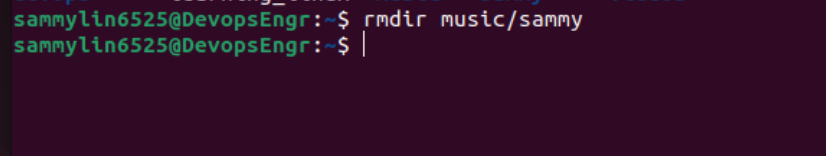
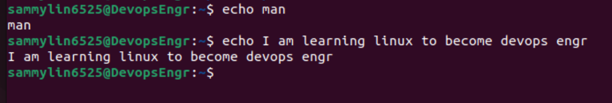
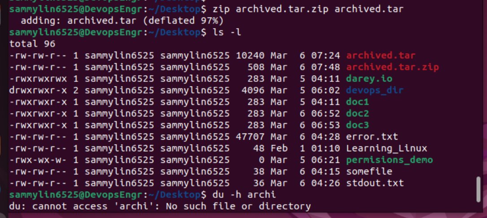

# 1. Linux
## Introduction to Linux
Linux is a free and open-source operating system kernel initially created by Linus Torvalds in 1991. It is widely used in various computing devices, from servers and supercomputers to smartphones and embedded systems. Linux is known for its stability, security, and flexibility, making it a popular choice for both individual users and enterprises.

### Here are some of the brief introduction to what ***Linux*** is all about.

### Open Source Nature: 
Linux is distributed under the GNU General Public License (GPL), which means its source code is freely available to anyone. This fosters a community-driven development model where developers worldwide can contribute to its improvement.

### Kernel: 
At its core, Linux comprises the kernel, which manages hardware resources, such as memory, CPU, and peripheral devices. The kernel interacts with user applications and system utilities to provide a complete operating environment.

### Distributions (Distros): 
Linux is not just one operating system but rather a family of operating systems, or distributions (distros), each tailored for specific purposes or user preferences. Popular distributions include Ubuntu, Debian, Fedora, CentOS, and Arch Linux.

### Command Line Interface (CLI): 
While Linux distributions typically offer graphical user interfaces (GUIs), the command line interface (CLI) remains a powerful and efficient way to interact with the system. The shell, such as Bash (Bourne Again Shell), is the primary interface for executing commands, managing files, and automating tasks.

### Package Management: 
Linux distributions employ package managers to simplify the installation, update, and removal of software packages. Package formats vary between distributions (e.g., DEB for Debian-based systems, RPM for Red Hat-based systems), but the concept remains consistent across most distros.

### File System Hierarchy: 
Linux follows a hierarchical file system structure, with directories organized in a tree-like fashion. Common directories include /bin (essential system binaries), /etc (system configuration files), /home (user home directories), and /var (variable data such as logs and temporary files).

### Multi-User and Multi-Tasking: Linux is inherently designed to support multiple users simultaneously, allowing several users to log in and run processes concurrently. It also supports multitasking, enabling multiple programs to run simultaneously on the system.

### Security: 
Linux is renowned for its robust security features, including user and group permissions, access control lists (ACLs), and robust firewall configurations. Regular security updates are provided by distribution maintainers to address vulnerabilities and enhance system security.

### Networking: 
Linux includes extensive networking capabilities, making it a popular choice for servers and networking devices. It supports various networking protocols, services (such as DHCP, DNS, and FTP), and utilities for network configuration and troubleshooting.

### Customizability and Flexibility:
One of Linux's greatest strengths is its flexibility and customizability. Users can tailor their Linux systems to meet specific requirements, choosing from a vast array of software packages, desktop environments, and system configurations.

**Learning Linux can be a rewarding journey, offering valuable skills in system administration, software development, and cybersecurity. Whether you're a beginner or an experienced user, Linux provides a powerful platform for exploration, innovation, and collaboration**.

  # FILE MANIPULATION
## 1. sudo command: 
The **sudo** command in Linux allows a permitted user to execute a command as the superuser or another user, as specified in the sudoers configuration file. The word "**sudo**" stands for "superuser do."

The commands on the images below are for **sudo**

The second command is an option on how to use **sudo**

## 2. pwd:
pwd stands for **"print working directory."** When you run the pwd command, it displays the current working directory, which is the directory in the file system where you are currently located or "working."

Here's how you use it:

/home/ubuntu/

## 3. cd command: 
The cd command in the command line stands for "change directory." It is used to change the current working directory in the shell.

Here's how you typically use it:

cd [directory]
For example, to change to a directory named "Documents," you would type:
**cd Documents**

## 4. ls command:
The **ls command** is used to list files and directories in a directory. It's one of the most commonly used commands in the command line interface.

Here's the basic syntax:

ls [options] [directory]     ls /path/to/directory

## 5. cat command:
The **cat command** short for "concatenate" and is primarily used to display the contents of files. It's one of the fundamental commands in the command line interface.

Here's the basic syntax:

cat [options] [file(s)]  or   cat file1.txt file2.txt

## 6. cp command:
The **"cp command"** is used to copy files and directories. It stands for "copy."

Here's the basic syntax:

cp [options] source destination
source: Specifies the file or directory you want to copy.
destination: Specifies the target location where you want to copy the file or directory.
If you're copying a single file, you would use cp like this:
 
For example, to copy a file named file1.txt to a directory named backup, you would use:

cp file1.txt backup/
If you're copying multiple files, you can specify them one after the other, followed by the destination directory. For example:

cp file1.txt file2.txt file3.txt backup/

## 7. mv command:
The mv command is used to move files or directories from one location to another. It can also be used to rename files or directories.

Here's the basic syntax:
mv [options] source destination
source: Specifies the file or directory you want to move or rename.
destination: Specifies the target location where you want to move the file or directory, or the new name if you're renaming.
If you're moving a single file, you would use mv like this:

mv sourcefile destination
For example, to move a file named file1.txt to a directory named backup, you would use:

mv file1.txt backup/
If you're moving multiple files, you can specify them one after the other, followed by the destination directory. For example:

## 8. mkdir command:
The **mkdir command** is used to create directories (folders). It stands for "make directory."

- Here's the basic syntax:

- mkdir [options] directory_name

## 9. rmdir command:
The **rmdir command** is used to remove empty directories (folders). It stands for "remove directory."

- Here's the basic syntax:

- rmdir [options] directory_name
  

## 10. rm command:
The rm command in Linux and Unix-like operating systems is used to remove files or directories. It stands for "remove."

Here's the basic syntax:

rm [options] file(s) or directory(s)

## 11. touch command:
The **touch command** is used to create empty files and update the timestamps of existing files. Its primary purpose is to change the access and modification timestamps of files, but if a file doesn't exist, touch will create it.

Here's the basic syntax:
touch [options] file(s)

## 12. locate command:
The **locate command** is used to quickly search for files and directories in the file system based on their names. It's a fast and efficient way to find files, especially when you know the name or part of the name but not the exact location.

Here's the basic syntax:
locate [options] pattern

## 13. find command:
The find command in Linux and Unix-like operating systems is a powerful tool for searching and locating files and directories in a file system hierarchy. It allows you to search for files based on various criteria such as name, type, size, permissions, and more.

Here's the basic syntax:

bash
Copy code
find [options] [starting_directory] [expression]

## 14. grep command:
The **grep command** in Linux and Unix-like operating systems is a powerful tool used for searching text patterns within files or command output. It stands for "global regular expression print."

Here's the basic syntax:
grep [options] pattern [file(s)]

## 15. df command:
The **df command** is used to display disk space usage statistics for file systems. It stands for "disk free."

Here's the basic syntax:
df [options] [file_system(s)]

## 16. du command:
The **du command** is used to estimate file and directory space usage. It stands for "disk usage."

Here's the basic syntax:

- du [options] [file(s) or directory(s)]

## 17. head command:
The **head command** is used to display the beginning lines of a file or files. By default, it displays the first 10 lines of each specified file. It's particularly useful for quickly previewing the contents of a file.

Here's the basic syntax:
- head [options] [file(s)]

## 18. tail command:
The **tail command** is used to display the last part of a file or files. By default, it displays the last 10 lines of each specified file. It's particularly useful for monitoring log files and viewing recent updates to files.

Here's the basic syntax:

- tail [options] [file(s)]

## 19. diff command:
The **diff command** is used to compare the content of two files line by line and display the differences between them. It's commonly used for file comparison and finding changes between different versions of files.

Here's the basic syntax: 
- diff [options] file1 file2

## 20. tar command:
The **tar command** is used for creating, viewing, extracting, and manipulating tar archives. A tar archive is a collection of files bundled together, typically used for creating backups or distributing files.

Here's the basic syntax:
tar [options] [archive_filename] [file(s) or directory(s)]

# FILE PERMISSIONS AND OWNERSHIP

## 21. chmod command:
The **chmod command** is used to change the permissions of files and directories. It stands for "change mode."

Here's the basic syntax:
- chmod [options] mode file(s) or directory(s)

## 22. chown command:
The **chown command** is used to change the ownership of files and directories. It stands for "change owner."

Here's the basic syntax:
chown [options] new_owner[:new_group] file(s) or directory(s)

 
## 23. jobs command:
In Unix-like operating systems, the **jobs command** is used to display the status of jobs running in the background within the current shell session. Jobs are processes started from the shell that can run asynchronously, either in the foreground or the background.

Here's how you can use the jobs command:
jobs [options]

## 24. kill command:
The **kill command** is used to terminate processes by sending signals to them. It's a versatile tool for managing processes, allowing you to gracefully shut them down or forcefully terminate them if needed.

Here's the basic syntax:
- kill [options] PID(s)

## 25. ping command:
The **ping command** is used to test the reachability of a host on an Internet Protocol (IP) network and to measure the round-trip time (RTT) for packets sent from the local host to a destination host.

Here's the basic syntax:
- ping [options] destination

## 26. wget command:
The **wget command** in Linux and Unix-like operating systems is used to download files from the internet. It's a versatile tool capable of downloading files via various protocols, including HTTP, HTTPS, FTP, and FTPS. wget supports resuming interrupted downloads, recursive downloading of directories, and downloading files in the background.

Here's the basic syntax:
wget [options] [URL(s)]

## 27. uname command:
The **uname command** in Unix-like operating systems is used to print system information about the machine and operating system.

Here's the basic syntax:
uname [options]

## 28. top command:
The **top command** is used to display real-time information about running processes and system resource usage. It provides an interactive interface that continuously updates to show information such as CPU usage, memory usage, and process information.

When you run the top command without any options, it displays a dynamic view of running processes, sorted by CPU usage by default. Here's an example output:

yaml
Copy code
top - 20:14:28 up 3 days,  5:12,  1 user,  load average: 0.10, 0.08, 0.09
Tasks: 101 total,   1 running,  69 sleeping,   0 stopped,   0 zombie
%Cpu(s):  0.3 us,  0.1 sy,  0.0 ni, 99.6 id,  0.0 wa,  0.0 hi,  0.0 si,  0.0 st
KiB Mem :  8099228 total,  1979816 free,  4329712 used,  1797700 buff/cache
KiB Swap:  2097148 total,  2097148 free,        0 used.  3077248 avail Mem 

  PID USER      PR  NI    VIRT    RES    SHR S  %CPU %MEM     TIME+ COMMAND             
 3747 user      20   0 2729496 440304  37596 S   0.7  5.4  16:18.50 firefox             
 2845 user      20   0  768372 156936  68480 S   0.3  1.9   3:02.17 gnome-terminal-     
 1766 root      20   0  260704   7124   5168 S   0.0  0.1   0:21.38 systemd-journal

 
 ## 29. history command:
 The **history command** is used to display a list of previously executed commands in the current shell session. It provides a convenient way to view and recall command-line history.

Here's how you can use the history command:

- history [options]

## 30. man command:
The **man command** is used to display the manual pages (documentation) for various commands, utilities, and system functions. It provides detailed information about the usage, options, and functionality of specific commands or system components.

Here's how you can use the man command:

man [options] [command]

## 31. echo command:
The **echo command** in Unix-like operating systems is used to display a line of text or a string of characters on the terminal.

## 32. zip, unzip command:
The **zip command** is used to compress files into a compressed archive in ZIP format. ZIP is a popular compression and archive format widely supported across different operating systems.

Here's the basic syntax:
zip [options] zipfile.zip file(s) or directory(s)

## 33. hostname command:
The **hostname command** is used to display or set the hostname of the system.

Here's how you can use the hostname command:

To display the current hostname:
- hostname

## 34. useradd, userdel commands:

