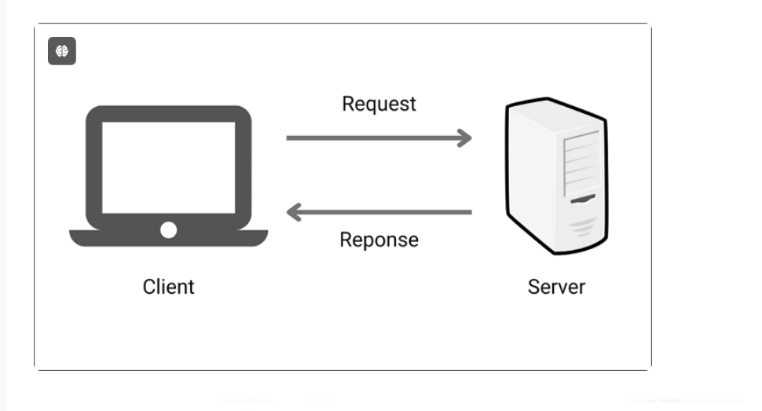
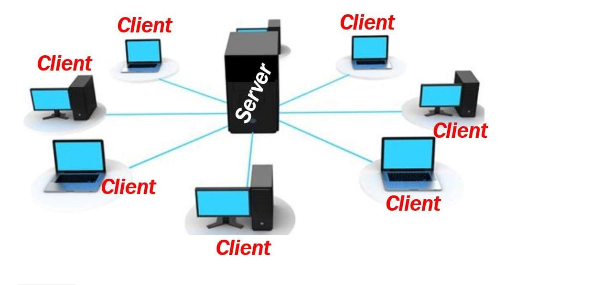
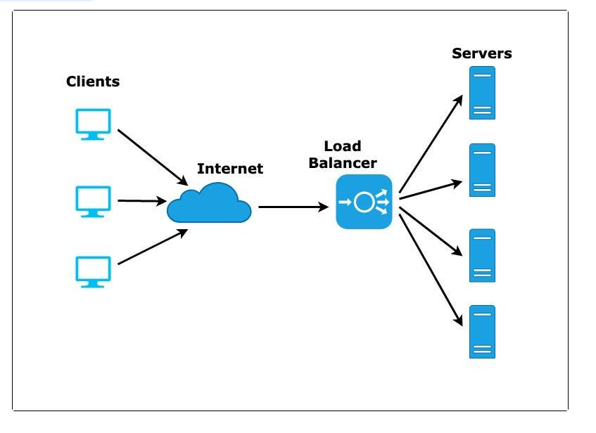

# Load Balancer and Auto-Scaling Group in AWS

### Load Balancer and AutoScailing group mini project. 

Today, I'm Exploring two essential tools in AWS:Load Balancers and Auto Scaling Groups. Imagine Load Balancers as traffic directors, making sure every visitor to my website gets where they need to go without any jams. And when the crowd starts pouring in, Auto scaling Groups kick into gear, bringing in extra servers to handle the rush. But before I jump in, let's get comfy with some basic cloud networking concepts. Ready to get started? Let's do this!

# Project Goals:

- Understand the concepts of High Availability and Scalability in cloud computing.

- Learn about Load Balancers and Auto sScaling Groups in AWS.

- Gain practical experience in setting up an Application Load Balancer (ALB) and configuring Auto scaling Groups (ASG) in AWS.

- Explore the importance of load balancing and auto-scaling in maintaining the reliability, availability, and performance of web applications.

# Learning Outcomes:

- Understand the concepts of High Availability, Scalability, Load Balancers, and Auto Scaling Groups.

- Learn how to create target groups and setup an Application Load Balancer to evenly distribute incoming traffic ac
ross multiple servers.

- Gain Knowledge of configuring Auto Scaling Groups to automatically adjust the number of instances based on demand.

Acquire troubleshooting skills to identify and resolve issues related to connectivity, security groups, and instance health in AWS.

What is High Availability?

Scalability is like being able to handle growth without breaking a sweat. Imagine I have a small bakery, and suddenly, I have to get a lot more customers than expected. Scalability means I can quickly bake more bread and pastries without the bakery falling apart. In tech, It's similar to set up my systems so that they can handle more and more users or customers without crashing or slowing down. So, whether it's adding more servers to my website during a big sale or making sure my app can handle a sudden surge in downloads, scalability ensure everything runs smoothly.

Let's understand some terms before going ahead with our practical.

1. Server: It's like a big computer that stores and shares stuff, like websites or apps, with other computers.

2. Client: This is my computer or phone, asking the server for stuff, like loading a web page or using an app.

3. Traffic: Think of the "busy road" as the network infrastructre, like highways and streets, that connects servers (where websites and apps are hosted) to clients (like my computer or phone). It's where data packets travel back and forth, carrying information between the servers and the clients.

4. Redundancy: This is like having backups for importance stuff, just in case something breaks. It's like having spare parts for my bike so that I can keep riding even if something
breaks.

5. Server Load: Imagine a server like a superhero carrying heavy bags of data. Server load is like how heavy those bags are. Too many bags can slow the superhero down!

6. Routing: Routing refers to the process of determining the best path for data packets to travel from their source (like a server) to their destination (like a client devices). It's like finding the most efficient route on a map to reach my destination while avoiding traffic jams and roadblocks. Routing ensures that data packets reach their intended destination quickly and reliably across the network.

# What is Load balancer?

- Imagine, I have a popular restaurant with only one cashier. As the day goes goes on, more and more customers start coming in, lining up to place their orders. Eventually, the line gets so long that customers become frustrated, dome may even leave without ordering, and the cashier gets overwhelmed trying to handle all the orders.

- A load balancer is like adding more cashier to the restaurant to help manage the increasing number of customers. It's a specialized device or software that evenly distribute incoming network traffic or workload across multiple servers or resources.

- So, I can say that a load balancer helps spread the workload across several servers, ensuring that no single server gets overwhelmed with too much traffic or requests. This not only improves the performance and response time of the system but also increase its reliability and availability. If one server goes down,the load balancer can redirect traffic to the remaining servers, minimizing downtime and ensuring that the service remains.

**Why is a load balancer important, and what could happen if we don't use it?**

- Imagine my website is like a bustling restaurant, and each visitor is a hungry customer lining up to place an order. Just like how a single cashier would struggle to handle a long line of customers, a single server for my website would struggle to handle too many visitors at once.

- That's where the load balancer comes in! It's like hiring extra cashiers for my restaurant. The load balancer helps spread out all those incoming visitors accross multiple servers, so no single server gets overwhelmed. Thsi keeps things running smoothly, and visitors don't have to wait forever to see my website.

- But what I didn't have a load balancer? well, It's d be like trying to run a restaurant with just one cashier on a super busy day. The line would get longer and longer, customers would get frustrated and might leave without ordering. And worst of all, my cahsier would be stressed out and might even crash under the pressure.

- Similarly, without a load balancer, my website could slow down or even crash when too many people try to visit it at once. Visitors would get error messages instead of seeing my awesome website, and I could end up losing customers and business.

So, in simple terms, a load balancer is lkie having extra cashiers for my website, making sure everything runs smoothly even when lots of people are trying to visit it at the same time.

**Types of Load balancer**

In AWS, there are mainly four types of load balancers:

1. Application Load Balancer

2. Network Load Balancer

3. Classic Load Balancer

4. Gateway Load Balancer

In this project, I will exclusively focus on the Application Load Balancer.

# What is an Application Load Balancer?

Imagine I have a website that's gettinga lot of visitors. When someone visits my website, their request needs to be send to one of my website's server to show them the webpage they want. Now, if I have multiple servers running my website, I need a way to decide which server should handle each request. That's where an Application Load Balancer (ALB) comes in.

Think of an ALB as a traffic cop for my website. It sits in front of my servers and receives all the incoming requests from users. when a user wants to visit your websites, their request goes to the ALB first.

But how does the ALB decide which server should handle each request? It uses a set of rules that my define. These rules can be based on things like the URL the user wants to visit, the type of request (like HTTP or HTTPS), or even custom conditions you specify.

Once the ALB decides which server should handle the request, it sends the request to that server. This helps distribute the incoming traffic evenly among all my servers, so no single server gets overloaded.

- But ALBS don't just send requests to servers blindly. They also monitor the health of your servers. If a server goes down or becomes unhealthy for some reason, the ALB stops sending requests to that server until it's back up and running properly. This helps ensure that my website stays reliable and available even if one of my servers has issues.

- An Application Load Balancer (ALB) works at Layer 7 of the OSI model, which is the application layer. This is what makes it different  from other load balancers. Because it works at layer 7, the ALB can make smart decisions based on the actual content of the web traffic. for Example, if a request comes in for "www.gatogrowfast.net/login," the ALB can send it to a server that handles login requests. If another request comes in for www.gatogrowfast.net/shop," it can route that to a different server that deals with the shopping section. This ability to understand and manage different types of traffic helps improve how well your applications run.

- So, in simple terms, an Application Load Balancer is like a traffic cop for your website, directing imcoming requests to the right servers based on predefined rules, and making sure everything runs smoothly and efficiently.

**Note-** The OSI model is a framework used to understand how different network protocols interact. It has seven layers: Physical, Data Link, Network, Transport, Session, Presentation, and Application. Each layer has a specific role, like how data is transmitted, routed, and presented to users. The Application Load Balancer (Layer 7), allowing it to make decisions based on the content of the data.  

