# Mini Project - EC2 Module and Security Group Module with Apache2 UserData

## Mini Project: EC2 Module and Security Group Module with Apache2 UserData


### Purpose: 

In this mini project, you will use Terraform to create modularized configurations for deploying an EC2 instance with a specified Security Group and Apache2 installed using UserData.


### Objectives:

1. Terraform Module Creation:


    - Learn how to create Terraform modules for modular infrastructure provisioning.

2. EC2 Instance Configuration:

    - Configure Terraform to create an EC2 instance.

3. Security Group Configuration:

    - Create a separate module for the Security Group associated with the EC2 instance.

4. UserData Script:

    - Utilize UserData to install and configure Apache2 on the EC2 instance.


# Project Tasks:

### Task 1: EC2 Module

1. Create a new directory for your Terraform project (e.g., `terraform-ec2-apache`).


2. Inside the project directory, create a directory for the EC2 module (e.g., `module/ec2`).


3. Write a Terraform module (`module/ec2/main.tf`) to create an EC2 instance.


### Task 2: Security Group Module


1. Inside the Project directory, create a directory for the Security Group module (e.g., `modules/security_group`).

2. Write a Terraform module (modules/security_group/main.tf) to create a Security Group for the EC2 instance.


### Task 3: UserData Script

1. Write a UserData Script to install and configure Apache2 on the Ec2 instance. Save it as a separate file (e.g., `apache_userdata.sh`).


2. Ensure that the UserData Script is executable (`chmod +x apache_userdata.sh`).


### Task 4: Main Terraform Configuration

1. Create the main Terraform Configuration file (`main.tf`) in the project directory


2. Use the EC2 and Security Group modules to create the necessary infrastructure for the EC2 instance.


Task 5: Deployment

   1. Run `terraform init` and `terraform apply` to deploy the EC2 instance with Apache2.

   2. Access the EC2 instance and verify that Apache2 is installed and running.


   Instructions:


   1. Create a new directory for your terraform project using a terminal (`mkdir terraform-ec2-apache`).

    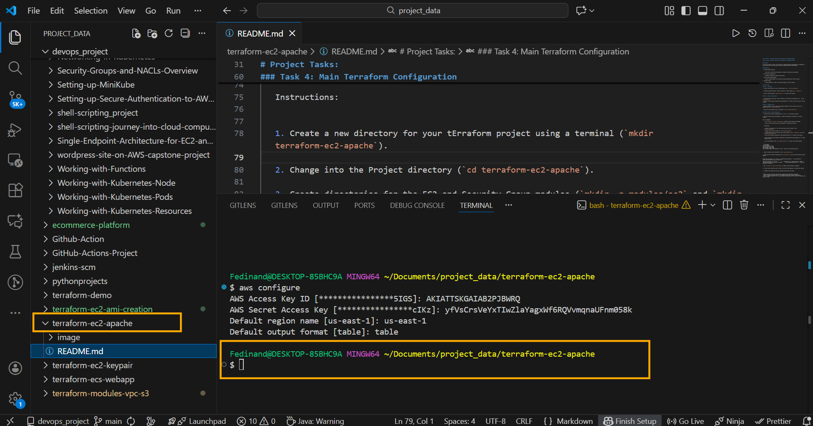

   2. Change into the Project directory (`cd terraform-ec2-apache`).

   3. Create directories for the EC2 and Security Group modules (`mkdir -p modules/ec2` and `mkdir -p modules/security_group`).

   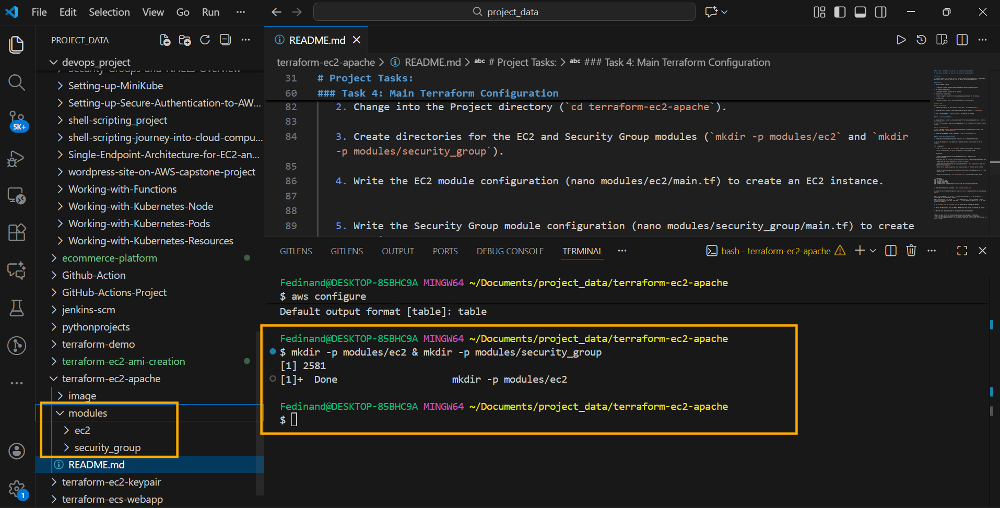

   4. Write the EC2 module configuration (nano modules/ec2/main.tf) to create an EC2 instance.

  ### Create the EC2 Module directory.

  From the root of my terraform project:

  `mkdir -p modules/ec2`

  ### Create the EC2 Module files

```
   modules/ec2/
├── main.tf
├── variables.tf
└── outputs.tf
```

### Modules/ec2/main.tf (EC2 Instance)
Create and open the file:

`nano modules/ec2/main.tf`

Paste the script snippet inside the file created above.

```
resource "aws_instance" "this" {
  ami                    = var.ami_id
  instance_type          = var.instance_type
  subnet_id              = var.subnet_id
  vpc_security_group_ids = var.security_group_ids
  key_name               = var.key_name

  tags = {
    Name = var.instance_name
  }
}
```

### Modules/ec2/variables.tf

`nano modules/ec2/variables.tf`

Paste the script snippet inside the variable file

```
variable "ami_id" {
  description = "AMI ID for EC2"
  type        = string
}

variable "instance_type" {
  description = "EC2 instance type"
  type        = string
}

variable "subnet_id" {
  description = "Subnet ID"
  type        = string
}

variable "security_group_ids" {
  description = "Security group IDs"
  type        = list(string)
}

variable "key_name" {
  description = "EC2 key pair name"
  type        = string
}

variable "instance_name" {
  description = "EC2 instance name"
  type        = string
}
```


### modules/ec2/output.tf

`nano modules/ec2/outputs.tf`

Paste the script snippet below inside the file above.

```
output "instance_id" {
  value = aws_instance.this.id
}

output "public_ip" {
  value = aws_instance.this.public_ip
}
```

5. Write the Security Group module configuration (nano modules/security_group/main.tf) to create a Security Group.

### Create the Security Group Module Directory

`mkdir -p modules/security_group`


### Create modules/security_group/main.tf

`nano modules/security_group/main.tf`

```
resource "aws_security_group" "this" {
  name        = var.name
  description = var.description
  vpc_id      = var.vpc_id

  ingress {
    description = "Allow HTTP"
    from_port   = 80
    to_port     = 80
    protocol    = "tcp"
    cidr_blocks = ["0.0.0.0/0"]
  }

  ingress {
    description = "Allow HTTPS"
    from_port   = 443
    to_port     = 443
    protocol    = "tcp"
    cidr_blocks = ["0.0.0.0/0"]
  }

  ingress {
    description = "Allow SSH"
    from_port   = 22
    to_port     = 22
    protocol    = "tcp"
    cidr_blocks = ["0.0.0.0/0"]
  }

  egress {
    description = "Allow all outbound traffic"
    from_port   = 0
    to_port     = 0
    protocol    = "-1"
    cidr_blocks = ["0.0.0.0/0"]
  }

  tags = var.tags
}
```

### Create modules/security_group/variables.tf

`nano modules/security_group/variables.tf`

```
variable "name" {
  description = "Security group name"
  type        = string
}

variable "description" {
  description = "Security group description"
  type        = string
}

variable "vpc_id" {
  description = "VPC ID"
  type        = string
}

variable "tags" {
  description = "Tags for the security group"
  type        = map(string)
  default     = {}
}
```

### Create Modules/security_group/outputs.tf

`nano modules/security_group/outputs.tf`

```
output "security_group_id" {
  value = aws_security_group.this.id
}

output "security_group_name" {
  value = aws_security_group.this.name
}
```
 
6. Write the UserData script (`nano apache_userdata.sh`) to install and configure Apache2


```
   #!/bin/bash
sudo yum update -y
sudo yum install -y httpd
sudo systemctl start httpd
sudo systemctl enable httpd
echo "<h1>Hello World from $(hostname -f)</h1>" | sudo tee /var/www/html/index.html
```

```
#!/bin/bash
apt update -y
apt install -y apache2
systemctl start apache2
systemctl enable apache2
echo "<h1>Hello World from $(hostname -f)</h1>" > /var/www/html/index.html
```

Below is what I finally used to execute my work.


```
#!/bin/bash
apt update -y
apt install -y apache2

systemctl start apache2
systemctl enable apache2

# Overwrite the default page
cat <<EOF > /var/www/html/index.html
<!DOCTYPE html>
<html>
<head>
  <title>Terraform Apache Server</title>
</head>
<body>
  <h1>Hello World from Terraform DevOps Learning!</h1>
  <p>Hostname: $(hostname -f)</p>
</body>
</html>
EOF
```

7. Make the UserData script executable (`chmod +x apache_userdata.sh`).

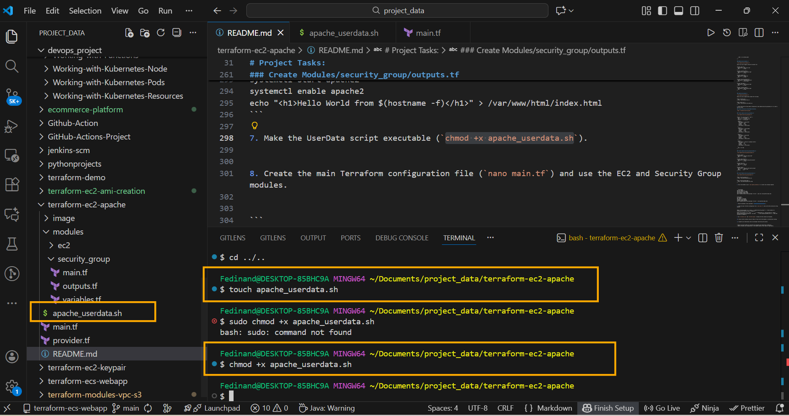

8. Create the main Terraform configuration file (`nano main.tf`) and use the EC2 and Security Group modules.

```
module "security_group" {"\n  source = \"./modules/security_group\"\n  // Add variables for customizing the Security Group if needed\n"}

module "ec2_instance" {"\n  source          = \"./modules/ec2\"\n  security_group_id = module.security_group.security_group_id\n  user_data       = file(\"apache_userdata.sh\")\n  // Add other variables as needed\n"}
```

Below is the properly formate version of the script.

```
module "security_group" {
  source = "./modules/security_group"

  # Add variables for customizing the Security Group if needed
}

module "ec2_instance" {
  source = "./modules/ec2"

  security_group_id = module.security_group.security_group_id
  user_data         = file("${path.module}/apache_userdata.sh")

  # Add other variables as needed
}
```

9. Run `terraform init` and `terraform apply` to deploy the EC2 instance with Apache2.

```
terraform init
terraform validate
terraform plan
terraform apply
```

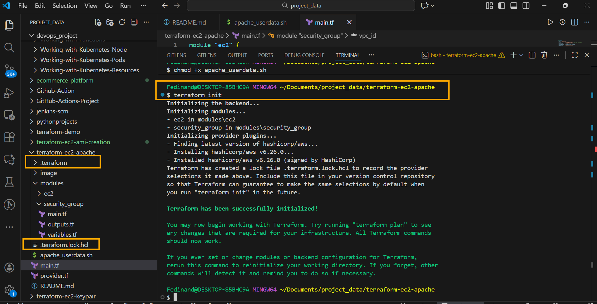


The Next is **Terraform Validate**

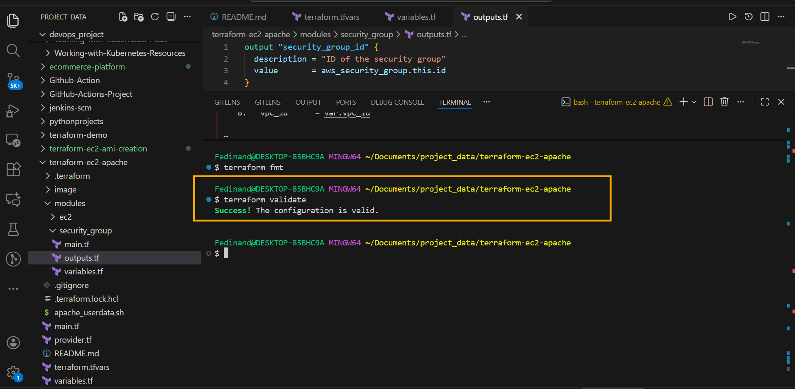


The Next is **Terraform Plan**

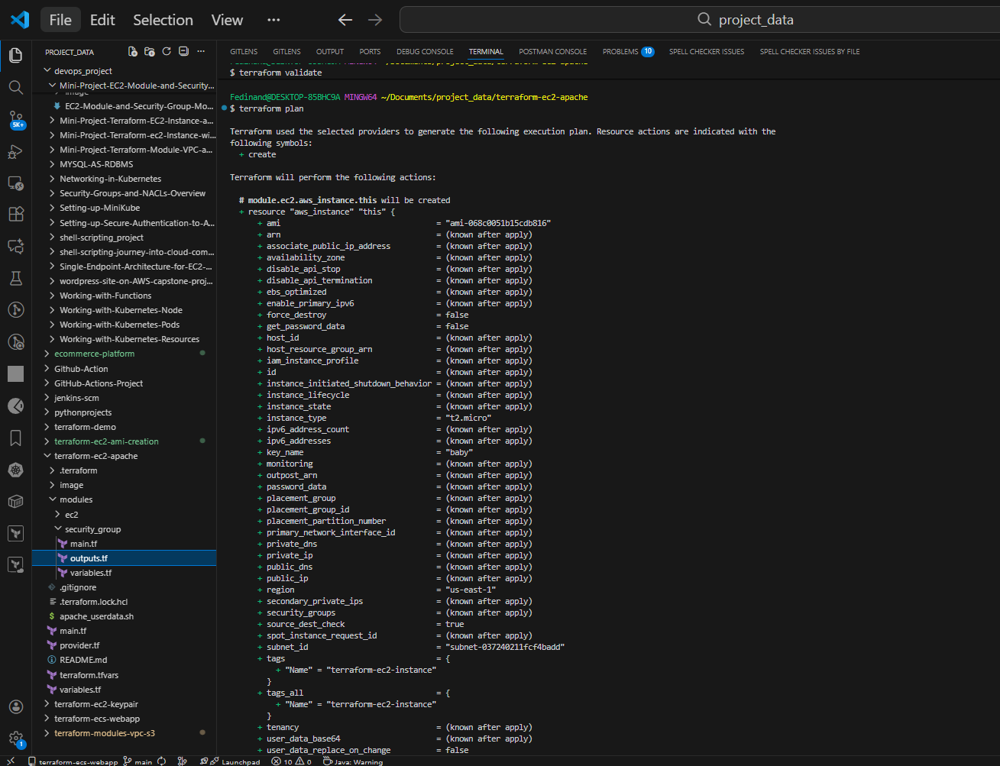

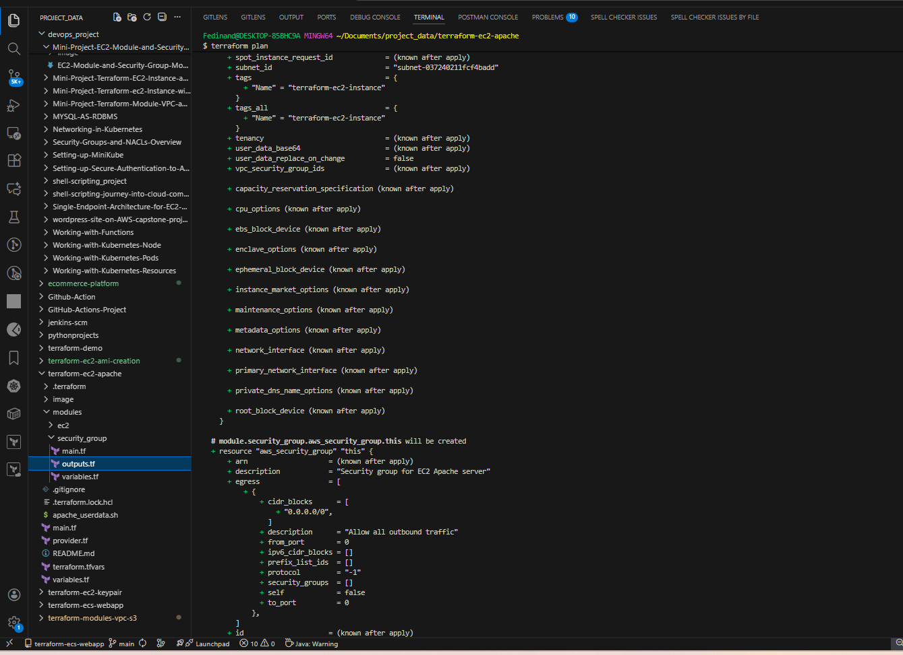


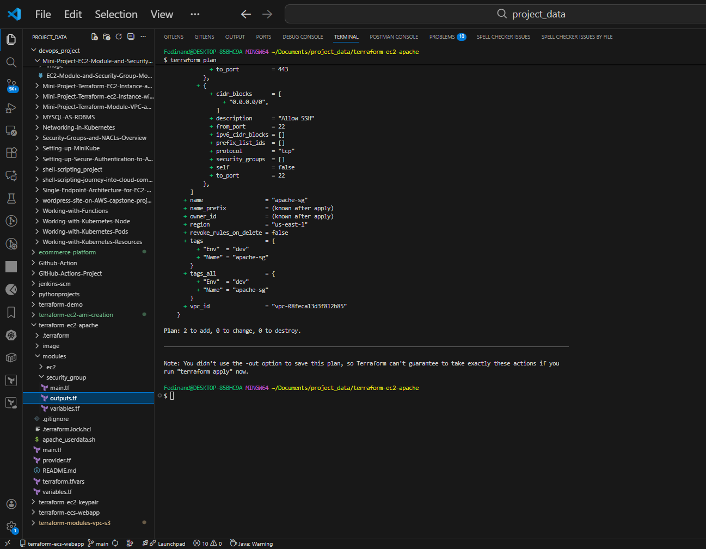


The Next Is **Terraform Apply**

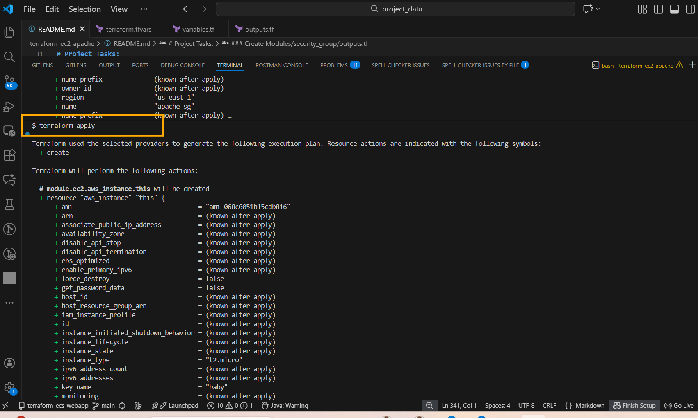

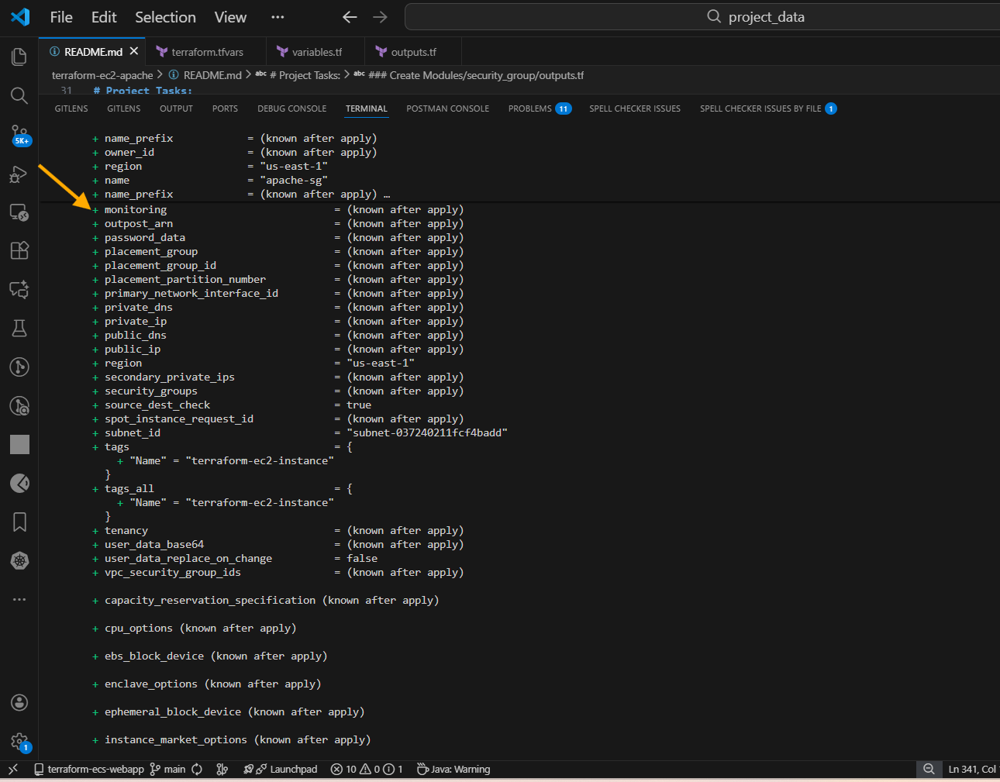


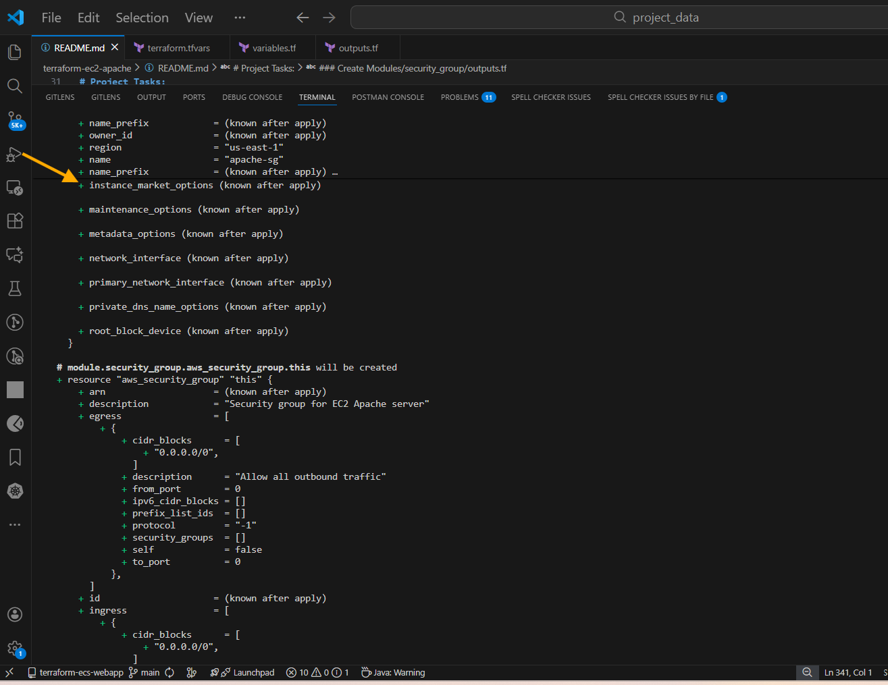

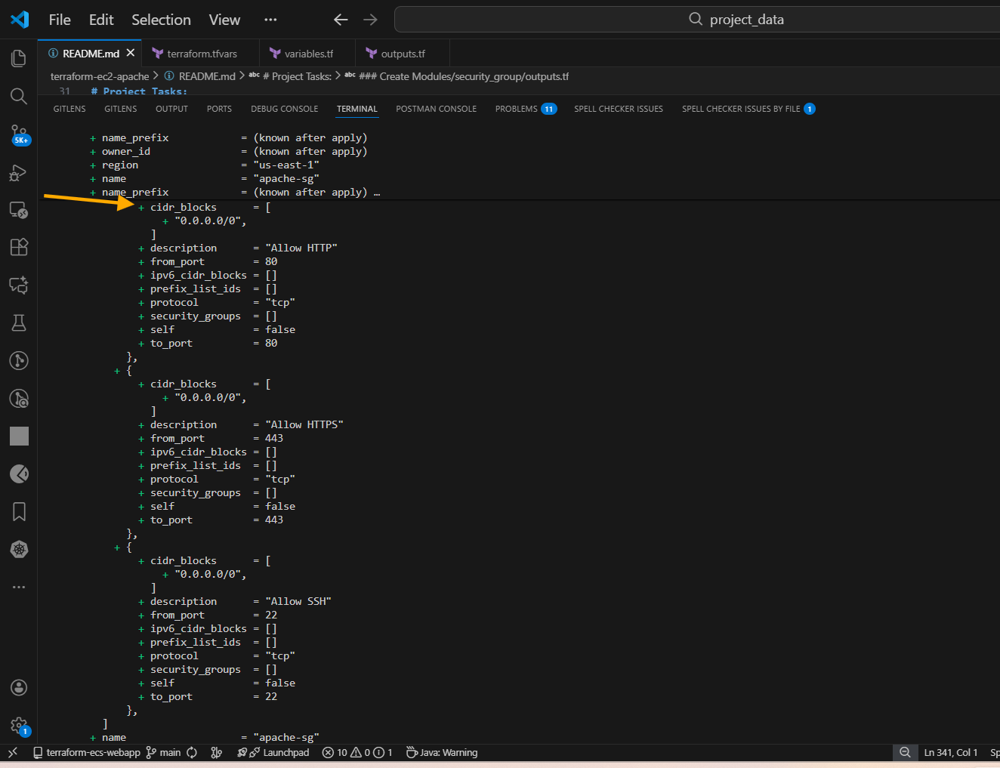

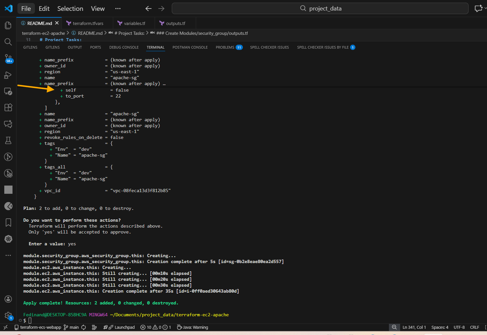


The Image below show the deployment of the **EC2 and Security_group Infrastructure** Via Terraform apply.

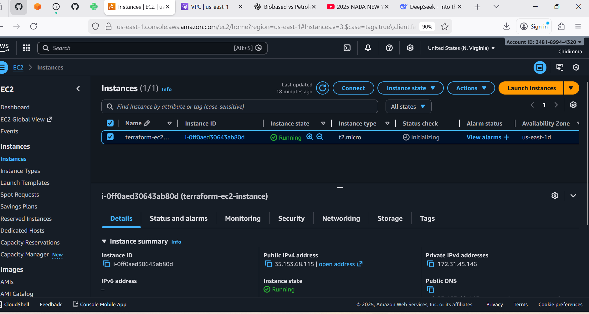

10. Access the EC2 instance using its Public IP and verify that Apache2 is installed and running.

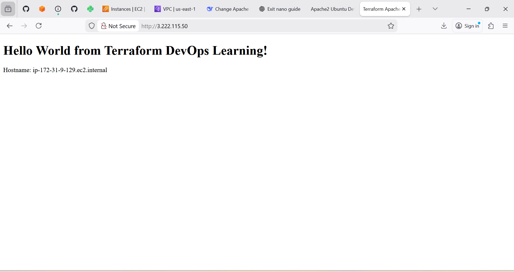

11. Document your observations and any challenges faced during the project.


```
- Ensure you have the AWS CLI installed and configured with appropriate credentials.
- Modify variables and configurations in the modules based on your specific requirements.
- This is a learning exercise; use it to gain hands-on experience with Terraform, EC2, UserData, and Security Groups.
```
