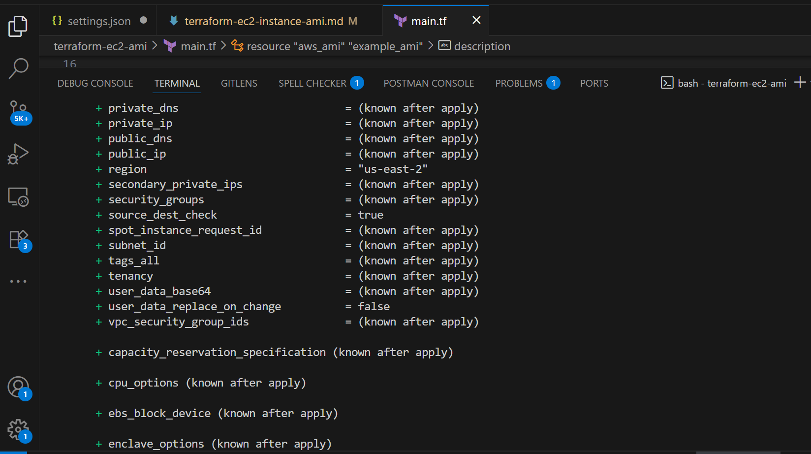

# Mini-Project-Terraform EC2 Instance and AMI Creation.


### Mini Project: Terraform EC2 Instance and AMI Creation.

**Purpose:**


In this mini project, you will use Terraform to automate the creation of an EC2 instance on AWS and then create an Amazon Machine Image (AMI) from that instance.


### Objectives:

1. Terraform Configuration:

    - Learn how to write basic Terraform configuration files.


2. EC2 Instance Creation:

    - Use Terraform to create an EC2 instance on AWS.

3. AMI Creation:

    - Automate the creation of an AMI from the created EC2 instance.


**Project Tasks:**
 
 **Task 1: Terraform Configuration for EC2 Instance**

 1. Create a new directory for your Terraform project(e.g., `terraform-ece2-ami`).


 2. Inside the Project directory, create a Terraform configuration file (e.g., `main.tf`).

 3. Write Terraform code to create an EC2 instance. Specify instance type,key pair, security group, etc.


 4. Initialize the Terraform using the command: `terraform init`.

 
 5. Apply the Terraform configuration to create the EC2 instance using the command: `terraform apply`.


 **Task 2: AMI Creation**

 1. Extend your Terraform configuration to include the creation of an AMI.


 2. Use Provisioners in Terraform to execute commands on the EC2 instance after it's created. Install necessary packages or perform any setup required. 


 3. Configure Terraform to create an AMI form the provisioned EC2 instance.


 4. Apply the update Terraform configuration to create the AMI using the command: `terraform apply`. 


 **Instructions:**


 1. Create a new directory for your Terraform project using a terminal (`mkdir terraform-ec2-ami`).


 2. Change into the project directory (`cd terraform-ec2-ami`).


 3. Create a Terraform configuration file (`nano main.tf`).


 4. Copy and paste the sample Terraform configuration template into your file.

Note, It's either you configure the terraform via the process above or by creating "IAM" user account from the server then configure it locally on the remote computer "CLI"
Below is the process and the sample script.


```
provider "aws" {"\n  region = \"us-east-1\"  # Change this to your desired AWS region\n"}

resource "aws_instance" "example_instance" {"\n  ami           = \"ami-0c55b159cbfafe1f0\"  # Specify your desired AMI ID\n  instance_type = \"t2.micro\"\n  key_name      = \"your-key-pair\"  # Specify your key pair name\n\n  // Add other necessary configuration for your instance (e.g., subnet, security group, etc.)\n"}

resource "aws_ami" "example_ami" {"\n  name        = \"example-ami\"\n  description = \"Example AMI created with Terraform\"\n  instance_id = aws_instance.example_instance.id\n\n  // Add any additional settings or configuration for your AMI\n"}

```

5.  Save the file and initialize the Terraform project using `terraform init`.


After terraform init,then the next is "terraform plan" the terraform plan will highlight all the deployment process.





6.  Apply the Terraform configuration using `terraform apply` and confirm the creation of the EC2 instances and AMI. 


7.  Experiment with modifying the configuration, such as changing instances type or adding additional resources. 

After creating and configuration infrastructure architecture on the server via "Iac" tools you can destroy with just one command as "terraform destroy"


8.  Documents your observations and any challenges faced during the project.


**Side Note:**


```
- Ensure you have the AWS CLI installed and configured with appropriate credentials.
- The provided AMI ID is just an example; replace it with the ID of a suitable AMI in your desired region.
- Be cautious with AWS resources to avoid unnecessary charges.
- This is a learning exercise; use it to gain hands-on experience with Terraform for infrastructure as code.
```


