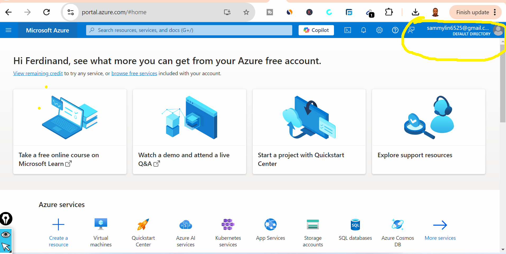
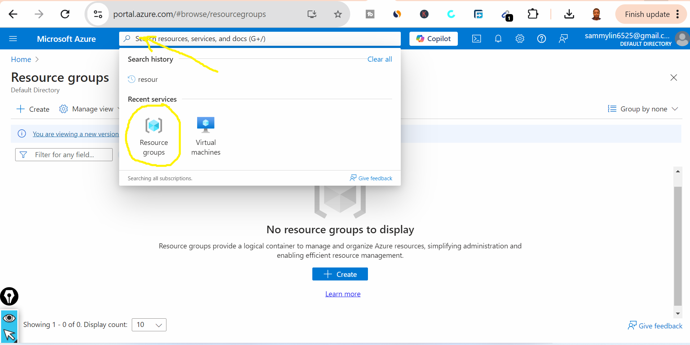
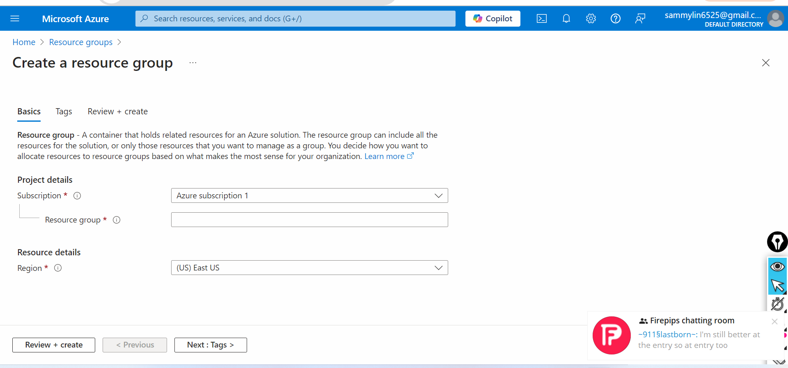
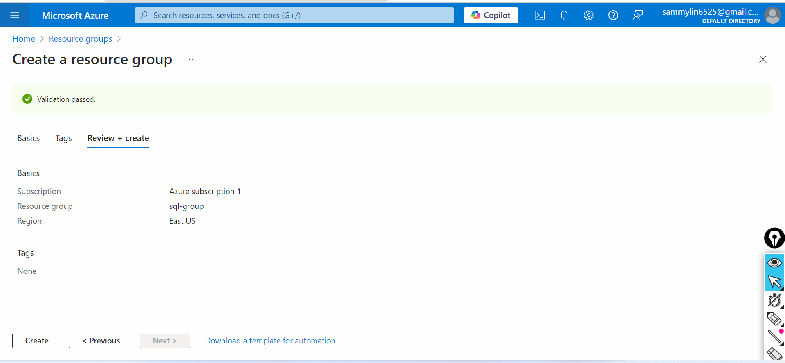
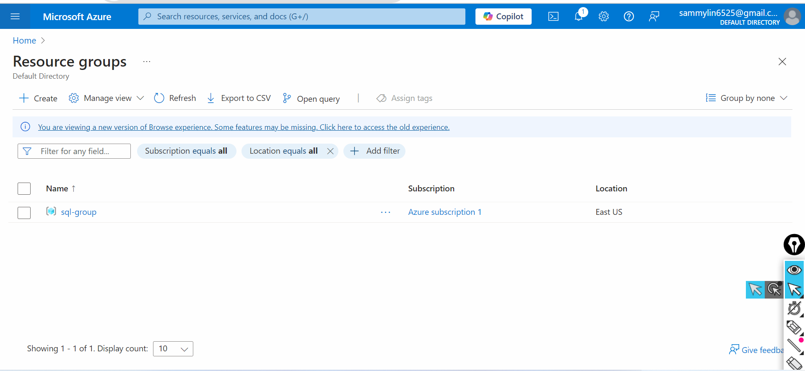
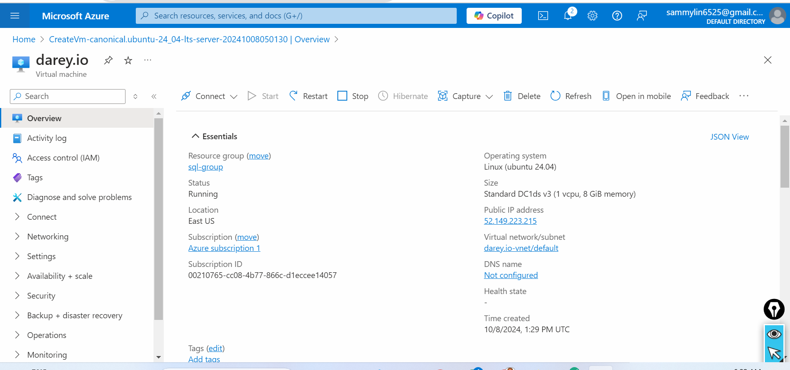
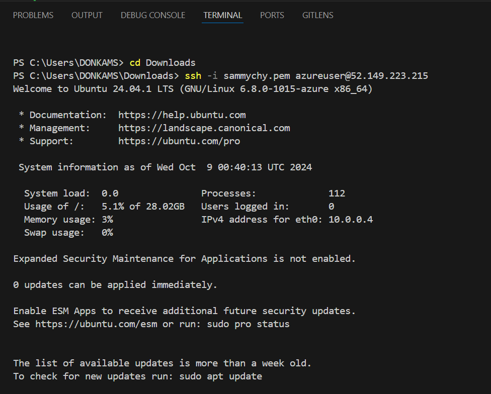
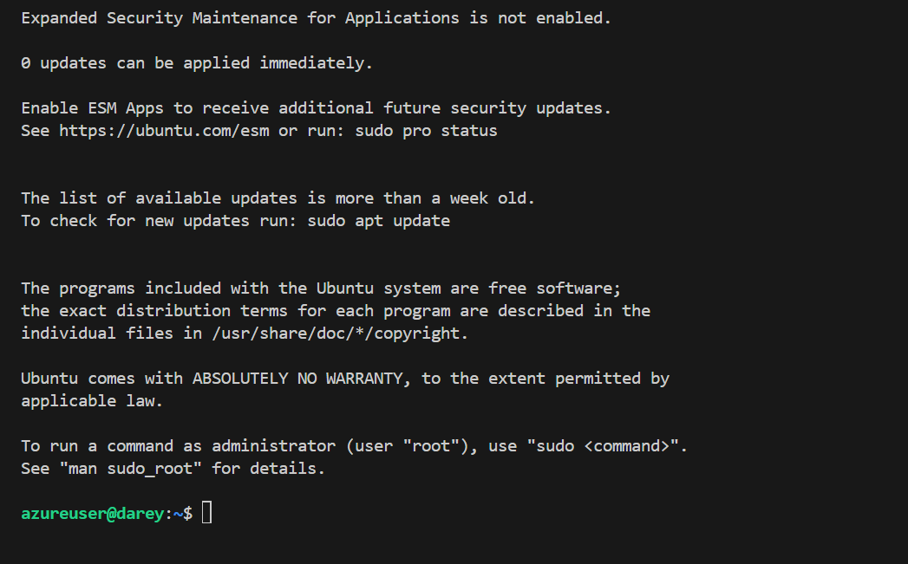

# Introduction to Cloud Computing - Azure Hands - On Project.

### This mini project will cover creating, configuring, and managing Azure VMs and connecting to them remotely.

# Project Overview:

# Part 1: Azure Setup

# 1. Create an Azure Account.

- Creating a Microsoft Azure account is a straightforward process. 

- Here's a step-by-step guide:

- Steps to Create an Azure Account:

- Go to the Azure Portal:

- Visit Azure's official website and click on Start Free or Create a free account .

   [Azures official website](https://azure.microsoft.com/en-us/pricing/purchase-options/azure-account?icid=azurefreeaccount).

- Sign In or Create a Microsoft Account:

- If you already have a Microsoft account (Outlook, Hotmail, etc.), sign in. If not, you can create a new Microsoft account by clicking Create one and following the prompts.

- Fill in Your Information:

- After signing in, you will be asked to provide personal information such as your name, country, and contact details.

- Verify Identity:

- Microsoft will request a phone number to send a verification code via SMS or call. Enter the code to verify your identity.

- Enter Payment Information:

- You'll need to add a credit or debit card to verify your identity, but Azure offers a free tier with $200 credit for the first 30 days and free access to certain services for 12 months. You won't be charged unless you exceed the free limits.

- Review and Complete:

- Accept the terms and conditions, then click Sign up. Once completed, you’ll have access to the Azure portal and can start using cloud services.

- Benefits of a Free Azure Account:

- $200 credit for the first 30 days.

- Access to free services like Virtual Machines, Blob Storage, and SQL Databases for 12 months.

- After completing these steps, you can start deploying and managing services through the Azure portal.
 
.

# 2.  Access Azure Portal

Once logged in, navigate to the Azure Portal and explore the platform.

# Part 2:  Azure Virtual Machine

3. Create a Resource Group

- Navigate to Resource Groups:

- In the left-hand menu, select Resource groups. If you don't see it, you can type "Resource groups" in the search bar at the top.

- Create a New Resource Group:

- Click Create at the top of the Resource Groups page.
Provide Resource Group Information:

- Subscription: Choose the Azure subscription in which the resource group will be created.

- Resource Group Name: Enter a name for your resource group. The name should be unique within the subscription.

- Region: Select a region (location) for the resource group. This is where the resources in the group will be stored and managed.

- Review and Create:

- Click Review + create to review your settings.

- Once satisfied, click Create to create the resource group.
After Creation:

- Once the resource group is created, you can start adding resources such as virtual machines, storage accounts, databases, etc., to the resource group. You can also manage these resources together (start, stop, delete, etc.).

- Resource groups are crucial for organizing resources and applying policies, permissions, and cost management.

.

.

.

.

Type in a **Resource Group** in a search box in a azure platform.

4. # Create a Virtual Machine

- Create a Window or Linux VM of my choice.

- Configure necessary settings like VM size, authenticatio (SSH for Linux, RDP for Windows), and Networking.

## Navigate to Virtual Machines:

- In the left-hand menu, click on Virtual Machines. If it's not visible, you can use the search bar at the top.

- Click on Create:

- At the top of the Virtual Machines page, click on + Create and select Azure Virtual Machine.

- Configure Basic Settings:

- Subscription: Choose your Azure subscription.

- Resource Group: Select an existing resource group or create a new one.

- Virtual Machine Name: Enter a name for your VM.

- Region: Choose the region where you want the VM to be deployed.

- Availability Options: Select if you want to use Availability Zones or sets for redundancy.

- Image: Choose the operating system image for your VM (e.g., Windows Server, Ubuntu).

- Size: Select the size of the VM based on CPU and memory requirements. You can click on See all sizes for more options.

- Configure Administrator Account:

- Authentication Type: Choose between password or SSH public key.

- Username: Enter the username for the VM.
Password/SSH Key: Provide a password or SSH public key for authentication.
Configure Inbound Port Rules:

- Select the ports you want to open for inbound traffic (e.g., SSH for Linux or RDP for Windows). You can choose Allow selected ports and select the desired protocol.

- Review and Create:

- Click Review + create to verify all settings. Azure will run a validation check.
If everything is correct, 

- click Create to deploy your VM.

- Post-Deployment:

- After a few minutes, your VM will be created. You can manage it through the Azure portal by starting, stopping, or configuring settings.

.

.

# 5. Connect to VM

- Use Remote Desktop Protocol (RDP) for Windows VM or SSH for Linux VM to connect remotely.

.

.