# Mini Project: Hosting a Dynamic Wed App on AWS with Terraform Module, Docker, Amazon ECR, and ECS.


## Purpose: 

In this Mini Project, you will use Terraform t create a modular infrastructure for hosting a dynamic web application on Amazon ECS (Elastic Container Service). The Project involves containerizing the web app using Docker, Pushing the Docker image to Amazon ECR (Elastic Container Registry),and deploying the app on ECS.


**Objectives:**


1. **Terraform Module Creation:**

    - Learn how to create Terraform modules for modular infrastructure provisioning.


2. **Dockerization:**

    - Containerize a dynamic web application using Docker.

    At this point, there are prerequisites.

Try to update your system eg ubuntu, redhat, centos.

`sudo apt update`
`sudo apt update -y`

- Install required dependencies

`sudo apt install -y ca-certificates curl gnupg lsb-release`

- Add Docker official GPG key

 `sudo mkdir -p /etc/apt/keyrings`

`curl -fsSL https://download.docker.com/linux/ubuntu/gpg | sudo gpg --dearmor -o /etc/apt/keyrings/docker.gpg`


- Add Docker repository.

```
 echo \
  "deb [arch=$(dpkg --print-architecture) signed-by=/etc/apt/keyrings/docker.gpg] https://download.docker.com/linux/ubuntu \
  $(lsb_release -cs) stable" | sudo tee /etc/apt/sources.list.d/docker.list > /dev/null
```

- Update apt again.

`sudo apt update`


- Now install Docker properly.

`sudo apt install -y docker-ce docker-ce-cli containerd.io docker-buildx-plugin docker-compose-plugin`

- Verify Docker Installation.

    `sudo systemctl status docker`

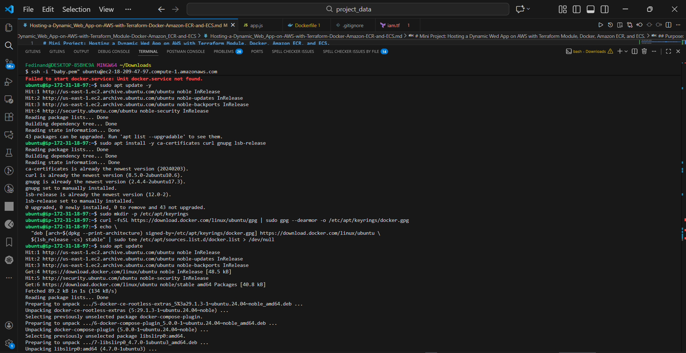


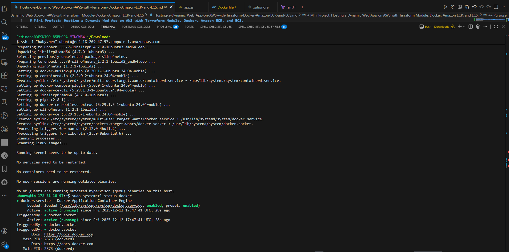


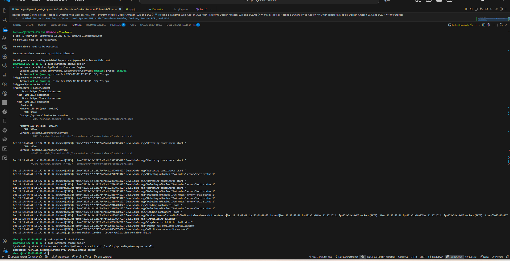


- After launching your server, you have to install a docker in other to containerize the image app.

Belows are the process to follow in other achieve that:


3. **Amazon ECR Configuration:**

    - Configure Terraform to create an Amazon ECR repository for storing Docker images.


4. **Amazon ECS Deployment:**

    - Use Terraform to provision an ECS cluster and deploy the Dockerized web app.

Before trying to start this project, you have to create IAM user in other to activate "aws" access via my "CLI" or alternatively, It can be scripted in a module along in the  working directory.
Bellow are the image description of the whole process.

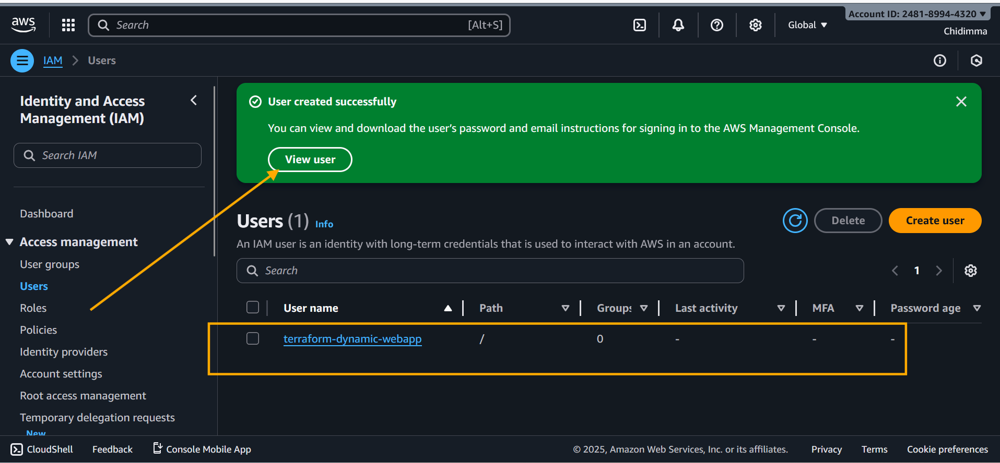


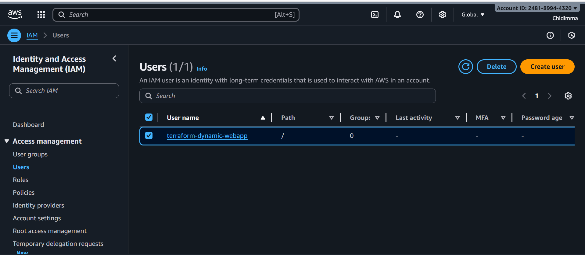


After creation of the "IAM" user, then create "aws-accesskey" to activate on the "CLI"
Below is the image of generated aws accesskey been configured on the "CLI"

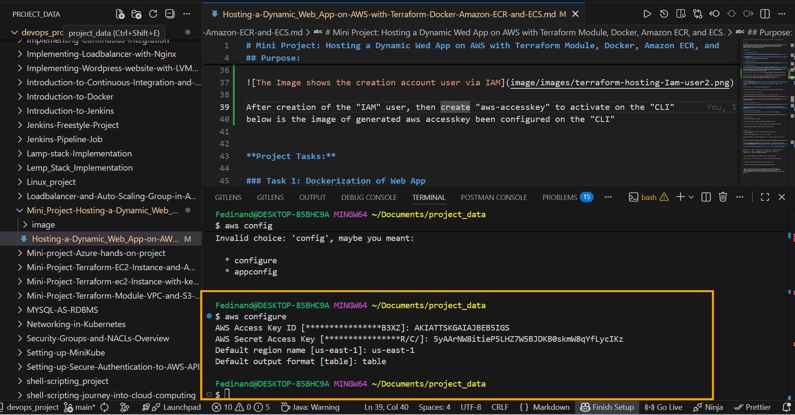

**Project Tasks:**

### Task 1: Dockerization of Web App

1. Create a dynamic web application using a technology of my choice (e.g., Node.js, Flask, Django).

From this step, If you haven't already, download and install Node.js: [Click here to download and install Node.js](https://nodejs.org).

**Verify installation**
- `node -v`
- `npm -v`

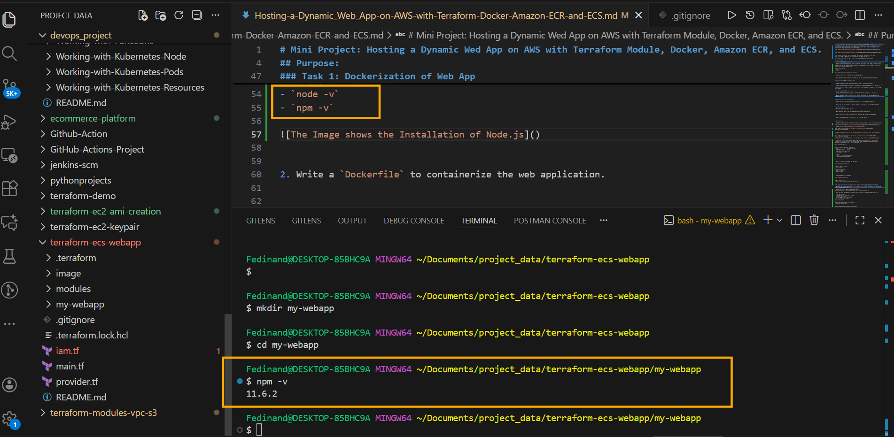

 **Create project folder**
- `mkdir my-webapp`
- `cd my-webapp`

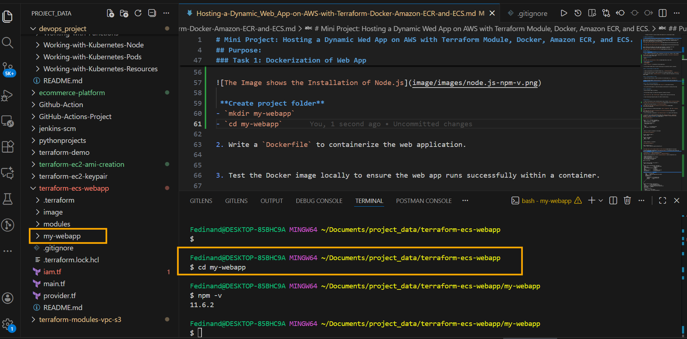

**Initialize Node.js project**

- `npm init -y`  this will create a **package.json** file.

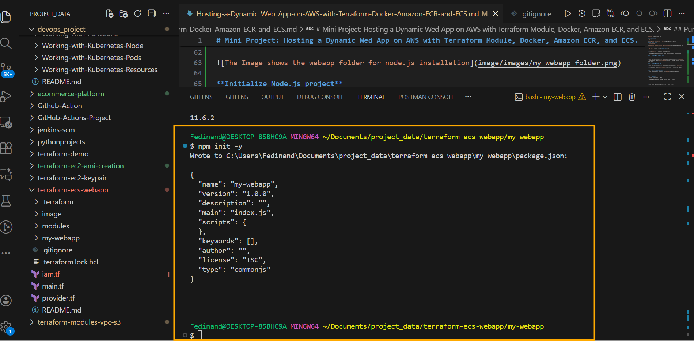


**Install Express.js (Web Server Framework)**

`npm install express`

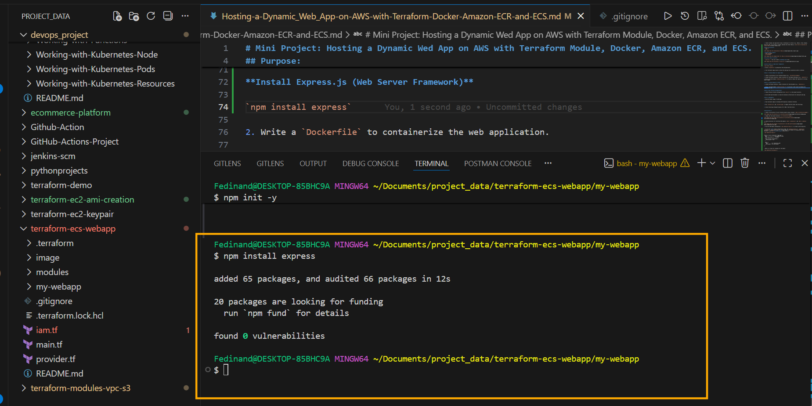


**Create Main Application File**

`nano app.js`

```
const express = require("express");
const app = express();
const port = process.env.PORT || 3000;

app.get("/", (req, res) => {
  res.send("Hello! Welcome to my dynamic Node.js Web Application deployed on ECS Fargate!");
});

app.get("/data", (req, res) => {
  res.json({
    message: "Dynamic JSON response",
    time: new Date().toISOString(),
  });
});

app.listen(port, () => {
  console.log(`Server running on http://localhost:${port}`);
});
```

2. Write a `Dockerfile` to containerize the web application.

Here is exactly how to write a **Dockerfile** to containerize the **Node.js** web application - step by step.

- Create a **Dockerfile**
  `nano Dockerfile`

- Paste this Dockerfile script.
  the script bellow is clean, production-ready Dockerfile for **Node.js:**

```
# Use an official Node.js runtime image
FROM node:18

# Set the working directory inside the container
WORKDIR /app

# Copy package.json and package-lock.json
COPY package*.json ./

# Install dependencies
RUN npm install

# Copy the rest of the application code
COPY . .

# Expose the port the app runs on
EXPOSE 3000

# Command to run the app
CMD ["node", "app.js"]
```

**Build the Docker Image**

`docker build -t node-webapp .`

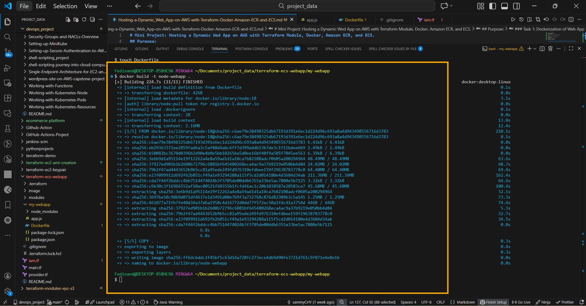


**Testing Docker Image locally**

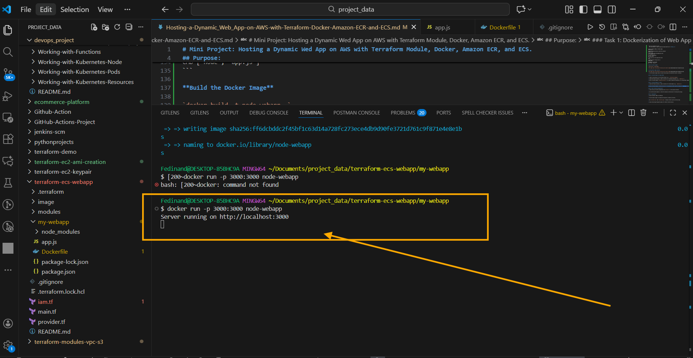

3. Test the Docker image locally to ensure the web app runs successfully within a container.

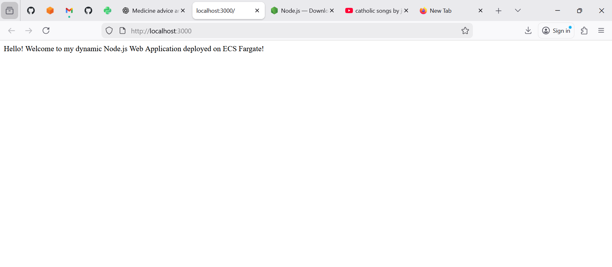

**Task 2: Terraform Module for Amazon ECR**


1. Create a new directory for my Terraform Project (e.g., `terraform-ecs-webapp`).

2. Inside the Project directory, create a directory for the Amazon ECR module (e.g., `modules/ecr`).

3. Write a Terraform module (`modules/ecr/main.tf`) to create an Amazon ECR repository for storing Docker images.


**Task 3: Terraform Modules for ECS**

1. Inside the Project directory, create a directory for the ECS module (e.g., `modules/ecs`).


2. Write a Terraform module (`modules/ecs/main.tf`) to provision an ECS cluster and deploy the Docterized web app.


**Task 4: Main Terraform Configuration**

1. Create the main Terraform Configuration file (`main.tf`) in the project directory.


2. Use the ECR and ECS modules to create the necessary infrastructure for hosting the web app.


**Task 5: Deployment**

1. Build the Docker image of my Web app.


2. Push the Docker image to the Amazon ECR repository created by Terraform.


3. Run `terraform init` and `terraform apply` to deploy the ECS cluster and the web app.


4. Access the web app through the public IP or DNS of the ECS service.


**Instructions:**

1. Create a new directory for your Terraform project using a terminal (`mkdir terraform-ecs-webapp`).

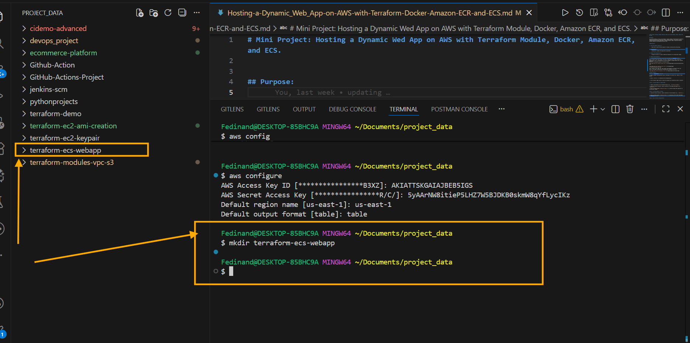

2. Change into the project directory (`cd terraform-ecs-webapp`).

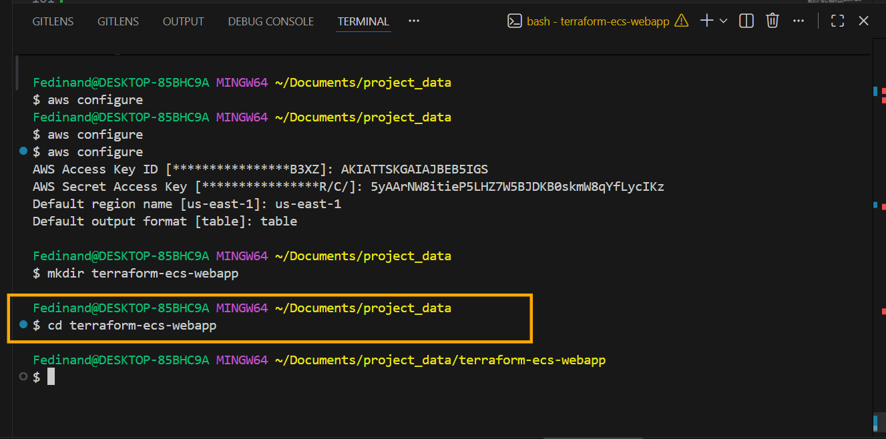


3. Create directories for the ECR and ECS modules (`mkdir -p modules/ecr` and `mkdir -p modules/ecs`).

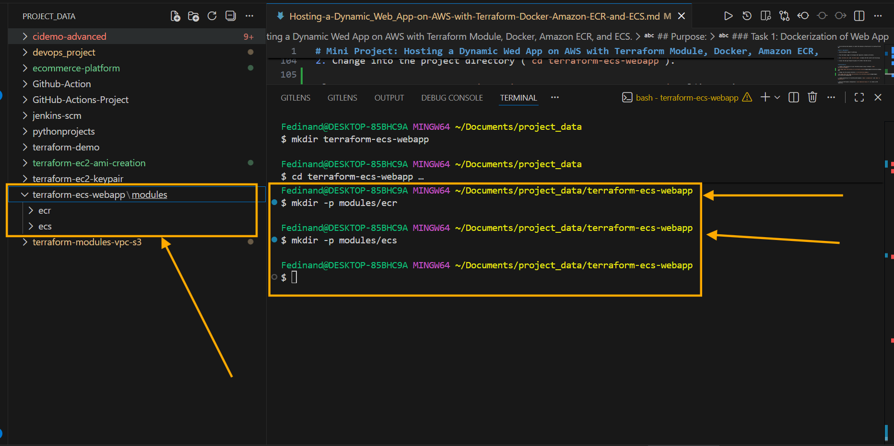

4. Write the ECR module configuration (`nano modules/ecr/main.tf`) to create an ECR repository.


- To write the **ECR** module configuration inside  the `modules/ecr/main.tf`  `modules/ecr/variables.tf` `modules/ecr/output.tf`  3 files needs to be created for configurations above, thereafter, paste the **Terraform codes** below into it.

`nano modules/ecr/main.tf`

```
resource "aws_ecr_repository" "app_repo" {
  name                 = var.repository_name
  image_tag_mutability = "MUTABLE"

  image_scanning_configuration {
    scan_on_push = true
  }

  tags = {
    Name        = var.repository_name
    Environment = var.environment
  }
}
```

- Below is a script for variables for the module

`nano modules/ecr/variables.tf`

```
variable "repository_name" {
  type = string
}

variable "environment" {
  type    = string
  default = "dev"
}
```

- Output (Although, it's optional)

`nano modules/ecr/outputs.tf`

```
output "repository_url" {
  value = aws_ecr_repository.app_repo.repository_url
}
```


5. Write the ECS module configuration (`nano modules/ecs.main.tf`) to provision an ECS cluster and deploy the Dockerized web app.

- To write the **ECS** module configuration inside:
`modules/ecs/main.tf` `modules/ecs/variables.tf`  `modules/ecs/output.tf`

- Paste the script configurations into the `modules/ecs/main.tf` and the configuration will:

- Create an ECS Cluster
- Create an ECS Task Definition (Fargate)
- Create an ECS Service
- Pull the image from the ECR module
- Run the container on Fargate

Below is the script

```
resource "aws_ecs_cluster" "ecs_cluster" {
  name = var.cluster_name
}

resource "aws_ecs_task_definition" "app_task" {
  family                   = "${var.app_name}-task"
  network_mode             = "awsvpc"
  requires_compatibilities = ["FARGATE"]
  cpu                      = var.cpu
  memory                   = var.memory
  execution_role_arn       = var.execution_role_arn
  task_role_arn            = var.task_role_arn

  container_definitions = jsonencode([
    {
      name      = var.app_name
      image     = "${var.ecr_repository_url}:latest"
      essential = true
      portMappings = [
        {
          containerPort = var.container_port
          hostPort      = var.container_port
          protocol      = "tcp"
        }
      ]
    }
  ])
}

resource "aws_ecs_service" "app_service" {
  name            = "${var.app_name}-service"
  cluster         = aws_ecs_cluster.ecs_cluster.arn
  task_definition = aws_ecs_task_definition.app_task.arn
  launch_type     = "FARGATE"
  desired_count   = 1

  network_configuration {
    subnets         = var.subnets
    security_groups = [var.security_group_id]
    assign_public_ip = true
  }
}
```

- `modules/ecs/variables.tf`

```
variable "cluster_name" {
  type = string
}

variable "app_name" {
  type = string
}

variable "ecr_repository_url" {
  type = string
}

variable "cpu" {
  type    = string
  default = "256"
}

variable "memory" {
  type    = string
  default = "512"
}

variable "execution_role_arn" {
  type = string
}

variable "task_role_arn" {
  type = string
}

variable "container_port" {
  type    = number
  default = 80
}

variable "subnets" {
  type = list(string)
}

variable "security_group_id" {
  type = string
}
```

- `modules/ecs/output.tf`

```
output "ecs_cluster_id" {
  value = aws_ecs_cluster.ecs_cluster.id
}

output "ecs_service_name" {
  value = aws_ecs_service.app_service.name
}
```

6. Create the main Terraform configuration file (`nano main.tf`) and use the ECR and ECS modules.


```
module "ecr" {"\n  source = \"./modules/ecr\"\n  repository_name = \"your-webapp-repo\"\n"}

module "ecs" {"\n  source = \"./modules/ecs\"\n  ecr_repository_url = module.ecr.repository_url\n  // Add other variables as needed\n"}
```

Below is the properly formatted script above for the deployment of main Terraform configuration file.

```
module "ecr" {
  source           = "./modules/ecr"
  repository_name  = "your-webapp-repo"
}

module "ecs" {
  source             = "./modules/ecs"
  ecr_repository_url = module.ecr.repository_url

  # Add other variables as needed, for example:
  # cluster_name        = "my-ecs-cluster"
  # app_name            = "webapp"
  # execution_role_arn  = aws_iam_role.ecs_execution_role.arn
  # task_role_arn       = aws_iam_role.ecs_task_role.arn
  # subnets             = ["subnet-12345", "subnet-67890"]
  # security_group_id   = aws_security_group.ecs_sg.id
  # container_port      = 80
}
```

Below is the final properly formatted script to be used for the deployment of main Terraform file.

```
terraform {
  required_providers {
    aws = {
      source  = "hashicorp/aws"
      version = "~> 5.0"
    }
  }
}

provider "aws" {
  region = "us-east-1"
}

module "ecr" {
  source           = "./modules/ecr"
  repository_name  = "your-webapp-repo"
  environment      = "dev"
}

module "ecs" {
  source             = "./modules/ecs"
  ecr_repository_url = module.ecr.repository_url

  # You must fill these with real values
  cluster_name        = "my-ecs-cluster"
  app_name            = "webapp"
  execution_role_arn  = aws_iam_role.ecs_execution_role.arn
  task_role_arn       = aws_iam_role.ecs_task_role.arn
  subnets             = ["subnet-12345", "subnet-67890"]
  security_group_id   = aws_security_group.ecs_sg.id
  container_port      = 80
}
```

7. Build the Docker image of your web app and push it to the ECR repository 


8. Run `terraform init` and `terraform apply` to deploy the ECS cluster and the web app.


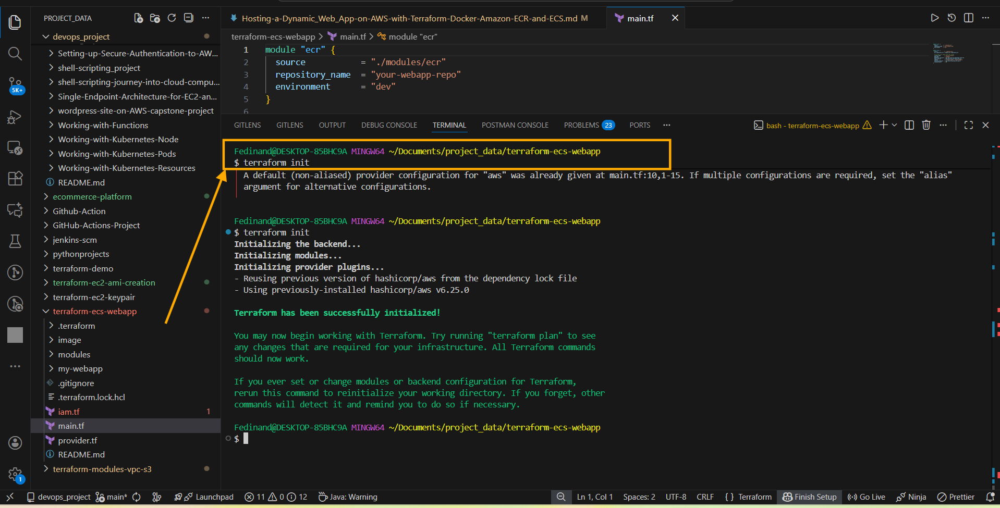


The next step is terraform plan.


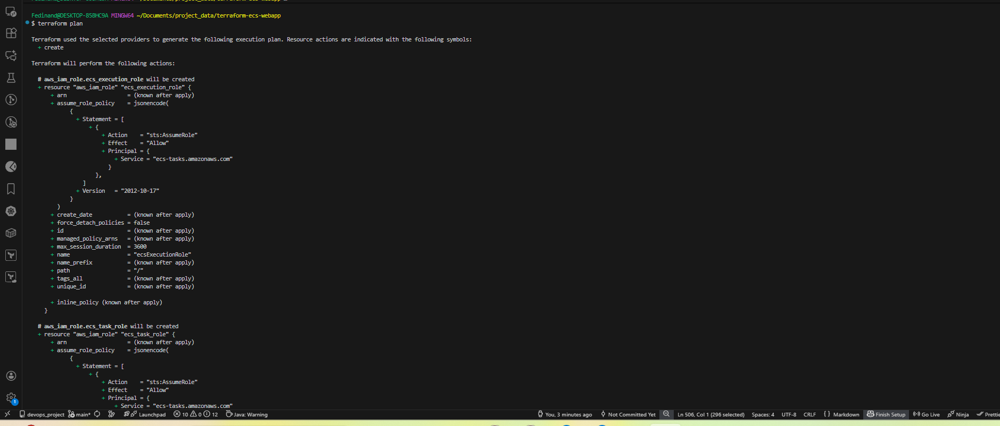


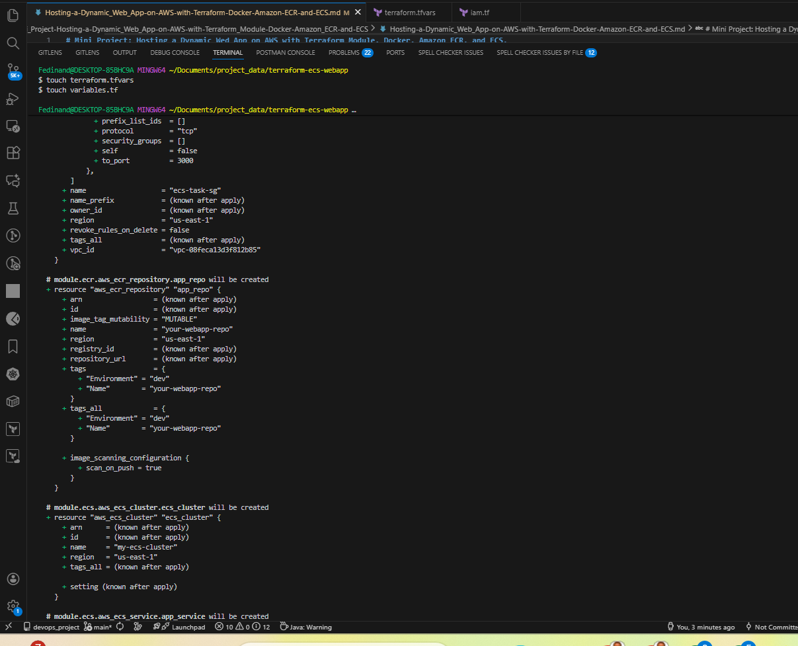


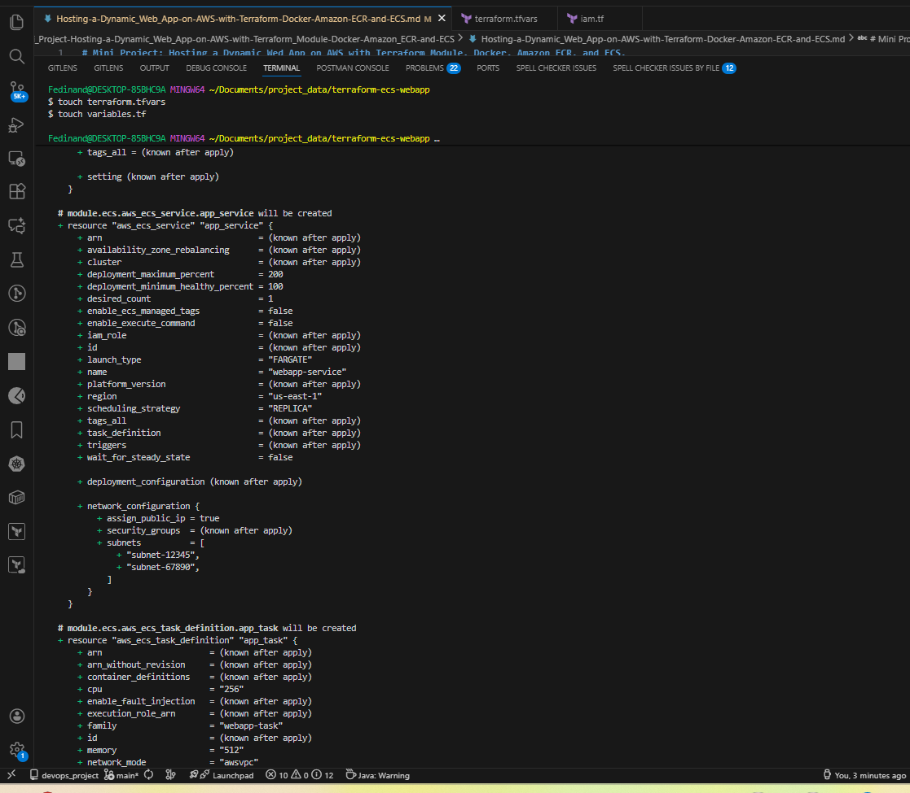


In this process of configuration and deployment, always remember to **IAM User Permissions**
Click Add Permissions ---> Attach Policies.

Attach only the required Policies.
The Required policies includes:

Service                                 Policy

- IAM                                 `IAMFULLAccess`
- ECS                                 `AmazonECSFullAccess`
- ECR                                 `AmazonEC2ContainerRegistryFullAccess`
- VPC                                 `AmazonVPCFullAccess`
- CloudWatch logs                     `CloudWatchLogsFullAccess`
- EC2 SG/Subnets                      `AmazonEC2FullAccess`


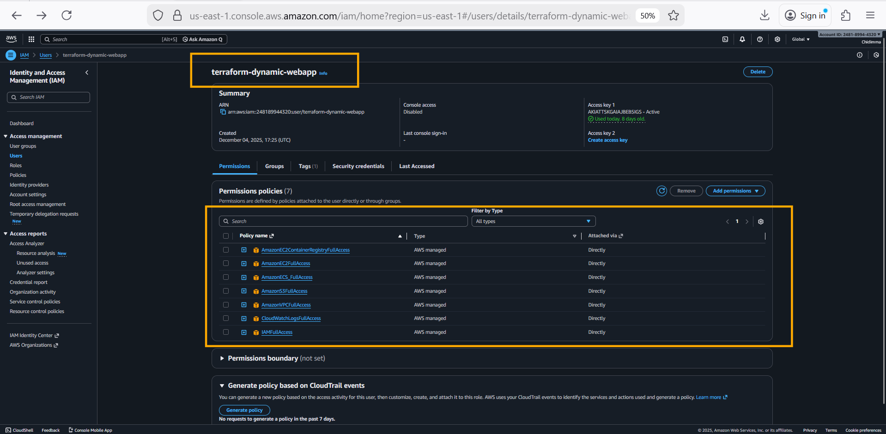


The next is Terraform apply to finalize the configurations


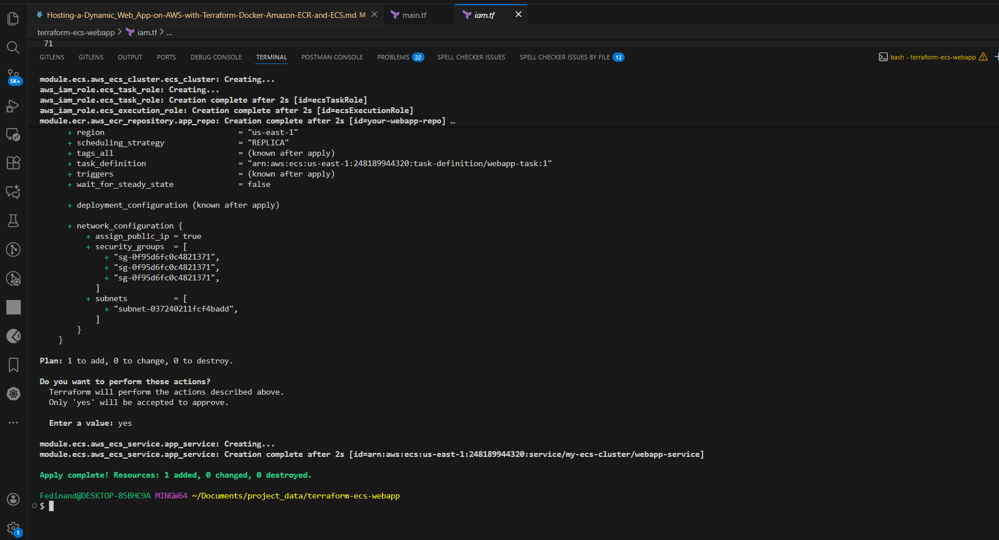


9. Access the web app through the public IP or DNS of the ECS service.

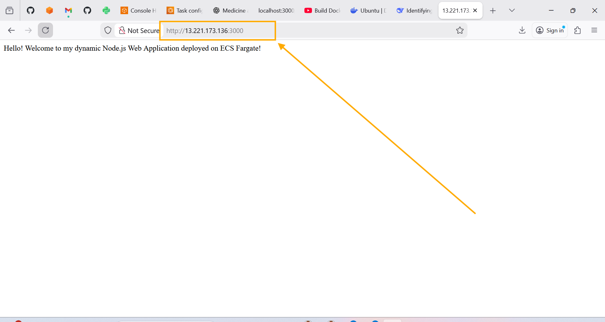


10. Document your observation and any challenges faced during the project.


```
- Ensure you have the AWS CLI installed and configured with appropriate credentials.
- Modify variables and configurations in the modules based on your specific requirements.
- Replace placeholder values in the main configuration file with actual values.
- This is a learning exercise; use it to gain hands-on experience with Terraform, Docker, Amazon ECR, and ECS.
```