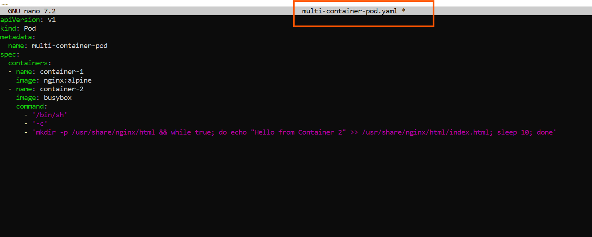
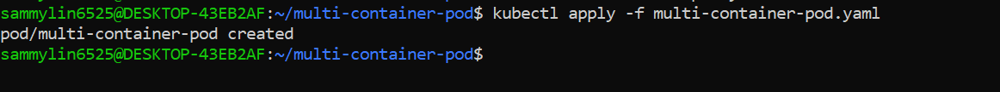
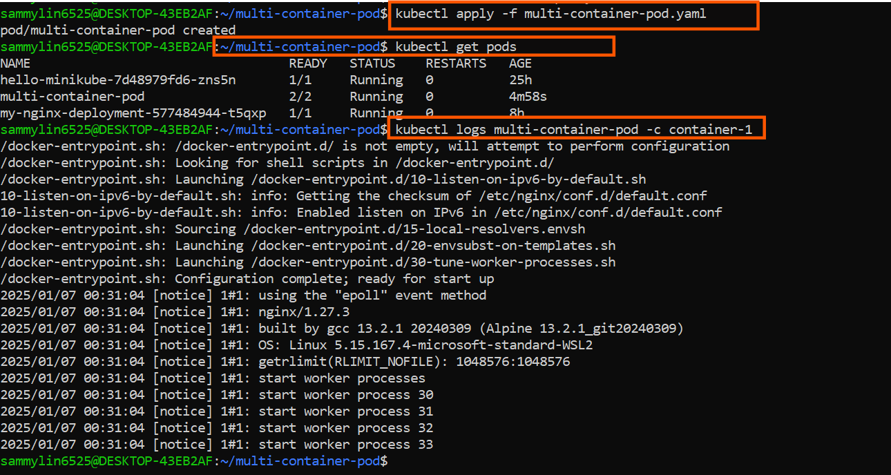
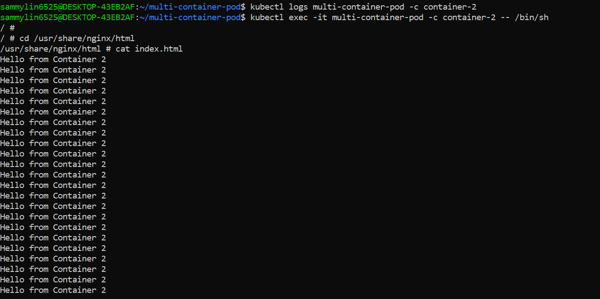

# Networking In Kubernetes

Networking refers to the mechanisms and configurations that allow communication between different components (Pods, services and other resources) within a Kubernetes cluster. Kubernetes provides a flexible and poerful networking model to enable seamless interaction between containers and services, whether they are running on the same node or across different nodes in a cluster.

# Some key aspect of networking in Kubernetes

- **Pod Networking:** Containers within a pod share the same network namespace, allowing them to communicate with each other using localhost. This enables tight coupling between containers within the same pod.

- **Pod-to-Pod Communication:** Pods communicate with each other using their individual IP addresses. Kubernetes ensures that pods can reach other directly, regardless of the node they are running on, by using an overlay network. 

- **Ingress:** Ingress is a Kubernetes resources that allows external access to services within the cluster. It defines rules for routing external HTTP and HTTPS traffic to different services based on the host or path. Ingress controllers manage the actual routing and traffic flow.

- **Network Policies:** Kubernetes Network Policies define rules for controlling the communication between pods. These policies allow administrators to specify how pods can communicate with each other, enhancing security within the cluster.


- **Container Network Interface (CNI):** Kubernetes relies on Container Network Interfaces to implement networking solutions. CNIs provide a standardized interface for networking plugins to intergrate with Kubernetes, allowing for flexibility and choice in networking implementations.

Let's get our hands on pod networking in Kubernetes by deploying a pod with multiple conatainers, showcasing how they share the same network namespace and can communicate with each other using `localhost`. Here's a step-by-step guide using Kubernetes and `kubectl`:  

1. Create a Multi-Conatainer Pod YAML file(e.g.,`multi-container-pod.yaml`): and paste the snippet below


```
apiVersion: v1
kind: Pod
metadata:
  name: multi-container-pod
spec:
  containers:
  - name: container-1
    image: nginx:alpine
  - name: container-2
    image: busybox
    command:
      - '/bin/sh'
      - '-c'
      - 'mkdir -p /usr/share/nginx/html && while true; do echo "Hello from Container 2" >> /usr/share/nginx/html/index.html; sleep 10; done'
```



## Explanation of the yaml snippet above

- apiVersion:v1: Specifies the Kubernetes API version for the abject being created, in this case, a Pod.

- **Kind:Pod:** Defines the type of Kubernetes resources being created, which is a Pod. Pods are the smallest deployable units in Kubernetes and can host one or more containers.


- **Metadata:** Contains metadata for the pod, including the name of the Pod, which is set to "multi-container-pod."


- **Spec:** Describes the desired state of the Pod.


- **Containers:** Specifies the containers configuration for the pod.

- name: container-1: Defines the first container in the pod with the name "container-1" and uses the `nginx:alpine`image.

- **name: container-2:** Defines the second container in the Pod with the name "container-2" and uses the `busybox` image. Additionally, it specifies a command to create an HTML file in the Nginx directory and continuously appends "Hello from Container 2" to it every 10 seconds.

The Pod has two containers - one running the Nginx web server and another running BusyBox with a simple command to continuously append "Hello from Container 2" to the Nginx default HTML file.

2. **Apply the Pod Configuration:**

```
kubectl apply -f multi-container-pod.yaml
```



3. Check pod status and Logs:

```
kubectl get pods
kubectl logs multi-container-pod -c container-1
kubectl logs multi-container-pod -c container-2
```

I will observe that both containers are running within the same pod, and they share the same network namespace. The Nginx container serves its default page, and the BusyBox container continuously updates the HTML file.




4. **Access Nginx from BusyBox Container:**

``` 
kubectl exec -it multi-container-pod -c container-2 -- /bin/sh
```



Now, within the BusyBox container, you can use tools like curl or wget to access http://localhost and see the Nginx page.

This demonstrates how containers within the same pod can communicate with each other using `localhost`.


