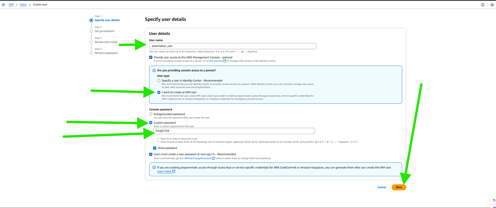

# Setting up Secure Authentication to AWS API

Following the requirement detailed in the project, the initial step in crafting our script is to ensure I have the necessary AWS account setup for authentication and resource management in the cloud. This setup is crucial for enabling the script to create EC2 instances and S3 buckets efficiently. Here's how to proceed:

1. # Create an IAM Role: 
Begin by establishing an IAM role that encapsulates the permissions required for the operations our script will perform.

1. ### Navigate to the IAM Console

- Log in to the AWS Management Console.
- Go to the IAM (Identity and Access Management) service.

2. ### Create the Role

1. ***Start the Role Creation:***

- In the IAM dashboard, click Roles on the sidebar and then click Create role.
Choose Trusted Entity:

2. ### Choose Trusted Entity:

- Select the trusted entity that will assume the role.

- For AWS services like Lambda or EC2, choose AWS Service.

- For cross-account access, select Another AWS Account.

- For external applications, choose Web Identity.

3. Select a Use Case:

- For example, if this role is for EC2 instances, select EC2 and click Next.

3. ### Attach Policies for Permissions.

- Add Policies:
Attach the necessary policies to define the permissions for the role.

For example, attach AmazonS3FullAccess if the role needs full access to S3.

2. # Create an IAM Policy: 
Design an IAM policy granting full access to both EC2 and S3 services. This policy ensures our script has then necessary permissions to manage these resources.

1. Policy JSON Document
Here's the JSON structure for the policy:

json
Copy code

`{
    "Version": "2012-10-17",
    "Statement": [
        {
            "Effect": "Allow",
            "Action": "ec2:*",
            "Resource": "*"
        },
        {
            "Effect": "Allow",
            "Action": "s3:*",
            "Resource": "*"
        }
    ]
}`

- Action: ec2:* and s3:* grant all possible actions for EC2 and S3 services.
Resource: The wildcard * allows access to all resources (e.g., all EC2 instances and S3 buckets). You can restrict this to specific resources if needed.

2. ### Create the Policy via the AWS Management Console
Log in to the AWS Management Console.

- Navigate to the IAM service.
- Click on Policies in the left navigation pane.

Click on the search box and typing in "AmazonEC2FullAccess" among the policy names.

- After the selection click on create policy to choose service.

- After the selection then review and create interface displays to view the selected options.

- The policy created.

3. ### Attach the Policy

Attach this policy to an IAM Role, User, or Group:
For an IAM Role (used by scripts or services), go to Roles, select the role, and attach this policy.

- For a User, go to Users, select the user, and attach the policy.

4. ### Create Policy via AWS CLI
Use the following commands:

3. # Create an IAM User: 
Instantiate an IAM user named automation_user. This user will serve as the primary entity our script uses to interact with AWS services.

***Steps:***

- Log in to the AWS Management Console.

- Navigate to the IAM service.

- In the left navigation pane, click Users.

- Click the Add users button.

- Enter automation_user in the User name field.

- Set permission

- After, the input and selection then review and create user.

- Under Select AWS access type:

Choose Access key - Programmatic access. This option generates credentials (Access Key ID and Secret Access Key) for the user, which your script will use.

Click Next: Permissions.

4. **Assign the User to the IAM Role:** Link the automation_user to the previously created IAM role to inherit its permissions. This step is vital for enabling the necessary access levels for our automation tasks.

5. **Attach the IAM Policy to the User:** Ensure that the automation_user is explicitly granted the permissions defined in our IAM policy by attaching the policy directly to the user. This attachment solidifies the user's access to EC2 and S3 resources.

6. **Create Programmatic Access Credentials:** Generate programmatic access credentials- specifically, an **access key ID** and a **secret access key** for **automation_user**. These credentials are indispensable for authenticating our script with the AWS API through the Linux terminal, allowing it to create and manage cloud resources programmatically.

***Installing and Configuring the AWS CLI***

After setting up my AWS account and creating the necessary IAM user and permissions, the next step involves installing the AWS Command Line Interface (CLI). The AWS CLI is a powerful tool that allows you to interact with AWS services directly from my terminal, enabing automation and simplification of AWS resources management.

**Downloading and Installing AWS CLI**

***On Linux***

1. Download the AWS CLI 

***On linux***

1. Download the AWS CLI version 2 installation file for Linux

`curl "https://awscli.amazonaws.com/awscli-exe-linux-x86_64.zip" -o "awscliv2.zip"`

2. Uzip the installer

`unzip awscliv2.zip`

3. Run the installer

sudo ./aws/install

***On Windows:***

1. ***Download the installer:***

Visit the [official AWS CLI version 2](https://docs.aws.amazon.com/cli/latest/userguide/getting-started-install.html#getting-started-install-instructions) download page and [download the MSI installer for windows.](c:\Users\DONKAMS\Downloads\AWSCLIV2 (1).msi)

2. ***Run the Installer:***

Execute the downloaded MSI installer and follow the on-screen instructions to complete the installation.

3. ***Verify Installation:***

Open the Command Prompt and type aws --version to ensure the CLI is installed correctly. You should see the version of the AWS CLI displayed.

On macOS:

1. In my browser, download the macOS pkg file

2. Run your download file and follow the on-screen instructions

The installer automatically creates a symlink at /usr/local/bin/aws that links to the main program in the installation folder I choosed.

3. Verify Installation:

In my terminal I have to type ***aws --version*** to check if the installation was successfull. I should see the AWS CLI version information.

Configuring the AWS CLI

Once the AWS CLI is installed, the next step is to configure it to use the ***access key ID** and  ***secret access key*** 
generated for my ***automation_user.*** This will authenticate my CLI (Command Line Interface) requests to the AWS API.

***Understanding APIs***

Before proceeding further, it's essential to understand what an ***API*** (Application Programming Interface) is nd it's relevance here. An API is a set of protocols and tools that allows different software applications to communicate with each other. In the context of AWS, the AWS API enables my scripts or the AWS CLI to interact with AWS services programmatically. This means I can create, modify, and delete AWS resources by making API calls, which are just structured requests that the AWS platform can understand and act upon.

***Configuring AWS CLI for access to AWS:***

Open my terminal or Command Prompt and enter.

`aws configure`

This command initiates the setup process for my AWS CLI installation.

**Enter Your Credentials:**

When prompted, enter the ***AWS Access Key ID*** and ***AWS Secret Access Key*** for the ***automation_user.*** Ensure these are kept secure and are not shared.

Next, specify the Default ***region*** name Default ***output*** format. The region should match the one I plan to deploy resources in, and a common output format is ***json***.

**Testing the Configuration:**

To verify that my AWS CLI is configured correctly and can communicate with AWS services, try running a basic command to list all the AWS regions:

`aws ec2 describe-regions --output table`

This command queries the EC2 service for a list of all regions and formats the output as a table. which makes it easy to read. You will recieve a list of regions.

***************

Now I'm ready to begin developing my shell script.

To submit this project, I have to simply document my understanding of AWS CLI, APIs, and authenticating to AWS API from the terminal. 

