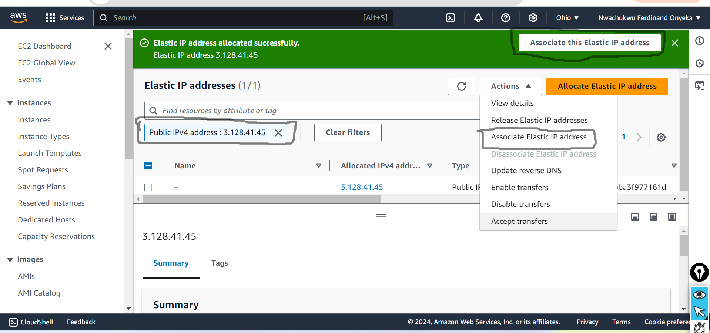
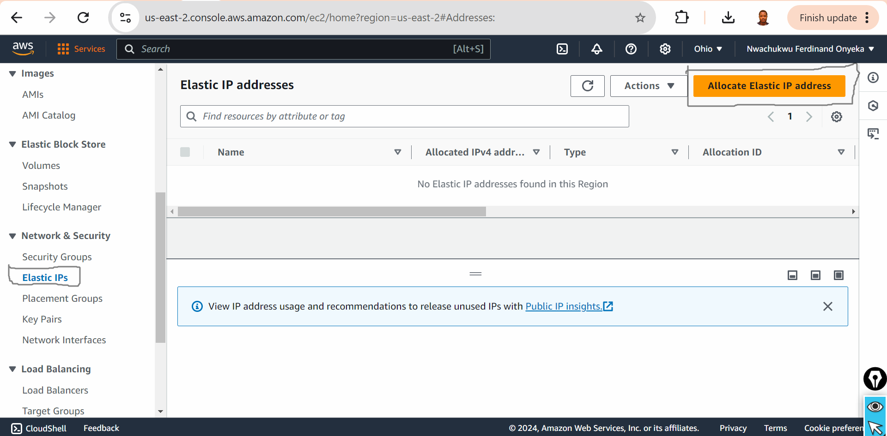

# Mini Project- Single Endpoint Architecture for EC2 and S3 Services

## Project Goals and Learning Outcomes.

### By the completion of this project, The list below is what to be mastered.

- Mastered the integration of EC2 and S3 to support a fintech application, balancing compute and storage needs.
- Gained practical experience in setting up a reverse proxy on EC2 to facilitate unified access to both EC2 and S3 resources

- Learned the significance of seamless resource integration in bulding scalable and secure fintech solutions.
- Developed a deeper understanding of AWS=s capability to support fintech innovations through hands-on experience with its core services.

# Project Setup.

1. Two Separate Chrome browser profiles
2. AWS Management Console Access:

# Project Setup
1. Two Separate Chrome browser profiles

2. AWS Management Console Access: Using "John" the developer's IAM account, log into the AWS Management Console

3. EC2 Instance Setup: Launch an EC2 instance that will host the main application, and associate it with an elastic IP.

4. S3 Bucket Configuration: Using Mary the Data Analyst's IAM account, Created and configure an S3 bucket for storing application data, ensuring proper permissions and web hosting settings are in place. 

5. Reverse Proxy Configuration: Install and configure a web server (e.g., Nginx) on the Ec2 instance to act as a reverse proxy, routing requests to either the application or the S3 bucket based on the URL path. 

# Setting up the EC2 Instance

- Login in the AWS console as "any-name" 

- Using the basic knowledge of launching EC2 instances, launch an ubuntu EC2 Instance.

- Assign a Static IP (Elastic IP): Associate an Elastic IP address with the EC2 instance to ensure it retains the same public IP address across reboots. Recall the earlier incovenience faced when a static IP was not utilized the EC2 instances. Each time the instances was rebooted, it was assigned a new public IP address, compelling to frequently update the SSH command with the latest IP to maintain access. This not only disrupt the workflow but also increase the risk of connectivity issues or security concern due to constantly changing access points. Follow the steps below to assign a static IP 

1. In this console navigation, select elastic IP and click on allocate elastic IP in the top right.

2. Select the highlighted part in the image below

[The image shows the allocate elastic IP address](Image/images/allocate-elastic-ip2.png)

3. Click on Allocate

4. Select the highlighted parts and click on associate elastic ip

[The image shows the associate elastic IP address](Image/images/associate-elastic-ip.png)

5. Select the resources type, the instance to alocate the elastic ip address and the private ip of the elastic ip.

[The image shows the allocate elastic IP and the private ip of the elastic ip address](Image/images/allocate-ip.png)

Creating S3 Bucket

1. Log in to the s3 console as any name eg Mary, Joseph, Emeka etc. 

2. Create a new bucket and give it a name of your choice.

[The image shows the new bucket created](Image/images/allocate-elastic-ip2.png)

3. Create a new object inside the bucket.index.html file containing a simple content should be uploaded.

On the computer, I have to create an ***index.html*** file with the content ***Welcome to Amazon S3***

Upload the ***index.html*** on S3 bucket as shown in the image below;

[The image shows the index.html on the bucket](Image/images/index.html.png)

**Configuring S3 Bucket for Web Hosting**

- Enable Static Website Hosting: In the S3 bucket settings, enable static website hosting. This makes the bucket content accessible via HTTP. 

1. Click on the bucket name.

2. Click on the properties tab and scroll down

[The image shows the bucket configuration](Image/images/configuring-s3-bucket1.png)
