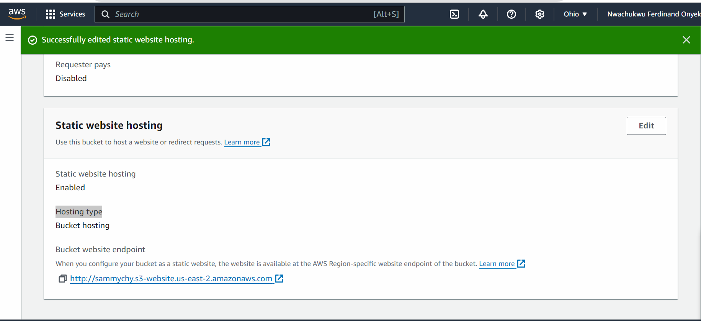

# Mini Project- Single Endpoint Architecture for EC2 and S3 Services

## Project Goals and Learning Outcomes.

### By the completion of this project, The list below is what to be mastered.

- Mastered the integration of EC2 and S3 to support a fintech application, balancing compute and storage needs.
- Gained practical experience in setting up a reverse proxy on EC2 to facilitate unified access to both EC2 and S3 resources

- Learned the significance of seamless resource integration in bulding scalable and secure fintech solutions.
- Developed a deeper understanding of AWS=s capability to support fintech innovations through hands-on experience with its core services.

# Project Setup.

1. Two Separate Chrome browser profiles
2. AWS Management Console Access:

# Project Setup
1. Two Separate Chrome browser profiles

2. AWS Management Console Access: Using "John" the developer's IAM account, log into the AWS Management Console

3. EC2 Instance Setup: Launch an EC2 instance that will host the main application, and associate it with an elastic IP.

4. S3 Bucket Configuration: Using Mary the Data Analyst's IAM account, Created and configure an S3 bucket for storing application data, ensuring proper permissions and web hosting settings are in place. 

5. Reverse Proxy Configuration: Install and configure a web server (e.g., Nginx) on the Ec2 instance to act as a reverse proxy, routing requests to either the application or the S3 bucket based on the URL path. 

# Setting up the EC2 Instance

- Login in the AWS console as "any-name" 

- Using the basic knowledge of launching EC2 instances, launch an ubuntu EC2 Instance.

- Assign a Static IP (Elastic IP): Associate an Elastic IP address with the EC2 instance to ensure it retains the same public IP address across reboots. Recall the earlier incovenience faced when a static IP was not utilized the EC2 instances. Each time the instances was rebooted, it was assigned a new public IP address, compelling to frequently update the SSH command with the latest IP to maintain access. This not only disrupt the workflow but also increase the risk of connectivity issues or security concern due to constantly changing access points. Follow the steps below to assign a static IP 

1. In this console navigation, select elastic IP and click on allocate elastic IP in the top right.

2. Select the highlighted part in the image below

3. Click on Allocate

4. Select the highlighted parts and click on associate elastic ip

5. Select the resources type, the instance to alocate the elastic ip address and the private ip of the elastic ip.

Creating S3 Bucket

1. Log in to the s3 console as any name eg Mary, Joseph, Emeka etc. 

2. Create a new bucket and give it a name of your choice.

3. Create a new object inside the bucket.index.html file containing a simple content should be uploaded.

On the computer, I have to create an ***index.html*** file with the content ***Welcome to Amazon S3***

Upload the ***index.html*** on S3 bucket as shown in the image below;

**Configuring S3 Bucket for Web Hosting**

- Enable Static Website Hosting: In the S3 bucket settings, enable static website hosting. This makes the bucket content accessible via HTTP. 

1. Click on the bucket name.

2. Click on the properties tab and scroll down

3. Click on the edit as shown in the image below.

4. Select the part highlighted in the image below. You can ignore the optional part

5. I have successfully enabled website hosting for the bucket.

**Configuring a Web Server as a Reverse Proxy**

Now that the I have successsfully assigned an elastic ip to the instance, let's install nginx on it. But what is nginx? Nginx is a popular open-source web server, reverse proxy server, load balancer, and HTTP cache. It's known for its high performance, stability, simple configuration, and low resources consumption. Originally created to solve the "C10k problem" ( handling 10,000 simultaneous connections), Nginx has since gained widespread adoption and is used by many large-scale websites and web applications.

1. On your EC2 instance, Install Nginx web server

`sudo apt update -y && sudo apt install nginx -y`

2. Configure the web server: Configure the web server to the s3 app directly and to forward request to the S3 bucket. Follow the steps below to configure the nginx

- Create and edit a new file named ***mybucket***

`sudo nano /etc/nginx/sites-available/mybucket`

- Paste the configuration code snippet below in the file and replace the highlighted part with the S3 link

Save and close the file.

**Note:** I have to replace with the link above with the link generated after enabled static web hosting for the bucket.

3. Note that by default, nginx keeps its configuration files in **/etc/nginx/sites-available** but it uses the file in the **/etc/nginx/sites-anabled/**. I need to create a symbolic link between sites-available and sites-enabled so that the new configuration file we created for our static websites in **sites-available** folder can be used by nginx in **sites-enabled** folder. Run the commands below to symbolic link between **sites-available/mybucket** configuration file to **site-enabled** directory

`sudo ln -s /etc/nginx/site-available/mybucket /etc/nginx/sites-enabled`

Remove the default configuration file in site-enabled using the command below

`sudo rm /etc/nginx/sites-enabled/default`

- Reload nginx using the command below.

`sudo systemctl reload nginx`

4. Make the index.html file public

- Navigate to the **index.html** file, click on **Actions** and then click on **Make public using ACL**

### Testing and Validation

After setting up your EC2 instance, configuring the S3 bucket, and establishing the reverse proxy, the next critical phase is testing and validation. This step is essential to ensure that the setup works as intended and that both the EC2-hosted application and the S3 bucket content are accessible through the unifield access point I ve created.

### Testing Steps:

1. Direct Application Access:

- Access the application hosted on the EC2 instance directly through the Elastic IP to confirm it's running as expected.

- Verify that the application responds to requests and functions correctly without any reverse proxy interference.

