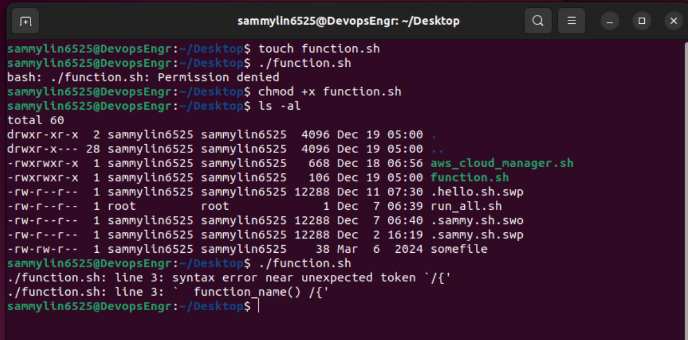
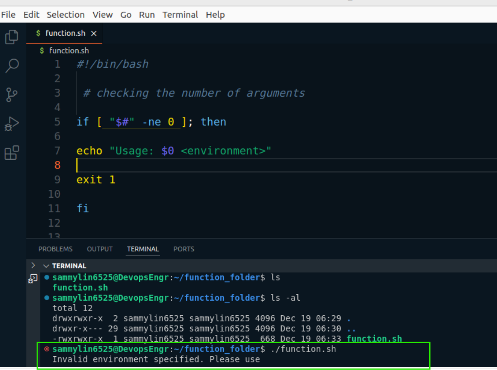

# Working with Functions

In this mini-project, I will focus on some other essential concepts in shell scripting.

The overall goal is to develope a shell script for one of ***DataWise Solutions's*** clients, that automates the setup of EC2instances and S3 buckets. Part of the critical elements we will be focusing on in this project is Functions.

## Functions

Organizing a code is key to maiantaining clarity and efficiency. One powerful technique for achieving this is through the use of functions.

By encapsulating specific logic within functions, I can streamline my scripts and improve readability. Going forward, I will be creating functions for every pieces of requirement I wish to satisfy.

Lets consider the following logic and encapsulate them in functions.

1. Check if script has an argument

2. Check id AWS CLI is installed

3. Check if environment variable exists to authenticate to AWS

To create a function in a shell script, I simply have to define it using the following syntax:

```
function_name() \{
    # Function body
    # You can place any commands or logic here
\}
```



Here's a breakdown of the syntax:

- ***function_name*** This is the name my function. Choose a descriptive name that reflects the purpose of the function.

- (): Parentheses are used to define the function. They can be omitted  in simpler cases, but it's good practice to include them for clarity.

- {}: Curly braces enclose the body of the function, where you define the commands or logic that the function will execute.

**Function: Check if script has an argument**

Lets take the same code in previous mini-project and encapsulate it in a function.

Here is the code below without a function.

```
#!/bin/bash

# Checking the number of arguments
if [ "$#" -ne 0 ]; then
    echo "Usage: $0 <environment>"
    exit 1
fi

# Accessing the first argument
ENVIRONMENT=$1

# Acting based on the argument value
if [ "$ENVIRONMENT" == "local" ]; then
  echo "Running script for Local Environment..."
elif [ "$ENVIRONMENT" == "testing" ]; then
  echo "Running script for Testing Environment..."
elif [ "$ENVIRONMENT" == "production" ]; then
  echo "Running script for Production Environment..."
else
  echo "Invalid environment specified. Please use 'local', 'testing', or 'production'."
  exit 2
fi
```



```
#!/bin/bash

check_num_of_args() \{
# Checking the number of arguments
if [ "$#" -ne 0 ]; then
    echo "Usage: $0 <environment>"
    exit 1
fi
\}

# Accessing the first argument
ENVIRONMENT=$1

# Acting based on the argument value
if [ "$ENVIRONMENT" == "local" ]; then
  echo "Running script for Local Environment..."
elif [ "$ENVIRONMENT" == "testing" ]; then
  echo "Running script for Testing Environment..."
elif [ "$ENVIRONMENT" == "production" ]; then
  echo "Running script for Production Environment..."
else
  echo "Invalid environment specified. Please use 'local', 'testing', or 'production'."
  exit 2
fi
```

When a function is defined in a shell script, it remains inactive unitl it is invoked or called within the script. To execute the code within the function, I must place a call to the function in a relevant part of my script.

It's crucial to consider the order in which the interpreter evaluates each line of code. Placing the function where it logically fits within the flow of my script ensures that it is available and ready to be executed when needed. This organization helps maintain the readability and coherence of my script, making it easier to understand and debug.

Lets see what that would now look like;

```
#!/bin/bash

# Environment variables
ENVIRONMENT=$1

check_num_of_args() \{
# Checking the number of arguments
if [ "$#" -ne 0 ]; then
    echo "Usage: $0 <environment>"
    exit 1
fi
\}

check_num_of_args()

# Acting based on the argument value
if [ "$ENVIRONMENT" == "local" ]; then
  echo "Running script for Local Environment..."
elif [ "$ENVIRONMENT" == "testing" ]; then
  echo "Running script for Testing Environment..."
elif [ "$ENVIRONMENT" == "production" ]; then
  echo "Running script for Production Environment..."
else
  echo "Invalid environment specified. Please use 'local', 'testing', or 'production'."
  exit 2
fi
```
With a refactored version of the code, we now have the flow like this;

1. Environment variable moved to the top

2. Function defined

3. Function call

4. Activate based on infrastructure environment section.

What we could also do is encapsulate number 4 in a function and call all the functions at the end of the script. This is what you would see most times in the real world.

Lets see what that would now look like.

```
#!/bin/bash

# Environment variables
ENVIRONMENT=$1

check_num_of_args() \{
# Checking the number of arguments
if [ "$#" -ne 0 ]; then
    echo "Usage: $0 <environment>"
    exit 1
fi
\}

activate_infra_environment() \{
# Acting based on the argument value
if [ "$ENVIRONMENT" == "local" ]; then
  echo "Running script for Local Environment..."
elif [ "$ENVIRONMENT" == "testing" ]; then
  echo "Running script for Testing Environment..."
elif [ "$ENVIRONMENT" == "production" ]; then
  echo "Running script for Production Environment..."
else
  echo "Invalid environment specified. Please use 'local', 'testing', or 'production'."
  exit 2
fi
\}

check_num_of_args
activate_infra_environment
```
With the updated version of the code, I can now see how clean the code looks. You can easily understand what each function is doing based on its name, comments, and the order in which the functions are called at the end.

### Check if AWS CLI is installed

```
#!/bin/bash

# Function to check if AWS CLI is installed
check_aws_cli() \{
    if ! command -v aws &> /dev/null; then
        echo "AWS CLI is not installed. Please install it before proceeding."
        return 1
    fi
\}
```
Lets break down this section of the code;

- if !command -v aws &> /dev/null;then: This line contains an if statement. Here's the breakdown:

- !: This is the logical negation operator. It reverses the result of a command, so ! command means "if Not".

- command -v aws: This command check if the **aws** command is available in the system. It returns the path to the aws executable if it exists, or nothing if it doesn't. if you run this on your system, it will tell you the path to the `aws` cli that you installed previously.

```
which aws
```
Hence, the "command -v" utility also return the same thing that the ***"which"*** command returns. with the "!" operator, we are saying that if the path for "aws" does not exist, then return 1

- &> /dev/null: This part redirects both standard output (stdout) and standard error (stderr) to /dev/null, a special device file that discards all output. This effectively suppresses any output from the command -v command. [Watch this video to fully understand redirection](https://www.youtube.com/watch?v=IysKGrfHnKo&list=PLtPuNR8I4TvkwU7Zu0l0G_uwtSUXLckvh)

- then: Then keyword indicates the beginning of the code block to execute if the condition in the if statement is true.

- echo "AWS CLI is not installed. I have to install it before proceeding.": This line prints an error message to the standard output if the AWS CLI is not installed.

- return 1: This line causes the function the exit with a non-zero exit status (1). A non-zero exit status conventionally indicates an error condition in Unix-like systems.

**Check if environment variable exists to authenticate to AWS**

To programmatically create resources in AWS, you need to configure anthentication using various means such as environment variables, configuration file, or IAM roles.

The ~/.aws/credentials and ~/.aws/config files are commonly used to store AWS credentials and configuration settings, respectively.

Running the **aws configure** command I ran earlier creates these files. I can use the "cat" command to open them and see the content.

***Credentials File (~/.aws/credentials)***

The credentials file typically contains AWS access key ID and secret access key pairs. I will have only **default** section at first. But I can add other environments as required. Just as we have for testing and production below.

It is formatted as follows:

```
[default]
aws_access_key_id = YOUR_ACCESS_KEY_ID
aws_secret_access_key = YOUR_SECRET_ACCESS_KEY

[profile testing]
aws_access_key_id = YOUR_TESTING_ENVIRONMENT_ACCESS_KEY_ID
aws_secret_access_key = YOUR_TESTING_ENVIRONMENT_SECRET_ACCESS_KEY

[profile production]
aws_access_key_id = YOUR_PRODUCTION_ENVIRONMENT_ACCESS_KEY_ID
aws_secret_access_key = YOUR_PRODUCTION_ENVIRONMENT_SECRET_ACCESS_KEY

```
Config File (~/.aws/config)

The config file stores configuration settings for AWS services and clients. It can include settings such as the default region, output format, and profiles. An example config file might look like this:

```
[default]
region = us-east-1
output = json

[profile testing]
region = us-west-2
output = json

[profile production]
region = us-west-2
output = json
```
A profile will enable me to easily switch between different AWS configurations. If you set an environment variable by running the command **export AWS_PROFILE=testing** - this will pick up the configuration from both file and authrnticate me to the testing environment.

**AWS Profile** The AWS_PROFILE environment variable allows users to specify which profile to use from their AWS confiq and credentials files. If AWS_PROFILE is not set, the default profile is used.

Here is what the function would look like;

```
#!/bin/bash

# Function to check if AWS profile is set
check_aws_profile() \{
    if [ -z "$AWS_PROFILE" ]; then
        echo "AWS profile environment variable is not set."
        return 1
    fi
\}

```
The **-z** flag is used to test if the value of the string variable (in this case, the value stored in the $AWS_PROFILE variable) has zero length, meaning it is empty or null.

Our shell script will now look like this.

```
#!/bin/bash

# Environment variables
ENVIRONMENT=$1

check_num_of_args() \{
# Checking the number of arguments
if [ "$#" -ne 0 ]; then
    echo "Usage: $0 <environment>"
    exit 1
fi
\}

activate_infra_environment() \{
# Acting based on the argument value
if [ "$ENVIRONMENT" == "local" ]; then
  echo "Running script for Local Environment..."
elif [ "$ENVIRONMENT" == "testing" ]; then
  echo "Running script for Testing Environment..."
elif [ "$ENVIRONMENT" == "production" ]; then
  echo "Running script for Production Environment..."
else
  echo "Invalid environment specified. Please use 'local', 'testing', or 'production'."
  exit 2
fi
\}

# Function to check if AWS CLI is installed
check_aws_cli() \{
    if ! command -v aws &> /dev/null; then
        echo "AWS CLI is not installed. Please install it before proceeding."
        return 1
    fi
\}

# Function to check if AWS profile is set
check_aws_profile() \{
    if [ -z "$AWS_PROFILE" ]; then
        echo "AWS profile environment variable is not set."
        return 1
    fi
\}

check_num_of_args
activate_infra_environment
check_aws_cli
check_aws_profile
```
Congratulations for reaching this milestone.

### Your task

Summarise all your learning in this mini project into a paragraph and submit.
