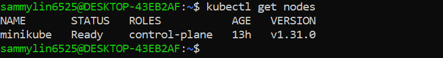
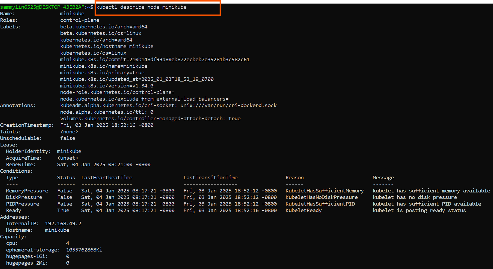
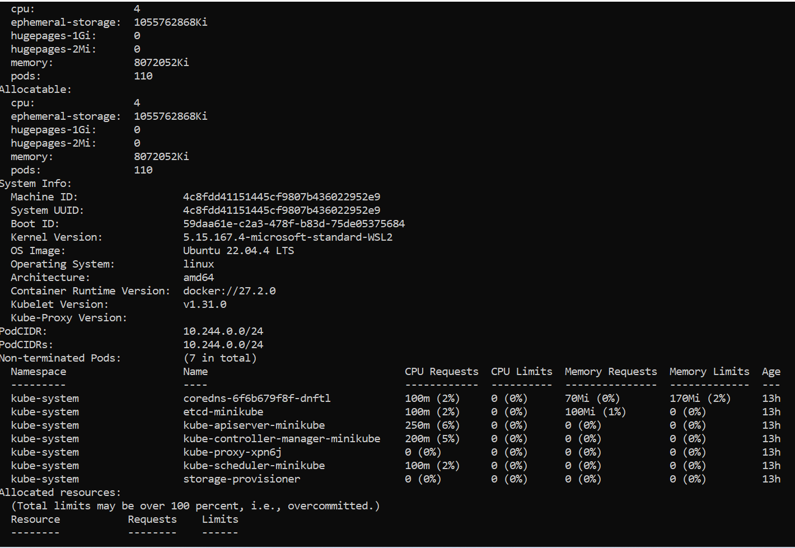
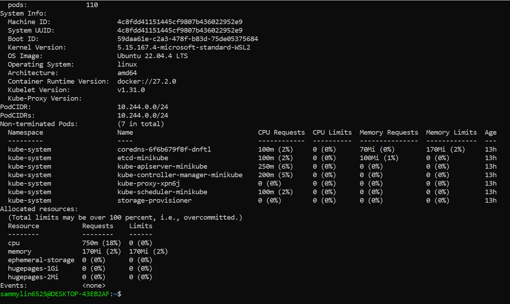

# Working with Kubernetes Node.

### Kubernetes Nodes

Now that I have my minikube cluster setup, let's dive into nodes in kubernetes.

## What Is a Node

In Kubernetes, think of a node as a dedicated worker, like a dependable employee in an office,responsible for executing tasks and hosting containers to ensure seamless application performance. A ***Kubernetes Node*** is a physical or virtual machine that runs the Kubernetes software and serves as a worker machine in the cluster. Nodes are responsible for running Pods, which are the basic deployable units in Kubernetes. Each node in a kubernetes cluster typically represents a single host system.

1. Start Minikube Cluster:

```
minikube start
```
This command starts a local kubernetes cluster (minikube) using a single-node minikube setup.It provisions a virtual machine (VM) as the Kubernetes node.

2. Stop Minikube Cluster:

```
minikube stop
```

Stops the running Minikube (local kubernetes cluster), preserving the cluster state.

3. Delete Minikube Cluster:

```
minikube delete
```
Delete the Minikube Kubernetes cluster and its associated resources.

4. View Nodes:

```
kubectl get nodes
```


List all the nodes in the Kubernetes cluster along with their current status.

5. Inspect a Node:

```
kubectl describe node <node-name>
```
Provides detailed information about a specific node, including its capacity, allocated resources, and status.








Node Scaling and Maintenance:

Minikube, as it's often used for local development and testing, scaling nodes may not be as critical as in production environments. However, understanding the concepts is beneficial:

- Node Scaling: Minikube is typically a single-node cluster, meaning you have one worker node. For larger, production-like environments.


- Node Upgrades: Minikube allows you to easily upgrade my local cluster to a new Kubernetes version, ensuring that my development environment aligns with the target production version.

By effectively managing nodes in minikube kubernetes cluster, I can create, test, and deploy applications locally, simulating a kubernetes cluster without the need for a full-scale production setup. This is particularly useful for debugging, experimenting, and developing applications in a controlled environment.