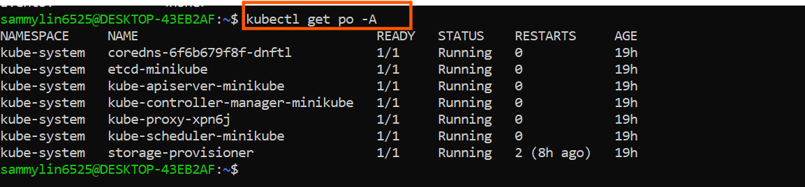

# Working with Kubernetes Pods

### Pods in Kubernetes

## Definition and Purpose:

A Pod in Kubernetes is like a small container for running parts of an application. It can have one or more containers inside it that work closely together. These containers share the same network and storage, which makes them communicate and cooperate easily. A pod is the smallest thing you can create and manage in Kubernetes . In Minikube, which is a tool to run Kubernetes easily, Pods are used to set up, change the size and control applications.

### Creating and Managing Pods:

Interaction with Pods in Mininkube involves using the powerful `kubectl` command-line tool. `kubectl` is the command-line interface (CLI) tool for interacting with Kubernetes clusters. It allows users to deploy and manage applications, inspect and manage cluster resources, and execute various commands
 against Kubernetes clusters.

 1. List Pods:

 ```
 kubectl get po -A
 ```

 This commands provides an overview of the current status of Pods within the Minikube cluster.

 .


 2. Inspect a Pod:

 ```
 kubectl describe pod <pod-name>
```

The command above can be used to gain detailed insights into a specific Pod, including events, container information, and overall configuration.

3. Delete a Pod:

```
kubectl delete pod <pod-name>
```
Removing a Pod from the Minikube cluster is as simple as issuing this command.

### Containers in Kubernetes

### Definition and Purpose:

From our Knowledge of docker, we know ***Container*** represents a lightweight, standalone, and executable software package that encapsulates everything needed to run a piece of software, including the code, runtime, libraries, and system tools. Containers are the fundamental units deployed within Pods, which are orchestrated by Kubernetes. In Minikube, containers play a central role in providing a consistent and portable environment for applications, ensuring they run reliably across various stages of the development lifecycle.

Integrating Containers into Pods:

- ***Pod Definition with Containers:*** In the Kubernetes world, containers come to file within Pods. Developers define a Pod YAML file that specifies the containers to run, their images, and other configuration details. This Pod becomes the unit of deployment, representing a cohasive application.

Using `Kubectl` we can deploy Pods and, consequently, the containers within them to the Minikube cluster. This process ensures that the defined containers work in concert within the shared context of a Pod.