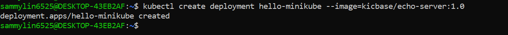
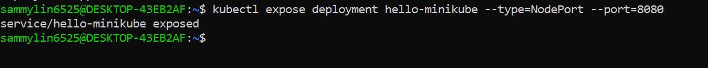
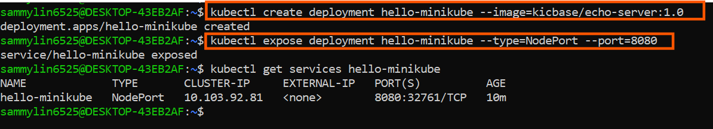
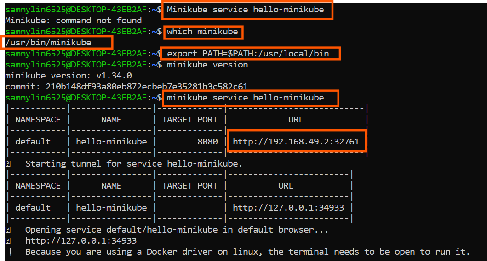
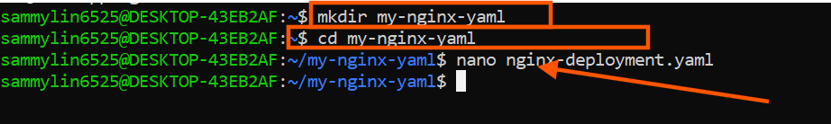
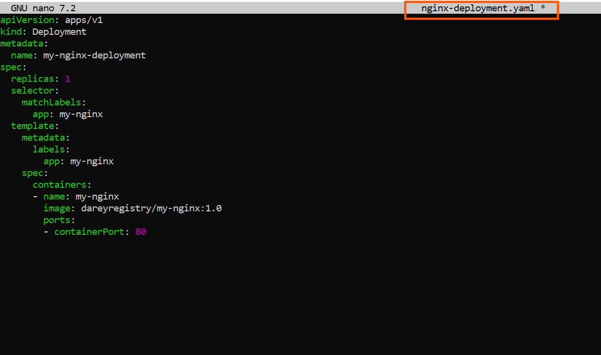
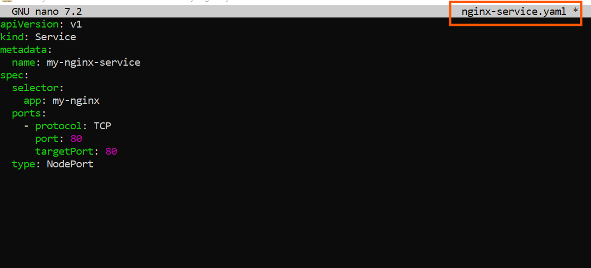
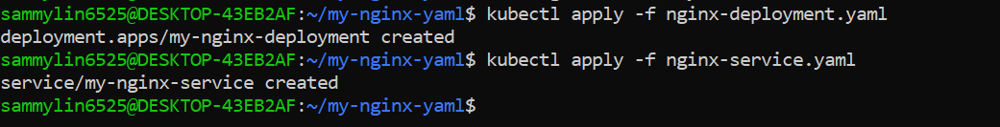
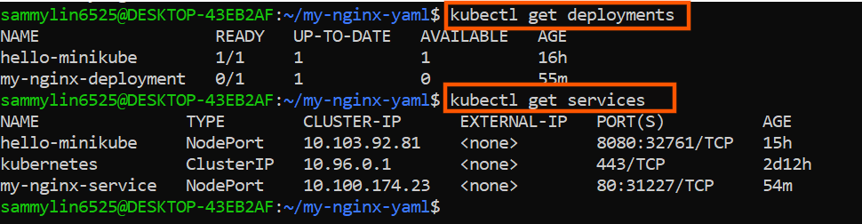
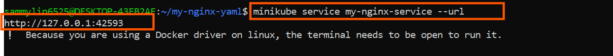

# Working with Kubernetes Resources

### Introduction To YAML

A Kubernetes YAML file is a text file written in YAML syntax is a human-readable data serialization format that is commonly used for configuration files. In the context of kebernetes, these YAML file serve as a declarative way to specify the desired state of the resources such as pods, container, service and deployment I want to deploy and manage within a Kubernetes cluster.

Basic Structure Of YAML File

YAML uses identation to represent the hierarchy of data, and it uses whitespace (usually spaces, not tabs) for indentation.

```
key1: value1
key2:
  subkey1: subvalue1
  subkey2: subvalue2
key3:
  - item1
  - item2
```

Data Types 

**Scalars** Scalars are single values.

- Strings:

```
name: John Doe
```

- Numbers:

```
age: 25
```

- Booleans:

```
is_student: true
```

# Collections

- Lists (arrays):

```
fruits:
  - apple
  - banana
  - orange
```

- Maps (key-value pairs):

```
person:
  name: Alice
  age: 30
```

**Nested Structures** YAML allows nesting of structures:

```
employee:
  name: John Doe
  position: developer
  skills:
    - Python
    - JavaScript
```

**Comments:**

In YAML, comments starts with `#`:


```
# This is a comment
key: value
```
Multiline Strings

Multiline strings can be represented using the `|` or `>` characters:

```
description: |
  This is a multiline
  string in YAML.
```

Anchors and Aliases

You can use `&` to create an anchor and `*` to create an alias:


```
first: &name John
second: *name
```

In this example, `second` has the same value as `first`.
Now that I've got the basics, practice writing and reading YAML to become comfortable with its syntax. It's widely used in configuration file for various tools and systems.

## Deploying Applications in Kubernetes

In Kubernetes, deploying applications is a fundamental skill that every beginner needs to grasp. Deployment involves the process of taking the application code and running it on a Kubernetes cluster, ensuring that it scales, manages resources efficiently, and stays resilient. This hands-on project will guilde me through deploying my first application using Minikube, a lightweight, single-node Kubernetes cluster perfect for beginners.


## Deployments in Kubernetes:

In Kubernetes, a **Deployment** is a declarative approach to managing and scaling applications. It provides a blueprint for the desired state of my application, allowing Kubernetes to handle the complexities of deploying and managing replicas. Whether I've running a simple web server or a more complex microservices architecture, Deployments are the cornerstone for maintaining application consistency and availability.

## Services in Kubernetes:

Once an application is deployed, it needs a way to be accessed by other parts of my system or external users. This is where **Services** come into play. In Kubernetes, a service is an abstraction that defines a logical set of Pods and a policy by which to acccess them. It acts as a stable endpoint to connect to my application, allowing for easy communication within the cluster or from external sources. Some of the several types of services in kubernetes;

- ***ClusterIP:***Purpose: The default type. Exposes the Service on a cluster-internal IP. Accessible only within the cluster.

- ***NodePort:*** Exposes the Service on each Node's IP at a static port (NodePort). Accessible externally using `NodeIP`

- ***LoadBalaner:***Exposes the service externally using a cloud provider's load balancer. Accessible externally through the load balancer's IP.

In subsequent sections, I will dive deep into deployment strategies and service configurations within the Kubernetes ecosystem, delving into the intricacies of these components to ensure a thorough understanding and proficiency in their utilization.

- **Deploying a Minikube Sample Application** Using YAML files for deployments and services in Kubernetes is like crafting a detailed plan for my application, while direct deployment with `kubectl` commands is more like giving quick, on-the-spot instructions to launch and manage my application. Let's create a minikube deployment and service with `kubectl`

```
kubectl create deployment hello-minikube --image=kicbase/echo-server:1.0
```


 

The command above create a Kubernetes Deployment named "hello-minikube" running the "kicbase/echo-server:1.0" container image.

```
kubectl expose deployment hello-minikube --type=NodePort --port=8080
```



The command above exposes the Kubernetes Deployment named "hello-minikube" as a NodePort service on Port 8080

```
kubectl get services hello-minikube
```




The easiest way to access this services is to let minikube launch a web browser for you

`Minikube service hello-minikube`




# Working With YAML Files

Let's recall our docker foundations project when I pushed an image I built to docker hub. Now let reuse my image in my yaml script for deployment. 

i. Create a new folder `my-nginx-yaml`

ii. Create a new file `nginx-deployment.yaml` and paste the content below.



```
apiVersion: apps/v1
kind: Deployment
metadata:
  name: my-nginx-deployment
spec:
  replicas: 1
  selector:
    matchLabels:
      app: my-nginx
  template:
    metadata:
      labels:
        app: my-nginx
    spec:
      containers:
      - name: my-nginx
        image: dareyregistry/my-nginx:1.0
        ports:
        - containerPort: 80

```




The provided YAML snippet defines a Kubernetes Deploment for deploying an instance of instance of the Nginx web server. Let's break down the key components:

- **apiVersion: apps/v1:** Specifies the Kubernetes API version for the object being created, in this case, a Deployment in the "apps" group.

- **Kind: Deployment:** Defines the type of Kubernetes resources being created, which is a Deployment. Deployments are used to manage the deployment and scaling of applications.

metadata: Contains metadata for the Deploment, including the name of the Deployment, which is set to "my-nginx-deployment"

- **Spec:** Describes the desired state of the Deployment.

- **replicas: 1:** Specifies that the desired number of replicas (instances) of the Pods controlled by this Deployment is 1.

- **Selector:** Defines how the Deployment selects which Pods to manage. In this case, it uses the label "app:my-nginx" to match pods.

- **Template:** Specifies the template for creating new Pods.

- **metadata:** Contains labels for the Pods, and in this case, the label is set to "app:my-nginx."

- **Spec:** Describes the Pod specification.

- **Containers:** Defines the containers within the Pod.

- **Name:** my-nginx: Sets the name of the container to "my-nginx."

- **image: dareyregistry/my-nginx:1.0:** Specifies the Docker image to be used to the Nginx container. The image is "ridwanaz/my-nginx" with version "1.0."

**Note I can replace the image with my own image**

- **Ports:** Specifies the port mapping for the container, and in this case, it exposes port 80.

iii. Create a new file called `nginx-service.yaml` and paste the content below

```
apiVersion: v1
kind: Service
metadata:
  name: my-nginx-service
spec:
  selector:
    app: my-nginx
  ports:
    - protocol: TCP
      port: 80
      targetPort: 80
  type: NodePort

```




The provided YAML snippet defines a Kubernetes Service for exposing the Nginx application to the external world. Let's break down the key components:

- **apiVersion:v1:** Specifies the Kubernetes API version for the object being created, in this case, a Service.

- **Kind: Service:** Defines the type of Kubernetes resources being created, which is a Service. Services provide a stable endpoint for accessing a set of Pods.

- **metadata:** Contains metadata for the Service, including the name of the Service, which is set to "my-nginx-service."

- **spec:** Describes the desired state of the Service.

- **Selector:** Specifies the labels used to select which Pods the Service will route traffic to. In this case, it selects Pods with the label "app:my-nginx."

- **Ports:** Specifies the ports configuration for the service.

- **Protocol: TCP:** Specifies the transport layer protocol, which is TCP in this case.


- **Port:80:** Defines the port on which the Service will be exposed.

- **TargetPort: 80:** Specifies the port on the Pods to which the traffic will be forwarded.


- **type: NodePort:** Sets the type of the Service to NodePort. This means that the service will be accessible externally on each Node's IP address at a static port, which will be automatically assigned unless specifies.


iv. Run the command below for the development on the cluster


```
kubectl apply -f nginx-deployment.yaml

kubectl apply -f nginx-service.yaml
```

 


v. Verify my deployment

```
kubectl get deployments

kubectl get services
```





vi. Access my deployment on my web browser

```
minikube service my-nginx-service --url
```

Follow the IP address to access my application on the web browser.


 

Welcome to Darey.io


