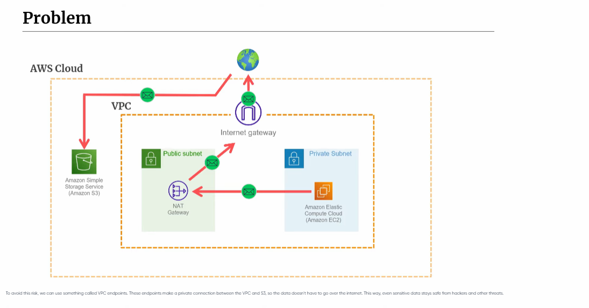

# AWS VPC- Virtual Private Cloud

I will explore the core concept of Amazon Web Services (AWS), focusing specifically on Virtually Private Clouds (VPCs). my objective is to understand the fundamental components of VPC infrastructure, including subnets, gateways, and routing tables. Through practical demonstrations and interactive exercises, I will navigate the AWS management console to deploy and manage these critical components effectively.

# Project Goals:

- Understand the fundamentals of virtual private cloud (vpc) and its components.

- Gain hands-on experience in setting up and configuring vpc, subnets, internet gateway, and vpc peering connections.

- Learn how to enable internet connectivity securely within a vpc. 

- Implement outbound internet access through the NAT gateway.

- Establish direct communication between VPCs using VPC peering.

**Learning Outcomes:**

- Acquired knowledge about vpc and its essential components, such as subnets,gateways,and route tables.

- Development skills in creating and configuring vpc resources using AWS management console.

- Learned how to set up routing tables to enable internet connectivity and outbound internet access securely.

- Gained understanding of vpc peering and its significance in connecting multiple VPCs within the same od different regions.

- Enhanced understanding of network security principles and best practices for cloud environments.

# What is VPC, Subnets, Internet Gateway and NAT Gateway?

Virtual Private Cloud (VPCS) Here's is an example:  Think of a site like GatoGrowFast.com office building. Inside, there are different departments like HR, Finance, and IT. Each departments has its own area with specific access rules. Similarly, in a VPC, GatoGrowFast.com can create different sections, called subnets, for different parts of the business.

- Now, let's say GatoGrowFast.com wants to connect its office to the internet. They'd use a router to control the flow of data in and out of the building. In a VPC, GatoGrowFast.com has something similar called an internet Gateway. It lets their VPC communicate with the internet securely.

- NAT (Network Address Translation) Gateway as a secret agent between GatoGrowFast.com's computers and the internet. When a computer inside their virtual office wants to talk to the internet, the NAT Gateway steps in. It translates the computer's message and sends it out, but it hides who send it. It's like sending a letter without your return address. This way, the internet only sees the NAT Gateway's address, keeping GatoGrowFast.com's computers safe and anonymous online.

- **Note-** A router is a device that directs data packets between computer networks. Think of it as a traffic cop for the internet. When data is sent from one device to another across a network, it's broken down into smaller packets. These packets need to find their way to the correct destination, and that's where the router comes in.

- A router knows how to send data packets from my device to the right destination on the internet. Routers use routing tables, which are like maps of the internet, to determine the best path for data packets to take. They analyze information in the packets, such as destination IP addresses, to make these decisions. Once the packets reach their destination, the router ensures they're delivered to the correct device.

# What is an IP address?

- An IP address is like a phone number for my computer. It's a unique set of numbers that helps computers find and talk to each other on a network, like the internet.

- There are two main types of IP addresses: Public IP addresses and private IP addresses. However, each type has different versions, with IPv4 and IPv6 being the most common.

***Public IP Address:*** This is like a home address. It's unique and helps other computers on the internet find mine. Just like how people send letters to someone's house using the house address, data packets are sent to my computer using its public IP address.

- A public IP address is globally unique and is assigned by the Internet Service Provider (ISP) to a device connected to the internet.

- It allows devices to communicate with other devices across the internet.

- Public IP addresses can be either dynamic or static. Dynamic IPs change periodically, often each time a device reconnects to the internet, while static IPs remain constant. Static IPs are typically used for servers, remote access, or services that require consistent connectivity.

***Private IP Address:*** Think of this like an internal extension number in a big office building. It's used for communucation within a specific network, like my home Wi-Fi network or an office network. Devices within the same network can talk to each other using their private IP addresses, but these addresses aren't visible to the outside world.

- Private IP addresses are typically assigned by a router or a DHCP (Dynamic Host Configuration Protocol) server within the network.

- Devices within the same private network communicate with each other using their private IP addresses.

- These addresses are not routable over the internet. They are used for internal network communication only and are hidden from the outside world.

- It is not globally unique and can be reused within different private networks without conflict.

IPv4 Address:

- IPv4 (Internet Protocol version 4) addresses are the most common type of IP addresses used today.

- They are 32-bit numeric addresses written in decimal format, separated by periods (e.g., 192.168.0.1).

- IPv4 addresses are divided into five classes: A, B, C, D and E, with classes A, B, and C being used for addressing hosts on networks.

- Each octet in an IPv4 address can have a value between 0 and 255. This is because each octet is made up of eight bits, and the maximiun value that can be represented with eight bits is 255 (which is 11111111 in binary).

# IPv6 Address:

- IPv6 (Internet Protocol version 6) addresses are designed to replace IPv4 due to the exhaustion of available IPv4 addresses.

- IPv6 addresses are 128-bit hexadecimal addresses, represented in eight groups of four hexadecimal addresses, represented in eight groups of four hexadecimal digits separated by colons (e,g., 2001:0db8:85a3:0000:0000:8a2e:0370:7334).

- IPv6 addresses provide a much larger address space compared to IPv4, allowing for a virtually unlimited number of unique addresses.

# What is CIDR?

- CIDR, or Classless Inter-Domain Routing, makes it easier to talk about groups of IP addresses on the internet. Instead of naming each address one by one, CIDR uses a simple shortcut. It's like saying "All the houses on Main Street" instead of listing each house separately.

- For example, let's say I have the IP address 192.168.1.0. With CIDR notation, I might write it like this: 192.168.1.0/24. The "/24" part tells us that we're talking about all the houses on that street from 192.168.1.0 to 192.168.1.255.

so, CIDR helps us manage and organize IP addresses on the internet in a way that's easy to understand and work with. It's like having a shorthand for talking about big groups of addresses.

- Determining the number of available IP addresses in a CIDR block to determine the number of available IP addresses in a CIDR block, I will calculate it using the formula:

`2^(32 - CIDR notation) - 2`

The "-2" is for excluding the network address and the broadcast address.

**Example -**

Let's say we have a CIDR block of "192.168.1.0/24" Using the formula, I calculate:

`2^(32 - 24) - 2

=2^8 - 2

=256−2

=254`

# What is gateway?

Gateways are like doorways between different networks. They help data travel between the local network and other networks, like the internet. Just like a gate that  will lets me go from my backyard to the neighborhood park, a gateway that will let my data go from my computer to the internet and back again. It's like the traffic cop of the internet, directing my data where it needs to go.

- For example - Imagine I live in a city with different neighborhoods, each with its own set of houses. I am in one neighborhood, let's call it Neighborhood A, and I want to visit a friend who lives in a different neighborhood, Neighborhood B. To get from my neighborhood to my friend's neighborhood, I need to go through a gateway-a special gate that connects the two neighborhoods. This gateway act as a bridge between the two areas, allowing people and things to pass back and forth.

- So, when I leave my house in  Neighborhood A, I will walk to the gateway, pass through it, and then find my friend's house in neighborhood B. The gateway helps me navigate from one neighborhood to another, just like how a network gateway helps data travel between different networks.

# What is a Route table?

A route table is like a map that helps data find its way around a network. Just like a map shows the best route to get from one place to another, a route table tells devices on a network how to send data packets to their destinations.

- In simple terms, a route table lists different destinations and the paths ( or "routes") to reach them. When a devices receives data that it needs to send somewhere, it consults the route table to figure out where to send it.

- For example, if my computer wants to send data to a website, it looks at it's route table to find out which gateway to use to reach the internet. The route table might say, "To reach the internet, send data to the router." Then, the router knows how to forward the data to the next stop on its journey, eventually reaching its destination.

- Think of a route tables as the navigation system from data on a network, helping it find the fastest and most efficient paths to where it needs to go.

### Connection between Gateway and Route table.

Gateways:

- Gateways are devices (like routers of firewalls) that serve as entry and exit points between different networks

- They connect networks with different IP address ranges, such as my local network and the internet.

- Gateways recieve incoming data packets and determine where the send them next based on routing information.

Route Tables:

- Route tables are tables maintained by networking devices (like routers or switches) that contain information about how to route data packets to their destinations.

- Each entry in a toute table specifies a destination network and the next hop (gateway) to each that network.

- Devices consult the route table to determine the best path for forwarding data packets based on their destination IP addresses.

# Connection: 

- When a device (like computer or server) wants to send data to a destination outside of it's local network, it checks it's route table.

- The route table provides the information needed to determine the next hop (gateway) for reaching the destination network.

- The device then forwards the data packet to the specified gateway, which continues the process until the packet reaches its final destination.

In summary, gateways and route tables works together to facilitate the routing of network traffic between different networks. Gateways serve as the entry and exit points between networks, while route tables provide the necessary routing informating to determine how data packets should be forwarded to their destinations.

Now let's come to the practical part,

# Steps -

1. Setting up a Virtual Private Cloud (VPC)

2. Configuring Subnets within the VPC

3. Creating Internet Gateway and attaching it to VPC

4. Enabling Internet Connectivity with the Internet Gateway by setting up Routing tables.

5. EnablinG Outbound Internet Access through NAT Gateway

6. Estimating VPC peering Connections

# Part-1

1. Navigate to the search bar

a) Enter "VPC" Upon locating the relevant result, proceed to click on it, directing me to the Virtual Private Cloud (VPC) page.

2. Please navigate to the "Create VPC" option and click on it.

3. Please select the "VPC only" option, specify the IPv4 CIDR block, and proceed by clicking on the "Create VPC" button.

**Note-** If you encounter an error message stating that the CIDR block size must be between "/16" and "/28" when creating a VPC, it indicates that your provided CIDR block falls outside of this recommended range. Adjusting the CIDR block to fall within the specified range should resolve the issue.

This is the VPC I have created.

I am done with part 1 now, Let's move to part2 which is Configuring Subnets within the VPC,

**Part-2**

1. Navigate to the "Subnets" option lacated on the left sidebar.

a) Upon clicking, I will be directed to the "Subnets" page.

b) From there,proceed to click on the "Create subnet" button.

2. Please, select the ID of the VPC that I have created in the previous step (part1)

3. Now enter the subnet name, and specify the IPV4 CIDR for the subnet.

a) Choose the availability zone

b) And specify the IPV4 for the subnet.

c) To create another subnet, click on the "Add subnet" button

d) Repeat the same steps for the secound subnet

e) ensuring to specify the subnet name, choose the availability zone, and provide the IPV4 CIDR.

f) Once completed, click on the "Create" button to create the subnet.

To maintain consistency with our intention of creating both a public and a private subnet, ensure that the naming convention reflects this distincton appropriately.

Here, the subnets is being created.

- With the creation of subnets, the second part of the task is now completed. Let's proceed to the next part, which involves creating on Internet Gateway and attaching it to VPC.

# Part-3

1. Navigate to the "Internet Gateway"option on the left sidebar.

a) Upon clicking, then, you will be directed to the Internet Gateway Page.

b) From there, proceed to click on the "Create Internet Gateway" button.

2. Specify the name of the Internet Gateway

a) proceed by clicking on the "Create Internet Gateway" button.

Now, the Internet gateway is been created successfully.

Now, you will notice that it is currently detached, indicating that it is not associated with any VPC. To enable internet connectivity, I have to attach the internet Gateway to the VPC I have previously created.

- Now, attach it to the VPC

- Now, let's come to the next part which is Enabling Internet Connectivity with the Internet Gateway by setting up Routing tables.

# Part -4

1. Proceed to the "Route Tables" option located on the left sidebar.

a) Once there, click on the "Create route table" button

2. Enter the name of the route table and select the VPC you previously created.

a) Finally, click on the "Create route table" button to proceed.

b) Next, click on Subnet associations, "followed by "Edit subnet associations" to associate the subnet with the route table, I will associate the public subnet with this route table. 

3. Choose the public subnet and click on save association.

4. Navigate to "Routes and then click on "Edit routes".

5. Click on add route.

6. Select "Destination" as "0.0.0.0/0," indicating that every IPV4 address can access this subnet.

7. In the "Target" field, choose "Internet Gateway", and then select the Internet Gateway I have created. Finally, save the changes

The route table has now been configured to route traffic to the Internet Gateway,allowing connectivity to the Internet. Sice only the subnet named "my-public-subnet-1" is associated with the route table, only resources within that subnet can access the internet.

- Now, let's come to the next part which is Enabling Outbound Internet Access through NAT Gateway,(bt attaching NAT Gateway to the subnet and attaching the route table).

# Part-5

1. Navigate to the "NAT Gateways" section, then click on "Create NAT Gateway"

2. mention the name of the NAT Gateway.

3. Now, choose the private subnet

4. Now select the connectivity type as private.

5. Then click on Create NAT Gateway.

Your NAT Gateway is being created successfully.

6. select the NAT Gateway.

7. Then navigate to the "Details" tab.

8. From there, locate the subnet ID and click on it.

9. In the subnet page, navigate to the "Route Table" section.

10. Then, click on the "route table ID" -In our case - 1"rtb-************

11. Proceed to the "Routes" section, then click on "Edit routes"

12. Then click on "Add routes"

a) Select Destination as 0.0.0.0/0

b) In the "Target" field choose "NAT Gateway"

c) Then select the NAT Gateway already created.

d) Finally, save the changes.

Now, 13. On the subnet association section, click on edit subnet association.

a) Choose the private subnet and click on "Save associations".

Now, the subnet has been successfully attached with the route table.

**Different between Internet Gateway and NAT Gateway Internet Gateway:**

Think of it like a door to the internet for the subnet. When I attached the Internet Gateway to a subnet, it allows the resources in that subnet (like EC2 instances) to reach out to the internet and also allows internet traffic to reach those resources.It's like having a door both to enter and exit the subnet.

**NAT Gateway:**

Imagine it as a one-way street sign for the subnet's traffic. When attached a NAT Gateway to a subnet, it lets the resources in that subnet (like EC2 instances) access the internet, but it doesn't allow incoming traffic from the internet to reach those resources. It's like the resources can go out to the internet, but the internet traffic can't directly come in.

Now, let's proceed further and come to our next part that involves Establishing VPC Peering Connections. For this let's first understand some terms-

**Note -** An Ec2 instances is a virtual server in AWS that anyone can use to run applications. It offers flexible computing power and can be easily scaled up or down. EC2 instances are widely used for hosting websites, running software, and processing data in the cloud.

# What is VPC Peering?

VPC peering is like connecting two virtual offices in the cloud so the can talk to each other directly. Just imagine two neighboring offices sharing files and chatting without going through a middleman.

- By default, EC2 instances in different VPCs cannot communicate with each other.

- To enable communication between EC2 instances in different VPCs, I can set up VPC peering, VPN connections, or AWS Direct Connect.

- VPC Peering establishes a direct network connection between the VPCs, allowing EC2 instances in one VPC to communicate with EC2 instances in the other VPC.

# Why do we need VPC Peering?

I need VPC Peering when we want different parts of our cloud network (VPCs) to work together smoothly. Maybe I have one VPC for my development team and another for the marketing team, and I want them to share data securely. That's where VPC peering comes in handy- it lets these VPCs communicate directly, making things easier for everyone.

Additionally, there are some key points that I should be aware of.

- Two VPCs cannot connect to each other. I need to set up VPC Peering or use a VPN or Direct Coonect to establish connectivity.

- Subnets within the same VPC can communicate with each other by default. AWS sets up route tables to allow communication within the same VPC.

- EC2 instances in the same subnet can communicate with each other by default, assuming they have proper security group rules allowing the desired traffic.

- EC2 instances in different subnets within the same VPC can also communicate  with other by default, as long as their associated route tables are configured to allow traffic between subnets

## Now come to the practical part,

# Part-6

1. Let's begin by creating two VPCs in the same region
Alternatively, I may choose a different region if needed.

2. Navigate to the "Peering Connections" option on the left sidebar.

a) Upon clicking, You will be directed to the VPC Peering Page.

b) From there, proceed to click on the "Create Peering Connection" button.

3. Now, provide a name for the VPC Peering connection.

a) select the requester VPC

b) Choose the account "My account" since the VPCs are in our own AWS account.

c) Ensure to use the same region, This Region (ap-southeast-1)," as the VPCs were created in the same region.

d) Next, select the accepter VPC

e) Proceed by clicking on the "Create Peering Connection" button.

Then you 'll see this,

4. In the peering Connection page, locate the "Actions" option on the right side.

a) Click on it, then select "Accept Request"

b) Click on Accept request.

5. Now, click on Main route table ID of the accepter VPC

6. Choose the route table.

a) then navigate to the "Routes" section

b) Click on "Edit route".

c) Click on add route.

7. Go to the VPC page

a) select the requester VPC.

b) in the details tab, you'll find the IPV4 CIDR. (in this case-192.168.0.0./16)

c) Copy this CIDR and paste it in the "Destination" field when adding a route.

d) In the target, choose VPC Peering and then choose the peering connection I have created. Click on save changes.

8. Now, copy the IPV4 CIDR of the accepter VPC (in this case-172.16.0.0/16)

9. Now, click on Main route table ID of the requester VPC.

10. Choose the route table, then navigate to the "Routes" section Click on "Edit route"

11. Click on add route.

a) paste the CIDR in the "Destination" field.

b) In the target, choose VPC peering

c) Then choose the peering connection I have created.

The connection has been successfully established. Now, resources in the accepter VPC can connect to resources in the requester VPC, and vice versa.

VPC Peering allows direct communication between two VPCs using private IP addresses. Region compatibility VPC peering can be set up between VPCs in the same AWS region or different regions and the same AWS account or different AWS accounts.

For more reference, then go through the [Create a VPC Peering connection](https://docs.aws.amazon.com/vpc/latest/peering/create-vpc-peering-connection.html#same-account-same-region)

**CIDR bLOCKS:** The CIDR blocks of the VPCs involves in the peering connection should not overlap or conflict with wach other. Each VPC must have a unique CIDR block.

**IP Addressing:** Resources in one VPC can communicate with resources in the peered VPC using their private IP addresses.

**Security Groups and NACLs:** Ensure proper configuration of security Groups and Network Access Control Lists (NACLs) to allow traffic between peered VPCs.

**Direct Communication:** Resources in one VPC can directly communicate with resources in the peered VPC without requiring internet access.

**Transitive Traffic:** Traffic cannot flow through a VPC peering connection to reach other VPCs not directly peered.

**Routing:** Update route tables in both VPCs to allow traffic to flow through the peering connection. Each VPCs route table must contain a route entry for the CIDR block of the peer VPC, pointing to the peering connection.

**Limitations:** There are limits on the number of VPC peering connections that can be established per VPC, as well as limitations on the number of route entries per route table.

Now, let's understand some more terms,

# What is VPC endpoint?

Think of a VPC endpoint like a dedicated,secure tunnel between the house (VPC) and a library (AWS service). Instead of going through the bustling streets (Public internet), I have a direct pathway from the home to the library. This pathway ensures that only me and authorized users can access the library's resources, like books or documents, without exposing them to outside risks. It's a private, efficient way to access what I need, keeping your data safe from prying eyes on the internet.

Let's understand the problem I were facing,

When I will backing up data from an EC2 instance to an S3 bucket, it usually goes over the internet, whether the instance is in a public or private subnet. But if the data is sensitive, that means it's risky because hackers could try to get it while it's traveling over the internet.

To avoid this risk, we can use something called VPC endpoints. These endpoint make a private connection between the VPC and S3, so the data doesn't have to go over the internet. This way, even sensitive data stays safe from hackers and other threats.

**Project Reflection:**

- Successfully completed the project tasks related to setting up VPC infrastructure and configuring network components.

- Gained practical experience in navigating AWS management console and configuring VPC resources.

- Encountered challenges such as CIDR block size limitations and learned how to troubleshoot and resolve them effectively.

- Developed a deeper understanding of network architecture and cloud networking concepts through hands-on experimentation.

- Recognized the important of network securit measures, such as NAT gateway and VPC end points, in ensuring secure communication within cloud environments.

- Overall, the project offered valuable perspectives on the fundamentals of cloud networking and practical experience in deploying VPC infrastructure on AWS.

