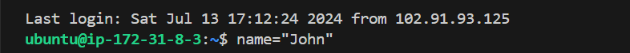
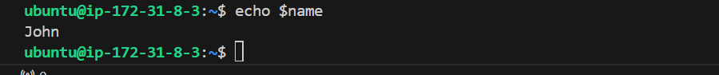

# Shell scripting
## Shell scripting syntax elements: 
### 1. Variables: 
Bash allow you to work and manipulate variables.Variables are used to store data that can be used and manipulated throughout a program. They serve as containers for information that can be referenced and manipulated using a variable name.
Variables can store data of various types such as numbers, strings and arrays. Assign values to variables using the = operator and access their values using the variable name preceded by a sign $ sign.

Example: Assigning a value to a variable:

`name="john"`

Example: retrieving value from valuable.  `echo $name`

