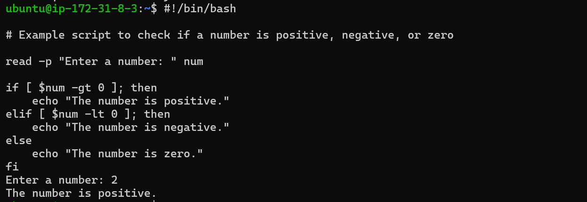
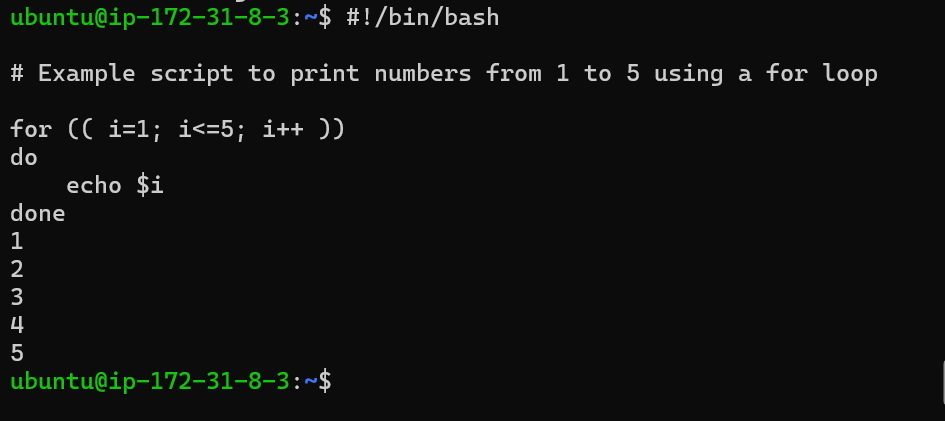
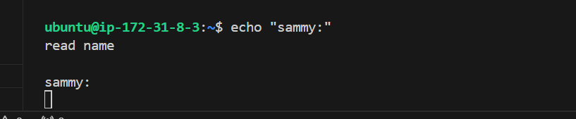
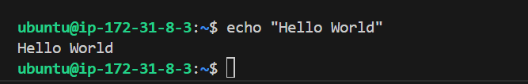
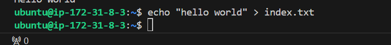
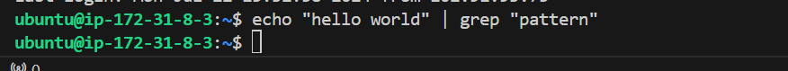

# Shell scripting
## Shell scripting syntax elements: 
### 1. Variables: 
Bash allow you to work and manipulate variables.Variables are used to store data that can be used and manipulated throughout a program. They serve as containers for information that can be referenced and manipulated using a variable name.
Variables can store data of various types such as numbers, strings and arrays. Assign values to variables using the = operator and access their values using the variable name preceded by a sign $ sign.

Example: Assigning a value to a variable:

`name="john"`

Example: retrieving value from valuable.  `echo $name`

# 2. Control Flow:
Bash provides control flow statements like if-else, for loops, while loops and case statements to control the flow of execution in the script. These statements allows to make decisions, iterate over lists and execute different commands based on conditions. 

Example: Using *if-else* to execute script based on a conditions.

The piece of code prompt me to type a number and prints a statement stating the number is positive or negetive.

Example: Iterating through a list using a *for loop*

# 3. Command Substitution:
Command substitution allows to capture the out put of a command and use it as a value within the script. Backtick or the $()syntax for command substitution.

Example: Using backtick for command substitution.

current_date= `date +%y-%m-%d`.

Example: Using `$()` syntax for command substitution.

`current_date=$(date +%y-%m-%d)`.

# 4. Input and Output:
Bash provides various ways to handle input and output. At this point *read command* to be used to accept **user input and output** text to the console using the *echo command*. Additionally, you can redirect input and output using operators like > *(output to a file), < (input from a file), and | (pipe the output of one command as input to another).

Example: Accept user input.

`echo "Enter your name:"`
`read name`

.

Example: Output text to the terminal.

`echo "Hello world"`

.

Example: Out the result of a command into a file.

`echo "hello world" > index.text`

.

Example: Pass the content of a file as input to a command.

`grep "pattern" < input.text`

Example: Pass the result of a command as input to another command.

`echo "hello world" | grep "pattern"`

.

