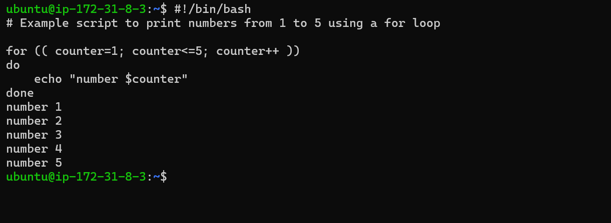

# Shell scripting
## Shell scripting syntax elements: 
### 1. Variables: 
Bash allow you to work and manipulate variables.Variables are used to store data that can be used and manipulated throughout a program. They serve as containers for information that can be referenced and manipulated using a variable name.
Variables can store data of various types such as numbers, strings and arrays. Assign values to variables using the = operator and access their values using the variable name preceded by a sign $ sign.

Example: Assigning a value to a variable:

`name="john"`

Example: retrieving value from valuable.  `echo $name`

# 2. Control Flow:
Bash provides control flow statements like if-else, for loops, while loops and case statements to control the flow of execution in the script. These statements allows to make decisions, iterate over lists and execute different commands based on conditions. 

Example: Using *if-else* to execute script based on a conditions.

The piece of code prompt me to type a number and prints a statement stating the number is positive or negetive.

Example: Iterating through a list using a *for loop*

# 3. Command Substitution:
Command substitution allows to capture the out put of a command and use it as a value within the script. Backtick or the $()syntax for command substitution.

Example: Using backtick for command substitution.

current_date= `date +%y-%m-%d`.

Example: Using `$()` syntax for command substitution.

`current_date=$(date +%y-%m-%d)`.

# 4. Input and Output:
Bash provides various ways to handle input and output. At this point *read command* to be used to accept **user input and output** text to the console using the *echo command*. Additionally, you can redirect input and output using operators like > *(output to a file), < (input from a file), and | (pipe the output of one command as input to another).

Example: Accept user input.

`echo "Enter your name:"`
`read name`

.

Example: Output text to the terminal.

`echo "Hello world"`

.

Example: Out the result of a command into a file.

`echo "hello world" > index.text`

.

Example: Pass the content of a file as input to a command.

`grep "pattern" < input.text`

Example: Pass the result of a command as input to another command.

`echo "hello world" | grep "pattern"`

.

# 5. Functions:
Bash allows you to define, manipulate and use functions to group related commands together. Functions provide a way to modularize your code and make it more reusable. You can define functions using the function keyword or simply by declaring the function name followed by parentheses.

.

# Lets write our first Shell Script.

- Step 1: On my terminal, I have to open a folder (repository) called *shell-scripting* using the     command  `mkdir shell-scripting`.

.

 This will hold all the script we will write in this lesson.

- Step 2: Create a file called `user-input.sh` using the command `touch user-input.sh`.

.

- Step 3: Inside the file copy and paste the block of code below: 

.

A little description about the code block. The script prompt for your name. When I type my name, It displays the text *hello !* *Nice to meet you* . Also `#!/bin/bash` helps you specify the type of bash interpreter to be used to execute the script.

- Step 4: Save the file.
- Step 5: Run the command `sudo chmod +x user-input.sh` this makes the file executable.

.

- Step 6: Run the script using the command `./user-input.sh`

.

# Directory Manipulation and Navigation:

This script will display the current directory, create a new directory called "my_directory," change to that directory, create two files inside it, list the files, move back one level up, remove the "my_directory" and its contents, and finally list the files in the current directory again.

### Proceed by following the steps bellow:

- Step 1: Open a file named *navigating-linux-filesystem.sh*

- Step 2: Paste the code block below into the file.

  `#!/bin/bash`

  .

  .

  - Step 3: Run the command `sudo chmod +x navigating-linux-filesystem.sh` to set execute permission on the file.

  .

  - Step 4: Run the script using this command `./navigating-linux-filesystem.sh`

  .

# File operations and Sorting:

In this lesson, I will be writting a simple shell script that focuses on *file operations and sorting*.

This script creates three files (file1.txt, file2.txt and file3.txt3), displays the files in their current order, sorts them alphabetically, saves the sorted files in sorted_files.txt. displays the sorted files, removes the original files, renames the sorted file to sorted_files_sorted_alphabetically.txt, and finally displays the contents of the final sorted files.

Lets proceed using the steps below:

- Step 1: Open the terminal and create a file called *sorting.sh* using the command `touch sorting.sh`.

- Step 2: Copy and paste the code block below into the file.

.

.

.

- Step 3: Set execute permission on *sorting.sh* using this command `sudo chmod +x sorting.sh`

.

- Step 4: Run the script using the command `./sorting.sh`

.

# Working with Numbers and Calculations:

This script defines two variables num1 and num2 with numeric values, performs basic arithmatic operations (addition, subtraction, multiplication, division and modulus), and displays the results. It also performs more complex calculations such as raising num1 to the power of 2 and calculating the square root of nm2, and displays those results as well.

Lets proceed by following the steps below:

- Step 1: On my terminal, I have to create a file *calculations.sh* using the command `touch calculations.sh`

- Step 2: Copy and paste the code block below:

.

.

