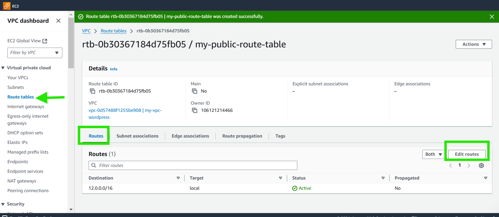
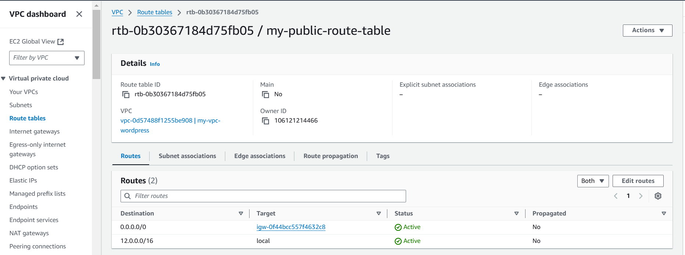
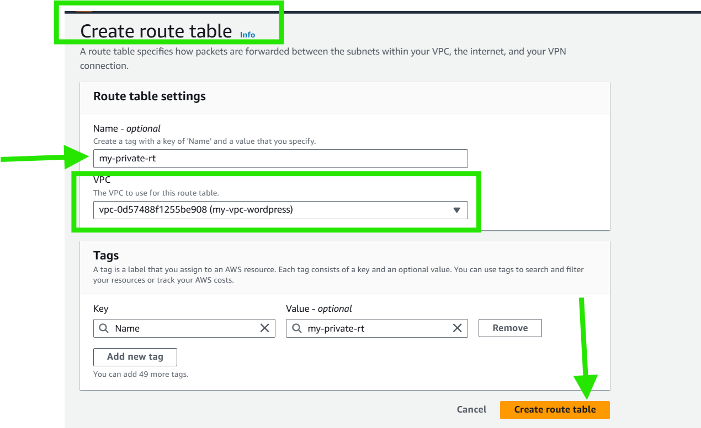
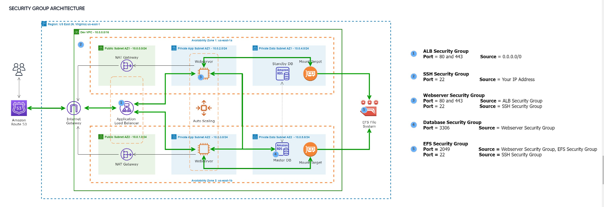
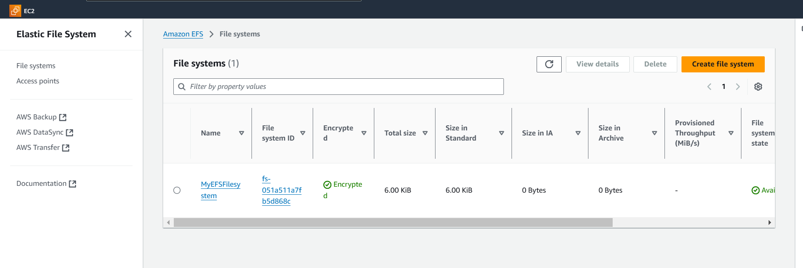

# Capstone Project-WordPress Site on AWS

1. VPC Setup (20 points):

   - 1.1 IP Address Range Definition (5 Points):
- Project definition of the IP address range for the VPC.

- 1.2 VPC Creation (7 Points):

  - Successful creation of the VPC with public and private subnets.

- 1.3 Route Table Configuration (8 Points):

   - Correct configuration of route tables for each subnet.

2. Public and Private Subnet with NAT Gateway (30 Points):

 - 2.1 Public Subnet Setup (10 Points):

  - Proper setup of the public subnet for resources accessible from the internet.

  2.2 Private Subnet Setup (10 Points):

    - Successful creation of the private subnet for resources with no direct internet access.

- 2.3 NAT Gateway Configuration (10 Points):
  - Correct configuration of a NAT Gateway for private subnet internet access.

3. AWS My SQL RDS Setup (20 Points):

  - 3.1 RDS Instance Creation (7 Points):

    - Proper creation of an Amazon RDS instance with MySQL engine.

 - 3.2 Security Group Configuration (7 Points):
   - Correct configuration of security groups for the RDS instance.

3.3 WordPress-RDS Connection (6 Points):

  - Successful connection of wordpress to the RDS database.

4. EFS Setup for wordpress Files (15 Points):

  - 4.1 EFS File System Creation (5 Points):

  - Proper creation of an EFS file system.

   - 4.2 Mounting EFS (5 Points):

   - Successful mounting of the EFS file system on wordpress instances.

   - 4.3 WordPress Configuratio (5 Points):

  - Correct configuration of wordpress to use the shared file system.

5. Application Load Balancer and Auto Scaling (15 Points):

   - 5.1 ALB creation (5 points):

   - Successfull creation of an Application Load Balancer.

- 5.2 Listener Rules Configuration (5 Points):

  - Proper configuration of listener rules for routing traffic to instances.

 - 5.3 Integration with Auto Scaling (5 Points):

  - Correction integration of the Load Balancer with the Auto Scaling group.

subtotal: 100 Points

# Capstone Project: Wordpress Site on AWS

### Project Scanario

A small to medium-sized digital marketing agency, "DigitalBoost", wants to enhance its online presence by creating a high-performance **Wordpress-based** website for their clients. The agency nedds a scalable, secure, and cost-effective solution that can handle increasing traffic and seamlessly integrated with their existing infrastructure. My task as an AWS Solutions Architect is to design and implement a wordpress solution using various AWS services, such as Networking, compute, Object Storage, and Databases.

## Pre-requisite

- Knowledge of TechOps Essentials

- Completion of Core 2 Courses and Mini projects

The project overview with necessary architecture have been provided as my help "DigitalBoost" with her wordpress-Based website. Kindly follow the instructions below to complete this Capstone Project. Also, necessary scripts have been provided here [here]

(https://github.com/dareyio/script-2)

## Project Deliverables

 - Detailed documentation for each component setup.

  - Explanation of security measures implemented.

  - Demonstration:

  - Live demonstartion of the WordPress site.

  - Showcase auto-scaling by simulating increased traffic.

### Objective:

I have to create a Virtual Private Cloud (VPC) to isolate and secure the wordpress infrastructure.

- Steps:

 - Define IP address range for the VPC.

1. Choose an IP Range:

**Select a private IP range based on the RFC 1918 standard:**

- 10.0.0.0 – 10.255.255.255 (10.0.0.0/8)
- 172.16.0.0 – 172.31.255.255 (172.16.0.0/12)
- 192.168.0.0 – 192.168.255.255 (192.168.0.0/16)

**Determine the Size of the CIDR Block:**

**The size depends on the number of IP addresses needed. For example:**

- /16 provides ~65,000 IPs.
- /24 provides 256 IPs.
- /28 provides 16 IPs.
- AWS allows VPC CIDR blocks ranging from /16 to /28.
- Assign the CIDR Block:

During VPC creation in the AWS Management Console assign a CIDR block (e.g., 12.0.0.0/16). whichis exactly what I assign for my VPC

 
 

 - Create VPC with public and private subnets.

### Create two subnets:

- Public Subnet:
- Name: PublicSubnet
- VPC: MyVPC
- Availability Zone: Choose one (e.g., us-east-2a)
- IPv4 CIDR block: 12.0.1.0/24
- Private Subnet:
- Name: PrivateSubnet
- VPC: MyVPC
- Availability Zone: Choose one (e.g., us-east-2a)
- IPv4 CIDR block: 12.0.2.0/24

## Before Creating the public and private subnets, I have to first create Internet gateway and attach to my vpc.

- Create an Internet Gateway (IGW)
- Go to the Internet Gateways section.
- Click Create Internet Gateway.
- Name it MyIGW and attach it to the VPC (MyVPC).

# Configure route tables for each subnets.

### 1. Configure the Route Table for the Public Subnet

Create a Public Route Table:

- Go to the VPC Dashboard.
- Select Route Tables.
- Click Create Route Table.
- Name: PublicRouteTable.
- VPC: Select your VPC (MyVPC).
- Click Create.

- Add a Route for Internet Access:
- Select the newly created PublicRouteTable.
- Click Routes and then Edit Routes.

- Add a route:
- Destination: 0.0.0.0/0 (matches all IPv4 traffic).
- Target: Select the Internet Gateway (MyIGW) created earlier.
- Save changes.
- Associate the Route Table with the Public Subnet:
- Click Subnet Associations in the PublicRouteTable settings.
- Click Edit Subnet Associations.
- Select the public subnet (PublicSubnet) and save.

### 2. Configure the Route Table for the Private Subnet
  Create a Private Route Table:
- Go to Route Tables.
- Click Create Route Table.
- Name: PrivateRouteTable.

- VPC: Select your VPC (MyVPC).
- Click Create.
- Add a Route for NAT Gateway Access:
- Select the newly created PrivateRouteTable.
- Click Routes and then Edit Routes.
- Add a route:

- Destination: 0.0.0.0/0 (matches all IPv4 traffic).
- Target: Select the NAT Gateway (MyNATGateway) created earlier.
- Save changes.

### 3. Associate the Route Table with the Private Subnet:

- Click Subnet Associations in the PrivateRouteTable settings.

- Click Edit Subnet Associations.
- Select the private subnet (PrivateSubnet) and save.

# 2. Public and Private Subnet with NAT Gateway

**NAT GATEWAY ARCHITECTURE**

# Objective:

Implement a secure network architecture with public and private subnets. Use a NAT Gateway for Private subnet internet access.

### Steps:

- Set up public subnet for resources
 accessible from the internet.

 - Create private subnet for resources with no direct internet access.

 - Configure a NAT Gateway for private subnet internet access.

 

 3. AWS MySQL RDS Setup

 SECURITY GROUP ARCHITECTURE

 

### Objective:
Deploy a managed MySQL database using Amazon RDS for wordpress data storage

### Steps:

- Create an Amazon RDS instance with Mysql engine.

  

 

- Configure security groups for RDS instance.

 

 

 

- Connect Wordpress to the RDS database.

4. EFS Setup for WordPress Files

- Objective:
Utilize Amazon Elastic File System (EFS) to store WordPress files for scalable and shared access.

- Steps:

- Create an EFS file system.

Creating an Amazon Elastic File System (EFS) in AWS involves a series of steps in the AWS Management Console, AWS CLI, or AWS SDK. Here’s a step-by-step guide to create an EFS file system using the AWS Management Console:

- Step 1: Navigate to the Amazon EFS Console

Search for "EFS" in the "AWS Management Console" search bar and select Elastic File System.

- Step 2: Create a New File System
Click on Create file system.

Provide the following details:

Name (optional): Assign a name to the file system for easy identification.
VPC: Select the Virtual Private Cloud (VPC) where you want to create the file system.

- Step 3: Configure Network Settings
Availability and Durability:

Regional: Ensures that the file system is available in all Availability Zones (AZs) within the region.

### Mount Targets:

Select the subnets in the AZs where you want to create mount targets.
Ensure that the Security Groups attached to the mount targets allow NFS traffic (port 2049) from EC2 instances.

- Step 4: Set Performance and Storage Settings
Performance Mode:
Choose between:
General Purpose (default): Ideal for latency-sensitive applications.
Configure policies to transition infrequently accessed files to the Infrequent Access (IA) storage class to reduce costs.

- Step 5: Review and Create
Review your settings and click Create.
The new file system will be created and listed in the EFS dashboard.

- Step 6: Mount the EFS File System to EC2 Instances
Install NFS Utilities on your EC2 instances:
sudo yum install -y nfs-utils  # For Amazon Linux/Red Hat

Mount the File System:
Copy the mount command from the EFS console:
Go to the EFS File System > Access Points or File System details.
Run the mount command on your EC2 instance:

`sudo mount -t nfs4 -o nfsvers=4.1,rsize=1048576,wsize=1048576,hard,timeo=600,retrans=2,noresvport fs-051a511a7fb5d868c.efs.us-east-2.amazonaws.com:/ /var/www/html`

Ensure the /mnt/efs directory exists:
sudo mkdir -p /var/www/html

- Step 7: Verify the Mount
Use the df -h command to confirm the EFS is mounted:

`df -h`

You should see the EFS file system listed.

Test the file system by creating a file:

sudo touch /mnt/efs/test-file

Ensure the Security Group attached to your EC2 instances and EFS allows inbound traffic on port 2049 for NFS.

# 5. Application Load Balancer

**Objective:**
Set up an Application Load Balancer to distribute incoming traffic among multiple instances, ensuring high availability and fault tolerance.

Steps:

- Create an Application Load Balancer.

- Configure listener rules for routing traffic to instances.

- Integrate Load Balancer with Auto Scaling group.

6. Auto Scaling Group

**Objective**

Implement Auto Scaling to automatically adjust the number of instances based on traffic load.

Steps:

- Create an Auto Scaling group.

- Define Scaling policies based on matrics like CPU utilization.

- Configure launch configurations for instances.

# 6. Amazon RDS Setup

Objective:

Deploy a managed MySQL database using Amazon RDS for WordPress data storage.

Steps:
Create a Security Group for the RDS instance allowing inbound traffic on MySQL port 3306 from the WordPress EC2 instances.

Launch the MySQL RDS Instance with appropriate configuration, such as storage and instance class.

# 7. Connecting WordPress to RDS

Steps:
Rename the default wp-config-sample.php to wp-config.php.

Edit the wp-config.php file with the database details from the RDS instance (DB name, username, password, and host).

Save the file and restart the web service.

`sudo systemctl restart httpd`

After the whole configuration, I have to copy the DNS of my created loadbalancer to the web-browser to access the user page of the wordpress.

